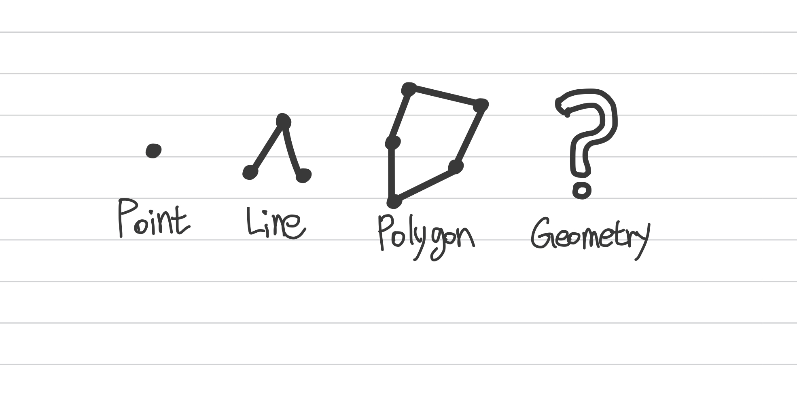
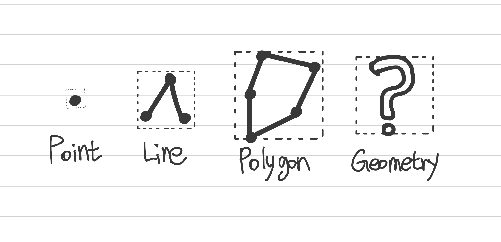
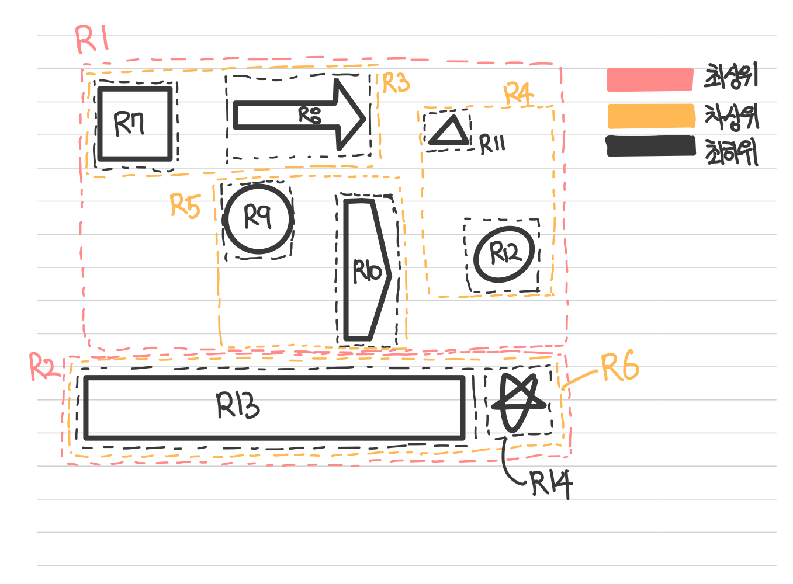

# R-Tree 인덱스

---

> `위키백과`  
> `R-Tree`는 `B-Tree`와 비슷하지만 다차원의 공간 데이터를 저장하는 색인이다.
> 
> `R-Tree`자료구조는 공간을 최소 경계 사각형(MBR)들로 분할하여 저장한다.
> MBR끼리는 겹칠 수 있고, 상위 레벨의 MBR은 하위 레벨의 MBR들을 포함하는 계층적인 트리구조이다.
> 각 노드는 미리 정의된 범위내에서 유동적인 개수의 자식 노드들의 정보를 가진다.

 
R-Tree는 기본적인 내부 메커니즘은 B-Tree와 흡사하지만, B-Tree는 인덱스를 구성하는 컬럼의 값이 1차원의 스칼라 값인 반면에, R-Tree 인덱스는 2차원의 공간 개념 값이라는 것이다.

또한, R-Tree는 MBR정보를 이용하여 B-Tree 형태로 인덱스를 구축하므로 Rectangle의 'R'과 B-Tree의 'Tree'라는 이름을 섞어서 R-Tree라고 부르며 공간인덱스라고도 한다.

---

### 📑 MBR ( Minimum Bounding Rectangle)
`MBR`은 도형을 감싸는 최소 크기의 사각형을 의미한다. 해당 사각형들의 포함 관계를 
B-Tree형태로 구현한 인덱스가 R-Tree이다.

> MBR에 대한 이미지는 아래의 이미지를 참고하면됩니다.

MySQL은 공간 정보의 저장 및 검색을 위해 기하학적 도형 정보를 관리할 수 있는 타입을 제공하는데. 대표적으로 지원하는 데이터 타입은 아래의 이미지와 같다.

 

 

대표적으로 보면 `POINT`, `LINE`, `POLYGON`, `GEOMETRY`를 제공한다.

`GEOMETRY` 데이터 타입은 `POINT`, `LINE`, `POLYGON`의 슈퍼 타입으로,  `GEOMETRY`는 `POINT`, `LINE`, `POLYGON`등을 포함할 수 있다.

2번째 이미지는 MBR처리를 한 데이터 타입들을 의미 합니다.

위의 이미지는 이러한 도형들이 저장되어있을때 만들어지는 인덱스의 구조를 이해하기 위해 MBR이 어떻게 되는지 표현해낸 이미지입니다.

해당 이미지는 MBR을 3개의 레벨로 나눠서 그렸습니다.

#### <mark style="background-color:#E5775C;">&nbsp;&nbsp;&nbsp;&nbsp;&nbsp;&nbsp;&nbsp;&nbsp;&nbsp;&nbsp;&nbsp;&nbsp;&nbsp;&nbsp;&nbsp;&nbsp;&nbsp;&nbsp;</mark> 최상위 레벨 : R1, R2
#### <mark style="background-color:#EFB652">&nbsp;&nbsp;&nbsp;&nbsp;&nbsp;&nbsp;&nbsp;&nbsp;&nbsp;&nbsp;&nbsp;&nbsp;&nbsp;&nbsp;&nbsp;&nbsp;&nbsp;&nbsp;</mark> 차상위 레벨 : R3, R4, R5, R6
#### <mark style="background-color:#000000">&nbsp;&nbsp;&nbsp;&nbsp;&nbsp;&nbsp;&nbsp;&nbsp;&nbsp;&nbsp;&nbsp;&nbsp;&nbsp;&nbsp;&nbsp;&nbsp;&nbsp;&nbsp;</mark> 최하위 레벨 : R7, R8, R9, R10, R11, R12, R13, R14

`최상위 레벨`은 MBR을 가장자리에서 둘러싼 사각형이며, R-Tree의 루트 노드에 저장되는 정보이다. 
`차상위 레벨`은 R-Tree의 브랜치 노드가 된다. 
마지막으로 각 도형의 객체는 `최하위 레벨(리프 노드)`에 저장된다.

---

### 📑 어디에 사용하는데??

지도 or GPS 서비스를 내장한 스마트 폰이 대중화 되면서 GIS와 GPS에 기반을 둔 서비스들이 많이 나타나거나, 확장되고 있다.

위치 기반의 서비스를 구현하는 방법에는 여러가지가 있지만. MySQL에서 제공하는 공간확장을 이용하면 간단하게 서비스를 구현할 수 있다.

MySQL에서 제공하는 공간확장은 크게 3가지 기능이 포함되어 있다.

🌟 공간 데이터를 저장할 수 있는 데이터 타입

🌟 공간 데이터의 검색을 위한 공간 인덱스(R-Tree 알고리즘)

🌟 공간 데이터의 연산 함수(거리 or 포함 관계의 처리 )

R-Tree는 각 도형의 포함 관계를 이용하여 만들어진 인덱스이다. 따라서 ST_Contains() 또는 ST_Within()등과 같은 포함 관계를 비교하는 함수로 검색을 
수행하는 경우에만 인덱스를 이용할 수 있다.

대표적으로는 <i><b>현재 사용자의 위치로부터 반경 5km 이내의 음식점 검색</b></i>등과 같은 검색에 사용할 수 있다.

> 현재 제공되는 ST_Distance(), ST_Distance_Sphere() 함수는 공간 인덱스를 효율적으로 사용하지 못하기 때문에
> 공간 인덱스를 사용할 수 있는 ST_Contains() or ST_Within()를 이용하여 거리 기반의 검색을 해야한다.

