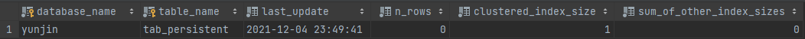

### 😊 실행 계획

---

>대부분의 DBMS는 많은 데이터를 안전하게 저장 및 관리하고 사용자가 원하는 데이터를 빠르게 조회할 수 있게 해주는 것이 주목적입니다.<br>
> 이러한 목적을 달성하려면 옵티마이저가 사용자의 쿼리를 최적으로 처리될 수 있게 하는 쿼리의 실행 계획을 수립할 수 있어야 한다.<br>
> 하지만 옵티마이저가 관리자나 사용자의 개입없이 항상 좋은 실행 계획을 만들어 낼 수 있는것은 아니다.
> 이러한 문제점을 관리자나 사용자가 보완할 수 있도록 EXPLAIN명령으로 옵티마이저가 수립한 실행 계획을 확인할 수 있게 해준다.

MySQL서버에서 보여주는 실행 계획을 읽고 이해하려면 MySQL서버가 데이터를 처리하는 로직을 이해할 필요가 있다.
<br>
처음 접하는 사용자에게는 해당 로직을 이해하는것이 쉬운일은 아니다. 

---

### ❗ 통계 정보

> MySQL 서버는 `5.7` 버전까지 테이블과 인덱스에 대한 개괄적인 정보를 가지고 실행 계획을 수립했다.<br>
> 하지만 이는 테이블 컬럼의 값들이 실제 어떻게 분포돼 있는지에 대한 정보가 없기 때문에 실행 계획의 정확도가 떨어지는 경우가 많았따.
> 
> 하지만 `8.0`버전 부터는 인덱스되지 않은 컬럼들에 대해서도 데이터 분포도를 수집해서 저장하는 `히스토그램`정보가 도입되었다.
> 
> 그렇다고 `히스토그램`가 도입되었다고 해서 기존의 테이블이나 인덱스의 통계 정보가 필요치 않은 것은 아니다.

---

### ❗ 테이블 및 인덱스 통계 정보 

> 비용 기반 최적화에서 가장 중요한 것은 통계 정보다.<br>
> 통계 정보가 정확하지 않다면 엉뚱한 방향으로 쿼리를 실행할 수 있기 때문이다.<br>

부정확한 통계 정보 탓에 0.1초만에 끝날 쿼리가 1시간이 소요될 수 있다. <br>
MySQL 또한 다른 DBMS와 같이 비용 기반의 최적화를 사용하지만, 다른 DBMS보다 통계 정보의 정확도가 높지 않고
통계 정보의 휘발성이 강했다. 그래서 MySQL 서버에서는 쿼리의 실행 계획을 수립할 때 실제 테이블의 데이터를 일부 분석해서 통계정보를 보완하여 사용하였다.

이러한 이유로 MySQL `5.6`버전부터는 통계 정보의 정확성을 높일 수 있는 방법이 제공되기 시작하였지만 아직도 많은 사용자가 기존 방식을 그대로 사용한다.

---

### ❗ MySQL 서버의 통계 정보

> MySQL 5.6 버전부터는 InnoDB 스토리지 엔진을 사용하는 테이블에 대한 통계 정보를 영구적으로 관리할 수 있게 개선되었다.<br>
> MySQL 5.5 버전까지는 각 테이블의 통계 정보가 메모리에만 관리되고, SHOW INDEX 명령으로만 테이블의 인덱스 컬럼의 분포도를 볼 수 있다.<br>

`MySQL 5.5`버전처럼 통계 정보가 메모리에 관리될 경우 MySQL 서버가 재시작되면 지금까지 수집된 통계 정보가 모두 사라진다.

`MySQL 5.6` 버전 부터는 각 테이블의 통계 정보를 mysql 데이터베이스의 innodb_index_stats 테이블과 innodb_table_stats 테아블로 관리할 수 있게 개선되었다.

이러한 정보를 테이블로 관리함으로써 MySQL 서버가 재시작되더라도 기존의 통계 정보를 유지할 수 있게 된다.

```sql
SHOW TABLES LIKE '%_stats';
```


`MySQL 5.6`에서 테이블을 생성할 때는 STATS_PERSISTENT 옵션을 설정할 수 있는데, 이 설정값에 따라 테이블 단위로 영구적인 통계 정보를 보관할지 말지를 결정할 수 있다.

```sql
CREATE TABLE tab_test(fd1 INT, fd2 VARCHAR(20), PRIMARY KEY(fd1))
ENGINE=InnoDB
STATS_PERSISTENT={ DEFAULT | 0 | 1}
```


 - `STATS_PERSISTENT=0` : 테이블의 통계 정보를 MySQL 5.5이전의 방식대로 관리하며, mysql 데이터베이스의 innodb_index_stats와 innodb_table_stats테이블에 저장하지 않음.<br><br>
   
 - `STATS_PERSISTENT=1` : 테이블의 통계 정보를 mysql 데이터베이스의 innodb_index_stats와 innodb_table_stats 테이블에 저장함.<br><br>
   
 - `STATS_PERSISTENT=DEFAULT` : 테이블을 생성할 때 별도로 STATS_PERSISTENT 옵션을 설정하지 않은것과 동일하며, 
테이블의 통계를 영구적으로 관리할지 말지를 innodb_stats_persistent 시스템 변수의 값으로 설정한다.<br>
   
```sql

create table tab_persistent(fd1 int primary key, fd2 int) engine=innodb stats_persistent =1;
create table tab_transient(fd1 int primary key, fd2 int) engine=innodb stats_persistent =0;

select * from mysql.innodb_table_stats where table_name in ('tab_persistent', 'tab_transient');
```
   


결과를 보면 `tab_persist`만 조회된 것을 확인 할 수 있다. 
혹시나 `STATS_PERSISTENT = 1` 로 저장한 설정을 변경하고 싶다면 `ALTER TABLE`로 실행 할 수 있다. 

```sql
ALTER TABLE `table 명` STATS_PERSISTENT=1;
```

MySQL 5.5 버전까지는 테이블의 통계 정보가 메모리에만 저장되며, MySQL 서버가 재시작이 된다면 통계 정보가 초기화가 되었다.
따라서 MySQL 서버가 시작되면 모든 테이블의 통계 정보는 다시 수집돼어야 했다.

다음과 같은 이벤트가 발생하면 통계정보가 갱신되었다
 - 테이블이 새로 오픈되는 경우.
 - 테이블의 레코드가 대량으로 변경되는 경우 ( 테이블의 전체 레코드 중에서 1/16정도의 Update, Insert, Delete 가 실행되는 경우)
 - ANALYZRE TABLE 명령이 실행되는 경우.
 - SHOW TABLE STATUS 명령이나 SHOW INDEX FROM 명령이 실행되는 경우
 - innodb_stats_on_metadata 시스템 설정이 ON 인 상태에서 SHOW TABLE STATUS 명령이 실행되는 경우.

위와 같은 변경으로 자주 통계 정보가 갱신된다면 응용 프로그램의 쿼리를 인덱스 레인지 스캔으로 잘 쳐리하던 
MySQL 서버가 어느날부터 풀 테이블 스캔으로 실행되는 상황이 발생할 수 있다.

따라서 갱신이 되지 않도록 막을 수 있다면 좋을것이다.

`innodb_stats_auto_recalc` 옵션은 default 값이 ON인데 OFF로 변경하게 되면 통계 정보가 자동으로 갱신되는 것을 막을 수 있다.

또한 테이블 생성시 해당 옵션을 설정할 수 있다.

```sql
-- STATS_AUTO_RECALC=1 - 테이블의 통계 정보를 MySQL 5.5 이전의 방식대로 자동 수집한다.
-- STATS_AUTO_RECALC=0 - 테이블의 통계 정보는 ANALYZE TABLE 명령을 실행할 때만 수집된다.
-- STATS_AUTO_RECALC=DEFAULT - 테이블을 생성할 때 별도로 옵션을 설정하지 않은 것과 동일, 시스템 변수의 값으로 결정.
```

---

### innodb_stats_sample_pages

MySQL 5.5 버전에서는 테이블의 통계 정보를 수집할 때 몇 개의 InnoDB 테이블 블록을 샘플링할지 결정하는 옵션으로 
`innodb_stats_sample_pages` 설정 변수가 제공된다. 

하지만 MySQL 5.6 버전부터는 해당 옵션은 Deprecated 되었다. 대신 시스템 변수가 `innodb_stats_transient_sample_pages`와
`innodb_stats_persistent_sample_pages` 시스템 변수로 분리되었다.

 - innodb_stats_transient_sample_pages
    - 해당 시스템 변수의 기본값은 8인데, 자동으로 통계 정보 수집이 실행될 때 8개 페이지만 임의로 샘플링하여 분석하고 해당 결과를 통계 정보로 활용한다.
    
 - innodb_stats_persistent_sample_pages
    - 기본값은 20이며 ANALYZE TABLE 명령이 실행되면 임의로 20개 페이지만 샘플링해서 분석하고 해당 결과를 영구적인 통계 정보 테이블에 저장하고 활용한다.
    
더 정확한 통계 정보를 수집하고자 한다면 `innodb_stats_persistent_sample_pages`시스템 변수에 높은 값을 설정하면 된다.
하지만 너무 높게 잡으면 통계 정보를 수집하는데 시간이 길어지므로 주의해야 한다.

---

## 히스토그램(Histogram)
> MySQL 5.7 버전까지의 통계 정보는 단순히 인덱스된 컬럼의 유니크한 값의 개수 정도만 가지고 있었지만, 이는 최적의 실행 계획을 옵티마이저가 수립하기에는 많이 부족하였다.
> 
> 따라서 옵티마이저는 실행 계획을 수립할 때 실제 인덱스의 일부 페이지를 랜덤으로 가져와 참조하는 방식을 사용했다.<br>
> MySQL 8.0 버전으로 업그레이드 되면서 MySQL 서버도 컬럼의 데이터 분포도를 참조할 수 있는 히스토그램 기능이 생겼다.

### 히스토그램 정보 수집 및 삭제

MySQL 8.0 버전에서의 히스토그램 정보는 컬럼 단위로 관리되는데, 자동으로 수집되지 않고 ANALYZE TABLE ... UPDATE HISTOGRAM 명령을 실행해 수동으로 수집 및 관리된다.

수집된 정보는 시스템 딕셔너리에 함께 저장되고, MySQL 서버가 시작될 때 딕셔너리의 히스토그램 정보를 `infomation_schema` 데이터베이스의 column_statistics 테이블로 로드한다.

---

히스토그램에서 지원하는 타입은 다음과 같이 2가지가 존재한다.

   - Singleton(싱글톤 히스토그램) : 컬럼값 개별로 레코드 건수를 관리하는 히스토그램으로, Value-Based 히스토그램 or 도수 분포라고 부른다.
   - Equi-Height(높이 균형 히스토그램) : 컬럼값의 범위를 균등한 개수로 구분해서 관리하는 히스토그램으로 Height-Balanced 히스토그램이라고도 부른다.

히스토그램은 `버킷(Bucket)` 단위로 구분이 되어 레코드 건수나 컬럼값의 범위가 관리된다.

`Singleton 히스토그램`은 컬럼이 가지는 값별로 버킷이 할당된다
`Equi-Height 히스토그램`은 개수가 균등한 컬럼값의 범위별로 하나의 버킷이 할당된다.

---

### 히스토그램의 용도

기존 MySQL 서버가 가지고 있던 통계 정보는 테이블의 전체 레코드 건수와 인덱스된 칼럼이 가지는 유니크한 값이 개수 정도였다.

예를 들면 레코드가 1000건이고 어떤 컬럼의 유니크한 값이 100개였다면 MySQL 서버는 컬럼에 대해 동등 비교 검색을 하면 대략 10개의 레코드가 일치할것이라고 예측한다.


---

## 코스트 모델(Cost Model)

MySQL 서버가 쿼리를 처리하려면 다음과 같은 작업을 필요로 한다.
 - 디스크로부터 데이터 페이지 읽기
 - 메모리로부터 데이터 페이지 읽기
 - 인덱스 키 비교
 - 레코드 평가
 - 메모리 임시 테이블 작업
 - 디스크 임시 테이블 작업

MySQL 서버는 사용자의 쿼리에 대해 다양한 작어비 얼마나 필요한지 예측하고 
전체 작업 비용을 계산한 결과를 바탕으로 최적의 실행 계획을 찾는다.

이렇게 전체 쿼리의 비용을 계산하는 데 필요한 단위 작업들의 비용을 `코스트 모델` 이라고 부른다.

`MySQL5.7` 이전 버전까지는 이런 작업들의 비용을 MySQL 서버 소스 코드에 상수화 하여 사용했지만 서버가 사용하는 하드웨어에 따라 달라질 수 있기 때문에
예전버전처럼 고정된 비용을 일률적ㅇ로 적용하는 것은 최적의 실행 계획 수립에있어서 방해요소였다.

이러한 단점을 보완하기 위해 `MySQL5.7` 버전부터 MySQL 서버의 소스코드에 상수화 돼어 
있던 각 단위 작업 비용을 DBMS관리자가 조정할 수 있게 개선되었다.

---

MySQL 8.0 서버의 코스트모델은 다음과 같다. 두테이블 모두 mysql DB에 존재한다.

 - server_cost : 인덱스를 찾고 레코드를 비교하고 임시 테이블 처리에 대한 비용관리
 - engine_cost : 레코드를 가진 데이터 페이지를 가져오는 데 필요한 비용 관리

server_cost 테이블과 engine_cost 테이블은 공통으로 다음 5개의 컬럼을 가지고 있다.

 - cost_name : 코스트 모델의 각 단위 작업
 - default_value : 각 단위 작업의 비용(기본값이며 이 값은 MySQL 서버 소스 코드에 설정된 값)
 - cost_value : DBMS 관리자가 설정한 값(이 값이 NULL 이라
   면 MySQL 서버는 default_value 컬럼의 비용 사용)
 - last_updated : 단위 작업의 비용이 변경된 시점
 - comment : 비용에 대한 추가 설명

`last_updated`와 `comment`는 서버 옵티마이저에 영향을 미치는 정보는 아니고, 단순 정보성으로 관리되는 컬럼이다.

`server_cost`와는 다르게 `engine_cost`는 2개의 컬럼을 더 가지고 있다.

 - engine_name : 비용이 적용된 스토리지 엔진
 - device_type : 디스크 타입

`engine_cost`에서 지원하는 단위는 책 P.409 참고

코스트 모델에서 중요한 것은 각 단위 작업에 설정되는 비용 값이 커지면 어떤 실행 계획들이 고비용으로 바뀌어
어떤 실행 계획들이 저비용으로 바뀌는지를 파악하는것이다.

 - `key_compare_cost` 비용을 높이면 MySQL 서버 옵티마이저가 가능하면 정렬을 수행하지 않는 방향의 실행 계획을 선택할 가능성이 높아진다.
   

 - `row_ebaluate_cost` 비용을 높이면 풀 스캔을 실행하는 쿼리들의 비용이 높아지고, MySQL 서버 옵티마이저는 가능하면 인덱스 레인지 스캔을 사용하는 실행 계획을 선택할 가능성이 높아진다.


 - `disk_temptable_create_cost`와 `disk_temptable_row_cost` 비용을 높이면 MySQL 옵티마이저는 디스크에 임시 테이블을 만들지 않는 방향의 실행 계획을 선택할 가능성이 높아진다.


 - `memory_temptable_create_cost`와 `memory_temptable_row_cost`비용을 높이면 MySQL 서버 옵티마이저는 메모리 임시 테이블을 만들지 않는 방향의 실행 계획을 선택할 가능성이 높아진다.


 - `io_block_read_cost` 비용이 높아지면 MySQL 서버 옵티마이저는 가능하면 innoDB 버퍼 풀에 데이터 페이지가 많이 적재돼 있는 인덱스를 사용하는 실행 계획을 선택할 가능성이 높아진다  


 - `memory_block_read_cost` 비용이 높아지면 MySQL 서버는 innoDB 버퍼 풀에 적재된 데이터 페이지가 상대적으로 적다고 하더라도 그 인덱스를 사용할 가능성이 높아진다.