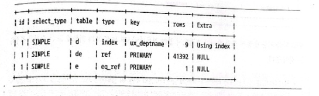

## 쿼리 힌트

---
> MySQL 서버는 우리가 서비스 하는 비지니스를 100% 이해하지 못합니다.<br>
> 그래서 해당 서비스의 개발자 or DBA보다 MySQL 서버가 부족한 실행 계획을 수립할 가능성이 있다.
> 
> 이러한 경우 옵티마이저에게 쿼리의 실행 계획을 수립해야 할지 알려줄 수 있는 방법이 필요하다
> 이 방법을 `쿼리 힌트`라고 한다.


### MySQL 에서 사용 가능한 쿼리 힌트 

 - 인덱스 힌트
 - 옵티마이저 힌트 

`인덱스 힌트`들은 모두 SQL의 문법에 맞게 사용해야 하기때문에 `ANSI-SQL`표준 문법을 준수하지 못하게 되는 단점이 있다.<br>
 그와 반대로 `옵티마이저 힌트`들은 `인덱스 힌트`와는 달리 MySQL서버를 제외한 RDBMS에서는 주석으로 해석되기 때문에 `ANSI-SQL`표준을 준수한다고 볼 수 있다.

가능하다면 `인덱스 힌트`가 아닌 `옵티마이저 힌트`를 사용하는것을 추천한다고 한다.

----


### ⭐ 인덱스 힌트

#### 인덱스 힌트는 예전 버전의 MySQL 서버에서 사용되던 `USE INDEX`와 같은 힌트를 의미한다.

`STRAIGHT_JOIN` 과 `USE INDEX`등을 포함한 인덱스 힌트들은 MySQL 서버에 옵티마이저 힌트가 도입되기 전부터 사용되던 기능들입니다.

인덱스 힌트들은 모두 SQL의 문법에 맞게 사용해야 하기때문에 `ANSI-SQL`표준 문법을 준수하지 못하게 되는 단점이 있다.

또한 인덱스 힌트는 `SELECT`와 `UPDATE`명령에서만 사용 가능하다.


### ⭐ 옵티마이저 힌트

#### 옵티마이저 힌트는 MySQL 5.6버전부터 새롭게 추가되기 시작한 힌트들을 지칭하는 용어입니다.

`옵티마이저 힌트`들은 `인덱스 힌트`와는 달리 MySQL서버를 제외한 RDBMS에서는 주석으로 해석되기 때문에 `ANSI-SQL`표준을 준수한다고 볼 수 있다.

---


#### ☝ STRAIGHT_JOIN
> STRAIGHT_JOIN은 MySQL5.6 이전부터 추가되었지만 옵티마이저 힌트이기도함과 동시에 조인 키워드이기도 하다.

STRAIGHT_JOIN의 역할은 `SELECT`, `UPDATE`, `DELETE`쿼리에서 여러 개의 테이블이 조인되는 경우 조인 순서를 고정하는 역할을 한다.

```sql
EXPLAIN
SELECT *
FROM employees e, dept_emp de, departments d 
WHERE e.emp_no = de.emp_no AND d.dept_no = de.dept_no;
```
위의 쿼리를 실행시켜서 나오는 실행 계획을 확인 해본다면 밑의 사진처럼 나올것입니다.



위 쿼리의 실행계획을 확인해보면 `department as d` 테이블을 드라이빙 테이블로 선택한것을 볼수 있고,<br>
두번재로는 `dept_emp as de` 테이블을 읽은 뒤에 마디막으로 `departments as d` 테이블을 읽었음을 확인할 수 있다.

실행계획은 일반적인 경우 `인덱스 여부` 로 조인의 순서가 결정되며 조인 컬럼의 인덱스에 아무런 문제가 없는 경우에는
`WHERE 조건`이 있는경우 해당 조건을 만족한 이후, 레코드가 적은 테이블을 드라이빙테이블로 선택한다.


>위의 내용만 본다면 rows 가 가장작은 `employees as e`가 드라이빙 테이블로 선택되어야 할듯 하지만 9건의 rows를 가지고 있는 `departments as d`가 드라이빙 테이블로 선택되어있다
> 
> 해당 이유는 type을 보면 알 수 있다. eq_ref는 조인시 기본 키나 고유키를 사용하여 하나의 값으로 접근( 최대 1행만을 정확하게 패치)한다고 합니다.
> 그렇다는건 rows의 갯수는 많지만 조건식으로 인하여 최대 1개로 판단되어 드라이빙 테이블 우선순위에서 밀린듯하다.


하지만 위의 쿼리 조인 순서 말고 사용자가 직접 STRAIGHT_JOIN 힌트를 통해 조인 순서를 변경 할 수 있다.  

```sql
SELECT STRAIGHT_JOIN
 e.first_name, e.last_name, d.dept_name
FROM employees e, dept_emp de, departments d
WHERE e.emp_no = de.emp_no AND d.dept_no = de.dept_no;

-- 위아래의 코드는 동일하게 동작한다.

SELECT /*! STRAIGHT_JOIN */
 e.first_name, e.last_name, d.dept_name
FROM employees e, dept_emp de, departments d
WHERE e.emp_no = de.emp_no AND d.dept_no = de.dept_no;

```

위의 쿼리를 실행하면 STRAIGHT_JOIN 힌트를 통하여 FROM절에 명시된 테이블의 순서대로 조인을 수행하도록 유도한다.
따라서 해당 쿼리의 실행계획을 보면 FROM절에 선언된 순서대로 조인을 수행합니다.

1. employees
2. dept_emp
3. departments 순입니다.

그렇다면 어떤 경우에 STRAIGHT_JOIN 힌트로 조인 순서를 조정하는 것이 좋을까 ?

1. 임시테이블과 일반 테이블의 조인
   > 임시 테이블을 드라이빙 테이블로 선정하는 것이 좋다, 일반 테이블의 조인 컬럼에 인덱스가 없는 경우에는 레코드 건수가 작은 쪽을 먼저 읽도록 선택하는 것이 좋다.
   > 하지만 대부분 옵티마이저가 적절한 순서를 선택해주기 때문에 쿼리를 작성할 때 부터 힌트를 사용할 필요가 없다.
   
2. 임시 테이블끼리 조인
   > 임시 테이블은 항상 인덱스가 없기 때문에 어느 테이블을 먼저 드라이빙으로 읽어도 무관하기 때문에 크기가 작은 테이블순으로 드라이빙되도록 선택해주는것이 좋다.
   
3. 일반 테이블끼리 조인
   > 양쪽 테이블 모두 조인 컬럼에 인덱스가 있거나, 조인컬럼에 인덱스가 없는경우에는 레코드 수가 적은 테이블을 드라이빙으로선택해주는 것이 좋다, 그 외의 경우에는 조인 컬럼에 인덱스가 없는 테이블을 드라이빙으로 선택하는것이 좋다.


> 위에서 언급된 `레코드 건수`는 인덱스를 사용할 수 있는 WHERE 조건까지 포함하여 그 조건을 만족하는 레코드 건수를 의미하는 것이지, 테이블 전체의 레코드 건수를 의미하는 것은 아니다.

---

#### 💁‍♂️ STRAIGHT_JOIN 힌트와 비슷한 역할을 하는 옵티마이저 힌트는 다음과 같다
- `JOIN_FIXED_ORDER` : STRAIGHT_JOIN 힌트와 동일한 효과를 낸다. 
  

- `JOIN_ORDER`, `JOIN_PREFIX`, `JOIN_SUFFIX` : 일부 테이블의 조인 순서에 대해서만 제안하는 힌트다.

---

### ⭐ `USE INDEX`, `FORCE INDEX`, `IGNORE INDEX` 인덱스 힌트

> STRAIGHT_JOIN 힌트와는 달리 인덱스 힌트는 사용하려는 인덱스를 가지는 테이블 뒤에 힌트를 명시해야 합니다.

옵티마이저는 어떤 인덱스를 사용해야할지 무난하게 잘 선택하는 편이지만 3~4개 이상의 컬럼을 포함하는 인덱스가 여러 개 존재하는 경우에는
옵티마이저가 실수를 하기도 한다. 이런 경우에는 강제로 특정 인덱스를 사용하도록 힌트를 추가할 수 있다.

인덱스 힌트는 위에 나열한 것처럼 크게 3가지가 있습니다. 3가지 인덱스 힌트 모두 키워드 뒤에 사용할 인덱스의 이름을 괄호로 묶어서 사용하며,
괄호 안에 아무것도 없거나 존재하지 않는인덱스 이름을 사용할 경우에는 쿼리의 문법 오류로 처리된다.

### ☝ USE INDEX
가장 자주 사용되는 인덱스 힌트이며, 옵티마이저에게 특정 테이블의 인덱스를 사용하도록 권장하는 힌트 정도ㅋ로 생각하면 된다.<br>
w가 주어지면 옵티마이저는 사용자의 힌트를 채택하지만 항상 사용하는 것은 아니다.

### ☝ FORCE INDEX
USE INDEX와 크게 다른점은 없지만, USE INDEX 보다 옵티마이저에게 미치는 영향이 더 강하다. USE INDEX 힌트만으로도 영향력이 충분하기때문에
크게 사용하지 않는다고 한다. 만약 USE INDEX를 부여했는데도 해당 인덱스를 타지 않는다면 FORCE INDEX를 사용해도 해당 인덱스를 사용하지 않을것이다.

### ☝ IGNORE INDEX
USE INDEX, FORCE INDEX와는 반대로 특정 인덱스를 사용하지 못하게 하는 용도로 사용하는 힌트다, 때로는 옵티마이저가 풀 테이블 스캔을 사용하도록 유도하기 위해 
IGNORE INDEX 힌트를 사용할 수도 있다.

---

위의 3종류의 인덱스 힌트 모두 용도를 명시해 줄 수 있다.

 - #### USE INDEX FOR JOIN
   JOIN 이라는 키워드는 테이블 간의 조인뿐만 아니라 레코드를 검색하기 위한 용도까지 포함하는 용어다.
   MySQL서버에서는 하나의 테이블로부터 데이터를 검색하는 작업도 JOIN이라고 표현하기 떄문에 FOR JOIN이라는 이름이 붙었다.
   
 - #### USE INDEX FOR ORDER BY
   명시된 인덱스를 ORDER BY 용도로만 사용 가능하도록 제한한다.

 - #### USE INDEX FOR GROUP BY
   명시된 인덱스를 GROUP BY 용도로만 사용할 수 있게 제한한다.

> 용도를 3가지로 나누긴 했지만 ORDER BY, GROUP BY 작업에서 인덱스를 사용할 수 있다면 더 나은 성능을 보장하며, <br>
> 용도는 옵티마이저가 대부분 최적으로 선택하기 떄문에 인덱스의 용도까지는 고려하지 않아도 된다.

```mysql
SELECT * FROM emplyees WHERE emp_no = 10001;
SELECT * FROM employees FORCE INDEX(primary) WHERE emp_no = 10001;
SELECT * FROM employees USE INDEX(primary) WHERE emp_no = 10001;

# 위의 3개의 쿼리는 모두 employees 테이블에서 PK를 이용하여 동일한 실행계획으로 쿼리를 처리한다.
# 기본적으로 인덱스 힌트가 주어지지 않아도 emp_no조건이 있기때문에 PK를 사용하는 것이 최적이라는 것이 옵티마이저에서도 인식하기 때문이다.

SELECT * FROM employees IGNORE INDEX(primary) WHERE emp_no = 10001;
# 해당 쿼리문은 pk 인덱스를  사용하지 못하게 힌트를 추가하였다. 말도 안되는 힌트이지만 이렇게 IGNORE INDEX를 통하여 PK 
# 를 무시하라고 한다면 무시할듯 하지만 실제로는 MySQL 5.5버전같은 구버전에서는 실제로 키 스캔을 마다하고 풀테이블 스캔으로 실행 계획이 사용되기도 하였다고 한다.

SELECT * FROM employees FORCE INDEX(ix_firstname) WHERE emp_no = 10001;
# 전혀 관계없는 ix_firstname 인덱스를 강제로 힌트로 사영했더니 PK를 버리고 풀 테이블 스캔을 하는 형태로 실행 계획이 출력된다.
```

해당 예제들은 샘플이지만 주의해야할 점이 있다.

`
전문 검색(FullText Search) 인덱스가 있는 경우 MySQL 옵티마이저는 다른 일반 보조 인덱스를 사용할 수 있는 상황이라고 하더라도 전문 검색 인덱스를 선택하는 경우가 많다
`
<br>
`옵티마이저는 PK나 전문 검색(Full Text Search) 인덱스에 대해서는 선택 시 가중치를 두고 실행 계획을 수립하기 때문이다.`