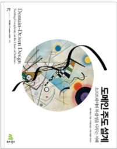

    
    
에릭 에반스 - 도메인 주도 설계

 > DDD를 사용한다고 사용하지만 제대로 이해하지 못하고 쓰는듯하여 공부하게된 내용을 정리하기 위하여 작성하는 글입니다.
 > 
 > 격주로 공부한 내용은 2챕터씩 정리하였습니다. 
 > 

[chapter 01~04장 - (지식탐구, 의사소통과 언어 사용, 모델과 구현의 연계, 도메인의 격리)](https://github.com/YunNote/TIL/tree/master/DomainDrivenDesign/chaprer_01)

[chapter 05장 - 소프트웨어에서 표한되는 모델](https://github.com/YunNote/TIL/tree/master/DomainDrivenDesign/chapter_05)

[chapter 06장 - 도메인 객체의 생명주기](https://github.com/YunNote/TIL/tree/master/DomainDrivenDesign/chapter_06)