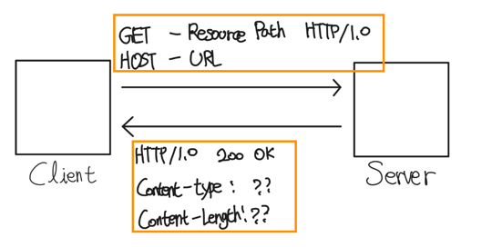
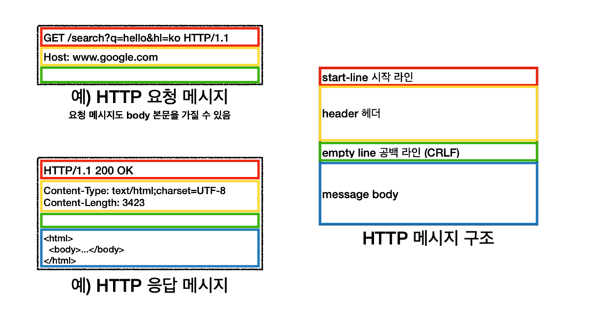

# Chapter 1 - HTTP 기초 정리

---

### 😀 미디어 타입  
> 우리가 흔히 알고 있는 Content-type으로 보면 쉽다 <br>  
> HTML - text/html <br>
> plain ASCII - text/plain <br>
> JPEG - image/jpeg <br>
> gif - image/gif <br>
> 애플 퀵타임 동영상 - video/quicktime <br>
> 파워포인트 - application/vnd.ms-powerpoint <br>
> json - application/json

---

### 😀 URI

> 통합 자원 식별자라고도 불린다.<br>
> URI는 인터넷의 우편물 조소 같은 것으로, 정보 리소스를 고유하게 식별하고 위치를 지정할 수 있다.

URI에는 URL과 URN이 있다.

#### - URL
통합 자원 지시자 - Uniform Resource Locator, URL 이라고 하며, 가장 흔한 형태이다.
URL은 특정 서버의 한 리소스에 대한 구체적인 위치를 서술한다. 또한 URL은 리소스가 정확히
어디에 있고 어떻게 접근할 수 있는지 분명하게 알려준다.

```http request
https://www.naver.com - 네이버 홈페이지의 URL
https://ssl.pstatic.net/sstatic/search/nlogo/20230807115141.png - 네이버 검색 로고 URL
```

URl은 세 부분으로 이루어진 표준 포맷
1. 스킴(scheme)라고 부르며 리소스에 접근하기 위해 사용되는 프로토콜을 의미, 보통 http or https 라고 부르는것이 스킴이라고 한다.
2. 서버의 인터넷 주소를 제공한다 위 네이버 같은경우 www.naver.com과 같다.
3. 웹서버의 리소스를 가리킨다. `/sstatic/search/nlogo/20230807115141.png`와 같다.


#### - URN
유니폼 리소스 이름(Uniform Resource Name) URN이라고 부르며
리소스의 위치에 영향받지 않는 유일무이한 이름역할을 한다.


---

### 😀 트랜잭션 
> HTTP 트랜잭션은 요청(client -> server)과 응답(server -> client)로 나뉜다.
> 
> 하댕 트랜잭션은 HTTP 메시지라고 불리는 정형화된 데이터 덩어리를 이용하여 이루어진다.
 


다음과 같이 요청메시지와 응답 메시지를 포함한다.

HTTP는 메서드라고 불리는 여러가지 메서드를 지원한다. 모든 HTTP요청에 대해서는 하나의 메서드를 갖고 요청하게 된다.

HTTP메서드는 서버에게 어떠한 동작이 취해져야 하는지에 대해서 가이드 해주는 역할을 한다.

가장 많이 쓰이는 HTTP 메서드는 다음과 같다


```http request
GET - 서버에서 클라이언트로 지정한 리소스를 보내라.
POST - 클아이언트 데이터를 서버 게이트웨이 어플리케이션에 보내라
PUT - 클라이언트에서 서버로 보낸 데이터를 지정한 이름의 리소스로 저장하라.
DELETE - 지정한 리소스르 서버에서 삭제해라
HEAD - 는 사용하지 않아서 따로 설명 X
```

REST API 관점에서 바라보자면 다음과 같이 쉽게 생각하면 편할듯하다.
```http request
GET - 데이터 조회, DB로 바라보자면 select와 유사.
POST - 데이터를 추가한다. DB로 바라보자면 insert와 유사.
PUT - 요청 데이터 기준으로 새로운 리소스 생성, 대상 리소스를 나타내는 데이터를 대체
PATCH - 데이터를 부분적으로 변경
DELETE - 삭제.
```

HTTP 요청에 따른 응답 메시지는 상태코드와 함께 반환된다. 
상태 코드는 따로 링크만 전달드립니다.
https://developer.mozilla.org/ko/docs/Web/HTTP/Status


---

### 😀 메세지 

출처 - https://dodeon.gitbook.io/study/kimyounghan-http-basic/03-http-basic/message

HTTP 메시지는 위 사진처럼 세 부분으로 이루어 진다.


#### 👊 시작줄
> 메시지의 첫줄로, 무엇을 해야하는지 응답이라면 무슨일이 일어났는지를 나타낸다.

#### 👊 헤더 
> 시작줄 다음에 나오는것으로 0개 이상의 헤더 필드가 이어진다.
> 각 헤더는 구문분석을 위해 `:` 로 구분되있는 이름과 값으로 구분된다<br>
> 헤더 필드를 추가하려면 한줄을 더하기만 하면된다, 다만 헤더는 빈줄로 끝난다. 

#### 👊 본문 
> 빈 줄 다음에 나오는 것이 본문이며, 필요에 따라 있을수도, 없을 수 도 있다.
> 본문에는 서버에서 반환한 데이터 또는 메세지, 텍스트가 포함될 수 있다.


---

### 😀 TCP 커넥션 
TCP - Transmission Control Protocol 전송 제어 프로토콜 

#### 👊 TCP/IP
HTTP는 애플리케이션 계층 프로토콜이다 HTTP는 핵심적인 세부사항에대해 신경쓰지 않고 대중적이고
신뢰성 있는인터넷전송 프로토콜인 TCP/IP에게 맡긴다.

TCP는 `오류 없는 데이터 전송`, `순서에 맞는 전달(순서 보장)`, `조각나지 않는 데이터 스트림` 을 제공한다.

위 세가지 방식에 따라 TCP는 커넥션이 맺어지면 클라이언트와 서버간에 교환되는 메시지가 없어지거나
손생되거나, 순서가 바뀌어 수신되는일은 결코 없다.
