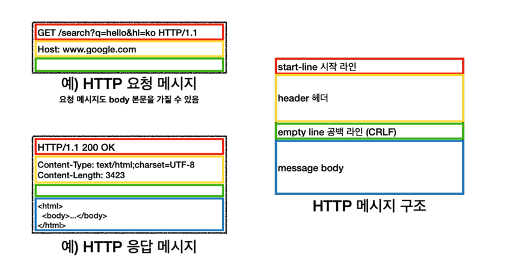

# Chapter 3 - HTTP 메시지

---

### 1. 메시지의 흐름 

HTTP메시지는 HTTP애플리케이션 간에 주고받은 데이터의 블록들이다.

데이터의 블록은 먼저 메시지의 내용과 의미를 설명하는 텍스트 메타정보로 시작하고, 선택적으로 데이터가 올 수 있다.

> 메시지는 원 서버 방향을 인바운드로 하여 송신한다.
> 
> 클라이언트로부터 서버방향으로 가는것을 `인바운드` 모든 처리가 끝난 뒤 메시지가 사용자에게 돌아오는 것은
> `아웃 바운드`라고 부른다.

모든 메시지는 다운스트림으로 흐른다.

---

### 메시지의 각 부분 

각 메시지는 클라이언트로부터의 요청이나 서버로부터의 응답 중 하나를 포함한다.

메시지는 시작줄, 헤더블록, 본문과 같이 세가지로 이루어져있다.

시작줄 - 어떤 메시지인지 서술 
헤더블록 - 속성 
본문 - 데이터를 담는다 

HTTP 메시지의 세 부분 

출처 - https://dodeon.gitbook.io/study/kimyounghan-http-basic/03-http-basic/message

메시지는 ASCII 13(CARRIAGE RETURN)과 ASCII 10(LINE FEED)으로 구성된 두 글자의 줄바꿈 문자열으로 끝난다.
앞 서 공부한 `CSRF`를 의미 한다.

`CR` - 커서를 현재 행의 맨 좌측으로 옮긴다
`LF` - 커서를 현재 행의 다음 행으로, 즉 아래로 내린다.

다만 요즘에는 `LF`만으로도개행이 된다. 
window - CRLF 기반
Unix or Linux - LF 기반

> HTTP명세에 따르면 견고한 애플리케이션으리만 그냥 개행 문자도 받아들일 수 있어야 한다.

메시지의 시작줄이나 헤더와는 달리, 본문은 텍스트나 이진 데이터를 포함할 수 있고 그냥 비워져 있을 수 있다.

HTTP메시지는 요청 메시지나 응답 메시지로 구분된다.

요청 메시지는 클라이언트가 서버에 어떠한 동작을 요구하는것이며, 응답 메시지는 요청에 대한 결과를 클라이언트에게
돌려준다.

요청과 응답 모두 구조는 같다.

---

### 요청 메시지의 형식

<strong><메서드> <요청 URL> <버전></strong>  
<strong><헤더></strong> 

<strong><엔티티 본문></strong>

### 응답 메시지의 형식
<strong><버전> <상태코드> <사유 구절></strong> 
<strong><헤더></strong> 

<strong><엔티티 본문></strong>

 

 - 메서드 : 클라이언트 측에서 서버가 리소스에 대해 수행해주길 바라는 동작이다. `GET`, `POST`와 같이 한단어로 되어있다.
   - GET : 서버에 데이터 조회
   - POST : 서버에 등록해야할 데이터를 보낸다.
   - HEAD : 서버에 해당 요청에 대한 헤더만 조회한다.
   - PUT : 서버에 요청 메시지의 본문을 저장
   - DELETE : 서버에서 해당 요청된 문서를 제거한다.
 - 요청 URL : 요청 대상이 되는 리소스를 지칭하는 URL 혹은 URL의 경로 구성요소.
 - 버전 : 메시지에서 사용중인 HTTP의 버전을 의미
 - 상태코드 : 요청중에 무엇이 일어났는지 설명하는 세자리 수이다.
 - 사유 구절 :  숫자로된 상태 코드의 의미를 사람이 이해할 수 있게 설명해주는 문구. 사유구절은 오로지 사람에게 읽히기 위한 목적으로만 존재.
 - 헤더들 : 이름, 콜론(:), 선택적인 공백, 값, CRLF가 순서대로 나타나는 0개 이상의 헤더들이며, 헤더의 목록은 CRLF로 끝나 헤더목록의 끝과 본문 시작을 표기한다.
 - 엔티티 본문 : 임의의 데이터 블록을 포함한다. 모든 메시지가 본문을 갖는것은 아니므로 떄로는 그냥 CRLF로 끝난다.

---

### 상태코드 

 100 ~ 199 - 정보   200 ~ 299 - 성공  300 ~ 399 - 리다이렉션  400 ~ 499 - 클라이언트 에러  500 ~ 599 - 서버 에러

