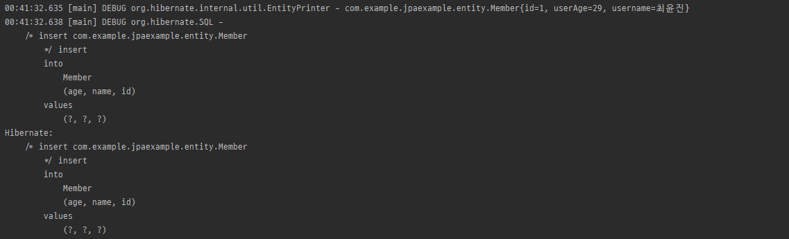

## 😀 JPA 사용해보기 

---

예제에서 사용된 기술 
> SpringBoot 2.5.4 + Gradle + hibernate-entitymanager 5.5.6 + MariaDB 10.6 을 사용하였습니다.


```groovy
// JPA를 사용하기 위해 hibernate-entitymanager 추가 
implementation group: 'org.hibernate', name: 'hibernate-entitymanager', version: '5.5.6.Final'
```

> Member.java
> ```java
> package com.example.jpaexample.entity;
> 
> import lombok.Getter;
> import javax.persistence.*;
> 
> /**
> * <pre>
> * com.example.jpaexample
> *      Member
> * </pre>
> *
> * @author YunJin Choi(zzdd1558@gmail.com)
> * @since 2021-08-23 오후 10:24
>   */
> 
> @Entity
> @Getter
> public class Member {
> 
>     @Id
>     public Long id;
> 
>     @Column(name = "name")
>     public String username;
> 
>     @Column(name = "age")
>     public int userAge;
> 
>     public Member() {}
>     public Member(Long id, String username, int userAge) {
>         this.id = id;
>         this.username = username;
>         this.userAge = userAge;
>     }
> }
> ```

---

해당 코드에 처음보는 Annotation 및 내용들이 있을것 입니다. 하나 하나 정리해보겠습니다.

### @Entity
> 해당 클래스를 테이블과 매핑하겠다고 JPA 에게 알려준다. 이러한 클래스를 Entity 클래스라고 부른다.

### @Table
> Entity 클래스를 매핑할 테이블 정보를 말한다.<br> 
> name속성에 "MEMBER" 라고 값을 줬는데 이렇게 되면 테이블이 생성될때 MEMBER라는 이름으로 생성이 된다.<br>
> 만약 해당 Annotation을 생략하게 된다면 클래스 이름을 테이블 이름으로 매핑한다.<br>
> (정확하게는 Entity의 이름을 사용한다.)

### @Id(식별자 필드)
> Entity 클래스의 필드를 Table의 기본키(Primary Key) 로 매핑한다.
> 해당 예제에서는 id필드가 MEMBER Table의 PK 로 매핑이 된다.


### @Column
> 필드를 컬럼에 매핑한다. <br>
> username 필드를 name과 매핑하였고, userAge 필드를 age로 매핑하였습니다.

---

## 😀 실제로 JPA를 저장하기.

> build.gradle
> ```groovy
> ...
> dependencies {
>   ...
>   
>    // JPA 를 사용하기 위하여 추가
>    implementation group: 'org.hibernate', name: 'hibernate-entitymanager', version: '5.5.6.Final'
>
>    // https://mvnrepository.com/artifact/org.mariadb.jdbc/mariadb-java-client
>    implementation group: 'org.mariadb.jdbc', name: 'mariadb-java-client', version: '2.7.4'
> }
>```

> resources/META-INF/persistence.xml
> ```xml
> <?xml version="1.0" encoding="UTF-8"?>
> <persistence xmlns="http://xmlns.jcp.org/xml/ns/persistence" version="2.1">
> 
>     <persistence-unit name="jpa-book">
>         <class>com.example.jpaexample.entity.Member</class>
>         <properties>
> 
>             <!-- 필수 속성 -->
>             <property name="javax.persistence.jdbc.driver" value="org.mariadb.jdbc.Driver"/>
>             <property name="javax.persistence.jdbc.user" value="root"/>
>             <property name="javax.persistence.jdbc.password" value="P@ssw0rd12#4"/>
>             <property name="javax.persistence.jdbc.url" value="jdbc:mariadb://localhost:3306/jpa"/>
>             <property name="hibernate.dialect" value="org.hibernate.dialect.MariaDBDialect" />
> 
>             <!-- 옵션 -->
>             <property name="hibernate.show_sql" value="true" />
>             <property name="hibernate.format_sql" value="true" />
>             <property name="hibernate.use_sql_comments" value="true" />
>             <property name="hibernate.id.new_generator_mappings" value="true" />
>             <property name="hibernate.hbm2ddl.auto" value="create" />
>         </properties>
>     </persistence-unit>
> </persistence>
>```

 #### - javax.persistence.jdbc.driver : JDBC 드라이버 이름 
 #### - javax.persistence.jdbc.user : 데이터베이스 접속 아이디
 #### - javax.persistence.jdbc.password : 데이터베이스 접속 비밀번호
 #### - javax.persistence.jdbc.url : 데이터베이스 접속 URL

> 하이버네이트 전용 속성 
 #### - hibernate.show_sql : 하이버네이트가 실행한 SQL을 출력한다.
 #### - hibernate.format_sql : 하이버네이트가 실행한 SQL을 출력할 때 보기쉽게 정렬한다.
 #### - hibernate.use_sql_comments : 쿼리를 출력할 때 주석도 함께 출력한다.
 #### - hibernate.id.new_generator_mappings : JPA 표준에 맞춘 새로운 키 생성 전략을 사용한다.

> `<class></class>` 를 사용한 이유는 JPA 에서 Entity를 자동으로 인식하지 못하여 `<class></class>`를 사용하여 직접 등록해 주는 기능입니다.

---

## 동작하는 JPA 구현

> Main.java
> ```java
> package com.example.jpaexample;
> 
> import com.example.jpaexample.entity.Member;
> 
> import javax.persistence.EntityManager;
> import javax.persistence.EntityManagerFactory;
> import javax.persistence.EntityTransaction;
> import javax.persistence.Persistence;
> 
> public class JpaExampleApplication {
> 
>     public static void main(String[] args) {
>         EntityManagerFactory emf = Persistence.createEntityManagerFactory("jpa-book");
>         EntityManager em = emf.createEntityManager();
>         EntityTransaction tx = em.getTransaction();
> 
>         Member member = new Member(1L, "최윤진", 29);
> 
>         try {
>             tx.begin();
>             em.persist(member);
>             tx.commit();
>         }catch(Exception e) {
>             tx.rollback();
>         }finally {
>             em.close();
>         }
>         emf.close();
>     }
> }
>```

### ```EntityManagerFactory```
EntityManagerFactory는 persistence.xml에있는 설정을 읽은다음 JPA 를 동작하기 위한 객체를 만든다.<br>
EntityManagerFactory를 생성하는 비용은 매우 크기 때문에 애플리케이션 전체에서 딱 한 번만 생성하고 공유하여 사용해야한다.<br>

### ```EntityManager```
JPA의 대부분의 기능은 EntityManager가 제공한다. <br>
EntityManager는 내부 데이터소스를 유지하면서 데이터베이스와 통신한다. <br>
주의해야할 점은 EntityManager는 데이터베이스 커넥션과 밀접한 관계가 있기때문에 스레드간에 공유하거나 재사용하면 안 된다.

### ```EntityTransaction```
JPA를 사용하면 항상 트랜잭션 안에서 데이터를 변경해야 한다,<br>
만약 트랜잭션 없이 데이터를 변경하려고 한다면 Exception이 발생한다.

### 실행 결과



위의 사진처럼 `persist(member)`를 통해 JPA가 자동으로 SQL 을 생성하여 전달한 것을 확인할 수 있다.

