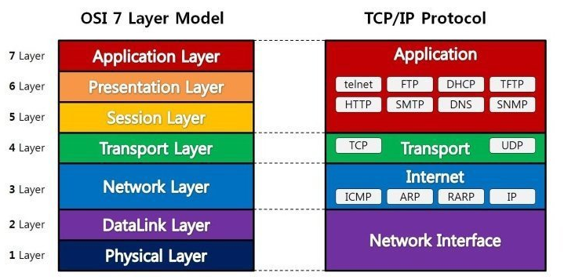

> 네트워크 지식이 완벽하지 않은것 같아 간단하게 공부해볼만한 책을 찾다가  
> [모두의 네트워크 10일만에 배우는 네트워크](http://www.yes24.com/Product/Goods/61794014) 라는 책을 발견하곤 Yes24를 통해 ebook으로 구매하였습니다. 
> 간단하게 정리하기에 앞서 읽어보니 지루하지 않게 예제도 잘나와있고 빠르게 보기 좋은내용 같습니다.  
> 해당 README에서는 간단하게 먼저 읽어보고 또 다른 책으로 내용을 보충하겠습니다 .

--

## 😊 프로토콜 (Protocol)
> 프로토콜이란 네트워크 통신을 하기 위한 규칙을 의미한다. (약속 ..)

## 😊 OSI 7 Layer
> ISO 국제표준화기구에서 만들어진 OSI 표준 규격 , 네트워크 기술의 기본이 되는 모델 
> 총 7개의 계층으로 구성되어있다.  
> <strong>1계층</strong> `물리 계층 (Physical Layer)` - 시스템 간의 물리적인 연결과 전기 신호를 변환 및 제어한다. 
> <strong>2계층</strong> `데이터 링크 계층 (Data Link Layer)` - 네트워크 기기 간의 데이터 전송 및 물리 주소를 결정한다. 
> <strong>3계층</strong> `네트워크 계층 (Network Layer)` - 다른 네트워크와 통신하기 위한 경로 설정 및 논리주소의 결정. 
> <strong>4계층</strong> `전송 계층 (Transport Layer)` - 신뢰할 수 있는 통신 구현  
> <strong>5계층</strong> `세션 계층 (Sessionh Layer)` - 세션 체결, 통신방식의 결정 
> <strong>6계층</strong> `표현 계층 (Presentation Layer)` - 문자 코드, 압축, 암호화 등의 데이터를 변환한다. 
> <strong>7계층</strong> `응용 계층 (Application Layer)` - 이메일 & 파일 전송, 웹사이트 조회 등 애플리케이션에 대한 서비스를 제공한다 
> 
> 1계층 부터 위로 올라간다고 생각하시면 편합니다.

