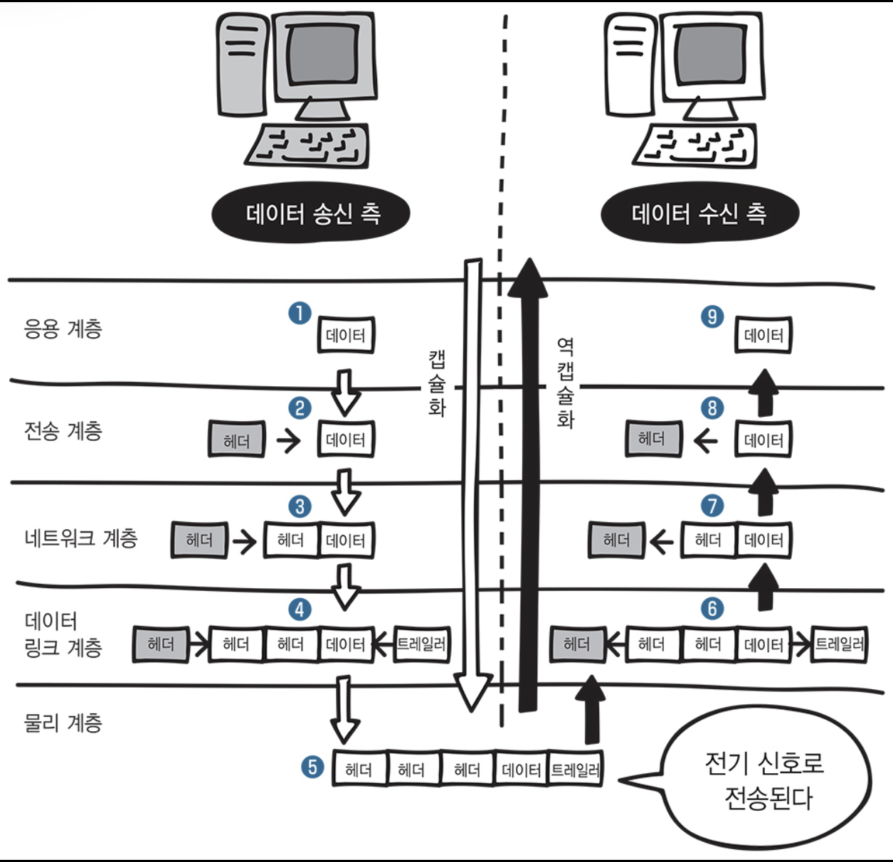

> 네트워크 지식이 완벽하지 않은것 같아 간단하게 공부해볼만한 책을 찾다가  
> [모두의 네트워크 10일만에 배우는 네트워크](http://www.yes24.com/Product/Goods/61794014) 라는 책을 발견하곤 Yes24를 통해 ebook으로 구매하였습니다. 
> 간단하게 정리하기에 앞서 읽어보니 지루하지 않게 예제도 잘나와있고 빠르게 보기 좋은내용 같습니다.  
> 해당 README에서는 간단하게 먼저 읽어보고 또 다른 책으로 내용을 보충하겠습니다 .

--

## 😊 프로토콜 (Protocol)
> 프로토콜이란 네트워크 통신을 하기 위한 규칙을 의미한다. (약속 ..)

## 😊 OSI 7 Layer
> ISO 국제표준화기구에서 만들어진 OSI 표준 규격 , 네트워크 기술의 기본이 되는 모델 
> 총 7개의 계층으로 구성되어있다.  
> <strong>1계층</strong> `물리 계층 (Physical Layer)` - 시스템 간의 물리적인 연결과 전기 신호를 변환 및 제어한다. 
> <strong>2계층</strong> `데이터 링크 계층 (Data Link Layer)` - 네트워크 기기 간의 데이터 전송 및 물리 주소를 결정한다. 
> <strong>3계층</strong> `네트워크 계층 (Network Layer)` - 다른 네트워크와 통신하기 위한 경로 설정 및 논리주소의 결정. 
> <strong>4계층</strong> `전송 계층 (Transport Layer)` - 신뢰할 수 있는 통신 구현  
> <strong>5계층</strong> `세션 계층 (Sessionh Layer)` - 세션 체결, 통신방식의 결정 
> <strong>6계층</strong> `표현 계층 (Presentation Layer)` - 문자 코드, 압축, 암호화 등의 데이터를 변환한다. 
> <strong>7계층</strong> `응용 계층 (Application Layer)` - 이메일 & 파일 전송, 웹사이트 조회 등 애플리케이션에 대한 서비스를 제공한다 
> 
> 1계층 부터 위로 올라간다고 생각하시면 편합니다.

---

## 😊 TCP/IP 모델 
> TCP/IP는 컴퓨터 사이의 통신 표준 및 네트워크의 라우팅 및 상호연결에 대한 자세한 규칙을 지정하는 프로토콜 스위트입니다. 
> TCP/IP 는 총 4계층으로 이루어져 있다.
>
> <strong>1계층</strong> `네트워크 접속 계층` - 물리계층과, 데이터 링크 계층 
> 하드웨어 적인 요소와 관련되는 모든것을 지원하는 계층  
> `Protocal로는 Ehternet, Token Ring, PPP`  
> <strong>2계층</strong> `인터넷 계층` - 네트워크 계층 
>  통신 노드간의 IP 패킷을 전송하는 기능 및 라우팅 기능을 담당   
> `Protocal로는 IP, ARP, RARP, ICMP, OSPF`  
> <strong>3계층</strong> `전송 계층` - 전송 계층  
> 통신 노드 간의 연결을 제어하고, 자료의 송수신을 담당 
> `Protocal로는 TCP, UDP`  
> <strong>4계층</strong> `응용 계층` - 세션 계층, 표현 계층, 응용 계층 
> TCP/IP 기반의 응용 프로그램을 구분할때 사용  
> `Protocal로는 HTTP, FTP, Telnet, DNS, SMTP` 

---

 

## 😊 캡슐화와 역캡슐화
> <strong>데이터를 송수신할 떄는 캡슐화와 역캡슐화가 이루어진다.</strong>

데이터를 전송하기 위해서는 해당 데이터의 앞에 전송하는데 필요한 정보를 붙여서 다음계층으로 보낸다. 계층마다 붙는 정보를 `헤더` 라고 부르는데 이 헤더 안에는 데이터를 전달받을 상대방에 대한 정보도 포함되어있다.

위의 이미지를 보면 데이터를 송신하는 측에서 캡슐화를 하면서 각 계층에 해당하는 헤더를 붙이고있으며. 받는쪽인 수신측에서는 계층이 위로 올라가면서 헤더를 제거하면서 데이터를 꺼내고 있는 모습을 볼 수있습니다.

> `헤더`는 데이터를 보낼때 필요한 정보를 데이터에 추가해야 하는데 이때 사용 하는 정보를 `헤더`라고 한다.

그런데 데이터 링크 계층을 보면 데이터 링크 헤더와 함께 `트레일러`라는것을 추가하는 것을 볼 수있습니다.

그렇다면 `트레일러`는 무엇일까...

> `트레일러`는 전송 하고자 하는 데이터의 마지막 부분에 붙이고, FCS(Frame Check Sequence)라고 부르기도 한다. 
이는 데이터 전송 도중 오류가 발생하는지 확인하는 데 사용된다. 