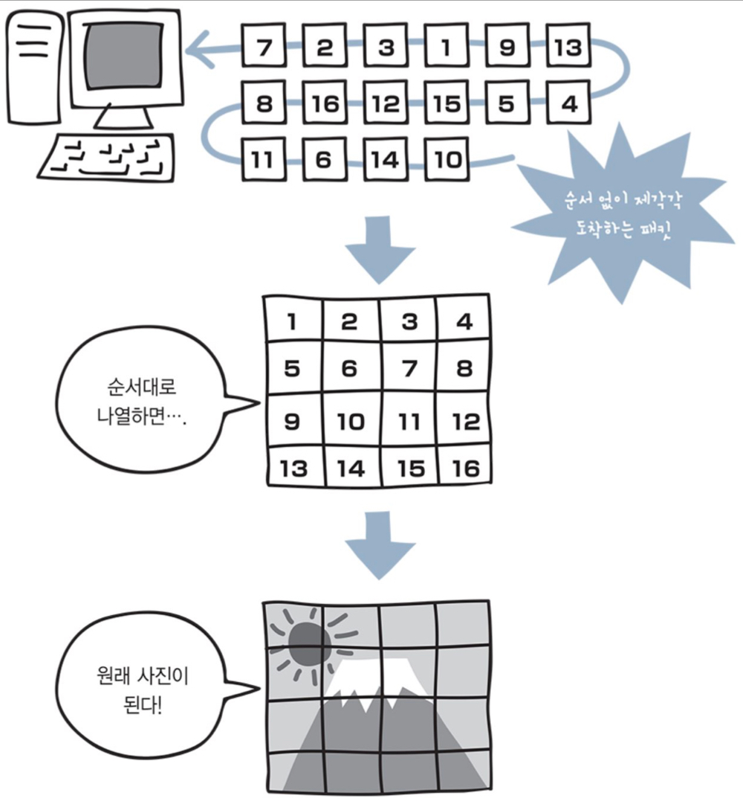

> 네트워크 지식이 완벽하지 않은것 같아 간단하게 공부해볼만한 책을 찾다가 <br> 
> [모두의 네트워크 10일만에 배우는 네트워크](http://www.yes24.com/Product/Goods/61794014) 라는 책을 발견하곤 Yes24를 통해 ebook으로 구매하였습니다.<br>
> 간단하게 정리하기에 앞서 읽어보니 지루하지 않게 예제도 잘나와있고 빠르게 보기 좋은내용 같습니다. <br>
> 해당 README에서는 간단하게 먼저 읽어보고 또 다른 책으로 내용을 보충하겠습니다 .

---

## 😊 컴퓨터 네트워크
> 전송 매체를 매개로 연결되어 서로 데이터를 주고 받는 시스템의 모음
> 

---

## 😊 패킷 (Packet)
> 브라우저에는 사진과 문자를 보여주기 위한 <strong>규칙</strong> 가 존재한다.<br>
> 이러한 규칙을 `패킷`이라고 부른다. `패킷`은 컴퓨터 간에 데이터를 주고받을 때 네트워크를 통해 전송되는 데이터의 작은 조각을 말한다.
> ```큰 데이터가 있어도 작게 나눠서 보내는것이 규칙이다.```

그렇다면 큰 데이터를 그냥 한번에 보내면 되는것을 왜 굳이 작게 나눠서 데이터를 전송하는것일까요 .<br>
먼저 `대역폭`부터 알아야 합니다.

> 대역폭 (bandwidth) 
> ```text
> 대역폭이란 네트워크에서 이용 가능한 최대 전송 속도로 전보를 전송할 수 있는 단위 시간당 전송량을 말한다.
> ```

만약 대역폭을 생각하지 않고 전송하게 된다면, 해당 내용이 네트워크 대역폭을 너무 많이 점유해서 다른 패킷의 흐름을 막아 속도가 정체될 수 있다.

하나의 예를 들어보겠습니다.<br>
하나의 사진을 네트워크로 전송하기위해 작게 조각내었다. 그렇다면 해당 데이터를 받는쪽에서는 어떻게 작은 조각들을 가지고 하나의 원본 사진을 만들수 있을까 ??<br>
실제로 데이터가 누락되었을수도 있고, 해당 패킷전송때 네트워크가 지연되어 늦게 도착하거나 할 수도 있습니다.

이러한 상황때문에 송신 측에서 수신 측으로 패킷을 보낼 때는 각 패킷에 순서를 부여하여 전송합니다. <br>
이렇게 되면 번호에 맞춰 정렬하면 되니 늦게 도착한 패킷도 원래의 위치로 돌아갈 수 있다.



---