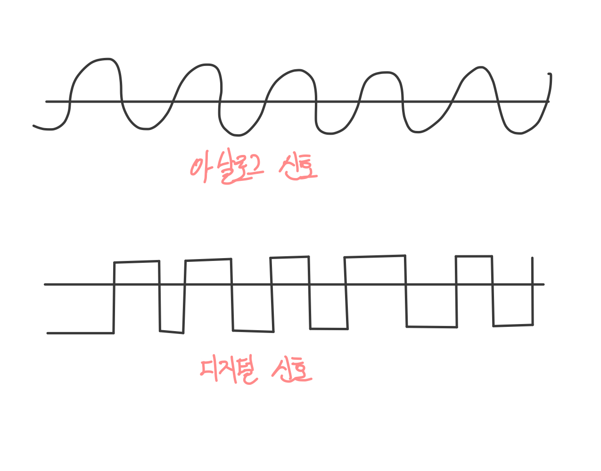
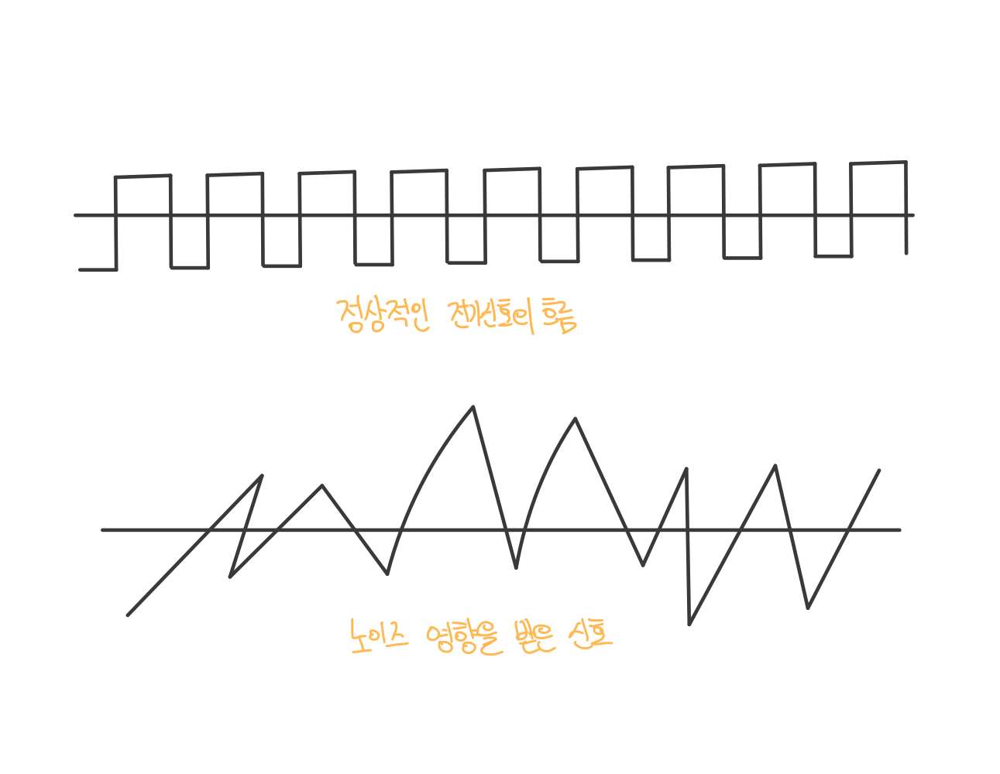

> 네트워크 지식이 완벽하지 않은것 같아 간단하게 공부해볼만한 책을 찾다가  
> [모두의 네트워크 10일만에 배우는 네트워크](http://www.yes24.com/Product/Goods/61794014) 라는 책을 발견하곤 Yes24를 통해 ebook으로 구매하였습니다. 
> 간단하게 정리하기에 앞서 읽어보니 지루하지 않게 예제도 잘나와있고 빠르게 보기 좋은내용 같습니다.  
> 해당 README에서는 간단하게 먼저 읽어보고 또 다른 책으로 내용을 보충하겠습니다 .

--

## 😊 전기 신호의 이해 

OSI모델에서 0과 1로 이루어진 비트열을 전기 신호로 변환하려면 물리계층의 기술이 필요하다.

전기신호의 종류에는 `아날로그 신호`와 `디지털 신호`가 존재한다.

아날로그는 물결모양으로 이루어져 있다. 아날로그 신호는 주로 전화 회선이나 라디오 방송에 사용되는 신호이다.

디지털 신호는 직각으로 이루어져 있습니다.

 

## 😊 랜 카드?

`랜 카드`는 네트워크를 통해 데이터를 송 수신할 수 있도록 0과 1의 정보가 컴퓨터 내부에 있는 랜 카드로 전송되고 랜카드는 0과 1을 전기 신호로 변환한다.

따라서 랜카드가 있어야만 네트워크에서 데이터를 주고 받을 수 있다.

 

## 😊 케이블의 종류와 구조

 ### ◼  트위스트 페어 케이블이란 ?
네트워크 전송에는 유선, 무선 2가지 방법이 있습니다. 

먼저 유선 매체로 사용되는 네트워크 케이블 커넥터에대해 알아본다.

`트위스트 페어 케이블`의 종류에는 UTP 케이블과 STP케이블이 있다.

> `UTP` - Unshielded Twist Pair의 약자로 비차폐 연선이라고도 한다.

UTP케이블은 구리 선 여덟개를 두 개씩 꼬아 만든 네쌍의 전선으로 실드로 보호되어 있지 않은 케이블을 의미한다.
실드라는 것은 금속 호일이나 금속의 매듭과 같은 것으로 외부에서 발생하는 노이즈를 막는 역할을 한다.

따라서 UTP케이블의 장단점을 보면 먼저 실드(shield)로 보호되어있지 않아서 노이즈의 영향을 받기 쉽지만 그만큼 가격이
저렴하기 때문에 일반적으로 많이 사용되는 케이블이다.

> `STP` - Shielded Twist Pair의 약자로 차폐 연선이라고한다.

STP케이블은 UTP 케이블의 반대로 두개씩 꼬아 만든 네쌍의 전선을 실드로 보호한 케이블입니다. 

따라서 노이즈의 영향을 매우 적게 받지만 그만큼 가격은 비싸기 댸문에 보편적으로 사용하지는 않는다.

그렇다면 노이즈의 영향을 받은 신호는 어떻게 될까?? 대략적인 그림은 이렇게 볼 수 있다.

 ### ◼  다이렉트 케이블과 크로스 케이블이란 ?

다이렉트 케이블은 구리선 여덟개를 같은 순서로 커넥터에 연결한 케일블을 의미한다. 
다이렉트 테이블은 실제로 컴퓨터와 스위치를 연결할 때 사용한다.

크로스 케이블은 구리선 여덟개중 1번과 2번을 반대쪽 3번과 6번에 연결한 케이블을 의미한다. 
크로스 케이블은 컴퓨터 간에 직접 랜 케이블로 연결할 때 사용한다.

`다이렉트 케이블`과 `크로스 케이블`은 실제로 1,2,3,6번 구리선만 사용하지 나머지 네개는 사용하지 않는다.

