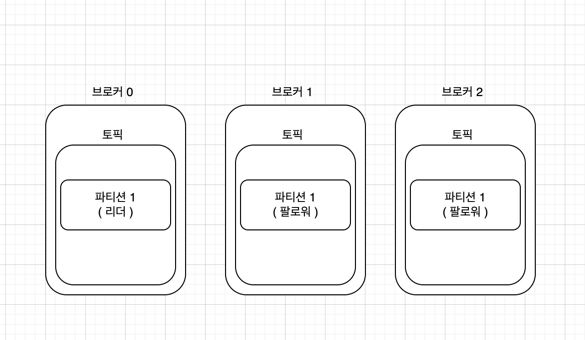

## Kafka 3장

---

### 🚀 카프카의 기본 개념

카프카 브로커는 클라이언트와 데이터를 주고받기 위해 사용되는 주체이자, 분산 저장하여 장애가 발생하더라도
안전하게 사용할 수 있도록 도와주는 애플리케이션이다.

하나의 서버에는 하나의 카프카 브로커 프로세스가 실행되어 한대의 서버만으로도 실행이 되지만
안전하게 보관하고 처리하기 위해 기본적으로 3대 이상의 브로커 서버를 1개의 클러스터로 묶어서 운영한다.

---

### 🚀 카프카의 데이터 저장과 전송.

프로듀서로 부터 데이터를 전달받으면 카프카 브로커에서는 프로듀서가 요청판 토픽의 파티션에
데이터를 저장하고 컨슈머가 데이터를 요청하면 저장된 데이터를 저장한다.

카프카에서 데이터의 저장은 파일 시스템에 저장된다. 

실제로 카프카 실행시 읽어들이는 설정파일 config/server.properties에서 `log.dir`에 설정된 경로에 파일시스템이 저장된다.

> 확인하는 방법은 topic에 데이터를 넣게 되면 해당 topic 명으로 생성되어 있음을 확인 가능

해당 폴더에 보면 `index`, `log`, `timeindex`등의 값을 볼 수 있는데.

 - log: 메시지와 메타데이터를 저장한다.
 - index: 메시지의 오프셋을 인덱싱한 정보를 담은 파일이다.
 - timeindex: 메시지에 포함된 timestamp값을 기준으로 인덱싱한 정보가 담겨있다.
    > 0.10.0.0 버전 이후의 카프카에서는 메시지에 timestamp값이 포함된다. timestamp 값은 
   > 브로커가 적재한 데이터를 삭제하거나 압축하는데 사용한다.
    
 
   
카프카는 기본적으로 파일 시스템에 저장하기 때문에 파일 입출력으로 인한 속도 이슈가 발생하지 않을까? 라는 의문을 품을 수 있따.
하지만 카프카는 페이지캐시를 사용하여 디스크 입출력 속도를 높여서 이 문제를 해결하였다

> #### 페이지 캐시란 
> 
> OS에서 파일 입출력의 선능 향상을 위해 만들어 놓은 메모리 영역을 의미한다. 
> 한번 읽은 데이터에 대해서 메모리의 페이지 캐시 영역에 저장후 동일한 파일의 접근시 메모리에서 읽어내는 방식이다

---

### 🚀 데이터 복제, 싱크

데이터 복제는 카프카를 장애허용시스템으로 동작하도록 하는 원동력이다.

복제의 이유는 클러스터로 묶인 브로커 중 일부에 장애가 발생하더라도 데이터를 유실하지 않고 안전하게 사용하기 위함이다.

> 카프카의 데이터 복제는 파티션 단위로 이루어진다. 토픽을 생성할 때 파티션의 복제 개수도 같이 설정되는데 직접 옵션을 선택하지 않는다면 브로커에 설정된 값을 따라간다.
> 
> 복제 개수의 최솟값은 1이고 최댓값은 브로커 개수만큼 설정하여 사용할 수 있다.
 

위의 이미지는 토픽의 파티션의 복제 개수가 3인 경우에 대한 이미지입니다.

카프카에서 복제된 파티션은 `리더 파티션`과 `팔로우 파티션`으로 구성된다.