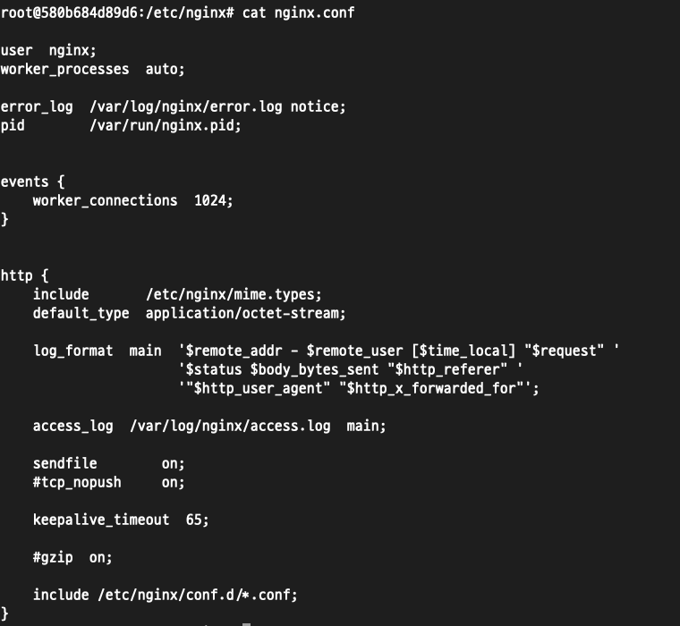
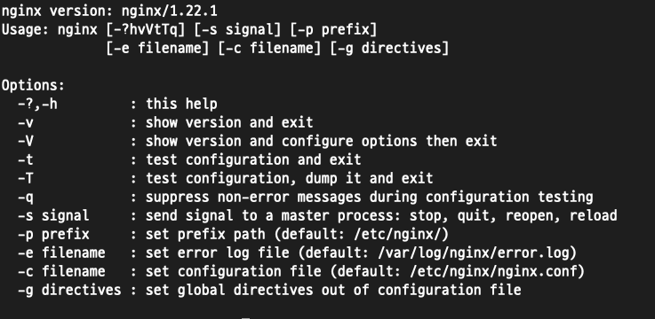
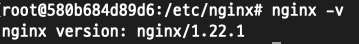
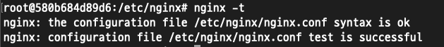

## Nginx 실습을 위한 Docker 환경 세팅

```shell
# 버전 ubuntu 22.04

docker container run -it -v /Users/choiyunjin/nginx-volume:/volume --name ubuntu ubuntu:22.04

# shell 접속 후 
apt-get update
apt install -y gnupg2 ca-certificates lsb-release debian-archive-keyring

# nginx 패키지 저장소 서명키 다운로드
curl https://nginx.org/keys/nginx_signing.key | gpg --dearmor | tee /usr/share/keyrings/nginx-archive-keyring.gpg >/dev/null


# apt 소스파일 생성 
# echo $OS => ubuntu 출력
OS=$(lsb_release -is | tr '[:upper:]' '[:lower:]')
RELEASE=$(lsb_release -cs)
echo "deb [signed-by=/usr/share/keyrings/nginx-archive-keyring.gpg] http://nginx.org/packages/${OS} ${RELEASE} nginx"  | tee /etc/apt/sources.list.d/nginx.list 


## 패키지 정보 업데이트 후 nginx 설치 
apt-get update
apt-get install -y nginx
nginx -version


## docker 실행 후 port 바인딩 시켜야할때...

# 컨테이너 종료
docker stop {containerID}

# 기존 Container를 Image로 저장
docker commit {containerID} {imageName}

# 저장된 Docker Image로 Container 실행 
docker run --name {name} -p {local-port}:{docker-port} -it -v {local-path}:{docker-path} {imageName} /bin/bash
## sample ## 
# docker run --name yunjin-ubuntu2204 -p 80:80 -it -v nginx-volume:/volume yunjin-ubuntu2204 /bin/bash

```
다음과 같이 설정하면 `localhost:80`으로 접근시 docker에 올라간 nginx 환경에 접근 가능.

---

## 주요 설정 파일

### 🌟 /etc/nginx/
> nginx가 사용하는 기본 설정이 저장된 root 디렉터리

### 🌟 /etc/nginx/nginx.conf/
> nginx의 기본 설정 파일로, 모든 설정에 대한 진입점. 워커 프로세스 개수, 튜닝, 동적 모듈 적재와 같은 글로벌 설정 항목을 포함. <br>
> 다른 nginx 세부 설정 파일에 대한 참조를 지정.



### 🌟 /etc/nginx/conf.d/
> 기본 HTTP 설정 파일을 포함. 디렉터리 내부 파일중 이름이 `.conf`로 끝나는 파일은 nginx.conf 파일이가진 최상위 http 블록에 포함된다.


### 🌟/var/log/nginx/
> nginx의 로그가 저장되는 디렉터리, access.log 와 error.log 파일 존재. nginx 설정을 통해 debug 모듈을 활성화 했다면 디버그 정보도 오류 파일에 기록됨.

---

## nginx 명령어

#### 🌟 nginx -h : nginx 도움말


#### 🌟 nginx -v : nginx 버전 정보 확인.


#### 🌟 nginx -V : nginx 버전 정보를 출력하지만 , 빌드정보도 함께 출력, 바이너리에 포함된 모듈들을 보여주는 설정 인숫값 확인가능.

#### 🌟 nginx -t : nginx 설정을 테스트한다.


#### 🌟 nginx -T : nginx 설정을 테스트한다. 결과를 화면에 보여준다, 기술 지원에 유용

#### 🌟 nginx -s signal : -s 매개변수는 지정된 신호를 nginx 마스터 프로세스에 전송.
> - stop : nginx 프로세스가 즉시 동작을 멈춤
> - quit : 현재 진행중인 요청을 모두 처리한 뒤 nginx 프로세스 종료.
> - reload : nginx 설정을 다시 읽는다.
> - reopen : 지정된 로그 파일을 다시 열도록 지시.


