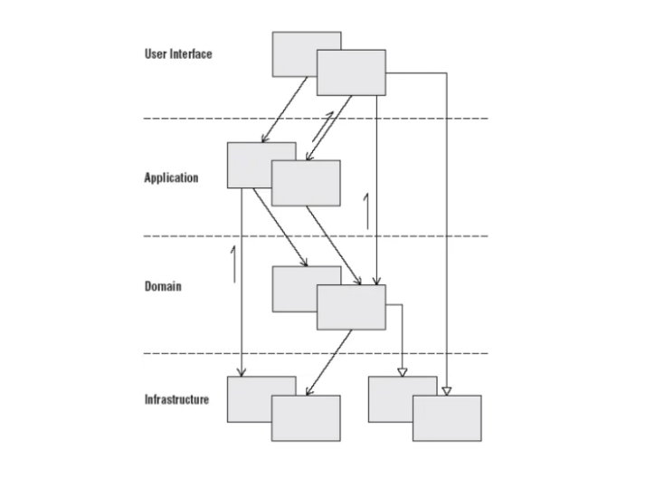

>해당 내용은 에릭 에반스의 <도메인 주도 설계> 책의 내용을 개인적으로 정리한 글 입니다.
>
>

---

# Chapter 01

## 😃 소프트웨어에서의 도메인 모델

----

- <b><i>모델</i></b> 이란 어떠한 사실을 해석한 것으로 볼 수 있다. 또한 모델은 대상은 단순화 한것이다.

- 모든 모델은 중요한 사실이나 일부 측면을 나타난다.

- 소프트웨어 상에서 사용자가 프로그램을 사용하는 대상영역이 바로 소프트웨어의 도메인이다.

- 소프트웨어에서의 모델은 지식을 선택적으로 단순화하고, 의식적으로 구조화한 형태다

- 도메인 모델은 전문가의 머릿속에만 존재하는 지식이 아니라 해당 지식을 엄격하게 구성하고 선택적으로
  추상화한 것이다.

- 모델은 프로그래밍과 설계와 밀접한 관계를 맺는다, 모델은 선순환을 통해 도메인에 대한 팀 구성원의 통찰력을 심화시켜 팀 구성원이 더욱 분명하게 모델을 파악하게 하고, 이는 한층 더 높은 수준으로 정제된 모델로 이어진다.

- 모델은 도메인을 이해하는 데 실용적이고 유용해야 한다. 쉽게 구현하고, 이해하기에 충분할 만큼 엄밀해야 한다.

### 😃 <i>도메인 주도 설계에서의 모델의 유용성</i>

---

#### 1. 모델과 핵심 설계는 서로 영향을 주며 구체화한다.

    위와 같은 모델과 구현의 연결은 유지보수와 계속되는 기능의 개선에 도움이 된다.
    이유는 모델을 이해한 바에 근거해 코드를 해석할 수 있기 때문이다.

#### 2. 모델은 모든 팀 구성원이 사용하는 언어의 중추다.

    모델과 구현이 서로연결돼 있기때문에 개발자는 이를 토대로 프로그램에 관해 의견을 나눌수 있다.

#### 3. 모델은 지식의 정수만을 뽑아낸 것이다.

    개발자와 도메인 전문가는 공유 언어를 바탕으로 갖가지 정보를 모델로 만들어낼 때
    효과적으로 협업할 수 있다.

  

### 😃 효과적인 모델링의 요소

---

####1. 모델과 구현의 연계

####2. 모델을 기반으로 하는 언어 정제

    누구라도 모델에서 바로 용어를 끄집어내어 모델의 구조와 
    일관된게 문장을 구성할 수 있게 되었고, 별도의 해석이 없어도 명확히 이해가 가능했다.

####3. 풍부한 지식이 담긴 모델 개발

    객체는 행위를 지니고 규칙을 이행했다. 모델은 단순히 데이터 스키마가 아니라 
    복잡한 문제를 해결하는데 필수불가결한 것이다. 그리고 모델에는 다양한 지식이 포함되어있다.

####4. 모델의 정제

    불필요한 개념과 필요한 개념이 한데 묶여 있을 경우, 본질과 무관한 개념은 모두 제거할 수 있게
    본질적인 개념만을 식별할 수 있는 새로운 모델은 만들어야 한다.

####5. 브레인스토밍과 실험

# Chapter 02

## 😃 의사소통과 언어 사용

---

### 보편언어 (Ubiquitous Language)

>도메인 전문가는 소프트웨어 개발에 사용되는 기술적인 전문 용어를 이해하는 데 한계가 있지만, 자신이 종사하는 분야의
언어는 아마 다양하게 사용할 것이다.

>개발자는 시스템을 서술적이고 기능적인 용어로 이해하고 토론할지는 모르지만 전문가들의 언어에 담긴 의미는 알지못한다.

위와 같이 공통 언어 없는 프로젝트에서는 각각의 도메인 전문가와 개발자는 서로의 언어를 번역해줘야한다.

이렇게 되다보면 모델의 개념을 혼란스럽게 만들어 해로운 코드 리펙터링으로 이어진다.

번역은 의사소통을 무디게하고 모델의 개념을 빈약하게 만들기 때문에 이러한 언어의 대해 의식적인 노력을 기울인다면
도메인 모델이 그러한 공통언어의 근간을 제공하고 동시에 팀 내 의사소통을 소프트웨어 구현이 이르기까지 연결할 수 있다 .

그렇다면 이러한 문제를 해결하기 위해서는 어떻게 해야할까 ??

#### 1. 모델을 언어의 근간으로 사용하라
    팀 내 모든 의사소통과 코드에서 해당 언으를 끊임없이 적용하는데 전념하라.
    다이어그램과 문서에서, 말할 때동일한 언어를 사용하라

#### 2. 대안 모델을 반영하는 대안이 되는 표현을 시도하라
    모델을 반영하는 대안이 되는 표현을 사용함으로 어려움을 해소하고 
    새로운 모델에 맞게 클래스, 메서드, 모듈의 이름을 다시 지으면서 코드를 리펙터링하라.

#### 3. Ubiquitous Language의 변화가 곧 모델의 변화라는것을 인지하라
    도메인 전문가는 부자연스럽고 부정확한 용어나 구조에 대해 반대 의사를 표명하고, 개발자는 
    설계를 어렵게 만드는 모호함과 불일치를 찾아내는 데 촉각을 곤두세워야 한다 .

---

### 모델은 다이어그램이 아니라는 점을 항상 명심하라.
#### 우리가 흔히 사용하는 다이어그램의 목적은 모델을 전달하고 설명하는 데 있다. 잘 작성된 자바 코드는 UML만큼 표현력이 있다.

---

### 글로 쓴 설계 문서

구두에 의한 의사소통은 코드의 정연함과 상세함을 의미적으로 보충하는 역할을 한다.
그러나 모든사람들 또는 어떤 집단에서는 글로 쓴 문서로 안정과 공유를 꾀할 필요가 있다.

그러나 팀이 좋은 소프트웨어를 만들어 내는 데 실제로 도움이 될 문서를 만드는것인 쉽지 않다.

왜일까 ?

바로 문서가 변하지 않는 형태를 취할때가 종종 있기 때문이다. 이말은 즉 프로젝트의 흐름과의 연관성을 잃어비린다는 말이다.
즉, 개발을 하다보면서 문서에 신겨을쓰지 못하여 문서가 코드의 발전이나 프로젝트 언어의 발전에 뒤처지는 것이다.

- 문서는 코드와 말을 보완하는 역할을 해야한다.
- 문서는 유효한 상태를 유지하고 최신 내용을 담고 있어야 한다.

설계문서의 가장 큰 가치는 모델의 개념을 설명하고, 코드의 세부사항을 파악해 나가는 데 도움을 주며,
의도된 사용방식에 어떤 통찰력을 주는데 있다. 팀의 철학에 다라 여러장의 밑그림만큼이나 간단할 수도있고, 상당한 양이 될 수 있다.

결과적으로 <b>문서를 최소한으로 유지하고 코드와 대화를 보완하는 데 집중함으로써 문서는 프로젝트와 연관된 상태로 유지할 수 있다.</b>

---

## 모델 주도 설계

도메인 모델은 전혀 없고 기능만 차례로 구현하기 위해 코드를 작성하는 프로젝트에서는 앞서 두 장에 걸쳐 논의한 지식 탐구와 의사소통의 이점을 거의 살리지 못한다 .

설계 혹은 설계의 주된 부분이 도메인 모델과 대응하지 않는다면 그 모델은 그다지 가치가 없으며, 소프트웨어의 정확함도 의심스러워진다.

동시에 모델과 설계 기능 사이의 복잡한 대응은 이해하기 힘들고, 실제로 설계가 변경되면 유지보수가 불가능해진다. 분석과 설계가 치명적으로 동떨어지고, 그에 따라 각자의 활동에서 얻은 통찰력이 서로에게 전해지지 않는다.

> 도메인 모델을 설계에 밀접하게 연관시키는 원칙을 강제하면 가능한 각종 모델 가운데 좀더 유용한 것을 선택하는 또 하나의 기준이 만들어진다.
>
> 이를 위해서는 많은 고민이 필요하고 보통 수차례에 걸친 반복주기와 상당한 양의 리팩터링이 따르지만, 그 결과 관련성 있는 모델이 만들어진다.
>
> 위와 같은 문제 때문에 소프트웨어 시스템의 일부를 설계를 할 때는 도메인 모델을 있는 그대로 반영해서 설계와 모델의 대응을 분명하게해야하며,
> 모델을 재검토하여 더욱 자연스럽게 소프트웨어로 구현될 수 있게 수정하라.
>
> 모델로부터 설계와 기본적인 책임 할당에 사용한 용어를 도출하라, 코드를 작성할 때 그러한 용어를 사용하면 코드가 모델을 표현한 것이 되고, 코드의 변경이 곧 모델의 변경으로 이어질 수 있다.
>
> 단일 모델은 오류가 일어날 확률을 줄인다. 이는 이제 설계가 주의 깊게 고려한 모델의 직접적인 결과물에 해당하기 때문이다. 따라서 코드 자체도 모델의 전달력을 갖추게 된다.
>
>

---

## 실천적 모델러 ( Hands On Modeler)

- 코드를 작성하는 사람이 모델에 책임을 느끼지 못하거나 애플리케이션을 대상으로 모델이 동작하게 만드는 법을 모른다면 그 모델은 소프트웨어와 무관해진다.

- 코드의 변경이 곧 모델의 변경이라는 점을 개발자가 인식하지 못하면 리팩터링은 모델을 강화하기보다는 약화시킬것이다.

- 모든 개발자는 모델에 관한 일정 수준의 토의에 깊이 곤여해야 하고 도메인 전문가와접촉해야 한다.

> 모델링과 프로그래밍을 뚜렷하게 구분하는 것은 별 의미가 없지만 규모가 큰 프로젝트에서는 고수준의 설계와 모델링을 조율하고 가장 어렵거나 중요한 의사결정을 내리는 것을 돕는 기술적인 측면의 리더가 필요하다.

---

## 도메인의 격리

객체지향 프로그래밍에서는 종종 사용자인터페이스와 데이터베이스, 기타 보조적인 코드들을 비즈니스 객체 안에 직접 작성하기도 한다.
이러한 방식이 나오게된 계기는  단기적으로는 이렇게 짜는 코디가 뭔가를 동작하게 하는 가장 쉬운 방법이기 때문이다.

하지만 도메인에 관련된 코드가 상당한 양의 도메인과 관련이 없는 다른 코드를 통해 확산될 경우 도메인에 관련된 코드를 확인하고
추론하기가 매우 힘들어진다.  기술과 로직이 모두 각 활동에 포함돼 있따면 프로그램을 이해하기가 힘들어진다.

흔히 많은 개발자들이 사용하는 Layered Architecture 입니다.

Layered Architecture 는 크게 4가지 Layer 로 분류됩니다

- 사용자 인터페이스 ( UI Layer )
- 응용 계층 ( Application Layer )
- 도메인 계층 ( Domain Layer )
- 인프라스트럭처 계층 ( Infrastructure Layer )

---

### 😃 사용자 인터페이스 ( UI Layer )
> 사용자에게 정보를 보여주고 사용자의 명령을 해석하는 일을 책임진다. 간혹 사람이 아닌 다른 컴퓨터 시스템이 외부 행위자가 되기도 한다.

 

### 😃 응용 계층 ( Application Layer )
> 소프트웨어가 수행할 작업을 정의하고 표현력 있는 도메인 객체가 문제를 해결하게한다. 해당 계층에서 책임지는 작업은 업무상중요하거나 다른 시스템의 응용
> 계층과 상호작용하는데 필요하다.

 

### 😃 도메인 계층 ( Domain Layer )
> 업무 개념과 업무 상황에 관한정보, 업무 규칙을 표현하는 일을 책임진다. 해당 계층에서는 업무 상황을 반영하느 상태를 제어하고 사용하며,
> 그와 같은 상태 저장과 관련된 기술적인 세부사항은 인프라스트럭처에 위임한다.
> 해당 계층은 업무용 소프트웨어의 핵심이다.

 

### 😃 인프라스트럭처 계층 ( Infrastructure Layer )
> 상위 계층을 지원하는 일반화된 기술적 기능을 제공한다.
> 해당 계층은 네 가지 계층에 대한 상호작용 패턴을 지원할 수도 있다.

 

---

### Model Driven Design 분리 방법

Model Driven Design을 가능하게 하는 방법은 도메인 계층을 분리하는 방법이 있다.

1. 복잡한 프로그램을 여러개의 계층으로 나눠라
2. 아래에 위치한 계층에만 의존하는 각 계층에서 설계를 발전시켜라.
3. 표준 아키텍처 패턴에 따라 사우이 계층과의 결합을 느슨하게 유지하라.
4. 도메인 모델과 관련된 코드는 모두 한 계층에 모으고 사용자 인터페이스 코드나 애플리케이션코드, 인프라 스트럭처 코드와 격리하라.

위와 같이 분리하게 된다면 모델은 진화를 거듭해 본질적인 업무 지식을 포착해서 해당 업무 지식이 효과를 발휘할 수있을만큼 풍부하고 명확 해질 것이다.

또한 격리된 계층을 유지하는 데 드는 비용은 훨씬 더 적은데, 이는 격리된 계층이 각자 다른 속도로 발전해서 각기 다른 요구에 대처할 것이기 때문이다.

개발을 하다보면 하위 수준의 객체가 상위 수준의 객체와 소토앻야 할 경우에는 또 다른 메커니즘이 필요한데, 이럴경우 콜백이나 옵저버 패턴처럼 계층간에
관계를 맺어주는 아키텍처 패턴을 활용할 수 있다.