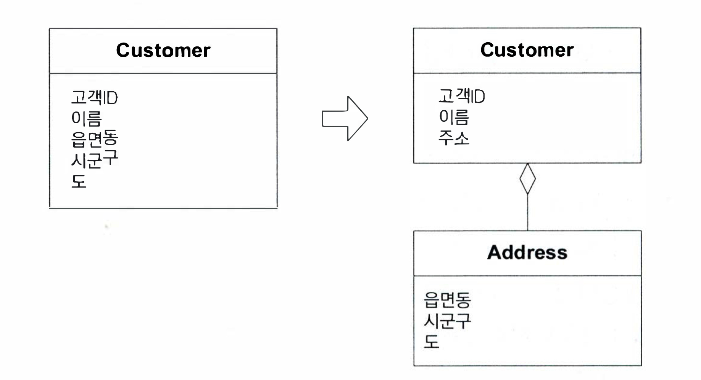

## 05 소프트웨어에서 표현되는 모델

---

#### - 연관관계

#### - Entity( 엔티티 , 참조객체 ) , Value Object ( 값 객체 )

> 어떤 객체가 연속성과 식별성을을 지닌것을 의미하는가? 아니면 다른 상태를 기술하는 속성에 불과한가.
>
> 이 내용은 Entity와 Value Object를 구분하는 가장 기본적인 방법이다.

```java
// Entity
@Entity
class User {
    @Id
    @Generatedvalue(strategy = generationtype.identity)
    private Long 
    
    ...
}

// Value Object 
class Money {
    private BigDecimal value;
    
    ...
}


```

#### - Service ( 서비스 )

> 어떠한 연산을 Entity나 Value Object에게 억지로 맡기는것 보다 Service로 표현하는 편이 나을 때가 있다.
>
> Service는 Client의 요청에 대해 수행되는 무언가를 의미하기도 한다.
>
> 소포트웨어에서 수행해야 하는 것에는 해당하지만 상태를 주고받지는 않는 활동을 모델링 하는 경우가 여기에 해당한다.

#### - Module ( 모듈, 패키지라고도 함 )

> 모든 설계 관련 의사결정은 도메인에 부여된 통찰력을 바탕으로 내려야 한다는 사실을 알게 될 것이다.
>
> 높은 응집도와 낮은 결홉도 라는 개념은 도메인 개념에도 적용할 수 있다 .
>

#### - 모델링 패러다임

<br><br>

### 💻 연관 관계

---

연관 관계는 흔히 개발하면서 들어볼수 있는 1:N, N:1, N:N 과 같은 객체와 객체 or 테이블과 테이블간의 관계를 표현할때 자주 사용하는 용어입니다.

기존에 RDBMS나 JPA ORM 을 사용해보셨다면 모다 알는 1:N, N:1, N:N 과 같은 다양한 연관관계가 있으며, 그중 상당수는 양방향으로 나타난다.

#### 연관관계를 좀더 쉽게 다루는 방법 3가지.

> 1. 탐색 방향을 부여한다( 단방향, 양방향 )
> 2. 한정자(qualifier)를 추가해서 사실상 다중성(multiplicity)을 줄인다.
> 3. 중요하지 않은 연관관계는 제거한다.

가능한 한 관계를 제약하는것이 중요하다. 양방향 연관 관계는 두 객체가 모두 존재해야지만 이해 할 수 있다.

만약 서비스 로직을 개발하는데 요구사항에서 양방향으로 탐색할 필요가 없다면 탐색 방향을 추가하여 상호 의존성을 줄여 설계를 단순하게 할 수 있다.

또한 도메인의 특성이 반영되게끔 연관관계를 일관되게 제약하면 의사전달력이 풍부해지고 구현이 단순해지며, 나머지 양방향 연관관계도 의미를 지니게 된다.

<br>

## 💻 Entity

---

> 어떤 객체를 일차적으로 해당 객체의 식별성으로 정의할 경우 해당 객체를 Entity라고 부른다. 또한 해당 Entity의 식별성은 고유해야 한다.
> 
> Entity는 생명주기 내내 이어지는 연속성과 애플리케이션 사용자에게 중요한 속성과는 독립적인 특징을 가진 것이다.
> 
> 사람, 도시, 자동차, 복권, 은행 등이 Entity가 되기도 한다.

객체 모델링을 할 때 우리는 객체의 속성에 집중하곤 한다.
<br>
Entity의 근본적인 개념은 객체의 생명주기 내내 이어지는 추상적인 연속성이며, 추상적인 연속성은 여러 현태를 거쳐 전달된다.

### Entity의 특징

- Entity에는 모델링과 설계상의 툭수한 고려사항이 포함돼 있다.
- Entity는 자신의 생명주기 동안 형태와 내용이 급격하게 바뀔수도 있지만 연속성은 유지하여야 한다.
  > 해당 Entity의 속성이 변경되었다고 해당 Entity의 식별값이 달라지는것은 아니다.
  > 
  > 아래의 예제를 보겠습니다. 
   ```java
  @Entity
  class User { 
    @Id 
    @Generatedvalue(strategy = generationtype.identity)
    private Long id;
  
    private String address;
  }
  
  // main
  User user = new User(1L, "서울시 관악구 봉천동 ");
  user.changeAddress("서울시 관악구 낙성대");
  
  // 형태와 내용(속성)이 변경되었지만 해당 User 가 다른 Entity는 아니다.
  ```
  
- Entity를 추적하기 위해서는 Entity에 식별성이 정의돼 있어야 한다.
- Entity의 클래스 정의와 책임, 속성,  연관관계는 Entity에 포함된 특정 속성보다는 Entity의 정체성에 초점을 맞춰야 한다.
- Entity가 급격하게 변형되지 않거나 생명주기가 복잡하지 않더라도 의미에 따라 Entity를 분류한다면 모델이 더욱 투명해지고 구현은 견고해 질 것이다.


### Entity 생성시 고려할점 

- 객체가 속성보다는 식별성으로 구분될 경우 모델 내에서 이를 해당 객체의 주된 정의로 삼아라.
- 클래스 정의를 단순하게 하고 생명주기의 연속성과 식별성에 집중하라.
- 객체의 형태나 이력에 관계없이 각 객체를 구별하는 수단을 정의하라
- 객체의 속성으로 객체의 일치 여부를 판단하는 요구사항에 주의하라
- 각 객체에 대해 유일한 결과를 반환하는 연산을 정의하라.


<br>

## 💻 Value Object ( 값 객체 )

---

>
> ✍🏼When programming, I often find it's useful to represent things as a compound. <br>
> A 2D coordinate consists of an x value and y value.<br>
> An amount of money consists of a number and a currency.<br>
> A date range consists of start and end dates,<br>
> which themselves can be compounds of year, month, and day.<br>
> 
> 
> 🔍프로그래밍할 때, 사물을 복합물로 표현하는 것이 유용한 경우가 종종 있다.<br>
> 예를 들어, 2차원 좌표는 x, y로 이루어져 있고,<br>
> 돈이나 통화 같은 경우 숫자로 이루어져 있다.<br>
> 날짜의 범위는 시작 날짜와 종료날짜로 구성될 수 있고,<br>
> 연도와 월, 일의 복합물일 수 도 있다
>
>  -Martin Fowler-

#### 즉, Value Object (값 객체) 는 한개 혹은 그 이상의 속성들을 하나의 의미있는 값으로 묶어서 특정 값을 나타내는 객체를 의미합니다.

- 모델에 포함된 어떤 요소의 속성에만 관심이 있다면 그것을 Value Object로 분류하라.
- Value Object는 간혹 Method의 매개변수로 전달되기도 한다.
- Value Object는 불변(Immutable)으로 다뤄야 한다.
- Value Object에는 아무런 식별성도 부여하지 말고 Entity를 유지하는 데 필요한 설계상의 복잡성을 피하라. 

#### 다음 예제를 확인해보겠습니다.

해당 예저는 Value Object가 없는 Customer를 ValueObject 를통해 분리하였을때의 모습입니다.


```java
// Value Object 를 사용하지 않았을때의 Customer
public class Customer {
  private String 고객ID;
  private String 이름;
  private String 읍면동; 
  private String 시군구;
  private String 도;
}
```


```java
// Value Object 를 사용하였을떄
public class Customer {
  private String 고객ID;
  private String 이름;
  private Address 주소;
}

public class Address {
    private String 읍면동;
    private String 시군구;
    private String 도;
}
```
Value Object를 사용하면 다음과 같이 Person내부의 Address로 완전한 주소를 구성함으로써 더 단순한 Person과 응집력 있는 Value Object인 Address를 만들어낸다.


### Value Object의 설계

---

###- 객체는 불변적이어야한다.

```java

// User 이름에 대한 값객체 UserName이 있다고 가정.
class UserName {
    private String userName;
    ...
}

// main
UserName userName = new UserName("최 윤진");
User user = new User(userName);
User user2 = new User(userName);

// 두 User 객체는 한 사람의 이름이 변경되기 전까지는 올바르게 동작할 것이다.
// 하지만 user의 userName을 변경하게 된다면 user2의 이름도 변경이 됩니다.
// 이러한 상황이 발생하면 의도하지 않은 사이드이펙트가 발생하게 된다.

```

이러한 내용으로 보면 객체를 안전하게 공유할 수 있으려면 해당 객체는 불변적이어야한다.
이말은 즉 해당 UserName 객체를 새로 만들어서 교체하지 않고는 이름을 변경하지 못한다 .

```java
// main
UserName userName = new UserName("최 윤진");
UserName user2Name = new UserName("최 윤진");
User user = new User(userName);
User user2 = new User(user2Name);
```

<br>

## 💻 Service ( 서비스 )

---

> Enyity나 Value Object에서 찾지 못하는 중요한 도메인 연산이 있을 수 있다. 이들 중 일부는 본질적으로 
> 사물이 아닌 활동이나 행동인데, 객체는 그러한 연산도 잘 어울리게끔 노력해야한다.
> 
> 하지만 이러한 객체의 정의에 어울리지 않는 연산을 강제로 객체에 포함시키게 된다면, 해당 객체는 자신의 개념적 명확성을 
> 잃어버리고 이해하거나 리팩터링하기 힘들어질것 이다.  ( 이러한 문제로 서비스가 나오지 않았을까? )
> 
> 
>  도메인이나 ValueObject에 두기 애매 모호한 로직이 있다면 도메인 서비스로 빼는것이 좋다. (도메인 주도 설계 철저입문 내용 중)
> 

### Service Naming 

서비스(행위자)의 이름의 끝에 Manager를 붙여 Class 를 만들기도 한다 .

서비스라는 이름은 다른 객체와의 관계를 강조합니다.

일반 적으로 Entity와, Value Object와 달리 Service를 정의하는 기준은 클라이언트에 무엇을 제공할 수 있느냐에 있다.

Entity가 주로 동사나 명사로 이름을 부여한다면 Service는 주로 활동으로 이름을 짓는다.

 
###Application Service(응용 서비스)
> 외부의 요청을 도메인 모델 또는 도메인 서비스에 위임하는 역할을 한다. (비지니스 로직이 있는곳이 아니다.)


### Domain Service (도메인 서비스)
> 여러 애그리게잇이나 비지니스 규칙을 구현할 때 사용. 연산 또는 규칙을 풀어낼때 사용한다.
> 


## 💻 Module ( 모듈 or 패키지 라고 부름)

---

- Module는 오래 전부터 확립되어 사용되고 있는 설계 요소다.
- Module 간에는 결합도가 낮아야하며, Module 내부의 응집도가 높아야한다.
- Module 로 분리하는 것은 코드의 분리가 아닌 바로 개념의 분리이다.
- Module 간의 결합도가 낮다면 내용을 분석할 때 내용물과의 상호작용하는 것에대해 조금만 알고 있어도 분석하기 쉽다.
- Module도 하나의 의사소통 메커니즘이다.


### 기민한 Module

---

Module를 변경하려면 넒은 범위의 코드를 수정해야만 한다. 
또한 Module or Package의 변경은 팀원간의 의사소통을 해치고, 코드관리 시스템 개발도구를 망칠 수 있다.

Module을 선택할 때 실수로 결합도가 높아지면 리팩터링을 수행하기가 어려워진다.

고통스럽겠지만... 문제가 있는 부분의 모듈(Package)는 리팩토링 하도록 하면 좋을듯 하다 .


하지만 처음부터 Module(Package)의 모델링을 잘하면 리팩터링을 최소화할 수 있을것이다.
( 하지만 요즘은 Tool 에서 Rename을 너무 잘해주지 않나 .. )


## 💻 인프라스트럭처 주도 패키지화의 함정

> 인프라 스트럭처 코드와 사용자 인터페이스 코드를 별도의 패키지 그룹에 두는식으로 Layered Architecture를 적용하여 도메인 
> 계층을 물리적으로 자체적인 패키지 안으로 들어가게 하는것이다.

 - 패키지화를 바타으로 코드로 부터 도메인 계층을 분리해야한다. 만약 그렇게 할 수 없다면 가능한 도메인 개발자가 자신의
모델과 설계 의사 결정을 지원하는 형태로 도메인 객체를 자유롭게 패키지화 하라.


## 💻 객체 패러다임이 지배적인 이유 

---

#### 객체지향 설계 원리는 대부분의 사람들도 자연스럽게 이해한다. 하지만 오히려 어떤 개발자들은 모델링의 미묘한 측면들을 놓치기도 한다.

1. 객체 모델링의 개념은 단순하면서도 중요한 도메인 지식을 포착할 만큼 풍부한 것으로 인증이 됐다.
2. 지난 몇년간 해당 기술이 널리 보급되어 무의미해졌다.
3. 개발자 커뮤니티와 설계 문화 자체의 성숙도도 지배적인 이유중 하나이다.
