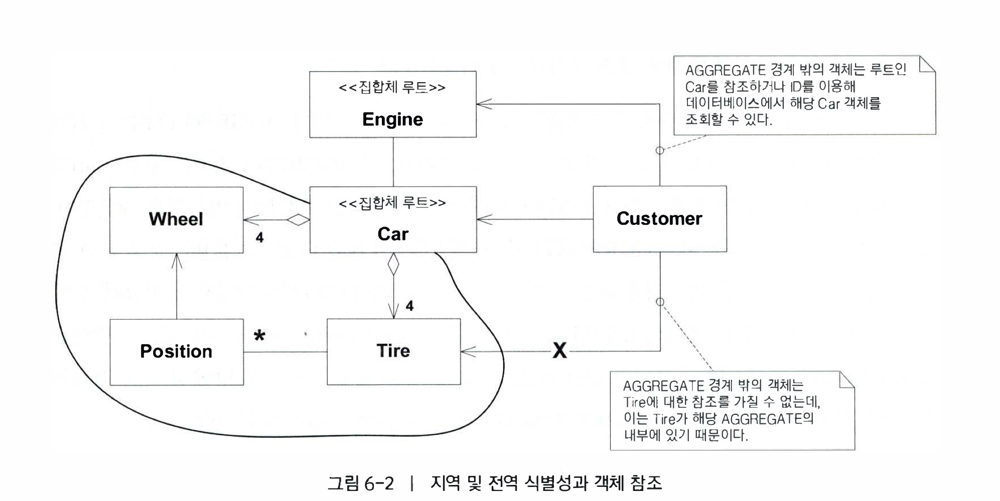

## 06 도메인 객체의 생명주기

---

> 객체는 생성되어 다양한 상태를 거친 후 결국 저장되거나 삭제되면서 소멸한다, 이러한 과정을 객체의 생명주기라고 한다
> 

### 도메인 객체의 관리와 관련된 문제

 - 생명주기 동안의 무결성 유지하기
 - 생명주기 관리의 복잡성으로 모델이 난해해지는 것을 방지하기 

해당 06장 챕터에서는 다음과 같은 패턴을 사용하여 해결한다 .

 - Aggregate
   > Aggregate는 소유권과 경계를 명확희 정의함으로써 모델을 엄격하게 만들어 객체 간의 연관관계가 혼란스럽게 얽히지 안헤 한다.
   > 해당 패턴은 생명주기상의 전 단계에 걸쳐 도메인 객체의 무결성을 유지하는데 매우 중요하다.
   
 - Factory
   > 해당 Factory는 복잡한 객체와, Aggreegate를 생성하고 재구성함으로써 그것들의 내부 구조를 캡슐화 하는것이다.
   
 - Repository
   > 거대한 관련 인프라스트럭처를 캡슐화 하면서 영속 객체를찾아 조회하는 수단을 제공한다

비록 Repository 와 Factory는 도메인에서 나오는것은 아니지만 이 2가지는 도메인 설계에서 중요한 역할을 담당한다.

Aggregate를 모델링하고 설계에 Factory와 Repository를 추가하면 모델객체의 생명주기 동안 체계적이고 의미있는 단위로 조작할 수 있다.

---

## AGGREGTE( 집합체 )

> AGGREGATE는 우리가 데이터 변경의 단위로 다루는 연관 객체의 묶음을 의미한다. 각 AGGREGATE에는 루트(root)와 경계(boundary)가 있다.

대부분의 업무 도메인은 상호 연관의 정도가 높기때문에 우리는 객체 참조를 통해 얽히고 설킨 관계망을 추적해야한다.
경우에 따라서는 이처럼 얽히고 설킨것이 우리가 명확히 경계를 지어야 할 일이 거의 없는 세상의 현실을 반영한다고도 볼 수 있다.

모델 내에서 복잡한 연관관계를 맺는 객체를 대상으로 변경의 일관성을 보장하기란 쉽지 않다. 왜냐하면 객체간에 서로 밀접한 관계가있다면 객체 
집합에도 불변식이 적용되야하기 때문이다. 이러한 문제가 생긴다고 변경의 일관성을 보장하고자 신중 잠금 기법을 슨다면 
다수의 사용자가 서로 부적절하게 간섭하여 시스템이 사용할 수 없는 상태가 될 것이다.

#### 이러한 문제를 해결하기 위해서는 도메인을 심층적으로 이해해야 하며, 해당 경우 특정 클래스 인스턴스 사이의 변화 빈도와 같은 사항까지 이해하고 있어야한다.

 

### 트랜잭션을 구현하기 위한 각종 규칙
 - 모델 내의 참조에 대한 캡슐화를 추상화할 필요가 있다.
 - AGGREGATE에는 루트(root)와 경계(boundary)가 있다.
   > AGGREGATE에서 루트(root)는 단 하나만 존재하며 AGGREGATE에 포함된 특정 ENTITY를 가리킨다
   > 
   > 경계에는 AGGREGATE에 무엇이 포함되고 포함되지 않는지를 정의한다. 
   > 경계 안의 객체는 서로 참조할 수 있지만, 경계 바깥의 객체는 해당 AGGREGATE의 구성요소 가운데 루트만 참조할 수 있다. 
   > 루트 이외의 ENTITY는 지역 식별성을 지니며 지역 식별성은 AGGREGATE내에서만 구분되면된다.  
   > 해당 AGGREGATE의 경계 밖에 위치한 객체는 루트 ENTITY의 컨텍스트 말고는 AGGREGATE의 내부를 볼 수 없기 때문이다. 

  
  
위의 사진은 대략 Car Aggregate와 Engine, Customer으로 이루어진 사진입니다.

Car Aggregate는 다음과같이 구성되어있습니다.
 - Car ( Aggregate Root )
 - Wheel
 - Position
 - Tire

Engin(Aggregate Root)

Custom

위와 같이 구성되어있습니다.

Aggregate 경계 박에있는 객체는 Wheel, Position, Tire에 대한 정보를 참조를 하고싶을경우 Car를 통해 접근하던가, CarId를 이용하여
데이터베이스에서 해당 Car객체를 조회할 수 있다.

<strong>불변식</strong>은 데이터가 변경될 때마다 유지되어야 하는 일관성 규칙을 뜻하며, Aggregate를 구성하는 각 구성요소 간의 관계도 포함이 된다

### 개념적 Aggregate를 구현하기위한 트랜잭션에 적용되는 규칙

 - 루트 Entity는 전역 식별성을 지니며 궁극적으로 불변식을 검사할 책임이 있다.
 - 각 루트 Entity는 전역 식별성을 지니며, 경계 안에있는 Entity는 지역 식별성을 지닌다,지역 식별성은 해당 Aggregate안에서만 유효하다.
 - Aggregate의 경계 밖에서는 루트Entity를 제외한 Aggregate 내부의 구성요소를 참조할 수 없다. 
   루트 Entity가 내부 Entity에 대한참조를 다른 객체에 전달 할 수 있지만, 해당 객체는 전달받은 참조를 일시적으로만 사용할 수 있고, 참조를 계속 보유할 수 없다.
   루트는 Value OBject의 복사본을 다른 객체에 전달해 줄수 있으며, 복사본에서는 어떤 일이 일어나도 단순한 Value에 불과하여 문제되지 않는다.
   
 - Aggregate 내부의 객체들은 다른 Aggregate의 루트만 참조 가능.
 - 삭제 연산은 Aggregate경계 안의 모든 요소를 한 번에 제거해야 한다
 - Aggregate 경계 안의 객체를 변경하더라도 전체 Aggregate의 불변식은 모두 지켜져야한다.

### 결과적으로 Aggregate는 생명주기의 전 단계에서 불변식이 유지돼야 할 범위를 표시해준다.

---

## Factory( 팩터리 )

>#### 어떤 객체나 전체 Aggregate를 생성하는 일이 복잡해지거나 내부 구조를 너무 많이 드러내는 경우 Factory가 캡슐화를 제공해준다.
> 
> 복잡한 객체와 Aggregate의 인스턴스를 생성하는 책임을 별도의 객체로 옮겨라, 
> 이 객체자체는 도메인 모델에서 아무런 책임도 맡지 않을 수도 있지만 여전히 도메인 설계의 일부를 구성한다.
> 복잡한 객체 생성과정을 캡슐화하는 동시에 클라이언트가 인스턴스화되는 객체의 구상 클래스를 참조할 필요가 없는 인터페이스를 제공하라.
> 
>전체 Aggregate를 하나의 단위로 생성하여 그것의 불변식이 이행되게 하라

객체의 장점 중 상당 부분은 내부구조와 연관관계를 정교하게 구성하는데서 나온다.

어떤 객체를 생성하는 것이 그 자체로도 주요한 연산이 될 수 있지만, 복잡한 조립 연산은 객체의 책임으로 어울리지 않는다.

이러한 책임을 클라이언트에 두게 되면 이해하기 힘들 설계가 만들어지게 되거나, Aggregate의 캡슐화를 위반하며, 클라이언트와
생성된 객체의 구현이 지나치게 결합이 된다.

 

### Factory를 제대로 설계하기 위한 2가지 기본 요건

 - 각 생성 방법은 원자적이어야하며, 생성된 객체나 Aggregate의 불변식을 모두 지켜야한다.
 - Factory는 생성된 클래스보다는 생성하고자 하는 타입으로 추상화돼야한다.

### Factory와 Factory의 위치 선정

 - Root Aggregate에 Factory Method
    > 이미 존재하는 Aggregate에 요소를 추가해야 한다면 해당 Aggregate의 루트에 Factory Method를 생성할 수 있다.
 - 필요로 하는 특정 객체에 Factory Method 
    > 한 객체의 데이터나 규칙이 객체를 생성하는 데 매우 크게 영향을 주는 경우 다른 곳에서 해당 객체를 생성할 대 생산자의 정보를 필요로 하는것을 줄일 수 있다.
 - Factory Class 
    > 특정 Aggregate 안의 어떤 객체가 Factory를 필요로 하는데 Aggregate루트가 해당 Factory가 있기에 적절한 곳이 아니라면, 
    > 독립형 Factory를 만들면된다. 주의해야할 점은 Aggregate 내부에 접근하는 것을 제한하는 규칙은 지켜지게 하고
    > Aggregate외부에서는 Factory의 생성물을 일시적으로 참조하게 해야한다.

---

### 생성자만으로 충분한 경우 
 
지금까지는 클래스의 생성자를 직접 호출하여 인스턴스를 
언어 자체에서 제공하는 기본적인 수준의 인스턴스 생성 방법으로 모든 인스턴스를 만들어내는 코드를 자주 사용하였다.

하지만 직접적으로 생성자를 사용하는 것이 최선의 선택일 때가 있다. 생성자는 극도로 단순해야 한다

다음과 같은상황에서는 공개 생성자를 사용하는 편이 좋다.

 - 클래스가 타입인 경우, 클래스가 어떤 계층 구조의 일부를 구성하지 않으며, 인터페이스를 구현하는 식으로 다형적으로 사용되지 않는경우.
 - 클라이언트가 Strategy를 선택하는 한 방법으로 구현체에 관심이 있는 경우
 - 클라이언트가 객체의 속성을 모두 이용할 수 있어서 클라이언트에게 노출된 생성자 내에서 객체 생성이 중첩되지 않은경우.
 - 생성자가 복잡하지 않은경우.
 - 공개 생성자가 Factory와 동일한 규칙을 반드시 준수해야 하는경우, 해당 규칙은생성된 객체의 모든 불변식을 충족하는 원자적인 연산이어야한다.

### 인터페이스 설계 

Factory의 메서드 서명을 설계할 떄는 해당 Factory가 독립형이냐 Factory Method냐에 관계 없이 다음의 두 가지 사항을 명심해야한다.

1. 각 연산은 원자적이어야 한다.
   > 복잡한 생성물을 만들어내는 데 필요한 것들을 모두 한 번에 Factory로 전달해야한다. 
   > 또한 생성이 실패하여 충족되지 못하는 상황에서는 어떠한 일이 일어나야할지 정해야 하는데, 예외를 던지거나 단순히 Null값을 
   > 반환 할 수 있다. , 일관성을 지키고자 Factory에서 발생하는 실패에 대해 코딩 표준을 돕할 것을 고려하면 좋다.
   > 

2. Factory는 자신에게 전달된 인자와 결합될 것이다.
   > 인자가 단순히 생성물에 들어가는 것이라면 가장 의존성이 적당한 상태다. 그러나 인자를 끄집어내서 객체 생성 과정에 사용한다면 결합은 더 강해진다.
   > 

---

### Entity Factory와 Value Object Factory

#### Entity Factory는 Value Object Factory와는 두가지 특징이 다르다.
   1. Value Object는 불변적이다, 즉 완전히 최종적인 형태로 객체가 생성된다. 그러므로 Factory의 연산은  
      생성물에 대해 풍부한 설명을 곁들여야 한다.   
      Entity Factory는 유효한 Aggregate를 만들어 내는 데 필요한 필수 속성만 받아들이는 경향이 있다. 불변식에서 세부사항을 필요로 하지 않는다면
그와 같은 세부사항은 나중에 추가해도 된다.

   2. Entity에는 식별성 할당과 관련된 쟁점이 있다.( Value Object는 해당하지 않는다. )
      식별자는 프로그램에서 자동으로 할당하거나 사용자가 부여하는 것처럼 외부에서 제공할 수도 있다.
      만약 전화번호로 고객의 식별성을 관리하게 된다면 Factory에는 반드시 전화번호를 인자로 전달해야한다.

---

### 저장된 객체의 재구성

객체는 언젠가 데이터베이스에 저장되거나 네트워크상으로 전송될 것이며, 이는 객체를 납작하게 만들어 훨씬 더 제한적인 형태로 만든다.
따라서 그와 같은 객체를 검색하기 위해서는 각 부분을 하나의 살아 있는 객체로 재구성하는 잠재적으로 복잡한 과정이 필요하다.

재구성에 사용되는 Factory는 생성에 사용된 것과 매우 유사하며 주된 차이점으로는 2가지가 존재한다.

 - 재구성에 사용된 Entity Factory는 새로운 ID를 할당하지 않는다.
   >  따라서 저장된 객체를 재구성하는 Factory의 입력 매개변수에는 반드시 식별 속성을 포함해야 한다.
   > 

 - 객체를 재구성하는 Factory는 불변식 위반을 다른 방식으로 처리할 것이다.
   > 새로운 객체를 생성하는 가운데 불변식이 충족되지 않은 경우 Factory라면 단순히 객체 생성 과정을 멈추면 되겠지만, 
   > 재구성이 일어나는 동안에는 탄력적으로 대응하여야 한다. 이미 객체가 시스템 어딘가에 존재한다면 이와 같은 사실을 무시해서는 안된다.
   > 따라서 새로 생성하는것보다 재구성이 불일치 문제를 해결하기 위한 전략이 어느정도 마련되어 있어야 한다.
   > 

---

## REPOSITORY ( 리파지터리 )

> Repository는 도메인 객체를 저장하고 조회하는 책임을 수행한다. RDB가 될수도 NoSQL, Key-Value 저장소인 Redis도 Repository에 해당 될 수 있다.
> 어떤 저장소를 사용하는가는 크게 중요하지 않다.

객체를 이용하여 뭔가를 하려면 일단 해당 객체에 대한 참조를 가지고 있어야한다.
그렇다면 먼저 이러한 참조를 얻어야한다.

참조는 어떻게 획득할 수 있을까. 새로 만들어야 할까? 
물론 새로 만들수도 있지만, 우리는 이미 알고 있는 객체의 연관관계를 토대로 필요한 객체의 참조를 얻는 방법이 있다.
바로 객체를 찾기 위한 진입점이 되는 첫번째 객체를 이용하는 법이다 이러한 객체를 Repository라고 한다.

### Repository의 이점 

 - Repository 는 영속화된 객체를 획득하고 해당 객체의 생명주기를 관리하기 위한 단순한 모델을 클라이언트에게 제공한다.
 - Repository 는 영속화 기술과 다수의 데이터베이스 전략, 또는 심지어 다수의 데이터 소스로부터 애플리케이션과 도메인 설계를 분리해준다.
 - Repository 는 객체 접근에 관한 설계 결정을 전해준다.
 - Repository 를 이용하면 테스트에서 사용할 가짜 구현을 손쉽게 대체할수 있다 ( 메모리상의 컬렉션을 사용 )