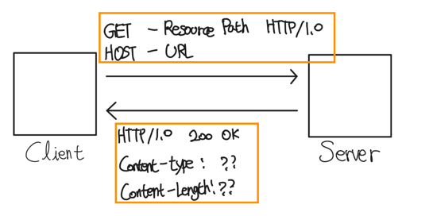
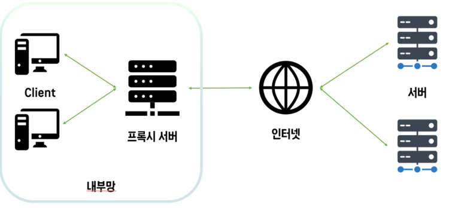
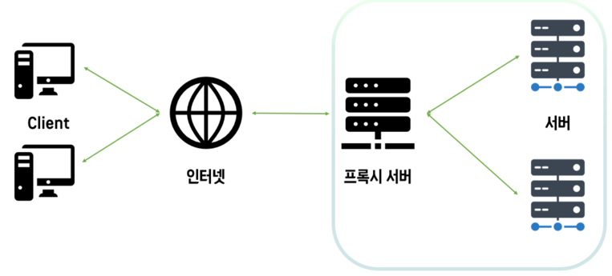

# Chapter 1 - HTTP 기초 정리

---

### 😀 미디어 타입  
> 우리가 흔히 알고 있는 Content-type으로 보면 쉽다 <br>  
> HTML - text/html <br>
> plain ASCII - text/plain <br>
> JPEG - image/jpeg <br>
> gif - image/gif <br>
> 애플 퀵타임 동영상 - video/quicktime <br>
> 파워포인트 - application/vnd.ms-powerpoint <br>
> json - application/json

---

### 😀 URI

> 통합 자원 식별자라고도 불린다.<br>
> URI는 인터넷의 우편물 조소 같은 것으로, 정보 리소스를 고유하게 식별하고 위치를 지정할 수 있다.

URI에는 URL과 URN이 있다.

#### - URL
통합 자원 지시자 - Uniform Resource Locator, URL 이라고 하며, 가장 흔한 형태이다.
URL은 특정 서버의 한 리소스에 대한 구체적인 위치를 서술한다. 또한 URL은 리소스가 정확히
어디에 있고 어떻게 접근할 수 있는지 분명하게 알려준다.

```http request
https://www.naver.com - 네이버 홈페이지의 URL
https://ssl.pstatic.net/sstatic/search/nlogo/20230807115141.png - 네이버 검색 로고 URL
```

URl은 세 부분으로 이루어진 표준 포맷
1. 스킴(scheme)라고 부르며 리소스에 접근하기 위해 사용되는 프로토콜을 의미, 보통 http or https 라고 부르는것이 스킴이라고 한다.
2. 서버의 인터넷 주소를 제공한다 위 네이버 같은경우 www.naver.com과 같다.
3. 웹서버의 리소스를 가리킨다. `/sstatic/search/nlogo/20230807115141.png`와 같다.


#### - URN
유니폼 리소스 이름(Uniform Resource Name) URN이라고 부르며
리소스의 위치에 영향받지 않는 유일무이한 이름역할을 한다.


---

### 😀 트랜잭션 
> HTTP 트랜잭션은 요청(client -> server)과 응답(server -> client)로 나뉜다.
> 
> 하댕 트랜잭션은 HTTP 메시지라고 불리는 정형화된 데이터 덩어리를 이용하여 이루어진다.
 


다음과 같이 요청메시지와 응답 메시지를 포함한다.

HTTP는 메서드라고 불리는 여러가지 메서드를 지원한다. 모든 HTTP요청에 대해서는 하나의 메서드를 갖고 요청하게 된다.

HTTP메서드는 서버에게 어떠한 동작이 취해져야 하는지에 대해서 가이드 해주는 역할을 한다.

가장 많이 쓰이는 HTTP 메서드는 다음과 같다


```http request
GET - 서버에서 클라이언트로 지정한 리소스를 보내라.
POST - 클아이언트 데이터를 서버 게이트웨이 어플리케이션에 보내라
PUT - 클라이언트에서 서버로 보낸 데이터를 지정한 이름의 리소스로 저장하라.
DELETE - 지정한 리소스르 서버에서 삭제해라
HEAD - 는 사용하지 않아서 따로 설명 X
```

REST API 관점에서 바라보자면 다음과 같이 쉽게 생각하면 편할듯하다.
```http request
GET - 데이터 조회, DB로 바라보자면 select와 유사.
POST - 데이터를 추가한다. DB로 바라보자면 insert와 유사.
PUT - 요청 데이터 기준으로 새로운 리소스 생성, 대상 리소스를 나타내는 데이터를 대체
PATCH - 데이터를 부분적으로 변경
DELETE - 삭제.
```

HTTP 요청에 따른 응답 메시지는 상태코드와 함께 반환된다. 
상태 코드는 따로 링크만 전달드립니다.
https://developer.mozilla.org/ko/docs/Web/HTTP/Status


---

### 😀 메세지 

출처 - https://dodeon.gitbook.io/study/kimyounghan-http-basic/03-http-basic/message

HTTP 메시지는 위 사진처럼 세 부분으로 이루어 진다.


#### 👊 시작줄
> 메시지의 첫줄로, 무엇을 해야하는지 응답이라면 무슨일이 일어났는지를 나타낸다.

#### 👊 헤더 
> 시작줄 다음에 나오는것으로 0개 이상의 헤더 필드가 이어진다.
> 각 헤더는 구문분석을 위해 `:` 로 구분되있는 이름과 값으로 구분된다<br>
> 헤더 필드를 추가하려면 한줄을 더하기만 하면된다, 다만 헤더는 빈줄로 끝난다. 

#### 👊 본문 
> 빈 줄 다음에 나오는 것이 본문이며, 필요에 따라 있을수도, 없을 수 도 있다.
> 본문에는 서버에서 반환한 데이터 또는 메세지, 텍스트가 포함될 수 있다.


---

### 😀 TCP 커넥션 
TCP - Transmission Control Protocol 전송 제어 프로토콜 

#### 👊 TCP/IP
HTTP는 애플리케이션 계층 프로토콜이다 HTTP는 핵심적인 세부사항에대해 신경쓰지 않고 대중적이고
신뢰성 있는인터넷전송 프로토콜인 TCP/IP에게 맡긴다.

TCP는 `오류 없는 데이터 전송`, `순서에 맞는 전달(순서 보장)`, `조각나지 않는 데이터 스트림` 을 제공한다.

위 세가지 방식에 따라 TCP는 커넥션이 맺어지면 클라이언트와 서버간에 교환되는 메시지가 없어지거나
손생되거나, 순서가 바뀌어 수신되는일은 결코 없다.

---

### 😀 프로토콜 버전

### `HTTP/0.9`
가장 초기 버전으로 단순 기능만 제공하며 HTTP메서드 GET방식만 지원하였으며, 콘텐츠에 대한 MIME, 헤더, 버전번호는 지원하지 않아 금방 HTTP/1.0으로 대체되었다.

### `HTTP/1.0`
처음으로 널리 쓰이기 시작한 HTTP버전이며, 버전번호, 헤더, 추가 메서드, 미디어 객체 처리를 추가하였다. 하지만 HTTP/1.0은 
결코 정의된 명세는 아니며, 여전히 단일 연결로 요청과 응답이 처리되었다.
 
### `HTTP/1.0+`
`keep-alive` 커넥션, 프락시 연결, 가상 호스팅 지원등 많은 기능이 공식적이지 않지만 사실상의 표준으로 HTTP에 추가되었다 규격 외의 확장된 HTTP버전을
HTTP/1.0+라고 부른다.

`keep-alive`란 HTTP/1.0의 기본동작은 요청시 연결을 맺고 끊기 때문에 불필요한 오버헤드와 느린 연결 설정 속도를 가지게 되었는데
해당 설정을 활성화 하게 되면 클라이언트와 서버간의 연결을 유지하고 여러 요청과 응답을 하나의 연결로 처리할 수 있게 되어,
불필요한 오버헤드와 네트워크 부하를 줄일 수 있으며, 웹 페이지 로딩속도를 향상 시킬 수 있다.

### `HTTP/1.1`
HTTP설계의 구조적 결함 교정, 성능 최적화, 잘못된 기능 제거에 집중하였으며, Keep-alive가 기본적으로 활성화되어 여러 요청과 응답을
하나의 연결로 처리할 수 있게 되었으며, 파이프라이닝을 지원하여 여러 요청을 병렬로 처리할 수있게 되었다.

### `HTTP/2`
2015년에 도입되었으며, 구성 요소를 이진 프레임으로 분할하여 전송하고, 헤더 압축등을 통해 성능을 향상시켰다.

### `HTTP/3`
2020년에 도입되었으며 이전버전과 달리 UDP프로토콜을 기반으로 하는 QUIC(Quick UDP Internat Connections) 프로토콜 위에서 동작한다. 이를 통해
연결 설정 속도를 높이고, 패킷손실에 대한 보정기능을 제공하여 성능을 향상시켰다.

---

### 😀 웹의 구성요소

`프락시`, `캐시`, `게이트웨이`, `터널`, `에이전트` 다음을 포함한 여러 애플리케이션에 대해 설명한다.
<br>
<br>
<br>

#### 1. 프락시(Proxy) 서버
> 클라이언트와 서버 사이에 위치한 HTTP중개자이며 웹보안, 애플리케이션의 통합, 성능 최적화를 위해 중요한 구성요소이다.<br>
> 프락시서버는 클라이언트와 서버 사이에 위치하여, 클라이언트의 모든 HTTP요청을 받아 서버에 전달한다.<br>
> 프락시는 주로 보안을 위해 사용한다, 모든 웹트래픽 흐름 속에서 신뢰할 만한 중개자 역할을 한다.

Proxy의 종류에는 Forward Proxy, Reverse Proxy가 있다.

#### Forward Proxy


주로 내부망을 통해 외부로 나가는 경우에 사용하며 프록시서버가 요청을 받아 인터넷에 연결하기 때문에 클라이언트 정보를 외부로부터 감출 수 있다.
또한 정적 데이터는 서버에 들릴 필요 없이 Proxy서버에서 충당하기 때문에, 트래픽도 줄이고 네트워크 병목현상도 해결 가능.


#### Reverse Proxy 


Forward Proxy와 반대로 클라이언트가 인터넷에게 직접 요청하고 리버스 프록시 서버에 요청하기 때문에 
클라이언트가 요청하는 endpoint는 프록시 서버가 된다. 따라서 서버를 감출 수 있는 효과가있다 .
다음과 같이 구성하면 로드밸런싱과 서버확장에 유리하게 된다.

---

#### 2. 캐시(Cache)
웹캐시와 캐시 Proxy는 자주 찾는 요청의 사본을 저장해 두는 특별한 종류의 HTTP Proxy 서버입니다.
캐시설정을 하게 되면 동일한 요청에 대해 유효한 동일 정보를 전달한다.

---

#### 3. 게이트웨이(Gateway)
게이트웨이는 다른 서버들의 중개자로 동작하는 특별한 서버이다.<br>
게이트웨이는 서로 다른 프로토콜이나 네트워크 환경에서 데이터를 전달하고 변환하는 역할을 담당한다.

또한 게이트웨이는 서로 다른 프로토콜을 사용하는 네트워크 간에 데이터를 변환하여 상호 운용성을 제공한다.
이와 같이 게이트웨이는 네트워크 기능을 확장하고 서로 다른 시스템 간의 통신을 용이하게 함으로써 더 넓은 범위의 통신을 가능하게한다.

---

`터널`과 `에이전트`는 따로 설명하지 않겠습니다.

---


# Chapter 2 - URL과 리소스 

---

### 😀 URL
- URL은 인터넷의 리소스를 가리키는 표준 이름이다.
- 브라우저가 정보를 찾는데 필요한 리소스의 위치를 가리키며, URL을 이용해 리소스를 찾고 공유할 수 있다.
- URL은 HTTP 프로토콜이 아닌 다른 가용한 프로토콜을 사용할 수도 있다.(email, ftp, rtsp와 같은 다양한 스킴을 가지고 있는 URL)

---

### 😀 URL 문법

대부분의 스킴의 문법은 일반적으로 9개의 부분으로 나뉜다.<br>
### `<스킴>://<사용자이름>:<비밀번호>@<호스트>:<포트>/<경로>;<파라미터>?<질의>#<프래그먼트>`

다만 위처럼 모든것을 다 가지는 URL은 거의 없다. URL의 가장 중요한 세 가지 컴포넌트는 스킴, 호스트, 경로다.


### 👊 스킴
> 리소스를 가져오려면 어떤 프로토콜을 사용하여 서버에 접근해야 하는지를 가리키며 default 값 x<br>
> 


### 👊 사용자 이름
> 몇몇 스킴은 리소스에 접근을 하기 위해 사용자 이름을 필요로 한다. default - anonymous

### 👊 비밀번호
> 사용자의 비밀번호를 가리키며, 사용자 이름에 콜론으로 이어서 기술한다. default - 이메일 주소 

### 👊 호스트
> 리소스를 호스팅하는 서버의 호스트 명이나 IP를 의미하며 default x

### 👊 포트
> 리소스를 호스팅하는 서버가 열어놓은 포트번호, 많은 스킴이 기본 포트를 가지고 있다. default - 스킴에 따라 다름 

### 👊 경로
> `/` 로 구분되어 있으며, 서버 내 리소스가 어디에 있는지를 가리킨다.


### 👊 파라미터
>특정 스킴들에서 입력 파라미터를 기술하는 용도로 사용한다. 세미콜론으로 구분하여 기술하며 여러개를 가질 수 있다.

### 👊 질의
> 스킴에서 애플리케이션에 파라미터를 전달하는데 쓰인다. `?`를 기준으로 구분한다.


### 👊 프래그먼트
> 리소스의 조각이나 일부분을 가리키는 이름이며, #문자로 구분한다.
 
---

단축 URL 과 상대 URL은 따로 정리하지 않겠습니다.

---


### 😀 URL 확장
URL의 확장은 `호스트명 확장`과 `히스토리 확장`이 있다.

### 👊 호스트명 확장
> 호스트명 확장 기능을 지원하는 브라우저는 단순한 휴리스틱만을 사용하여 입력한 호스트 명을 전체 호스트명으로 확장할 수 있다.<br>
> 예를 들면 naver만 입력하더라도 www.와 .com을 붙여서 www.naver.com으로 만든다. 이는 해당 단어를 포함하는 사이트를 찾지 못하면
> 확장을 포기하기전에 몇가지의 URL을 추가로 제시한다.


### 👊 히스토리 확장
> 히스토리 확장이란 사용자가 URL을 입력하는 시간을 줄이고자 브라우저가 사용자가 방문했던 URL의 기록을 저장해 놓는것이다. 
> URL을 입력하면 그 입력된 URl의 앞 글자들을 포함흐는 완성된 형태의 URL들을 선택하게 해준다.

---

### 😀 문자 제한 
몇몇 문자의 경우 URL 내에서 특별한 의미로 예약되어있다.<br>
`%` , `/`, `.`, `..`, `#`, `?`, `:` , `;` , `$`, `,`, `+`, `@` , `&` , `=` , `{}|\~[]<>"`등등이 있다 해당 값들은 
반드시 사용하기 전에 인코딩해야한다.