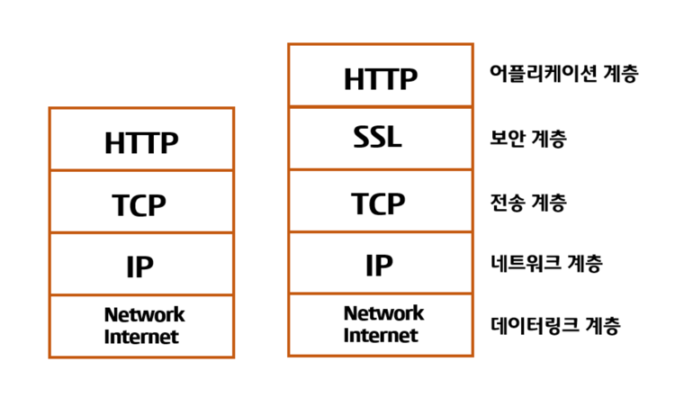
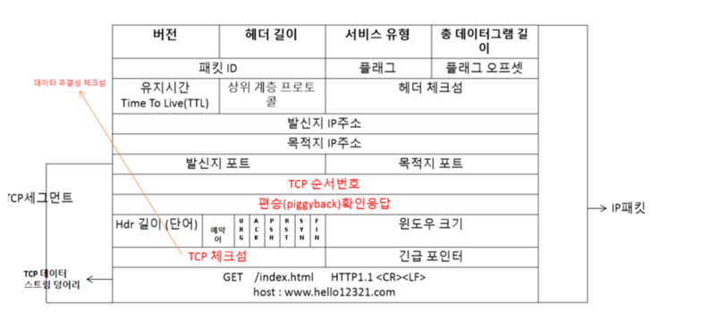
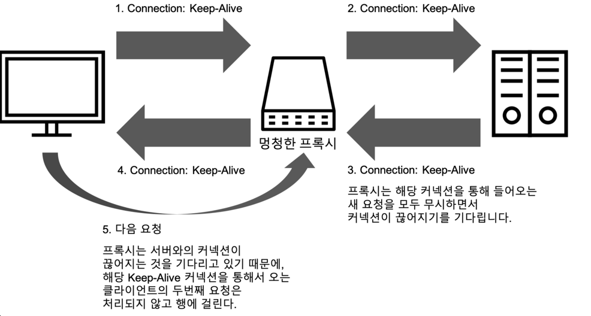

# Chapter 4 - 커텍션 관리 

---

- HTTP는 어떻게 TCP 커넥션을 사용하는가
- TCP 커넥션의 지연, 병목, 막힘
- 병렬 커넥션, keep-alive 커넥션, 커넥션 파이프라인을 활용한 HTTP 최적화
- 커넥션 관리를 위해 다라야 할 규칙들

---
 

## TCP 커넥션 

HTTP 통신은 TCP/IP를 통해 이루어지며, 전세계 어디서든 TCP/IP 커넥션을 맺을 수 있다. 

일단 커넥션이 맺어지게 되면 클라이언트와 서버 컴퓨터 가넹 주고받는 메시지들은 손실 혹은 손상되거나 순서가 바뀌지 않고 안전하게 전달된다.

### 신뢰할 수 있는 데이터 전송 통로인 TCP

HTTP 커넥션은 몇몇 사용 규칙을 제외하고는 TCP 커넥션에 불과하다. TCP커넥션은 안정적으로 연결해주며, 신속 정확하게 데이터를 보내고자 한다면
TCP의 기초적인 애용을 알아야한다.

### TCP 스트림은 세그먼트로 나뉘어 IP패킷을 통해 전송된다.

> TCP는 IP패킷(혹은 IP 데이터그램)이라고 불리는 작은 조각을 통해 데이터를 전송한다.

#### [참고] https://velog.io/@leeinae/HTTP-Connection-TCP

HTTP는 위의 그림처럼 IP,TCP,HTTP로 구성되어있으며, HTTPS의 경우 IP, TCP, SSL, HTTPS로 구성되어있다.

HTTPS는 HTTP에 TLS or SSL이라 불리는 보안기능이 더해져 있다.  

TCP세그먼트 혹은 IP데이터그램은 세그먼트라는 단위로 데이터 스트림을 잘게 나누고, 세그먼트를 IP패킷이라고 불리는 봉투에 담아서
인터넷을 통해 데이터를 전달한다.

이 모든것은 TCP/IP 소프트웨어에 의해 처리되며 그 과정은 프로그래머에게 보이지는 않는다.

HTTP를 통해 전달되는 패킷에는 다음과 같은 정보들을 포함하고있다.

- IP 패킷 헤더 (보통 20 바이트)
  - 발신지와 목적지 IP 주소, 크기, 기타 플래그를 가지고 있다.
- TCP 세그먼트 헤더(보통 20 바이트)
  - TCP 포트 번호, TCP 제어 플래그, 데이터의 순서와 무결성을 검사하기 위해 사용되는 숫자값
- TCP 데이터 조각(0 혹은 그 이상의 바이트)

---

### TCP 커넥션 유지하기

컴퓨터는 TCP 커넥션을 여러개 가지고 있고, 포ㅛ트 번호를 통해서 여러 개의 커넥션을 유지한다.

IP 주소는 해당 컴퓨터에 연결되며 포트 번호는 해당 애플리케이션으로 전달된다. 

TCP 커넥션은 네 가지 값으로 식별한다  
`<발신지 IP 주소, 발신지 포트 , 수신지 IP주소, 수신자 포트>`

---

### TCP의 성능에 대한 고려 

HTTP는  TCP의 바로 위에 있는 계층이기 때문에 HTTP 트랜잭션의 성능은 그 아래 계층은 TCP 성능에 영향을 받는다.

#### -  HTTP 트랜잭션 지연

트랜잭션을 처리하는 시간은 TCP 커넥션을 설정하고, 요청을 전송하고, 응답 메시지를 보내는 것에 비하면 상당히 짧다
클라이언트나 서버가 너무 많은 데이터를 내려받거나 복잡하고 동적인 자원들을 실행하지 않는 한 대부분의 HTTP 지연은
TCP 네트워크 지연때문에 발생한다.

HTTP 트랜잭션을 지연시키는 원인은 여러가지가 있지만 해당 도서에서는 아래와 같다

 - URI에 기술되어있는 호스트에 한번이라도 방문한적이 없다면, DNS이름 분석인프라를 사용하여 URI에 있는 호스트명을 IP주소로 변환하는데 수십초의 시간이 걸릴것이다.
 - 커넥션 설정 시간은 새로운 TCP 커넥션에서 항상 발생한다. 이는 보통 1~2초 소요되며, 수백개의 HTTP 트랜잭션이만들어지면 크게 증가한다.
 - 웹서버는 데이터가 도착하는 대로 TCP 커넥션에서 요청 메시지를 읽고 처리한다, 요청 메시지가 전달되고 서버에 의해서 처리되는데까지는 시간이 소요된다.
 - 웹서버가 HTTP 응답을 보내는것 역시 시간이 소요된다.

위와 같은 TCP 네트워크 지연은 하드웨어의 성능, 네트워크와 서버의 전송속도, 요청과 응답 메시지의 크기, 클라이언트와 서버간의 거리에 따라 크게 달라진다.

또한 TCP 프로토콜의 기술적인 복잡성도 지연에 큰 영향을 미친다.

#### - 성능 관련 중요 요소 

 - TCP 커넥션의 핸드셰이크 설정
 - 인터넷의 혼잡을 제어하기 위한 TCP의 느린 시작 `slow-start`
 - 데이터를 한데 모아 한 번에 전송하기 위핸 `nagle 알고리즘`
 - TCP의 편승 확인 응답을 위한 확인응답 지연 알고리즘
 - TIME_WAIT 지연과 포트 고갈 

### - TCP 커넥션의 핸드셰이크 설정

데이터를 전송하기 위해 새로운 TCP 커넥션을 열 때면 커넥션을 매직 위한 
조건을 맞추기 위해 연속적으로 IP 패킷을 교환한다. 작은 크기의 데이터 전송에 커넥션이 사용된다면 패킷 교환은
HTTP 성능을 크게 저하시킬 수 있다. 결국 크기가 작은 HTTP 트랜잭션은 50% 이상의 시간을 TCP를 구성하는데 사용하게 된다.
(SYN, SYN+ACK 커넥션 핸드셰이크 지연 데이터를 주고받는 ACK는 작으면 데이터 전송량 낮음)

### - TCP 느린 시작 (Slow Start)

> TCP의 전송속도는 커넥션이 만들어진 지 얼마나 지났는지에 따라 달라질 수 있다.
> 
> 시간이 지나면 자체적으로 튜닝되어서 처음에는 커넥션의 최대 속도를 제한하고, 데이터가 성공적으로 전송됨에 따라서 속도 제한을 높여나간다. 이러한 
> 방식을 느린 시작이라고 부른다. 
>
> <중요 내용>
> 
> - 초기 위도웅 크기 설정 : 현재 산태를 고려하여 초기 윈도우 크기를 설정합니다. 보통은 작은값으로 시작합니다.  
> - 지수적인 증가 : 각 시간마다 현재 윈도우 크기를 2배씩 증가시킨다. 데이터 전송속도가 지수적으로 증가하는 것을 의미한다.
> - 혼잡 윈도우 크기 도달 : 네트워크 혼잡이 감지되면 송신자는 현재 윈도우 크기를 줄이고 혼잡제어 알고리즘을 실행하여 네트워크 혼잡을 완하하려고 한다.
> - 혼잡 윈도우 크기 조절 : Slow Start는 혼잡제어와 함께 작동하여 혼잡 윈도우 크기를 동적으로 조절한다. 혼잡 윈도우 크기가 너무 커지면 혼잡을 야기할 수 있기 때문에 송신자는 혼잡 윈도우 크기를 조절하여 안정적인 전송을 유지한다.

### - 확인응답 지연 

인터넷 자체가 패킷 전송을 완벽하게 보장하지 못한다(과부하 걸렸을 때 패킷을 마음대로 파기 가능 ). 따라서 TCP는 데이터의 신뢰성을 보장하기 위해 자체적인 확인 차계를 갖고있따.

TCP 세그먼트는 순번과 데이터 무결성 체크섬을 가지고 수신자는 세그먼트를 온전히 받으면
확인응답 패킷을 송신자에게 반환한다.

만약 송신자가 확인응답 메시지를 특정시간 또는 아예 받지 못하면 패킷이 파괴되었거나 오류가 있는것으로 판단, 데이터를 다시 전송한다.

확인 응답은 크기가 작기 때문에 TCp 는 송출되는 데이터 패킷에 확인응답을 편승시킨다.

출처 - https://m.blog.naver.com/dlaxodud2388/222034044640

> 중요
> 
> 확인응답지연은 확인응답을 특정시간동안 버퍼에 저장해두고 확인응답을 편승시키기 위한 송출 데이터 패킷을 찾는다.
> 만약 일정 시간안에 송출 데이터 패킷을 찾지 못하면 확인응답은 별도 패킷을 만들어 전송된다.

---

### - 네이글 알고리즘과 TCP_NODELAY

> 네티워크 통신에서 발생할 수 있는 지연을 줄이기 위한 알고리즘이다. 해당 알고리즘은 네트워크 패킷을 최적화하여 전송을 효율적으로
> 만들어 네트워크 지연을 최소화 합니다.
> 
> 세그먼트가 최대 크기가 되지 않으면 전송을 하지 않는다, 다만 다른 모든 패킷이 확인응답을 받았을 경우에는 최대크기보다작은 패킷의 전송을 허락한다.

### - TIME_WAIT의 누적과 포트 고갈 

> TCP연결이 종료된 후에도 일정 시간 동안 대기하는 상태를 나타낸다. 데이터 패킷이 제대로 처리되지 않았을 경우에도 연결을 확실하게 종료하기
> 위해 유지되는 것이다. TIME_WAIT 상태는 네트워크의 안정성과 신뢰성을 유지하기 위해 중요한 역할을 한다.
> 
> TIME_WAIT은 다음과 같은 목적으로 유지한다.
> 
> 1. Delayed Packets 처리 : 연결 종료 시 모든 데이터 패킷이 정상적으로 도착하지 않을 수 있다. 
> 2. Connection Pairs 분리 : 같은 연결에 대한 후속 패킷이 이전 연결과 혼란을 일으키지 않도록 하기 위해 연결 쌍을 분리한다.
> 3. TCP Sequence Number 재활용 방지 : TCP는 전이중통신을 지원하므로 양쪽 방향으로 데이터가 전송 될 수 있다. TIME_WAIT는 양방향 통신의
> 4. 모든 패킷이 처리되도록 한다, 다른 연결에서 같은 포트를 사용할때 충돌을 방지한다.

---

## HTTP 커넥션 관리

### 흔히 잘못 이해하는 Connection 헤더 

HTTP Connection 헤더 필드는 커넥션 토큰을 쉼표로 구분하여 가지고 있으며, 그 값들은 다른 커넥션에 전달되지 않는다.

Connection 헤더에는 다음 세가지 종류의 토큰이 전달될 수 있다.

- HTTP 헤더 필드명은, 이 커넥션에만 해당되는 헤더들을 나열한다
- 임시적인 토큰 값은, 커넥션에 대한 비표준 옵션을 의미한다.
- close 값은, 커넥션이 작업이 완료되면 종료되어야 함을 의미한다.

커넥션 토큰이 HTTP 헤더 필드 명을 가지고 있다면 해당 필드들은 현재 커넥션만을 위한 정보이므로 다음 커넥션에 전달하면 안된다. 

Connection 헤더에 있는 모든 헤더 필드는 메시지를 다른 곳으로 전달하는 시점에 삭제되어야 한다.

---

### 순차적인 트랜잭션 처리에 의한 지연 

순차적인 처리로 인한 지연에는 물리적인 지연뿐 아니라, 심리적 지연도 있다.

HTTP 커넥션의 성능을 향상시키는 방법  

 - 병렬 커넥션 
 - 지속커넥션
 - 파이프라인 커넥션
 - 다중 커넥션

---

#### 병력 커넥션 

> 여러 요청에 대해 하나가 끝날떄 까지 기다렸다가 그 다음을 내려받는식으로 하게된다면 속도가 너무 느릴것이다.
> 
> HTTP는 이러한 상황에 대해서 클라이언트가 여러 개의 커넥션을 맺음으로써 여러개의 HTTP 트랜잭션을 병렬로 처리할 수 있다.
> 
> 각 커넥션의 지연 시간을 겹치게 하면 총 지연시간을 줄일 수 있고, 클라이언트의 인터넷 대역폭을 한 개의 커넥션이 다 써버리는 것이 아니라면 나머지 객체를 내려받는 데에 남은 대역폭을 사용할 수 있다.
> 
> 다만 병렬커넥션이 항상 옳은 정답은 아니다. 일반적으로 바르긴 하나 대역폭이 좁다면 대부분 시간을 데이터를 전송하는데만 쓸것이다.
> 따라서 성능상의 잠점은 거의 없어지게 된다. 
> 
> 또한 다수의 커넥션을 사용한다는것은 메모리를 많이 소모하고 자체적인 성능 문제를 발생시킬 수 있다.

사용자들에게는 총 다운로드 시간이 더 걸린다 하더라도, 화면 전체에서 여러 작업이 병렬로 일어나는 것을 눈으로 확인할 수 있다면 그것을 더 빠르다고 
생각할 수 있다.

---

#### 지속 커넥션

> 대부분의 클라이언트는 같은 사이트에 여러개의 커넥션을 맺는다.
> 웹페이즈를 불러고 난후 
> 대부분 파일들이나 이미지등을 가져오기 위해 해당 서버에 도 요청하게된다. 이러한 속성을 사이트 지역성이라 부른다.

HTTP 커넥션을 요청이 끝났다고 끝내지 않고 커넥션을 계속 연결된 상태로 있는것은 지속 커넥션이라고 한다.
지속 커넥션은 커넥션을 끊기 전까지는 트랜잭션 간에도 커넥션을 유지한다.

장점으로는 커넥션을 맺기 위한 준비작업에 드는 시간을 절약할 수 있고 앞서 나온 slow start를 피함으로써 빠르게 데이터 전송이 가능하다.

---

#### 지속 커넥션 vs 병렬 커넥션 

병렬 커넥션은 앞에 내용처럼 여러 객체가 있는 페이지를 더 빠르게 전송한다. 다만 몇가지 단점이 있다면 다음과 같다.

1. 트랜잭션마다 새로운 커넥션으 맺고 끊기때문에 시간과 대역폭이 소모된다.
2. 각각의 새로운 커넥션은 TCP `slow start` 때문에 성능이 떨어진다.
3. 실제로 연결할 수있는 병렬 커넥션의 수에는 제한이 있다. 

위와 같은 단점과 달리 지속 커넥션에는 다음과 같은 장점이 있다.

1. 커넥션을 유지해주기 때문에 커넥션을 맺고 끊는데 들어가는 시간이 소모되지 않으며, 튜닝이된 커넥션을 유지한다.

하지만 커넥션을 잘못 관리하게 된다면.. 계속 연결을 유지해 놓기때문에 커넥션이 쌓이게 되고 이로인하여 불필요한 리소스의 소모를 발생시킬 수 있다.

그러면 뭘써야할까?

해당 책에서는 위 두가지 커넥션을 함께 사용하면 효과적이라고 한다. 

방법은 병렬커넥션으로 동작하되 해당 커넥션들이 지속 커넥션을 유지하도록 한다. 

HTTP/1.0+ 에서는 `keep-alive` 커넥션이 있고, HTTP/1.1에는 `지속커넥션`이 있다.

---

#### Http/1.0+의 Keep-Alive 커넥션 

`keep-alive`는 커넥션을 유지하기 위해서 요청에 Connection:Keep-Alive 헤더를 포함시킨다.
해당 요청을 받은 서버는 그다음 요청도 이커넥션을 통해 받고자 한다면 응답 메시지에 같은 헤더를
포함시켜 응답한다. 

Connection: Keep-Alive 헤더가 없다면, 클라이언트는 서버가 `keep-alive`를 지원하지 않는다.

`keep-alive`의 동작은 헤더의 쉼표로 구분된 옵션들로 제어할 수 있다.

- timeout - `keep-alive` 응답 헤더를 통해 보낸다, 해당 커넥션이 얼마간 유지될 것인지를 의미한다.  
- max - `keep-alive` 응답 헤더를 통해 보낸다. 이는 커넥션이 몇 개의 HTTP 트랜잭션을 처리할 때까지 유지될 것인지를 의미한다.

> `keep-alive` 헤더의 사용은 선택사항이지만 , Connection: Keep-Alive 헤더가 있을때만 사용 가능하다.

---

#### Keep-Alive 커넥션 제한과 규칙 

- HTTP/1.0에서 기본으로 사용되지 않는다. 사용하기위해서는 Connection: Keep-Alive 헤더를 보내야 한다
- 커넥션을 계속 유지하려면 Connection:Keep-Alive 헤더를 포함해 보내야 한다. 보내지 않는다면 서버는 요청 처리 후 끊는다.
- 클라이언트는 Connection: Keep-Alive 가 포함되어있는지를 보고 커넥션을 끊을지 선택한다.
- 프락시와 게이트웨이는 Connection 헤더의 규칙을 철저히 지켜야한다. 프락시와 게이트웨이는 메시지를 전송하거나 캐시에 넣기전에 Connection헤더에 명시된 모든 헤더 필드와 Connection 헤더를 제거해줘야 한다.

---

#### Keep-Alive 멍청한 프록시 

출처 - https://beomy.github.io/tech/etc/http-version/

---

#### Proxy-Connection 

프락시 및 게이트웨에서 무조건적으로 헤더를 전달하는 문제를 해결하기 위해 나온 차선책이다. Proxy-Connection이라는 헤더를 사용하는것이다.
Proxy-Connection은 프락시를 별도로 설정할 수 있는 브라우저에서만 지원한다.
 
멍청한 프락시는 Connection: Keep-Alive 같은 헤더를 무조건 전달하기 때문에 문제를 일으킨다.

Proxy-Connection을 사용하면 헤더를 무조건 전달하더라도 웹서버는 그것을 무시하기 때문에 별 문제가 되지 않는다. 하지만 영리한 프락시를 사용하면 의미없는 Proxy-Connection헤더를
Connection헤더로 바꿈으로써 원하는 결과를 얻을 수 있다.

---

#### HTTP/1.1의 지속 커넥션 

HTTP/1.1에서는 keep-alive 커넥션을 지원하지 않는 대신 개선된 `지속 커넥션`을 지원한다.

`지속 커넥션`의 목적은 `keep-alive`와 같지만 더 개선되어 잘 동작한다.

`지속 커넥션`은 `keep-alive`와 달리 별도의 설정이 없어도 활성화 되어있다. 
> HTTP/1.1에서는 별도의 설정을 하지 않는다면 모든 커넥션을 지속 커넥션으로 취급한다.

`지속 커넥션`에서 연결을 끊기 위해서는 기존과 동일하게 Connection: close를 명시해줘야 한다.

---

#### 파이프라인 커넥션 

HTTP/1.1은 지속 커넥션을 통해서 요청을 파이프라이닝할 수 있다. 이는 keep-alive의 성능을 더 높여준다.

제약 사항 
1. HTTP클라이언트는 커넥션이 지속 커넥션인지 확인하기 전까지는 파이프라인을 이어서는 안된다.
2. HTTP응답은 요청순서와 같게 와야한다.
3. HTTP클라이언트는 커넥션이 언제 끊어지더라도, 완료되지 않은 요청이 파이프라인에 있으면 언제든 다시 요청을 보낼 준비가 되어야한다.