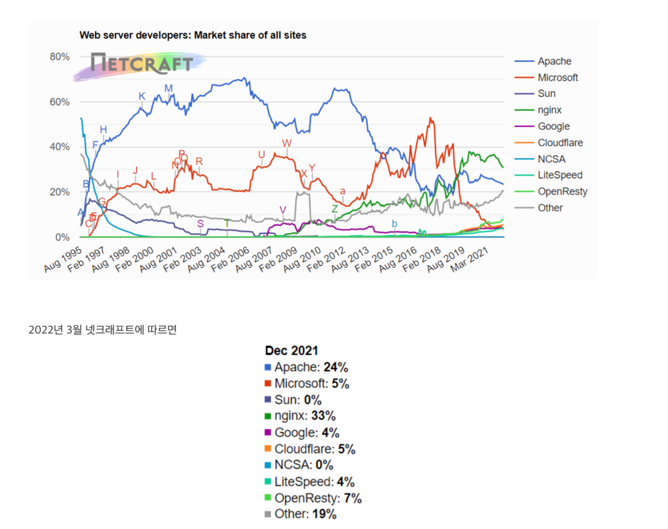

# Chapter 5 - 웹 서버

---

### 다채로운 웹서버 
> `웹 서버`라는 용어는 소프트웨어와 웹페이지 제공에 특화된 장비 양쪽 모드를 가리킨다.
> 
> 웹서버는 기능, 형태, 크기가 다양하다 하지만 기능은 달라도 모든 웹서버는 리소스에 대한 HTTP요청을 받아서 콘텐츠를 클라이언트에게 돌려준다.

---

#### 🧐 웹 서버 구현 
웹 서버는 HTTP 및 그와 관련된 TCP 처리를 구현한 것이다. 

웹서버는 자신이 제공하는 리소스를 관리하고 웹서버를 설정, 통제, 확장하기 위한 관리 기능을 제공한다.

웹서버는 HTTP 프로토콜을 구현하고, 웹 리소스를 관리하고, 웹서버 관리기능을 제공하며, 커넥션 관리에 대한
책임을 운영체제와 나눠 갖는다. 

운영체제는 컴퓨터 시스템의 하드웨어를 관리하고 TCP/IP 네트워크 지원, 웹 리소스를 유지하기 위한 파일 시스템, 프로세스 관리를 제공한다.

웹서버는 여러가지 형태로 제공 가능하다.

---

#### 🧐 다목적 소프트웨어 웹 서버

다목적 소프트웨어 웹 서버는 네트워크에 연결된 표준 컴퓨터 시스템에서 동작한다.

거의 모든 컴퓨터와 운영체제에서 동작한다.

출처 - https://mapoman.tistory.com/entry/2022-%EC%9B%B9-%EC%84%9C%EB%B2%84-%EC%A0%90%EC%9C%A0%EC%9C%A8-%EB%B3%80%ED%99%94-web-server-market-share-of-all-sites

---

#### 🧐 임베디드 웹 서버

일반 소비자용 제품에 내장될 목적으로 만들어진 작은 웹서버이다. 보통 최소한의 기능만을 제공한다.

---

#### 🧐 진짜 웹서버가 하는일

1. 커넥션을 맺는다 -- 클라이언트의 접속을 받거나, 원치 않는 클라이언트라면 닫는다.
2. 요청을 받는다 -- HTTP 요청 메시지를 네트워크로 부터 읽어들인다.
3. 요청을 처리한다 -- 요청 메시지를 해석하고 행동을 취한다
4. 리소스에 접근한다 -- 메시지에서 지정한 리소스에 접근한다
5. 응답을 만든다 -- 올바른 헤더를 포함한 HTTP 응답 메시지를 생성한다.
6. 응답을 보낸다 -- 응답을 클라이언트에게 돌려준다
7. 트랜잭션을 로그로 남긴다 -- 로그파일에 트랜잭션 완료에 대한 기록을 남긴다.

---

### 🧐 단계 1 - 클라이언트 커넥션 수락

클라이언트가 이미 서버에 대해 열려있는 지속적 커넥션을 가지고 있다면, 클라이언트는 요청을 보내기 위해ㅔ
그 커넥션을 사용할 수 있다. 그렇지 않다면 새 커넥션을 열필요가 있다.

클라이언트가 웹서버에 TCP 커넥션을 요청하면 커넥션필요한 정보들을 추출하여 커넥션 목록에 추가하고 오고가는 데이터를 지켜보기 위한 준비를 한다.

웹서버는 마음대로 커넥션을 거절하거나 즉시 닫을 수 있다.

어떤 서버들은 IP주소나, 호스트명이 인가되지 않았거나 악의적이라고 판단되면 커넥션을 닫는다. (다양한 구현방식이 있다.)

#### 🧐 클라이언트 호스트명 식별

대부분의 웹 서버는 `역방향 DNS`를 사용하여 클라이언트의 IP 주소를 클라이언트의 호스트명으로 변환하도록 설정되어있다.

호스트명분석(hostname lookup)을 사용하면 클라이언트 호스트 명을 구체적인 구접근 제어와 로깅을 위해 사용할 수 있다.

많은 대용량 웹 서버는 호스트명분석을 꺼두거나 특정 콘텐츠에 대해서만 켜놓는다.

#### 🧐 ident를 통한 클라이언트 사용자 알아내기

몇며 웹서버는 IETF ident프로토콜을 지원한다 해당 프로토콜은 어떤 사용자 이름이
HTTP커넥션을 초기화하였는지 찾아낼수 있게 해준다.

웹서버 로깅에서 유용하게 사용되기때문에 일반로그포맷의 두번째 필드는 각 HTTP요청의 ident 사용자 이름을 담고 있다.

만약 클라이언트가 ident프로토콜을 지원한다면 113번 포트를 listen한다.

하지만 ident는 트랜잭션을 유의미하게 지연시키고, 방화벽이 트래픽이 들어오는것을막는 경우가 많으며, 
안전하지 않고 조작하기 쉬워서 잘 사용하지 않는다.

---

### 🧐 단계 2 - 요청 메시지 수신

커넥션을 통해 데이터가 도착하게 되면 웹 서버는 네트워크 커넥션에서 그 데이터를 읽어 들이고 파싱하여 요청 메시지를 구성한다.

요청메시지가 들어오게 되면 웹서버는 요청줄을 파싱하여 요청 메서드, 식별자, 버전번호를 찾는다.
각 헤더들은 CRLF로 끝난다.

CRLF를 통해 빈줄을 찾아내고 요청 본문이 있다면 읽어 들인다.

#### 🧐 메시지의 내부 표현 

몇몇의 웹서버는 요청 메시지를 쉽게 다룰수있도록 내부 자료구조에 저장한다.

메시지의 조각에 대한 포인터와 길이를 담고, 헤더는 속도가 빠른 룩업 테이블에 저장되어 각 필드에 신속하게 접근할 수 있을것이다.

#### 🧐 커넥션 입력/출력 처리 아키텍처

고성능 웹서버는 수천개의 커넥션을 동시에 열 수 있도록 지원한다. 해당 커넥션들은 웹 서버가 전세계 클라이언트들과도
각각 한개이상의 커넥션을통해 통신할 수 있게 해준다. 

웹서버들은 항상 새 요청을 주시하고 있다. 이유는 요청은 언제라도 도착할 수 있기 때문이다. 다만 
아키텍처의 차이에 따라 요청을 처리하는 방식은 다르다.

#### 단일 스레드 웹서버
> 단일 스레드 웹서버는 요청을 한번에 하나씩 처리한다. 트랜잭션이 완료되면, 다음 커넥션이 처리되는 방식이다.
> 해당 방식은 구현하기는 간단하지만 처리도중 다른 커넥션들에 대해서는 무시된다. 따라서 이는 심각한 성능 문제를 만들어 내기때문에 로드가 적은 서버나
> type-o-serve와 같은 진단도구에만 적당하다.

#### 멀티프로세스와 멀티스레드 웹 서버

>멀티프로세스, 멀티스레드 웹서버는 여러 요청을 동시에 처리하기 위해 여러개의 프로세스 또는 고효율 스레드를 할당한다.
>스레드/프로세스는 필요할 때마다 만들어질 수도 있고 미리 만들수도 있다.
> 
> 몇몇 프로세스는 커넥션마다 하나를 할당하지만, 서버가 수백, 수천개의 동시커넥션을 처리할때 그로인해 만들어진 수많은 프로세스느 스레드는 
> 많은 메모리, 시스템 리소스를 소비한다. 그러므로 최대갯수에 제한을 걸어 사용한다.

#### 다중 I/O 서버
> 대량의 커넥션을 지우너하기 위해 많은 웹서버는 다중 아키텍처를 채택했다.
> 
> 해당 웹서버는 모든커넥션을 동시에 활동을 감시당한다. 상태가 바뀌면 해당 커넥션에 대해 작은양의 처리가 수행된다.
> 수행이 완료되면 다음번 상태변경을 위해 열린 커넥션 목록으로 돌아간다.

#### 다중 멀티스레드 웹서버
> 여러개의 스레드는 각각 여렬있는 커넥션을 감시하고 각 커넥션에 대해 조금씩 작업을 수행한다.

---

### 🧐 단계 3 - 요청처리 

 웹서버가 요청을 받으면 서버는 요청으로부터, 메서드, 헤더, 본문등을 얻어서 처리한다. 

---

### 🧐 단계 4 - 리소스의 매핑과 접근

웹서버는 리소스 서버이다. HTML, JPEG와 같은 정적 컨텐츠들을 제공하며, 애플리케이션을 통해 만들어진 동적 콘텐츠도 제공한다.

웹서버가 클라이언트에 콘텐츠를 전달하려면, 그전에 요청 메시지의 URI에 대응하는 알맞은 콘텐츠나 콘텐츠 생성기를 웹서버에서
찾아서 그 콘텐츠의 원천을 식별해야한다.

#### Docroot

> 웹서버는 여러 종류의 리소스 매핑을 지원한다. 다만 리소스 매핑의 가장 단순한 형태는
> URI를 웹서버의 파일 시스템 안에 있는 파일 이름으로 사용하는 것이다.
> 
> 일반적으로 웹 서버 파일시스템의 특별한 폴더를 웹 콘텐츠를 위해 예약해 둔다. 해당 폴더는 루트 혹은 docroot로 불린다.
> 
> 웹서버는 요청 메시지에서 URI를 가져와서 문서 루트 뒤에 붙인다.
> 
> 문서 root가 /usr/local/httpd/files라면 URI를 통해 /img/image1.jpeg 를 요청하면 /usr/local/httpd/files/img/image1.jpeg 경로에서 리소스를 찾아온다.

#### 가상 호스팅된 docroot
> 가상 호스팅된 웹 서버는, 각 사이트에 그들만의 분리된 문서 루트를 주는 방법으로 한 웹서버에 여러개의 웹사이트를 호스팅한다.
> 
> 가상 호스팅 웹서버는 URI나 Host헤더에서 얻은 IP 주소나 호스트명을 이용해 올바른 문서 루트를 식별한다.
> 
> 해당 방법으로 하나의 웹서버 위에서 두개의 사이트가 완전히 분리되도록 콘텐츠를 갖고 호스팅되도록 할 수 있다.

#### 사용자 홈 디렉터리 docroots
> docroots의 또다른 대표적인 활용은, 사용자들이 한대의 웹서버에서 각자의 개인 웹 사이트를 만들 수 있도록 해주는것이다.
> 
> 보통 빗금(/)과 물결표(~) 다음에 사용자 이름이 오는 것으로 시작하는 URi는 사용자의 개인 문서 루트를 가리킨다.

---

#### 디렉터리 목록
웹서버는 경로가 파일이 아닌 디렉터리를 가리키는 URL에 대한 요청도 처리할 수 있다. 
대부분의 웹 서버는 디렉터리URl을 요청했을때 다음과 같이 몇가지 다른 행동을 취하도록 설정할 수 있다.

- 에러를 반환한다
- 디렉터리 대신 색인파일을 반환한다
- 디렉터리를 탐색해서 해당 내용을 담은 HTML페이지를 반환한다.

대부분의 웹서버는 요청 URL에 대응되는 디렉터리 안에서 `index.html` or `index.html` 이 붙은 파일을 찾는다
만약 사용자가 어떤 디레겉리에 대한 URL을 요청하였는데 index.html이란 이름을 가진 파일을 갖고 있다면
서버는 그 파일의 콘텐츠를 반환한다.

---

#### 동적 콘텐츠 리소스 매핑 
웹 서버는 URI를 동적 리소스에 매핑할 수 있다. 즉, 요청에 맞게 콘텐츠를 생성하는
프로그램에 URI를 매핑하는것이다. 

---

#### 서버사이드 인클루드(Server-Side Includes, SSI)

많은 웹서버가 서버사이드 인클루드도 지원한다. 
만약 어떤 리소스가 서버사이드 인클루드를 포함하고 있는곳으로 설정되면 서버는 그 리소스의 콘텐츠를 클라이언트에게 보내기 전에 처리한다.

---

#### 접근 제어
웹서버는 각각의 리소스에 접근 제어를 할당할 수 있다. 접근 제어되는 리소스에 대한 요청이 도착했을때
웹서버는 클라이언트의 IP주소에 근거하여 접근을 제어할 수 있고 리소스에 접근하기 위한 비밀번호도 설정이 가능하다.

---

### 🧐 단계 5 응답 만들기

한번 서버가 리소스를 식별하면, 서버는 요청 메서드로 서술되는 동작을 수행한 뒤 응답 메시지를 반환한다.

응답 메시지로는 상태코드, 응답헤더, 응답본문을 포함한다. 

#### 🧐 응답 엔터티
만약 트랜잭션이 응답 본문을 생성한다면, 그내용을 응답 메시지와 함께 돌려보낸다. 만약 본문이 있다면 주로 다음과 같은 내용을 포함한다.
 - 응답 Content-Type( 응답 본문의 MIME 타입)
 - 응답 Content-Length (응답 본문의 길이 서술)
 - 실제 응답 본문의 내용

#### 🧐 MIME 타입 결정하기.

mime타입과 리소스를 연결하는 여러가지 방법

#### 1. mime.types
> 웹서너는 각 리소스의 MIME타입을 계산하기 위해 확장자별 MIME타입이 담겨있는 파일을 탐색하여 나타낸다.

#### 2. 매직 타이핑(Magic typing)
> MIME타입을 알아내기 위해 파일의 내용을 검사해서 알려진 패턴에 대한 테이블에 해당하는 패턴이 있는지 확인하여 확인한다. 다만 느리긴 하지만 표준 확장자 없이 일므이 지어진 경우에는 편리하다.

#### 3. 유형 명시(Explicit typing)
> 특정 파일이나 디렉터리 안의 파일들이 파일 확장자나 내용에 상관없이 어떤 MIME타입을 갖도록 설정할 수있다.

#### 4. 유형 협상(Type negotiation)
> 한리소스는 여러 종류의 문서 형식에 속하도록 설정할 수 있다. 이럴때 웹서버가 사용자와의 협상 과정을 통해
사용하기 가장 좋은 형식을 판별할 것인지의 여부를 설정 가능.

#### 🧐 리다이렉션
> 웹서버는 종종 성공 메시지 대신 리다이렉션 응답을 반환한다. 이는 요청을 수행하기 위해 브라우저가 다른곳으로 가도록 리다이렉트 할 수 있다.
> 
> 리다이렉션 응답은 3XX 상태코드로 지칭된다. Location 응답 헤더는 새로운, 선호하는 위치에 대한 URI를 포함한다.

리다이렉션은 리소스가 영구적으로 옮겨진경우, 임시로 옮겨진 경우, URL증강, 부하균형, 친밀한 다른서버가 있을경우, 정규화에 사용된다.

#### 영구히 리소스가 옮겨진 경우
> 리소스가 새 URL이 부여되어 위치가 옮겨졌거나 이름이 바뀌었을 수 있다. 웹서버는 클라이언트에게 
> 리소스의 URL이 변경되었으니 301 Moved Permanently 상태코드를 통해 리다이렉션을 하라고 알려준다.

#### 임시로 리소스가 옮겨진 경우
> 영구적이 아닌 임시로 옮겨진 경우 `303 See Other`, `307 Temporary Redirect`를 통해 리다이렉트를 시킨다.

#### URL 증강
> 서버는 종종 문맥 정보를 포함시키기 위해ㅔ 재 작성된 URL로 리다이렉트를 한다 이럴때는  303, 307을 사용한다.

#### 부하균형 
> 만약 웹서버가 과부하되게 되면 서버는 클라이언트를 덜 부하가 걸린 서버로 리다이렉트 시킬 수 있다. 이런 종류의 리다이렉트 또한
> , 307 을 사용한다.

#### 친밀한 다른서버가 있는 경우
> 웹서버는 어떤 사용자에 대한 정보를 가질 수 있다. 이를 통해 정보를 가지고 있는 다른 서버로 리다이렉트 시킬 수 있다.
> 이 방식에도 303, 307을 사용한다.

#### 디렉터리 이름 정규화
> 클라이언트가 디렉터리 이름에 대한 요청을 하는데 빗금(/)을 빠뜨렸다면 대부분 웹서버는 상대경로가 
> 정상적으로 동작할 수 있도록 슬래시를 추가한 URL로 리다이렉트 한다.

---

### 🧐 단계 6 응답 보내기
웹서버는 받을 때와 마찬가지로 커넥션 너머로 데이터를 보낼 때도 비슷한 이슈에 직면한다.
서버는 여러 클라이언트에 대한 많은 커넥션을 가질 수 있다. 일부는 아무것도 안하고, 일부는 데이터를 보내고있으며,
일부는 응답한다.

응답을 보내서 커넥션을 닫아야 한다.

---

### 🧐 단계 7 로깅
트랜잭션이 완료되었을때 어떻게 수행되었는지에 대한 로그를 파일 에 기록한다. 