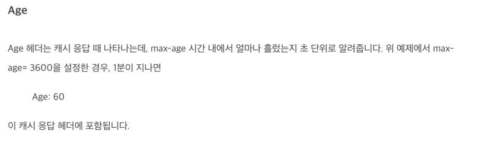

# 캐시

---

캐시는 자주 쓰이는 문서의 사본을 자동으로 보관하는 HTTP 장치이다.

웹 요청이 도착했을때 캐시에 해당 사본이 존재한다면 해당 사본을 제공하고 없다면 원 서버로 요청한다.

 - 캐시는 불필요한 데이터 전송을 줄여서 네트워크 요금으로 인한 비용을 줄여준다.
 - 캐시는 네트워크의 병목ㅇ르 줄인다. 대역폭을 늘리지 않고도 페이지를 빠르게 불러올 수 있다.
 - 캐시는 원 서버에 대한 요청을 줄여준다. 서버는 부하를 줄일 수 있으며 빠르게 응답 할 ㅅ ㅜ있다.
 - 페이지를 먼곳에서 불러올수록 시간이 오래걸리는데, 캐시는 거리로 인한 지연을 줄여준다.

---

## 🧐 불필요한 데이터 전송

여러 클라이언트가 원 서버에 접근할때 서버는 같은 문서에 대해서 클라이언트들에게 각각 한번 씩 전송하게 된다.

같은 내용의 문서들을 계속해서 반복적으로 전송하게 된다면 값비싼 네트워크 대역폭을 잡아먹고, 전송을 느리게 만들어
웹 서버에 부하를 준다. 

캐시를 이용하면 첫번째 응답은 캐시에 보관된다. 캐시된 사본이 그다음 요청들에 대해서 사본을 응답으로 사용하게 된다.

이는 원 서버가 중복해서 트래픽을 주고받는 낭비가 줄어들게 된다.

---

## 🧐 대역폭 병목

캐시는 네트워크 병목을 줄여준다. 클라이언트들이 서버에 접근할 때의 속도는
그 경로에 있는 가장 느린 네트워크의 속도와 같다. 만약 클라이언트가 빠른 LAN에 있는 캐시로부터
사본을 가져온다면 캐싱은 성능을 대폭 개선할 수 있다.

---

## 🧐 갑작스러운 요청 쇄도(Flash Crowds)

캐싱은 갑작스런 요청 쇄도에 대처하기 위해서도 중요하다.

갑작스런 이슈로 인해 많은 클라이언트로부터 요청이 쇄도한다면 초래된 불필요한 트래픽 급증으로 인해
네트워크와 웹서버의 심각한 장애를 발생히킨다.

---

## 🧐 거리로 인한 지연

대역폭이 문제가 되지 않더라도, 거리에 따른 문제가 발생할 수 있다.

모든 네트워크라우터는 제각각 인터넷 트래픽을 지연시킨다. 그리고 클라리언트와 서버 사이에
라우터가 많지 않더라도 유의미한 지연을 유발한다.

해결하기 위해서는 근처에 캐시를 설치해서 문서가 전송되는 거리를 줄일 수 있다.

---

## 🧐 적중과 부적중

캐시는 유용하다. 그러나 캐시가 모든 문서의 사본을 저장하지는 않는다.

캐시에 요청이 도착했을때 만약 대응하는 사본이 잇다면 그를 이용해 요청을 처리할 수 있다.
이것을 캐시가 적중했다고 한다.  

만약 대응하는 사본이 없는 경우 그냥 원서버로 전달이되어 요청을 처리한다 이것을 캐시 부적중(cache miss)이라고 한다.

---

## 🧐 재검사

원 서버 컨텐츠는 변경될 수 있기 때문에 캐시는 반드시 갖고있는 사본이 최신인지 서버를 통해 점검해야 한다.
이러한 방법을 `HTTP 재검사`라고 부른다 

캐시는 스스로 원한다면 언제든지 사본을 재검사할 수 있다. 그러나 캐시가 문서를 수백만개씩 
가지고있는 경우가 흔한데 비해 네트워크 대역폭은 부족하다, 따라서 캐시는 클라이언트가 사본을 요청하면
해당 사본이 검사를 할 필요가 있을 정도로 충분히 오래된 경우에만 재검사를 한다.

캐시는 캐시된 사본의 재검사가 필요할 때 원 서버에 작은 재검사 요청을 보내고 콘텐츠가 변경되지 않았다면 
`304 Not Modified`응답을 보낸다. 

사본이 여전히 유효함을 알게된 캐시는 사본이 신선하다고 표시한 뒤 클라이언트에 제공한다 이를 `재검사 적중` or `느린 적중`
이라고 부른다.

재검사 적중은 순수 캐시보다는 느리고, 캐시 부적중보다는 빠르다.

HTTP는 캐시된 객체를 재확인하기 위한 도구로 다음과 같은 헤더를 제공한다.

#### `If-Modified-Since`헤더
서버에게 보내는 GET요청에 해당 헤더를 추가하면 캐시된 시간 이후에 변경된 경우에만 사본을 보내달라는 의미가 된다.

If-Modified-Since 를 사용하였을때 발생할 수 있는 세가지 상황

1. 재검사 적중
> 만약 서버 객체가 변경되지 않았다면, 서버는 클라이언트에게 `304 Not Modified`응답을 보낸다.

2. 재검사 부적중
> 만약 서버 객체가 캐시된 사본과 다르다면, 서버는 콘텐츠 전체와 함께 평범한 `200 OK`응답을 클라이언트에게 보낸다.

3. 객체 삭제
> 만약 서버 객체가 삭제되었다면, 서버는 `404 NotFound` 응답을 반환하며 캐시는 사본을 삭제한다.

---

### 적중률

캐시가 요청을 처리하는 비율을 `캐시 적중률` or `캐시 적중비`, `문서 적중률`이라고 부르기도 한다.

적중률은 0~1까지의 값으로 되어 있지만, 흔히 퍼센트로도 표현된다. 0%는 모든 요청이 캐시 부적중임을, 100%는 
모든 요청이 캐시 적중임을 의미한다.

캐시 적중률은 캐시가 얼마나 큰지, 얼마나 자주 변경되거나 개인화되는지, 어떻게 설정되어 있는지에 달려있다.

---

### 바이트 적중률 

문서들이 모두 같은 크기인것은 아니기 때문에 문서 적중률이 모든 것을 말해주지는 않는다.

몇몇 큰 객체는 접근되지만 그 크기 때문에 전체 트래픽에는 더 크게 기여한다. 이러한 이유로 
사람들은 바이트 단위 적중률 측정값을 더 선호한다.

바이트 단위 적중률이란 캐시를 통해 제공된 모든 바이트의 비율을 표현한다. 바이트단위 적중률 100%는 모든
바이트가 캐시에서 왔으며, 어떤 트래픽도 인터넷으로 나가지 않았음을 의미한다.

문서 적중률과 바이트 단위 적중률은 둘다  캐시 성능에 대한 유용한 지표이다.

 - 문서 적중률은 얼마나 많은 웹 트랜잭션을 외부로 내보내지 않았는지 보여준다
 - 바이트 단위 적중률은 얼마나 많은 바이트가 인터넷으로 나가지 않았는지 보여준다. 바이트 단위 적중률의 개선은 대역폭 절약을 최적화한다.

---

### 적중과 부적중의 구별

HTTP는 캐시가 적중되었는지 아니면 부적중 되었는지 설명을 제공하지는 않는다. 두 경우 모두 
응답코드는 본문을 갖고 있음을 의미하는 200 OK가 될 것이다.

어떠한 상용 프록시 캐시는 캐시에 무슨일이 일어났는지 Via 헤더에 추가정보를 붙인다.

클라이언트가 응답이 캐시에서 왔는지 알아낼 수 있는 방법은 Date헤더를 이용하는 것이다. 

응답의 Date헤더 값을 현재시각과 비교하여 응답의 생성일이 더 오래되었다면 클라이언트는 응답이 캐시되었다는것을 알아낼 수 있다.

추가적으로 또 다른 방법은 응답이 얼마나 오래되었는지 말해주는 Age 헤더를 이용하는 것이다. 

출처 - https://www.zerocho.com/category/HTTP/post/5b594dd3c06fa2001b89feb9

---

## 🧐 캐시 토폴로지 

캐시는 한 명의 사용자에게만 할당될 수도 있고 반대로 수천 명의 사용자들 간에 공유될 수도 있다.
단일 사용자에게만 할당되는 캐시를 개인 전용 캐시(private cache)라고 부른다. 개인 전용 캐시는 개인만을 위한 캐시이므로
한명의 사용자가 자주 찾는 페이지를 담는다. 공용 캐시라고 불린다. 공용 캐시는 사용자 집단에게 자주 쓰이는 페이지를 담는다.

---

### 개인 전용 캐시 (private cache) 

개인 전용 캐시는 많은 에너지나 저장공간을 필요로 하지 않으며, 작고 저렴할 수 있다

웹 브라우저는 개인 전용 캐시를 내장하고 있기 때문에 자주쓰이는 문서를 개인용 컴퓨터의 디스크와 메모리에 캐시해놓고, 사용자가 캐시 하이즈와
설정을 수정할 수 있도록 하용한다. 캐시에 어떤 값들이 있는지 보기 위해서는
브라우저 안을 들여다보는 것도 가능하다. 브라우저에서는 캐시된 문서를 임시파일이라고 부르며.
연관된 URL 및 문서 만료 시각과 함께 파일 목록에 나열한다.

---

### 공용 프락시 캐시 (public cache)

공용 캐시는 프록시 서버 혹은 프록시 캐시라고 불리는 특별한 종류의 공유된 프록시 서버이다.

프록시 캐시는 로컬 캐시에서 문서를 제공하거나 사용자의 입장에서 서버에 접근한다.

공용캐시는 여러 사용자가 접근하기 때문에, 불필요한 트래픽을 줄일 수 있는 더 많은 기회가 있다.

개인 전용 캐시를 이용하여 서버로 동일한 문서에 접근하게 된다면 각각 캐시를 설정하고 사용하기 떄문에 여러번에
걸쳐서 가져오지만, 공용 캐시를 사용할 경우 자주 찾는 객체를 단 한번만 가져와 모든 요청에 대해 공유된 사본을 제공함으로써
네트워크 트래픽을 줄인다.

---

### 프록시 캐시 계층들 

작은 캐시에서 캐시 부적중이 발생했을 떄 더 큰 부모 캐시가 그 걸러남겨진 트래픽을 처리하도록 하는 계층을 만드는 방식이 합리적인 경우가 있다.

해당 내용은 캐시 계층을 두단계의 캐시로 나눠 적용하는것을 설명한다.

예를 들면 레벨 1차 캐시가 한번에 적중되면 좋겠지만 그렇게 하지 못하였을때의 대응이 필요하다.
그에따라 1차 캐시가 적중이 되지 않았다면 2차캐시를, 2차캐시또한 부적중이라면 원서버를 호출하는 방식이다.

이러한 방식은 캐시 계층이 길다면 요청은 캐시의 연쇄를 따라가게 되고 중간 프록시는 현저한 성능의 저하가 발생한다.

---

### 캐시망, 콘텐츠 라우팅, 피어링

몇몇 네트워크 아키텍처는 단순한 캐시 계층 대신 복잡한 캐시망을 만든다. 캐시망의 프록시의 프록시 캐시는
복잡한 방법으로 서로 대화하여, 어떤 부모 캐시와 대화할 것인지, 캐시를 완전히 우회해서 원서버로 가도록 할것인지 결정을 
동적으로 내린다.

캐시망 안에서의 콘텐츠 라우팅을 위해 설계된 캐시들은 다음과 같이 나열된 일을 한다.

- URL에 근거하여 부모 캐시와 원 서버중 하나를 동적으로 선택한다.
- URL에 근거하여 특정 부모 캐시를 동적으로 선택한다. 
- 부모 캐시에게 가기 전에, 캐시된 사본을 로컬에서 찾아본다.
- 다른 캐시들이 그들의 캐시된 콘텐츠에 부부적으로 접근할 수 있도록 허용하되, 그들 의 캐시를 통한
- 인턴엣 트랜짓은 허용하지 않는다. (트랜짓 - 다른 네트워크로 트래픽이 건너가는것)

선택적인 피어링을 지원하는 캐시는 형제캐시라고 불린다. HTTP는 형제 캐시를 지원하지 않기 때문에
사람들은 인터넷 캐시 프로토콜이나 하이퍼텍스트 캐시 프로토콜과 같은 프로토콜을 이용하여 HTTP를 확장했다.

---

## 🧐 캐시 처리단계 

오늘날의 캐시 프록시는 복잡하다. 매우 고성닝이면서도 HTTP와 그 외 다른 기술의 고급 기능을 지원하도록
만들어졌다.

HTTP GET 메시지 하느를 처리하는 기본적인 캐시 처리 절차는 일곱 단계로 이루어져 있다.

1. 요청 받기 - 캐시는 네트워크로부터 도착한 요청 메시지를 읽는다. 
2. 파싱 - 캐시는 메시지를 파싱하여 URL과 헤더들을 추출한다.
3. 검색 - 캐시는 로컬 복사본이 있는지 검사하고, 사본이 없다면 사본을 받아온다.
4. 신선도 검사 - 캐시는 캐시된 사본이 충분히 신선한지 검사하고, 신선하지 않다면 변경사항이 있는지 서버에게 요청한다.
5. 응답 생성 - 캐시는 새로운 헤더와 캐시된 본문으로 응답 메시지를 만든다. 
6. 발송 - 캐시는 네트워크를 통해 응답을 클라이언트에게 돌려준다.
7. 로깅 - 선택적으로 캐시는 로그파일에 트랜잭션에 대한 서술한 로그 하나를 남긴다.

---

## 🧐 사본을 신선하게 유지하기 