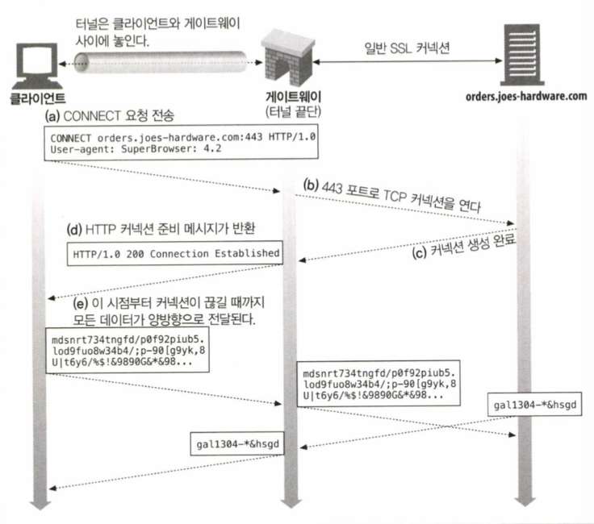

# 통합점: 게이트워이, 터널, 릴레이

---

- 게이트웨이 : 서로다른 프로토콜과 애플리케이션 간의 HTTP 인터페이스
- 애플리케이션 인터페이스 : 서로 다른 형식의 웹 애플리케이션이 통신하는데 사요 
- 터널 : HTTP 커넥션을 통해서 HTTP가 아닌 트래픽을 전송하는데 사용
- 릴레이 : 일종의 단순한 HTTP 프록시로, 한번에 한개의 홉에 데이터를 전달하는데 사용한다.

---

## 🧐 게이트웨이

모든 리소스를 한 개의 애플리케이션으로만 처리할 수 없다는 것은 분명하다. 따라서 개발자들은 이 문제에 대한
해결책으로, 인터프리터 같이 리소스를 받기 위한 경로를 안내하는 역할을 하는 게이트웨이를 고안하게 되었다.

`게이트웨이`는 리소스와 애플리케이션을 연결하는 역할을 한다. 애플리케이션은 게이트웨이에게 요청을
처리해달라고 할 수 있고, `게이트웨이`는 그에 응답한다. 

동작 방식은 요청을 받고 해당 응답을 보내는 포털같이 동작하는데, 동적인 컨텐츠를 생성하거나 데이터베이스에
질의등을 보낼 수 있다.

게이트웨이는 HTTP 트래픽을 다른 프로토콜로 자동으로 변환하여, HTTP 클라이언트가 다른 프로토콜을 알 필요 없이
서버에 접속할 수 있게 한다.

### 클라이언트 측 게이트웨이와 서버 측 게이트웨이 

웹 게이트웨이는 한쪽에서는 HTTP로 통신하고 다른 한쪽에서는 HTTP가 아닌 다른 프로토콜로 통신한다.

게이트웨이는 클라이언트 측과 서버 측 프로토콜을 빗금으로 구분한다.

`<클라이언트 프로토콜>/<서버 프로토콜>`

만약 게이트웨이가 HTTP 클라이언트와 NNTP 뉴스 서버 사이에 있다면 `HTTP/NNTP` 게이트 웨이가 된다.

 - 서버 측 게이트웨이는 클라이언트와 HTTP로 통신하고, 서버와는 외래 프로토콜로 통신한다
 - 클라이언트 측 게이트웨이는 클라이언트와 외래 프로토콜로 통신하고, 서버와는 HTTP통신을 한다.

---

### 프로토콜 게이트웨이

게이트웨이도 프록시와 동일하게 HTTP트래픽을 바로 보낼 수 있다.

보통은 명시적으로 게이트웨이를 설정하여 자연스럽게 거쳐가게 하거나, 게이트웨이를 대리서버로 설정할 수도 있다.

P.231 그림 8-4 참고

---

### HTTP/*: 서버측 웹 게이트웨이 

서버 측 웹게이트웨이는 클라이언트로부터 HTTP 요청이 서버 영역으로 들어오는 시점에 클라리언트 측의 HTTP요청을
외래 프로토콜로 전환한다.

해당 내용에서는 HTTP를 통해 요청했을시 HTTP/FTP 인바운드 변환 게이트웨이에서
FTP서버에게 인증과 요청 정보를 전달하여 해당 데이터를 반환하고, 해당 객체를 받는대로 HTTP응답에 실어서 클라이언트에게 전송한다.

---

### HTTP/HTTPS: 서버 측 보안 게이트웨이

기업 내부의 모든 웹 요청을 암호화 함으로써 개인 정보 보호와 보안을 제공하는데 게이트웨이를 사용할 수 있다.
클라이언트는 일반적으로 HTTP를 사용하여 웹을 탐색할 수 있지만, 게이트웨이가 자동으로 사용자의 모든 세션을 암호화한다.

(실제 사례 설명 할 예정)

### HTTP/HTTPS: 서버 측 보안 가속 게이트웨이

HTTPS/HTTP 게이트웨이는 보안 가속기로 유명하다. 해당 게이트웨이 웹서버의 앞단에 위치하고,
보이지 않는 인터셉트 게이트웨이나 리버스 프락시 역할을 한다. 

HTTPS트래픽을 받아서 복호화하고, 웹 서버로 보낼 일반 HTTP요청을 만든다.

---

## 리소스 게이트웨이

게이트웨이의 가장 일반적인 형태인 애플리케이션 서버는 목적지 서버와
게이트웨이를 한개의 서버로 결합한다. 

애플리케이션 서버는 HTTP를 통해서 클라이언트와 통신하고 서버 측에 있는 애플리케이션 프로그램에 연결하는 서버 측 게이트웨이다.

애플리케이션 서버는 게이트웨이의 애플리케이션 프로그래밍 인터페이스를 통해서 요청을 서버에서 동작하고 있는 애플리케이션에 전달한다.

---

### 공용 게이트웨이 인터페이스

공용 게이트웨이 언터페이스(CGI)는 최초의 서버 확장이자 지금까지도 가장 널리 쓰이는 서버 확장이다.

웹에서 동적인 HTML, 신용카드처리, 데이터베이스 질의 등을 제공한다.

CGI애플리케이션이 서버와 분리되면서 펄, Tcl, C, 다양한 셸 언어를 포함하여 수많은 언어로 구현이 가능하다.

또한 단순하기 때문에 거의 모든 HTTP 서버가 지원한다. 

다만 CGI가 내부에서 어떻게 처리하는지 사용자에게 보여지지는 않는다. 사용자 시각에서는 CGI가 내부적으로
일반적인 요청을 만드는것일뿐이다. 또한 서버와 CGI애플리케이션간의 진행되는 처리단계를 감추기때문에 URL에 있는 `cgi`, `?`같은 단어들로만 유추할 수 있다.

> CGI는 모든 리소스 형식과 서버의 접점에 있으면서 필요에 따라 어떤 변형이든 처리해내는 단순한 기능을 제공하고 확장으로부터
> 서버를 보호하지만, 이러한 분이때문에 성능관련 비용이 발생, 부하가 크고 서버의 성능을 제어, 장비에 부담을 준다.

---

### 서버 확장 API

서버 자체의 동작을 바꾸고 싶거나, 서버의 처리능력을 끌어올리고자 하는 필요때문에 서버 개발자는
웹 개발자가 자신의 모듈을 HTTP와 직접 연결할 수 있는 인터페이스인 서버 확장 API를 제공하였다.

이는 자신의 코드를 서버에 연결하거나 서버의 컴포넌트를 자신이 만든것으로 교체할 수 있게 하였다.

서버 확장의 한가지 예는, 프론트페이지 제작자가 웹 출반 서비스를 하게 지원해주는 마이크로소프트의 프론트페이지 서버 확장이다.

해당 FPSE는 프론트페이지 클라이언트로부터 전송되는 원격 프로시저호출명령을 인식할 수 있다.

---

## 애플리케이션 인터페이스와 웹 서비스

웹 애플리케이션이 더 많은 형식의 서비스를 제공함에 따라 HTTP가 애플리케이션을 연결하는 도구로 활용할 수 있다.
다만 연결하면서 까다로운점은 데이터를 교환하려는 두 애플리케이션 사이에서 프로토콜 인터페이스를 맞추는 일이다.

애플리케이션이 상호 운용을 하다보면 HTTP헤더로는 표현하기 힘든 복잡한 정보를 교환해야 하는 상황이 생긴다.
 - HTTP POST메시지 위에 덧씌워진 RPC
 - HTTP 헤더에 XML을 추가하는 방법등이 있다.

웹서비스는 애플리케이션이 정보를 공유하는데 사용하는 새로운 매커니즘을 의미하며, HTTP 같은 표준웹 기술 위에서 개발한다.

웹 서비스는 SOAP를 통해 XML을 사용하여 정보를 교환한다. XML은 데이터 객체를 담는 데이터를 생성하고 해석하는
방식을 제공한다. `SOPA`는 `Simple Object Access Protocal`의 약자로 HTTP 메시지에 XML 데이터를 담는 방식에 관한 표준이다.

---

## 터널 

> `터널` - 터널은 HTTP 프로토콜을 지원하지 않는 애플리케이셔넹 HTTP 애플리케이션을 사용해 접근하는 방법을 제공한다.

여러종류의 리소스에 접근하기위해 게이트웨이를 이용하거나, HTTP를 사용하는 여러가지 방법이 있지만 HTTP의 또다른 방식이다.

웹터널을 사용하면 HTTP 커넥션을 통해서 HTTP가 아닌 트래픽을 전송할 수 있고, 다른 프로토콜올을 HTTP 위에 올릴 수도 있다.

터널을 사용하는 가장 일반적인 이유는 HTTp커넥션 안에 HTTP가 아닌 트래픽을 얹기 위해서다. 따라서 웹터널을 사용하면
 웹트래픽만을 허락하는 방화벽이 있더라도 HTTP가 아닌 트래픽을 전송할 수 있다.

---

### CONNECT로 HTTP 터널 커넥션 맺기

웹 터널은 HTTP의 CONNECT 메서드를 사용하여 커넥션을 맺는다.

CONNECT프로토콜은 HTTP/1.1명세에는 자세하게 나와 있지는 않지만 많이 구현하는 확장이다.

CONNECT 메서드는 터널 게이트웨이가 임의의 목적 서버와 포트에 TCP 커넥션을 맺고 클라이언트와 서버간에 오는 데이트를 무조건 전달 하기를 요청한다.

#### CONNECT 요청

CONNECT문법은 시작줄을 제외하고는 다른 HTTP 메서드와 같다. 
요청 정보를 보면 기존 HTTP호출과 비슷하다. 

시작줄 다음에는 다른 HTTP와 같이, 추가적인 요청헤더필드가 있거나 없으며, 각 행은 CRLF끝나고 헤더 목록의 끝은
빈줄의 CRLF로 끝난다.

---

#### CONNECT 응답

클라이언트는 요청을 전송한 다음, 게이트웨이의 응답을 기다린다.
일반 HTTP 메시지와 같이 200응답 코드는 성공을 뜻한다.편의상 응답의 사유는 `Connection Established`로 기술된다.

다만 일반적인 HTTP 응답과 달리 Content-Type헤더를 포함할 필요가 없다. 이유는 바이트를 그대로 전달하기 때문에 콘텐츠의
형식을 기술하는 Content-Type헤더가 필요 없기 때문이다.

---

### 데이터 터널링, 시간, 커넥션 관리

터널을 통해 데이터를 전송하더라도 게이트웨이에서는 볼 수 없다, 게이트웨이는 패킷의 순서나
흐름에 대한 어떤 가정도 할 수 없다. 터널이 일단 연결된다면 데이터는 어디로든 흘러갈 수 있다.

클라이언트는 성능을 높이기 위해 CONNECT 요청을 보낸 다음, 응답을 받기도 전에 터널 데이터를 전송할 수 있다.
이렇게 한다면 데이터를 더 빨리 보내는 방법이긴하지만 게이트웨이가 요청에 이어서 데이터를 적절하게 처리할 수 있어야 한다.

터널의 끝단에서 커넥션이 끊어진다면 끊어진 곳으로부터 온 데이터는 반대로 전달되고 그다음 커넥션이 끊어졌던
터널의 반대편의 커넥션도 프락시에 의해서 끊어진다. 다만 끊긴 한쪽에 아직 전송하지 않은 데이터가 있다면 데이터는 버려진다.

---

### SSL 터널링

웹 터널은 방화벽을 통해서 암호화된 SSL 트래픽을 전달하려고 개발되었다.
많은 회사에서 강력한 보안을 위해 모든 트래픽이 패킷을 핑터링하는 라우터와 프록시를 지나가도록 하게 하였지만
SSL같이 암호화된 프로토콜은 정보가 암호화되어 있기 떄문에 낡은 방식에서는 프록시 처리 되지 않는다.

터널을 사용하면 SSL 트래픽도 HTTP 커넥션으로 전송하여 80 포트의 HTTP만을 허용하는 방화벽을 통과시킬 수 있다.

터널은 HTTP가 아닌 트래픽이 포트를 제한하는 방화벽을 통과하게 해주지만, 이는 보안 SSL트래픽이 방화벽을
통과하는 데 유용하게 사용될 수 있다. 하지만 터널은 악의적인 트래픽이 사내로 유입되는 경로가 될 수도 있다.

---

### SSL터널링 vs HTTP/HTTPS 게이트웨이

HTTPS 프로토콜은 다른 프로토콜과 같은 방식으로 게이트웨이를 통과할 수 있다.

원격 HTTPS서버와 SSL세션을 시작하는 게이트웨이를 두고 클라이언트 측의 HTTPS 트랜잭션을 수행하는 방식이다.

응답은 프록시가 받아서 복호화 하고 난 후에 HTTP를 통해 클라이언트에게 전송한다.

다만 이방식은 보안이 적용되지 않은 일반 HTTP 커넥션이 맺어지고, 클라이언트는 원격서버에 SSL클라이언트 인증을 할수 없으분더러.
게이트웨이가 SSL을 완벽하게 지원해야 한다.

이상황에서 터널링을 사용한다면 프록시에 SSL을 구현할 필요가 없다. SSL세션은 클라이언트가
생성한 요청과 목적지 웹 서버간에 생성된다.

프록시 서버는 트랜잭션의 보안에는 관여하지 않고 오로지 데이터를 그대로 터널링한다.

---

### 터널 인증

HTTP의 기능들은 터널과 함께 적절하게 사용될 수 있다. 대게 권한을 검사하는 용도로 터널에서 사용할 수 있다.

P.243 그림 8-13 참고

---

### 터널 보안에 대한 고려사항

터널 게이트웨이는 통신하고 있는 프로토콜이 터널을 올바른 용도로 사용하고 있는지 검증할 방법은 없다.

따라서 터널의 오용을 최소화하기 위해서는 게이트웨이는 HTTPS 전용 포트인 443 같이 잘 알려진
특정 포트만을 터널링 할 수 있게 허용해야 한다.

---

### 릴레이

HTTP 릴레이는 HTTP명세를 완전히 준수하지는 않는 간단한 HTTP 프록시이다. 릴레이는 커넥션을 맺기 위해
HTTP 통신을 한 다음, 바이트를 맹목적으로 전달한다.

HTTP는 복잡해서, 모든 헤더와 메서드 로직을 수행하지 않고 맹목적으로 트래픽을 전달하는 간단한 프록시를 구현하는 방식이
유용할 때가 있다. 데이트만 맹목적으로 전달하도록 구현하기는 쉽기 때문에 단순 필터링이나, 진단, 혹은 콘텐츠를 변환하는데 사용하기도 한다.

다만 잠재적으로 심각한 상호 운용 문제를 가지고 있기 때문에 주의해서 배포해야 한다.

릴레이의 일반적인 문제중 하나는 바로 맹목적 릴레이가 Connection 헤더를 제대로 처리하지 못하여 keep-alive 커넥션이
행에 걸리는 것이다.

따라서 HTTP를 제대로 준수하는 프록시를 사용하는게 좋다.

