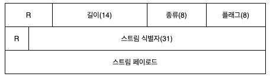

# 9장. 웹 로봇

---

`웹로봇`은 사람과의 상호작용 없이 연속된 웹 트랜잭션들을 자동으로 수행하는 소프트웨어 프로그램을 뜻한다.

이 웹로봇들은 웹사이트에 다른 웹사이트로 하이퍼링크, 콘텐츠를 따라 이동하면서 발견한 데이터를 처리한다.
우리는 이를 흔히 `크롤러`, `스파이더`, `웜`, `봇`이라고 부르 기도 한다.

---

## 웹 로봇의 예

- 주식시장 서버에 매 분 HTTP GET요청을 보내고, 얻은데이터를 활용하여 주가 추이 그래프를 생성하는 주식 그래프 로봇
- 월드 와이드 웹의 규모와 진화에 대한 통겨정보를 수집하는 웹 통계 조사 로봇, 이것들은 웹을 떠돌면서 페이지의 갯수를 세고 각 페이지의 크기, 언어, 미디어를 기록 
- 검색 데이터베이스를 만들기위해 발견한 모든 문서를 수집하는 검색엔진 봇 
- 상품에 대한 가격 정보를 수집하는 가격 비교 로봇


---

## 크롤러와 크롤링


> `웹 크롤러`는 웬페이지 한개를 호출하고 그 다음 그페이지가 가리키는 모든 웹페이지를 가져와, 계속해서 그다음 페이지딜이 가리키는
> 모든 웹페이지들을 가져온다. 재귀적인 방식으로 순회하는 로봇을 웹 크롤러라고 부른다. 
> 
> 이러한 로봇을 크롤러 혹인 스파이더라고 부른다.

인터넷 검색엔진은 웹을 돌아다니면서 그들이 만나는 모든 문서를 끌어오기 위해 웹 크롤러를 사용한다. 해당 문서들은
나중에 처리되어 검색 가능한 데이터베이스로 만들어져 사용자들이 특정 단어를 포함한 문서를 찾을 수 있게 해준다.

---

### 어디에서 시작하는가: '루트 집합'

크롤러를 시작하기전 어디서부터 시작할지 출발지점을 알려줘야 한다. 이때 크롤러가 방문을 시작하는 URL들의
초기 집합을 루트집합이라고 부른다. 

루트집합을 고를때는 모든 링크를 크롤링 할 수 있도록관심있는 웹페이지들의 대부분을 가져 올수 있도록 충분히 다른 장소에서 URL들을 선택해야한다.

루트집합을 통해 페이지를 돌며 검색하던중 몇몇 웹페이지들은 어떤 링크도 없이 오도가도 못하게 거의 고립되어 있는 경우가 생긴다
이런 경우때문에 대규모 크롤러 제품들은 루트 집합에 새 페이지나 알려지지 않은 페이지들을 추가하는 기능들을 제공한다.

---

### 링크 추출과 상대 링크 정상화 

크롤러는 웹을 돌아다니면서 꾸준히 문서를 검색한다음 각 페이지안에 들어있는 URL링크들을 파싱해서 크롤링할 페이지들의
목록에 추가해야한다.

새 링크를 발견하면 보통 급속히 확장되게 된다. 크롤러들은 간단한 HTML 파싱을해서 링크들을 추출하고 상대 링크를
절대링크로 변환할 필요가 있다.

---

### 순환 피하기

크롤링을 할때 가장 주의해야할 점은 루프나, 순환에 빠지지 않도록 매우 조심해야한다.
P249 에서 제공하는 이미지를 보면 서로 링크된 페이지가 순환이 되며 동일한 페이지를 계속 가져오게 되는 순환에 빠진다
따라서 이 문제를 해결하기 위해서는 방문한 링크에 대해서 알 고 있어야 한다.

---

### 루프와 중복

순환은 최소 다음의 세가지 이유로 인해 크롤러에게 해롭다.

1. 같은 페이지들을 반복해서 가져오기때문에 시간을 낭비하게 되며, 이러한 크롤러가 네트워크 대역폭을 다 차지하고 어떠한 페이지도 가져올 수 없게 되어버릴 수 있다.
2. 크롤러가 같은 페이지를 반복해서 가져오게 되면 웹 서버의 부담이 된다. 만약 크롤러의 네트워크 접근 속도가 충분히 빠르다면, 웹사이트에게 부하가 가해져 실제 사용자도 사이트에 접근할 수 없게 막아버리게 될 수 있다. 따라서 이러한 행위가 법적인 문제제기의 근거가 될 수 있다.
3. 수많은 중복페이지를 가져오게 되고, 크롤러의 애플리케이션은 중복된 컨텐츠로 넘쳐나게 된다.

---

### 빵 부스러기의 흔적 

방문한 사이트를 지속적으로 추적하는 것은 쉽지 않다, 지금 순간에도 동적으로 생성된 콘텐츠를 제외하더라도 수십억 개의 
서로 다른 웹페이지들이 존재한다.

대규모 웹 크롤러가 그들이 방문한 곳을 관리하기 위해 사용하는 기법은 다음과 같다.

#### 트리와 해시 테이블
> 복잡한 로봇이라면 방문한 URl을 추적하기 위해 검색트리나 해시테이블을 사용할 수 있다. 해당 자료구조는 URL을 훨씬 빨리 찾아볼 수 있게 해준다.

#### 느슨한 존재 비트맵
> 공간 사용을 최소화하기 위해 존재비트배열과 같은 느슨한 자료구조를 사용한다. 각 URL은 함수에 의해 고정된 크기의 숫자로 변환되고
> 배열 안에 대응하는 존재비트를 갖는다. 크롤링이 되었을때 해당하는 존재비트가 만들어지고 만약 존재비트가 이미 존재한다면 그 URL을 이미 크롤링 되었다고 간주한다.


#### 체크 포인트
> 방문한 URL의 목록이 디스크에 저장되었는지 확인한다.

#### 파티셔닝 
>한대의 컴퓨터에서 하나의 로봇이 크롤링을 완수하는 것은 불가능할정도로 웹이 성장하였다. 따라서 여러개의 분리된 크롤링봇으로 
> URL들의 특정한 부분을 할당하여 책임을 진다, 개별 로봇들은 URL들을 넘겨주거나, 오동작하는 동료를 도와주거나
> 그 외의 이유로 활동을 조정하기 위해 커뮤니케이션을 한다.

---

### 별칭과 로봇 순환 

올바른 자료구조를 바탕으로 순환하면서 크롤링 하더라도 URL이 별칭을 가질 수 있는 이상 어떠한 페이지를 이전에
방문했었는지 확인하는것이 쉽지 않을때도 있다. 같은 URL에 대해서 서로 다른 별칭을 가지고 있다면 달라보이더라도 
결국은 서로 같은 리소스를 가리키게 되는것이다. URL정규화하는 방식을 통해 위 문제를 일부분 해결할 수 있다.

---

### URL 정규화하기

대부분의 웹 로봇은 URL들을 표준 형식으로 `정규화`함으로써 서로 다른 URL이지만 서로 같은 리소스를 가리키고 있는 URL에 대해서
제거하려고 시도한다. 정규화는 다음과 같은 방식으로 변환할 수 있다.

1. 포트 번호가 명시되어 있지 않다면 호스트명에 포트를 추가한다.
2. 모든 %xx 이스케이핑 되어있는 문자들에 대해서 대응되는 문자로 변환한다.
3. `#`태그들을 제거한다. 

위와 같은 방법으로 위 세가지에 해당 하는 방식만 해결 할 수 있다.

그렇다면 해결하지 못하는 방법은 뭐가있을까?

- 서버가 대소문자를 구분하지 않는경우
- 기본페이지가 index.html을 직접 가리킬때
- 도메인이 아닌 ip를 통한 접근을 하였을떄

위 세가지 방법에 대해서는 앞서나온 방식으로는 정규화가 불가능할듯하다.

웹서버에 대한 지식없이는 위와 같은 중복을 피할수 있는 좋은 방법은 없다...

---

### 파일 시스템 링크 순환

파일 시스템의 심볼릭 링크는 아무것도 존재하지 않으면서도 끝없이 깊어지는 디렉토리 계층을 만들 수 있다.
따라서 관리자가 실수로 만들기도 하지만, 때로는 웹 마스터가 크롤러를 순환 시키기 위해 악의적으로 순환계층을 만들기도 한다.

예를 들면 다음과 같다.
A의 하위 계층에 B와 C가 있지만 해당 C에서 A를 가리키도록 링크되어있다면 무한적으로 서브링크가 붙어 호출되므로
순환되지만 URL이 달라보이기 때문에 URL만으로는 크롤러가 눈치채지 못하게 된다.

---

### 동적 가상 웹 공간

위의 내용처럼 악의적으로 순환시키기 위해 의도저적으로 복잡한 크롤러 루프를 만드는것은 충분히 발생할 수 있는 일이다.

동적 가상 웹공간은 크롤러를 무한한 가상 웹공간 너머에 있는 나라로 여행을 보내버린다...
이때 웹서버는 파일을 하나도 갖고있지 않을 수 있다. 또한 URL과 HTML은 매번 다르게 하여 크롤러가 순환을 감지하기 어렵다는 것이다.

예를 들면 다음과 같다.

1. 크롤러가 /index.html 을 호출 웹서버에서 /index1.html로 가도록 반환.
2. 크롤러가 다시 /index1.html 호출, 웹서버가 /index2.html로 가도록 반환.

위와 같은 방식을 무한적으로 가상공간을 생성하는 것이다.

---

### 루프와 중복 피하기

모든 순환을 완벽하게 피하는 방법은 없다.또한 웹은 크롤러가 문제를 일으킬 가능성으로 가득차있다. 이러한 문제를 해결하고 올바르게 동작하기위해
사용하는 기법들을 소개한다.


#### URL 정규화
> URL을 표준형태로 변경함으로써 같은 리소스를 가리키는 중복된 URL에 대해서 회피한다.

#### 너비 우선 크롤링
> 크롤러들은 크롤링을 할 수 있는 URL들의 집합을 가지고있다.<br>
> 방문할 URL들을 웹사이트 전체에 걸쳐 너비우선으로 스케줄링하면, 순환의 영향을 최소화 할 수 있다<br>
> 만약 깊이우선탐색으로 운영하게 되면 순환을 건드리는 경우 영원히 다른 사이트로 빠져나올 수 없는 순환에 빠지게 된다.

#### 스로틀링
> 크롤러가 웹사이트에서 일정시간동안 가져올 수 있는 페이지수를 제한한다. 크롤러가 지속적으로 해당 사이트에 접근을
> 시도한다면 문제가 될 수 있기때문에 스로틀링을 사용하여 해당 서버에 대한 접근 횟수와 중복 횟수를 제한할 수 있다.

#### URL 크기 제한
> 보통 1KB가 넘는 URL에 대해서 크롤링을 거부할 수 있다. 만약 순환으로 인해서 URL이 계속 길어지게 된다면 결국
> 길이제한으로 인하여 순환이 중단된다. <br>
> 추가로 URL이 점점길어지게되어 순환에 빠지게 되면 웹 마스터가 크롤러를 서비스 거부 공격자로 오해하게 만들수도 있다.<br>
> 
> 다만 주의해야할 점은 크기제한때문에 특정한 컨텐츠들에 대해서는 가져오지 못하는 문제가 발생할 수 있다.<br>
> 많은 사이트들이 URL을 통하여 상태를 관리하기도 한다. 따라서 URL길이가 길어지기도 한다<br>
> 
> 다만 해당 기법은 URL이 특정 크기에 도달할 때마다 로그를 남김으로써, 특정 사이트에서 벌어지는 일에 대해서 모니터링 할 수있어
> 사용자에게는 훌륭한 신호를 제공할 수 있다.
> 

#### URL/사이트 블랙리스트

>순환을 만들어내거나 함정으로 인하여 순환으로 빠트리고자 하는 사이트의 URL목록을 만들어 관리하고, 블랙리스트에 있는 URL들은
> 피하도록 하는 방식이다. 또한 문제를 일으킬만한 URL에 대해서는 블랙리스트에 추가한다.<br>
> 다만 이 방식은 사람의 손을 필요로 한다. 요즘 크롤러들은 이미 악의적이거나 문제를 가지고 있는 URl에 대해서는 블랙리스트를 가지고 있다.


#### 패턴 발견 
> 반복적인 구성요소를 가지고 있는 URL이나 순환과 같은 오설정들의 패턴을보고 잠재적으로 해당 URL들에 대해서 거절한다.

#### 콘텐츠 지문 
> 해당 박식은 페이지의 콘텐츠에서 몇 바이트를 얻어내어 체크섬을 계산하여 중복된 방분인지에 대해서 확인한 후 크롤링 하지 않도록 한다.
> 
> 체크섬이 같다면 이미 콘텐츠를 방문하였다고 판단한다. 다만 주의해야할 점은 페이지가 서로 다른내용임에도 체크섬이 똑같은 확률이
> 적은 것을 사용해야 한다. 지문 생성용으로는 MD5와 같은 함수가 사용된다.

#### 사람의 모니터링
> 해당 박식은 말그대로 어떠한 기법으로도 해결하지 못할 경우 사용하는 방법이다. 크롤러의 진행 상황을 사용자가
> 모니터링하여 특정한 일이 발생하면 즉각 인지할 수 있도록 로깅을 추가한뒤 문제가 발생하면 사용자가 직접 커스터마이징을 하는것이다


---

## 로봇의 HTTP 

로봇들은 다른 HTTP 클라이언트와 다르지 않다. 로봇 또한 HTTP 명세의 규칙을 지켜야 한다.

### 요청 헤더 식별하기

로봇들이 HTTP를 최소한으로 지원하려고 하더라도 대부분은 신원 식별 헤더(User-Agent HTTP 헤더)를 구현하고 전송한다.
구현한 개발자들은 로봇에 대해 몇가지 헤더를 사이트에 전송하는것이 좋다.

특정 헤더들은 잘못된 크롤러의 소유자를 찾아낼때, 어떤 컨텐츠를 다룰수 있는지에 대한 정보를 전달할 수 있다.

- User-Agent : 서버에게 요청을 만든 로봇(클라이언트)의 이름을 전달한다.
- From : 로봇(클라이언트)의 사용자/관리자의 이메일 주소를 제공한다.
- Accept : 서버에데 어떠한 미디어 타입을 보내도 되는지 말해준다. 이는 관심있는 유형의 컨텐츠만 받게될 것임을 학신하는데 도움된다.
- Referer : 현재 요청 URL을 포함한 문서의 URL을 제공한다.

---

### 가상 호스팅

로봇(클라이언트) 구현자들은 Host 헤더를 지원할 필요가 있다. 가상 호스팅이 많은 현실에서는 요청에 Host 헤더 정보를
포함하지 않는다면 로봇(클라이언트)이 어떤 URL에 대해 잘못된 컨텐츠를 찾게만든다.

따라서 HTTP/1.1은 Host 헤더를 사용할 것을 요구한다.

Host 헤더를 포함하지 않는다면 다음과 같은 문제가 발생할 수 있다. 예를 들면 다음과 같다.

하나의 서버에서 기본적으로 하나의 사이트를 운영하기도 하지만 그렇지 않은 경우 하나의 서버에 두개 이상의 사이트를 운영하기도 한다.

www.sample1.com 과 www.sample2.com을 운영하는 사이트가 있는상태에서 로봇이 www.sample2.com 을 Host헤더 없이 호출한다면
우리는 www.sample2.com 에 대한 정보를 반환한다고 기대하게 된다. 하지만 서버가 기본적으로 www.sample1.com 을 제공하도록
설정되어있다면 Host가 없는 경우 www.sample2.com이 아닌 www.sample1.com 을 반환하여 우리가 원하는 결과를 얻을 수 없게 된다.

---

### 조건부 요청

조건부 요청이랑 특정 시간이나 엔티티 태그를 비교함으로써 로봇(클라이언트)이 받아간 데이터의 마지막 버전 이후
업데이트가 된 내용이 있는지 알아보는 조건부 HTTP 요청을 구현할 수 있다. 

조건부 요청은 HTTP 캐시가 이전에 받아온 리소스의 사본이 유효한지 검사하는 방법과 매우 비슷하다.

---

### 응답 다루기

기본적으로 로봇(클라이언트)들은 데이터를 가져오는것이 주 관심사이기 떄문에 HTTP 메소드의 `GET` 방식을 주로 사용한다.
다만 조건부 요청과 같은 기능을 사용하는 로봇들에 대해서는 상호작용을 위해 여러 종류의 HTTP 응답을 다루기도 한다.

#### 상태코드
> 로봇들은 최소한의 상태코드나 예상할 수 있는 상태코드를 다룰줄 알아야 한다. `200 OK` or `404 NotFound`와 같은 상태코드를 이해할 줄 알아야 한다.
> 명시적으로 이해할 수 없는 상태코드들에 ㅎ대해서는 상태코드가 속한 분류에 근거하야 다뤄야 한다.
> 
> 다만 모든 서버가 항상 적절한 상태코드를 내려주지는 않는다는것도 알아야 한다.

#### 엔티티 
> HTTP 헤더에 임베딩된 정보를  따라 로봇들은 엔티티 자체의 정보를 찾을 수 있다.<br>
> `http-equiv` 태그와 같은 메타 HTML 태그는 리소스에 대해 콘텐츠 저자가 포함시킨 정보이다.<br>
> 
> `http-equiv`태그는 콘텐츠를 다루는 서버가 제공할 수도 있는 헤더를 덮어쓰기 위한 수단이기도 하다.

#### User-Agent 타게팅 
> 웹 관리자들은 로봇들이 방문하게 될 수 있다는것을 염두하고 요청을 예상해야 한다.<br>
> User-Agent는 HTTP 요청을 보내는 디바이스와 브라우저 등 사용자 소프트웨어의 식별 정보를 담고 있는 헤더이다.
> 
> 따라서 User-Agent값을 보고 브라우저의 종류에 맞게 컨텐츠를 최적화하기도 한다. 해당 헤더를 잘 활용하면 특정
> 브라우저나 클라이언트에 대응하는 유연한 페이지를 개발할 수 있다.

---

### 부적절하게 동작하는 로봇들

부적절하게 동작하는 몇몇의 로복들은 서버들을 망가트릴 위험이 있다.다음은 몇가지 실수와, 그로 인하여 초래되는 결과들에 대한 내용을 나열한다.

#### 폭주하는 로봇 
> 보통의 로봇들은 일반 사람보다 훨씬 빠르게 HTTP 명세를 만들어 요청을 할 수 있다. 만약 해당 로봇들이
> 논리적인 에러를 갖고 있거나 순환에 빠졌다면 웹서버에 극심한 부하를 안겨주게되어 다른 사용자들또한 서비스를 사용하지
> 못하게 만들 수 있다. 따라서 개발자들은 이러한 문제가 발생하지 않도록 보호 장치를 설계하기도 해야한다.

#### 오래된 URL
> 로봇들은 특정 URL을 방문한 후 방문했던 기록을 저장한다. 만약 방문했던 사이트들이 콘텐츠들을 많이 변경하였다면 
> 운이 나쁜경우 로봇들은 사라진 URL에 대해서 접근을 요청하여 서버에 에러로그가 채워져 그 부하로 인해 요청에 대한 수용 능력이
> 떨어지게 되는 불상사를 만든다.

#### 길고 잘못된 URL
> 로봇은 순환이나 오류로 인해 웹사이트에게 크고 의미없는 URl요청을 할 수 있다. 만약 URL이 길다면 서버의 처리능력에 영향을 주고 
> 웹서버를 어지럽게 채우거나, 서버에 장애를 발생시킬 수 있다.

#### 호기심이 지나친 로봇 
> 이는 사용자가 특정 URL을 알리고 싶지 않았지만 로봇이 존재하지도 않는 문서,디렉토리등을 가져오는 방법으로 긁어오게 되면
> 가끔 발생하기도 한다. <br>
> 이는 소유자가 알리고 싶지 않았지만 제거하지 않거나 깜빡한 경우 발생한다.

#### 동적 게이트웨이 접근
> 로봇들은 자신들이 접근하는 것에 대해 언제나 잘알고 있는것은 아니다 만약 로봇들이 게이트웨이를 통해 URL로 요청한다면 이는 특수한 컨텐츠일 수 있고 처리 비용이
> 많이 들 수 있다. 따라서 웹 관리자들은 이러한 순진한 로봇들을 좋아하지는 않는다.

---

## 로봇 차단하기

로봇 커뮤니티에서는 로봇에 의한 웹사이트 접근이 유발할 수 있는 문제를 알고 로봇들을 잘 제어할 수 있는 메커니즘을 제공하는
자발적인 기법을 제안하였다. `Robots Exclusion Standard`라는 이름으로 지어졌지만 
접근을 제어하는 정보를 저장하는 파일의 이름을따 `robots.txt`라고 부른다. 

`robots.txt`는 단순하다. 웹서버는 서버의 루트에 `robots.txt`파일을 제공하며 어떤 로봇이 어떤 부분에
접근할 수 있는지에 대한 정보를 기술한다. 

만약 로봇이 자발적으로 해당 표준을 따른다면 다른 리소스에 접근하기전에 `robots.txt`에 먼저 접근하여 요청하며 특정 리소스를 요청하기전에
권한이 있는지 확인하기 위해 `robots.txt` 를 검사하게 된다.

웹로봇이 `robots.txt`를 확인하고 요청하는 방식은 다음과 같다.

1. 웹로봇이 웹서버에 리소스를 요청을 하기전에 `/robots.txt` 를 요청한다.
2. `/robots.txt`에 작성되어있는 허용된 리소스에 대해서 권한을 확인하고 해당 리소스를 요청한다.
3. 해당 리소스를 반환받는다.

--- 

### 로봇 차단 표준 

로봇 차단 표준은 임시방편으로 마련된 표준이다.  해당 표준이 작성되고있을때는 표준을 소유한 주체가 없었고 부분집합을 제각각 구현하고 있었다. 

해당 표준은 버전의 이름이 잘 정의되어 있지 않지만 세가지 버전이 존재한다. 

- v0.0 : 로봇 배제 표준-Disabllow 지시자를 지원하는 robots.txt 메커니즘
- v1.0 : 웹로봇제어방법-Allow 지시자의 지원 추가
- v2.0 : 로봇 차단을 위한 표준 정규식과 타이밍 정보를 포함, 다만 널리 지원되지는 않는다.

오늘날에는 v0.0이나 v1.0을 표준으로 채택하였으며, v2.0표준은 복잡하여 널리 채택되지 못하였다. 

[로봇 차단 표준 Wiki](https://ko.wikipedia.org/wiki/%EB%A1%9C%EB%B4%87_%EB%B0%B0%EC%A0%9C_%ED%91%9C%EC%A4%80)

### 웹 사이트와 robots.txt 파일들 

웹사이트의 어떤 URL을 방문하기전에 해당 웹 사이트들의 `robots.txt` 파일이 존재한다면 로봇은 해당 파일을 반드시
가져와서 처리해야한다. 

호스트명과 포트번호에 의해 정의되는 웹 사이트가 있다면 사이트 전체에 대한 `robots.txt`파일은 반드시 하나만 있어야 하며 
만약 가상호스팅이 된다면 다른 모든 파일이 그러하듯 가상의 docroot에 서로 다른 `robots.txt`가 존재 할 수 있다.

---

#### robots.txt 가져오기 

로봇들은 HTTP GET메서드를 활용하여 `robots.txt`리소스를 가져온다. robots.txt가 존재한다면 서버는 해당 파일을 
`text/plain` 본문으로 반환한다. 

만약에 서버가 `/robots.txt` 요청에 대해서 404 NotFound 를 반환한다면 로봇은 해당 서버가 로봇의 접근을 제한하지
않는것으로 간주하여 어떤 파일이든 요청해서 가져가게 된다. 

로봇은 추적가능하도록 From이나 User-Agent헤더를 통해 신원을 넘기고, 사이트 관리자가 로봇에 대해 문의나 불만이 있는경우를 위해
연락처를 제공해야한다. 다음은 크롤러 요청의 예시이다.
```http request
GET /robots.txt HTTP/1.0
Host: www.sample.com
User-Agent: YunJin/2.0
Date: Fri Oct 6 01:46:11 KST 2023
``` 

---

#### 응답 코드 

많은 웹사이트들이 `robots.txt`파일들을 항상 가지고 있지는 않다. 하지만 로봇은 이 사실을 모르고 어떠한 웹사이트에서든
`robots.txt`를 찾으려고 할것이다. 로봇은 검색 결과에 따라 다르게 동작하게 된다.

- 서버가 성공으로 응답하게 된다면 로봇은 반드시 그 응답의 컨텐츠를 파싱하여 차단 규칙을 얻고, 해당 사이트에서 리소스를 얻기전에 반드시 그 규칙을 따르게 된다.
- 만약 리소스가 존재하지 않는다고 사버가 응답하게 된다면 로봇은 차단 규칙이 존재하지 않는다고 가정하고 제약없이 해당 사이트에 접근한다.
- 만약 서버가 접근제한으로 응답한다면 로봇은 그사이트로의 접근은 완전히 제한되어있다고 가정해야한다.
- 요청 시도가 일시적(503)으로 실패했다면 그사이트의 리소스를 검색하는 것은 뒤로 미뤄야 한다.
- 서버가 리다이렉션을 응답한다면 로봇은 리소스가 발견될때까지 리다이렉트를 따라가야한다.

---

### robots.txt 파일 포맷 

`robots.txt`파일은 단순한 줄 기반의 문법을 갖는다. 각 줄은 빈줄, 주석 줄, 규칙 줄의 세가지 종류가 있다.

규칙 줄은 헤더처럼 생겼으며 패턴 매칭을 위해 사용된다.

```text
`robots.txt` 예제 

User-Agent: yunjin
User-Agent: crawler
Disallow: /private

User-Agent: *
Disallow: 
```

위 예제를 보면 각 줄들은 레코드로 구분된다. 각 레코드들은 차단 규칙의 집합을 기술한다. 또한 로봇별로 각각 다른 규칙들도 적용할 수 있다.

각 레코드는 규칙 줄들의 집합으로 이뤄져있으며 빈 줄이나 파일끝문자로 끝난다. 

첫 시작은 `User-Agent`로 시작하며 그다음 로봇들이 접근할 수 있는 URL들을 말해주는 Allow, Disallow줄이 온다.

### `User-Agent 줄` <br>
로봇의 레코드는 하나의상의 `User-Agent`줄로 시작하며 `User-Agent: <robot-name>` 또는 `User-Agent: *` 와 같이 
설정할 수 있다. 

만약 로봇이 자신의 이름에 해당하는 User-Agent를 찾지못하거나 User-Agent:* 이 없다면 대응하는 레코드가 없다는것으로 간주하고 접근에 어떤 제한도 없다.

주의해야할 점은 User-Agent의 로봇 이름은 대소문자를 구분하지 않는 부분 문자열과 맞춰보기 때문에 의도치 않게 마즌 경우에 주의해야한다.

만약 User-Agent: bot으로 했지미만, Bot, RoBot등과 같은 User-Agent와도 매치된다.

### `Disallow 와 Allow 줄들`<br>

`Disallow`와 `Allow` 줄은 `User-Agent`줄들 바로 다음에 온다. 해당 줄들은 어떠한 경로들에 대해서
허용하고 금지할지 기술한다. 

로봇은 반드시 요청하려고 하는 URL을 차단 레코드의 모든 Disallow, Allow규칙에 순서대로 맞춰봐야하며 첫번째로 맞은것이 사용된다.
아무것도 맞지 않는다면 해당 URL은 허용된다

---

### robots.txt 파싱시 지켜야할 몇가지 추가 규칙

- `robots.txt` 파일은 명세가 발전함에 따라 User-Agent, Disallow, Allow 외에도 다른 필드들을 포함하게 변경될 수 있다. 따라서 로봇들은 이해하지 못하는 필드는 무시해야 한다.
- 하위 호환성을 위해, 한 줄을 여러줄로 나누어 적는것은 허용되지 않는다.
- 주석은 파일의 어디든 허용된다.
- 로봇 차단 표준 v0.0은 Allow줄을 지원하지 않았다. 몇몇 로봇은 오직 v0.0 버전의 명세만을 구현하고 Allow줄들은 무시한다. 이러한 경우 보수적으로 동작하기 때문에 허용되는 URL도 탐색하지 않을 수 있다.

### robots.txt 캐싱과 만료 

매 파일 접근마다 로봇이 `robots.txt`를 새로 가져와야 했다면 이는 비효율적일 뿐만 아니라 서버에게도 부하가 계속 된다.
따라서 주기적으로 해당 파일을 가지고와서 캐싱해야 한다. 

`robots.txt` 캐시된 사본은 파일이 만료될 때까지 로봇에 의해 사용된다. 캐시를 제어하기 위해서 표준 HTTP 캐시 메커니즘이 
원서버와 로봇 양쪽 모두에 의해 사용된다 따라서 로봇은 HTTP 응답의 Cache-Control, Expires 헤더에 주의를 기울인다

### HTML 로봇 제어 META 태그

`robots.txt`파일은 사이트 관리자가 로봇들을 웹 사이트의 일부 혹은 전체에 접근할 수 없게 한다.
`robots.txt`파일의 단점중 하나는 그 파일을 작성자 개개인이 아니라 웹 사이트의 관리자가 소유한다.

HTML 페이지는 로봇이 개별 페이지에 접근하는 것을 제한하는 좀 더 직접적인 방법이 있다. 

해당 내용은 바로 HTML 문서에 로봇제어태그를 추가하는 것이다. 로봇 차단 탴그는 HTML META 태그를 이용하여 구현된다.

로봇 Meta 지시자 중 가장 많이 사용되는 것은다음과 같다.

1. `NOINDEX` - `<META NAME="ROBOTS" CONTENT="NOINDEX">` : 로봇에게 이 페이지를 처리하지 말고 무시하라고 말한다.
2. `NOFLLOW` - `<META NAME="ROBOTS" CONTENT="NOFLLOW">` : 로봇에게 이 페이지가 링크한 페이지를 크롤링 하지 말라고 말한다.
3. `INDEX` - `<META NAME="ROBOTS" CONTENT="INDEX">` : 로봇에게 이 페이지의 컨텐츠를 인덱싱 해도 된다고 말한다.
4. `FOLOOW` - `<META NAME="ROBOTS" CONTENT="FOLOOW">` : 로봇에게 해당 페이지가 링크한 페이지를 크롤링해도 된다고 말한다.
5. `NOARCHIVE` - `<META NAME="ROBOTS" CONTENT="NOARCHIVE">` : 로봇에게 이 페이지의 캐시를위한 로컬 사본을 만들면 안된다고 말한다.
6. `ALL` - `<META NAME="ROBOTS" CONTENT="ALL">` : INDEX, FOLLOW와 같다. (인덱싱도 허용, 링크 페이지 크롤링도 허용)
7. `NONE` - `<META NAME="ROBOTS" CONTENT="NONE">` : NOINDEX, NOFOLLOW와 같다 (페이지 무시, 크롤링 무시)

로봇 메타태그는 HTML 메타 태그와 마찬가지로 페이지의 <head></head> 섹션에 설정해야 한다. 
또한 대소문자를 구문하지 않으며, 지시자들이 서로 충돌하거나 중복되게 하면 안된다.

로봇의 META 태그 외에도 검색엔진 META 태그에 사용되는 내용도 있다. 

로봇의 경우 `name="robots"`이었다면 DESCRIPTION, KEYWORDS, REVISIT-AFTER등과 같이 name도 사용 가능하다. 

해당 설명은 P276 참고.

---

## 로봇 에티켓 

### 신원 식별 

#### 로봇의 신원을 밝혀라
> `User-Agent` 필드를 사용하여 웹서버에게 신원을 알려 로봇이 무엇을 하는지 이해하는데 도움을 준다. (몇몇 로봇들은 해당 필드에 목적과 정책을 기술한 URL 을 명시하기도 한다.)
 
#### 기계의 신원을 밝혀라
> 웹사이트가 로봇의 IP주소를 호스트 명을 통해 역방향 DNS를 할 수 있도록 하라. 관리자에게 로봇에 대해 책임이 있는 조직이 어디인지 식별하게 도와준다.

#### 연락처를 밝혀라
> HTTP 폼 필드를 사용하여 연락할 수 있는 이메일 주소를 제공하라.

---

### 동작

#### 긴장하라 
> 로봇을 운영하기 시작하면 문의와 항의가 들어오기도 한다. 이들 중 일부는 로봇이 나쁜짓을 하기때문이기도 하다. 따라서 로봇에 대해 모니터링을 할 필요가 있다.

#### 대비하라
> 로봇이 크롤링을 시작하면 속한 조직에 알려둘 필요가 있다. 네트워크 대역폭의 소비를 감시하길 원할 것이다.

#### 감시와 로그
> 로봇은 진행상황을 추적하고, 함정을 식별하고, 모든것이 정상적으로 동작하는지 기본적인 검사가 가능하도록 진단과 로깅 기능을 풍부하게 갖춰야 한다. 
> 
> 로봇 운영자는 항의가 들어왔을때 어떠한 일이 벌어졌는지 되짚어 볼 수 있도록 로그를 가지고 있다면 도움이 될것이다. 굳이 오작동이 아니라도
> 디버깅할때 근거없는 불평에 대한 방어를 위해서도 중요하다.

#### 배우고 조정하라 
> 크롤링을 진행할때마다 새로운 것을 배우게 되며, 매번 조정하고 개선해서 함정에 빠지는것을 피하게 해야한다.

---

### 스스로를 제한하라

#### URL을 필터링하라
> URL이 이해할 수 없거나 관심 없는 데이터를 참조하는거 같다면 무시하는것이 좋다. 특정 확장자의 경우 압축파일이거나
> 실행파일일 수 있기 때문에 로봇이 찾는것이 맞는지도 확인해봐야 한다.

#### 동적 URL을 필터링하라
> 로봇들은 동적인 게이트웨이로부터의 컨텐츠를 크롤링할 필요가 없다. 로봇은 쿼리를 구성하여 보내는 올바른 방법을 모를것이고, 그 결과는 불규칙하거나 일시적일것이다. 
> `cgi` or `?` 를 URL에 포함하고 있다면 무시하는 편이 나을 수 있다. 

#### Accept 관련 헤더로 필터링
> 로봇은 Accept 헤더를 사용하여 서버에게 어떤 컨텐츠를 이해할 수 있는지 말해줘야한다.

#### robots.txt에 따르라.
> 로봇은 방문한 사이트의 `robots.txt`의 제어에 따라야 한다.

#### 스스로를 억제하라
> 로봇은 사이트에 접글할 때마다 몇번 접근했는지 기억하고 해당 사이트에 너무 자주 방문하지 않도록 해야한다. 로봇이 너무 자주 방문해서
> 웹 사이트의 트래픽을 막아버리면 관리자들은 분노하게 될 것이다.

---

### 루프와 중복을 견뎌내기, 그리고 그외의 문제들 

#### 모든 응답 코드 다루기
> 로봇 운영자는 모든 리다이렉트와 에러를 포함한 모든 HTTP상태코드를 다룰 수 있도록 준비해야 한다. 응답코드에 따라 서버가 로봇에게
> 문서를 제공하지 않으려 하는 것일 수도 있다.
 
#### URL 정규화 하기 
> 모든 URL을 표준화함으로써 자원을 가리키는 중복된 URL에 대해서 제거하고자 노력해야하낟.

#### 적극적으로 순환 피하기
> 순환을 감지하고 피하기 위해서 노력해야한다. 크롤링 운영과정을 피드백해서 지속적으로 나아질 수 있도록 해야한다.

#### 함정을 감시하라
> 순환은 악의적으로도 생성될 수 있다. 의도적으로 만들어져 탐지하기 어렵게 만들어져 있다면 낯선 URL에 대해서 감시해야한다.

#### 블랙리스트 관리
> 함정, 사이클, 깨진 사이트, 순화 사이트들은 블랙리스트에 등록하여 다시는 방문하지 않도록 해야한다.

---

### 확장성

#### 공간 이해하기
> 풀고있는 문제가 얼마나 큰지 미리 계산해야한다. 애플리케이션이 특정 작업을 마치는데 많은 메모리를 요구하게 될것인지 알게되면 놀랄 수도 있다.

#### 대역폭 이해하기 
> 얼마나 많은 대역폭이 사용 가능한지 끝나는대 얼마나 필요한지 이해해야 한다. 네트워크 사용량을 모니터링 함으로써 로봇을 더 최적화할 수 있는 
> 가능성을 찾을 수 있고 그렇게 되면 TCP를 좀더 효율적으로 사용하여 이득을 가져올 수도 있을것이다.

#### 시간 이해하기
> 로봇이 작업을 끝내는데 걸리는 시간을 미리 이해하고, 실제 소요된 시간이 추정한것과 맞는지 검새해야 한다. 만약
> 추측이 많이 빗나갔다면 아마도 문제가 있을 수 있다.

#### 분할 정복
> 대규모 크롤링을 해야하는 상황에서는 여러개로 나눠 분할 정복을 하면 좋다.

---

### 신뢰성 

#### 철저하게 테스트하라 
> 로봇을 실제로 운영에 동작시키기전 내부에서 철저하게 테스트해야한다. 내부적으로 작은 규모에서 테스트를 많이하여 결과를 기반으로
> 성능과 메모리 사용량을 분석하여 늘어남에 따른 요구량에 대해서 추정해야한다.

#### 체크 포인트
> 어떠한 로봇은 소프트웨어나, 하드웨어의 문제로 실패한상황에서 그 지점에서 다시 시작하기를 원할 수 있다. 따라서 체크포인트/재시작 기능을 설계하여 
> 특정 체크포인트부터 시작하도록 설계하면 좋다.

#### 실패에 대한 유연성
> 실패하여도 계속 동작할 수 있도록 설계하라.

---

### 소통 

#### 준비하라
> 로봇때문에 웹 운영자들이 화날 수 있는 상황이 많아질 수 있다. 따라서 문의에 빠르게 응답할 수 있도록 정책 안내페이지를 만들고 
> 페이지에 대해서 robots.txt를 만드는 법에 대한 상세한 설명도 포함시켜야한다.

#### 이해하라
> 로봇때문에 연락오는 사람들중에는 전문적인 지식이 없는 살마들도 꽤 연락이 올 수 있다 따라서 우리의 주장만 하는것은 옳지 않다.
> 따라서 로봇 차단 규칙 표준에 대해서 설명하고 블랙리스트에 추가해야한다.

#### 즉각 대응하라
> 웹 운영자 또는 사용자에게 문의가 올 경우 즉각적으로 대응하여 불만을 빠르게 해결해 주는것이 좋다.

---

## 검색엔진

웹로봇을 가장 광범위하게 사용하는 것은 인터넷 검색 엔진이다. 인터넷 검색엔진은 전 세계의 어떤 주제에 대한 문서라도
찾을 수 있게 해준다. 

생각해 보면 가장 유명한 사이트들은 대부분 검색엔진이며, 웹 사용자들의 시작점이며 필요한 정보를 찾도록 도와주는 서비스를 제공한다.


### 넓게 생각하라 

오늘날 같은 수십억개의 웹 페이지에서 원하는 정보를 찾는것은 복잡한 크롤러를 사용해야 한다. 검색엔진이 필요한 데이터들을
크롤링 하기 위해서는 수십억개의 HTTP 질의를 생성하고, 요청하고, 완료하는 작업을 순차적으로 진행하게 된다면 시간은 굉장히
오래걸릴 것이다 . 따라서 해당 장비를 똑똑하게 사용해서 요청을 병렬로 수행하여야 한다.

---

### 현대적인 검색엔진 아키텍처

오늘날의 검색엔진들은 전세계의 웹페이지들에 대해 `풀 테스트 색인`이라고 하는 복잡한 로컬 데이터베이스를 생성하고, 색인은 모든 
문서에 대한 카탈로그처럼 동작한다.

검색엔진들은 웹페이지들을 수집한 후 `풀 테스트 색인`에 추가한다. 동시에 검색엔진 사용자들은 웹 검색 게이트웨이를 통해 
색인에 대한 질의를 보내게 된다. 풀 텍스트 색인은 웹의 특정 순간에 대한스냅숏에 불과하다.

---

### 풀 텍스트 색인

`풀 테스트 색인`은 단어 하나를 입력받아 해당 단어를 포함하고 있는 문서를 즉각 알려주는 데이터 베이스이다.

해당 문서들은 색인이 생성된 후에는 검색할 필요가 없다.

---

### 질의 보내기

질의는 사용자가 GET 이나 POST을 이용하여 게이트웨이에게 질의를 요청 보내는 식이다. 게이트웨이는 검색 질의를 추출하여
질의를 풀텍스트색인을 검색할 때 사용되는 표현식으로 변환한다. 그 다으 변환한 질의를 통해 결과 파일을 반환한다.

---

### 검색 결과를 정렬하고 보여주기

질의에 대한 결과를 확인하기 위해 검색엔진이 색인을 사용했다면 게이트웨이는 해당 결과를 이용해 최종 사용자에게
결과 페이지를 만들어준다.

특정단어에 대해서 웹 페이지들은 주어진단어를 포함할 수 있기 때문에 검색엔진은 문서에 대한 운선순위를 매기기 위해
알고리즘을 사용한다. 

`랭킹`이라고 부르는것이 해당 알고리즘의 하나의 예이다. 랭킹은 주어진 단어와 가장 관련이 많은 순서대로 결과 문서에
나타날 수 있도록 문서들간의 순서를 매기고 정렬한다.

---

### 스푸핑 

사용자들은 자신이 찾는 내용이 최상위에 보이지 않는다면 불만족스러워 할 것이다. 따라서 결과의 순서는
매우 중요하다. 또한 상업적인 사이트들은 높은 우선순위를 차지하고자 하는 바람이 높다. 따라서 
수많은 키워드들을 나열한 가짜 페이지를 나열하거나 더 나아가서는 검색엔진의 관련도 알고맂므을 속일 수 있는
특정 단어에 대한 가짜 페이지를 생성하는 게이트웨이 애플리케이션을 만들어 사용한다.

---

# 10장. HTTP/2.0

HTTP 명세를 만들어온 HTTP 그룹은 성능 문제를 계선하기 위해 HTTP/2.0을 만드는 작업을 진행중이다 (도서기준.. 현재는 3.0도 있음)

## HTTP/2.0의 등장배경

HTTP/1.1의 메시지 포멧은 단순성과 접근성에 주안점을 두고 최적화되어있다보니 성능은 어느정도 희생이 따랐다.

왜냐하면 커넥션 하나를 통해 요청 하나를 보내고 그에 해당 하는 응답 하나만을 받는 HTTP 메시지 교환방식이라 단순함면에서는
더할나위 없지만, 응답을 받아야만 다음 요청을 보낼 수 있어 지연을 피할 수 없다.

따라서 이 문제를 해결하기 위해 커넥션이나, 파이프라인 커넥션이 도입되었지만 성능 개선에 대한 근본적인 해결책이 되지는 않았다.

이러한 문제들을 해결하기위해 HTTP1.1의 저자의 `WAKA`, MS의 `Microsoft S+M`, 구글의 `SPDY` 프로토콜을 여러 그룹이 내놓았다.

대표적으로 `SPDY`는 기존 HTTP속도를 개선하기 위해 기능을 추가한 것이다.

- 헤더를 압축하여 대역폭 절약
- 하나의 TCP 커넥션에 여러 요청을 동시에 보내 지연을 줄인다.
- 클라이언트가 요청을 보내지 않아도 서버가 리소스를 푸시하는기능 추가.

이러한 장점들로 인하여 HTTP 작업 그룹은 SPDY를 기반으로 HTTP/2.0프로토콜을 설계하기로 하였다. 
HTTP 작업 그룹은 구글의 `SPDY` 초안을 기반으로 HTTP/2.0의 초안을 만들었다.

## 개요 

HTTP/2.0은 서버와 클라이언트 사이의 TCP 커넥션 위에서 동작한다. 이때 TCP 커넥션을 초기화하는것은 클라리언트이다.
HTTP/2.0 요청,응답의 길이는 최대 16383바이트로 한개 이상의 프레임에 담기면 이때 헤더는 압축되어 담긴다.

프레임들에 담긴 요청은 스트름을 통해 보내지게 되며 한개의 스트림이 한쌍의 요청과 응답을 처리한다. 

추가로 HTTP/2.0은 SPDY기반이라 하나의 커넥션안에 여러개 스트림이 만들어 질수 있어 동시에 여러개의 요청과 응답을 처리하는것 또한 가능하다

HTTP/2.0은 이들 스트림에 대해서 흐름 제어와 우선순위 부여기능도 제공한다.

HTTP/2.0은 기존 요청-응답과는 다른 서버푸시라는 새로운 상호작용 모델도 도입하였다. 이를 통해 서버에서 클라이언트에게 필요하다고 생각하는
리소스라면 명시적으로 요청을 클라이언트가 하지 않아도 능동적으로 클라이언트에게 담아서 보내줄 수 있다.

HTTP/2.0은 기존 애플리케이션들과의 호환성을 위해 요청과 메시지를 HTTP/1.1과 같도록 유지하여 호환성을 제공하며 

헤더및 내용들은 의미는 비슷하나 문볍만 변경되었다.

---

## HTTP/2.0과 HTTP/1.1의 차이 

### 프레임 
HTTP/2.0에서 모든 메시지는 프레임에 담겨 전송된다. 모든 프레임은 8바이트 크기의 헤더로 시작하며, 뒤이어 16383바이트 크기의 페이로드가 온다.




출처 https://azderica.github.io/til/docs/web/http-perfect-guide/ch10/

- R: 예약된 2비트 필드이며 값의 의미가 정의되어있지 않고 반드시 0이어야 한다. 받는 쪽에서는 이를 무시해야 한다.
- 길이(14): 페이로드의 길이를 나타내는 14비트 무부호 정수, 길이에 프레임 헤더는 포함되지 않는다.
- 종류(8) : 프레임의 종류
- 플래그(8) : 8비트 플레그이며, 프레임의 종류에 따라 값의 의미가 다르다.
- R: 예약된 1비트 필드, 첫번쨰 나오는 R과 의미가 같다.
- 스트림 식별자(31): 31비트 스트림 식별자, 특별하게 0은 커넥션 전체와 연관된 프레임임을 의미한다.

위의 비트를 총 합치면 64비트이며 프레임의 헤더인 8바이트이다.

HTTP/2.0에서는 총 10가지의 프레임을 정의하고 있으며, 페이로드의 형식이나 내용은 프레임의 종류에 따라 다르다.

`DATA`, `HEADERS`, `PRIORITY`, `RST_STREAM`, `SETINGS`, `PUSH_PROMISE`, `PING`, `GOAWAY`,
`WINDOW_UPDATE`, `CONTINUATION

---

### 스트림과 멀티 플렉싱

스트림은 HTTP/2.0 커넥션을 통해 클라이언트와 서버 사이에서 교환되는 프레임들의 독립된 양방향 시퀀스라고 한다.

한쌍의 HTTP 요청-응답은 스트림을 통해 이뤄지며, 클라이언트는 스트림을 생성하여 해당 스트림을 통해 HTTP 요청을 보낸 후 서버는 해당 스트림을 통해응답을 보낸다.
그후에는 스트림은 닫힌다.

하나의 커넥션을 만들어 요청-응답을 받은 후에 다음 작업을 할 수 있는 HTTP/1.1과 다르게 HTTP/2.0은 하나의 커넥션에 여러 개의 스트림이
동시에 열릴 수 있다. 따라서 HTTP/1.1에서 문제가 되는 회전 지연문제를 HTTP/2.0의  커넥션을 통해 문제를 해결할 수 있다.

HTTP/2.0은 스트림에 우선순위를 부여할 수 있따. 예를들면 네트워크 대역폭이 충분하지 않아 프레임의 전송이 느리다면, 중요한 리소스를 요청하는 스트림에게 
보다 높은 우선순위를 부여한다. 하지만 우선순위를 따르는것은 의무사항이 아니기 떄문에 우선순위대로 처리된다는 보장은 되지 않는다.

모든 스트림은 31비트의 무부호 정수로된 고유한 식별자를 갖는다. 클라이언트에 의해 초기화 되었다면 식별자는 반드시 홀수여야 하며 서버라면 짝수여야 한다.

또한 새롬낟릉저닌 식별자는 이전에 만들어졌거나 예약된 스트림들의 식별자들 보다 커야하며, 해당 규칙을 어기게 되면 PROTOCOL_ERROR커넥션 에러로 응답한다.

HTTP/2.0에서 커넥션에서 한번 사용한 스트림 식별자는 다시 사용 불가능하다. 따라서 식별자가 고갈되기도 하는데 그런경우에는
커넥션만 다시 맺으면 된다.

이처럼 동시에 여러개의 스트림을 사용하면 스트림이 블록될 우려가 있다는 주장이 나왔으며 해당 내용에 대해서는 
HTTP/2.0의 프레임인 `WINDOW_UPDATE` 프레임을 이용하여 흐름제어를 통해 서로 간섭해서 망가지는것을 막아준다.

---

### 헤더 압축

HTTP/1.1에서 헤더는 아무런 압축 없이 있는 그대로 전송되었다. 옛날에는 하나의 웹페이지를 방문할때
요청이 많지 않았기 떄문에 헤더의 크기가 크지가 않아 문제가 되지 않았다. 하지만 점점 발전하면서
우베페이지 하나를 보기 위해서는 많으면 수백번의 요청을 보내기도 하기 때문에 헤더의 크기가 지연과 대역폭을 낭비하게되어
클라리언트와 서버에게 영향을 미치게 되었다. 

따라서 이를 해결하기 위해 HTTP/2.0에서는  HTTP 메시지의 헤더를 압축하여 전송하도록 변경되었다.

헤더는 HPACK 명세에 정의된 헤더 압축 방법으로 압축된 뒤 `헤더 블록 조각`들로 쪼개져서 전송된다. 받는 쪽에서는 조각들을 연결한뒤
압축을 풀어 원래의 헤더로 복원한다.

---

### 서버 푸시 
HTTP/2.0은 하나의 요청에 대해 응답으로 여러개의 리소스를 함께 보낼 수 있도록 지원한다.

해당 기능은 서버가 클라이언트에서 어떤 리소스를 요구할 것인지 미리 알 수 있는 상황에서만 유용하다. 이는 트래픽과 지연을 줄여주게 된다.

리소스를 푸시하는 서버는 클라이언트에게 자원을 푸시할 것임을 알려주기 위해 PUSH_PROMISE 프레임을 보내어 미리 알려줘야 한다.

클라이언트가 해당 프레임을 받게 되면 해당 프레임의 스트림은 클라이언트 입장에서 예약됨 상태가 되며 클라이언트는 RST_STREAM프레임을 보내어
푸시를 거절할 수 있다 해당 프레임을 받으면 스트림은 즉각적으로 닫히게 된다. 스트림이 닫히기 전까지는 서버가 푸시하려고하는 리소스를 요청하면 안된다.

PUSH_PROMISE 프레임을 먼저 보내는 이유는 푸시하려는 리소스를 클라리언트가 별도로 요청하게 되는 상황을 피하기 위함이다.
따라서 서버 푸시를 사용할 때는 다음과같은 사항을 주의해야 한다.

 - 서버 푸시를 사용하기로 했어도, 프록시가 서버로 부터 받은 추가 리소스를 클라이언트에게 전달하지 않을 수 있으며, 아무런 추가 리소스를 서버로부터 받지 않아도 클라이언트에게 추가 리소스를 전달할 수 있다.
 - 서버는 캐시가능하고, 안전하고, 본문을 포함하지 않은 요청에 대해서만 푸시를 할 수 있다.
 - 푸시할 리소스는 클라리언트가 요청한 리소스와 연관된 것이어야 한다.
 - 클라리언트는 서버가 푸시한 리소스를 동일출처정책에 따라 검사해야 한다.
 - 서버 푸시를 끄고 싶다면 SETTINGS_ENABLE_PUSH를 0으로 설정한다.

---

## 알려진 보안 이슈 

### 중개자 캡슐화 공격 

HTTP/2.0의 메시지를 중간 프록시가 HTTP/1.1로 변환할때 메시지의 의미가 변질될 가능성이 있다. 

HTTP/1.1은 HTTP/2.0과 달리 헤더의 이름과 값을 바이너리로 인코딩한다. 이는 HTTP/2.0이 헤더 필드로 어떤 문자열이든 사용할 수 있게 해준다.

이는 정상적인 요청에 대해서 불법적이거나 위조된 HTTP/1.1메시지로 번역되는것을 유발할 수 있다.

### 긴 커넥션 유지로 인한 개인정보 누출 우려
HTTP/2.0은 사용자가 요청을 보낼때 지연을 줄이기 위해 커네션을 오래 유지하는것을 염두해 두고 있다.
이는 개인 정보의 유출에 악용될 가능성이 있다. 

예를들면 사용자가 브라우저를 사용할 때 사용자는 이전에 해당 하는 사용자가 무엇을 했는지 알아낼 가능성도 있어 문제가 된다. 다만
짧게 유지되는 커넥션에서는 위험이 적다.