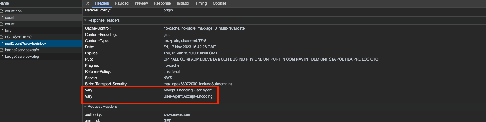

# 16.국제화 

매일 수십억의 사람들이 각자의 언어로 문서를 작성한다 HTTP는 여러 문자로 된 국제 문서들의 처리 및 전송을 지원해야 한다.

해당 챕터에서는 인코등과 언어 태그에 대해서 다루게 된다.

- HTTP가 어떻게 여러 언어 문자들의 체계 및 표준과 상호작용하는지 설명한다.
- HTTP 프로그래머가 올바르게 업무를 수행하는데 도움이 되는 전문용어, 기술, 표준의 개요를 제공한다.
- 언어를 위한 표준 명명 체계와, 어떻게 표준화된 언어 태그가 선택한 콘텐츠를 서술하는지에 대해 설명한다.
- 국제화된 URI의 규칙과 주의사항을 개괄적으로 서술한다
- 날짜와 그 외 다른 국제화 이슈에 대해 간단희 논의한다.

---

## 국제적인 콘텐츠를 다루기 위해 필요한 HTTP 지원

HTTP는 어떠한 언어로된 콘텐츠, 이미지, 동영상 혹은 다른 종류의 미디어처럼 실어 나를 수 있다. 

표현 본문은 단순하게 비트들로 가득찬 상자에 불과하다.

국제콘텐츠를 지원하기 위해서는 서버가 클라이언트에게 각 문서의 문자와 언어를 알려줘, 클라이언트가
올바르게 문서를 이루고 있는 비트들을 문자들로 풀어내고 올바르게 사용자에게 콘텐츠를 제공해줄 수 있도록 할 필요가 있다.

따라서 서버는 클라이언트에게 문서의 문자와 언어를 HTTP Content-Type charset 매개변수와 Content-Language헤더를 통해 알려준다.

```http request
Accept-Language: fr, en; q=0.8
Accept-Charset: iso-8859-1, utf-8
```

위는 프랑스어에 q=1.0(default), 영어에는 q=0.8을 주어 프랑스어를 선호하지만 피치 못할 경우에는 영어도 사용한다는 의미가 된다.

---


## 문자집합과 HTTP

### Charset은 글자를 비트롷 변환하는 인코딩이다.

HTTP Charset은 어떻게 콘텐츠 비트들을 특정 문자 체계의 글자들로 바꾸는지 말해준다. 각 Charset태그는
비트드을 글자들로 변환하거나 혹은 그 반대의 일을 해주는 알고리즘을 명명한다. 

Charset은 등록된 Mime 문자 집합에 표준화되어 있고, IANA가 과ㅓㄴ리한다.

```http request
// 콘텐츠가 HTML임을 알려주고 charset을 통해 iso-8859-6 아랍 문자로 디코딩 하는 기법을 사용하라고 알려준다.
Content-Type: text/html; charset=iso-8859-6
```

---

### 문자집합과 인코딩은 어떻게 동작하는가

- 문서를 이루는 비트들은 특정 코딩된 문자집합의 특정 문자로 식별될 수 있는 문자코드로 변환한다. 
- 문자 코드는 코딩된 문자집합의 특정 요소를 선택하기 위해 사용된다. 특정 단어를 특정 값을 통해 결정한다.

국제화된 문자 시스템의 핵시 ㅁ목표는 표현에서 의미를 분리하는 것이다. HTTP는 문자 데이터 및 그와 관련된 어어와
charset 라벨의 전송에만 관심을 갖는다. 따라서 글자의 모양을 어떻게 표현할 것인가 하는것은 사용자의 그래픽 디스플레이
소프트웨어가 결정한다.

--- 

### 잘못된 charset은 잘못된 글자들을 낳는다.

만약 클라이언트가 잘못된 charset 매개변수를 사용하게 된다면 클라이언트는 깨진 글자를 보여주게 된다.
charset은 문자 코드를 이루는 특정요소를 특정한 값을 통해 선택하게 되는데 잘못된 charset 을 사용하게 되면 A를
원하지만 FEH와 같은 잘못된 문자를 보여주게 될것이다.

---

### 표준화된 MIME chaeset 값

특정 문자 인코딩과 특정 코딩된 문자집합의 결합을 MIME charset이라고 부른다.<br>
HTTP는 표준화된 MIME charset 태그를 Content-Type과 Accept-Charset 헤더에 사용한다.

MIME Charset의 값은 IANA에 등록되어 있다.

목록은 P.432에 있다. 보통은 utf-8을 가장 많이 사용하기도 한다.

---

### Content-Type charset 헤더와 META 태그 

웹서버는 클라이언트에게 MIME Charset 태그를 charset 매개변수와 함께 Content-Type 헤더에 담아 보낸다.

HTML META태그에 명시된 Charset 을 통해 문자집합을 어떻게 설정하였는지 보여준다. 만약
클라이언트가 문자 인코딩을 추측하짐 못했다면, iso-8859-1 인 것으로 가정한다.

---

### Accept-Charset 헤더 

세상에는 수천가지의 정의된 문자 인코딩, 디코딩 방법이 존재한다. 다만 클라이언트 모든 종류의 문자코딩과 매핑시스템을
지원하지는 않는다.

HTTP 클라이언트는 서버에게 정확히 어떤 문자 체계를 클라이언트에서 지원하지는지 서버에게 Accept-Charset 요청 헤더를 통해 알려준다.

`Accept-Charset`은 클라이언트가 지원하는 문자 체계를 제공한다.

```http request
Accept-Charset: iso-8859-1, utf-8
```

---

16.3은 건너뛰었습니다.

---

## 언어 태그와 HTTP 

언어 태그는 언어에 이름을 붙이기 위한 짧고 표준화된 문자열이다. 탄생 배경은 사람마다 각 언어를 사용하는 표기법이 다르다.
따라서 표준화된 언어 태그는 이러한 혼란을 방지하는데 도움을 준다.

다양한 언어 태그가 존재한다. 미국영어를 표현하는 `en-US`, 포르투갈어 `pt-BR`등등과 같이 표준화 할 수 있따.

---

### Content-Language 헤더 

Content-Language 헤더 필드는 엔티티가 어떤 언어사용자를 대상으로 하고있는지 서술한다. 만약 프랑스 사용자를 대상으로 하고있다면
Content-Language 헤더는 다음과 같이 표기된다

```http request
Content-Language: fr
Content-Language: fr, en
```

해당 헤더는 텍스트 문서만을 위한것이 아니다. 오디오 클립, 동영상 , 애플리케이션도 특정 언어 사용자를 대상으로 할 수 있ㄷ4ㅏ.

특정 사용자를 대상으로 하는 미디어라도 해당 헤더를 가질 수 있다. 

또한 Content-Language 헤더는 여러 언어를 나열하에 명세에 제안된 바와 같이 표기할 수 있다.

---

### Accept-Language 헤더 

HTTP는 우리에게 우리의 언어 제약과 선호도를 웹 서버에 전달할 수 있게 해준다. 
해당 헤더를 통해 서버에게 어떤 언어로 된 컨텐츠를 선호하는지 보낼 수 있다.

---

## 국제화된 URI

오늘날의 URI는 국제화를 지원하지 않는다. 오늘날의 URI 는 US-ASCII부분집합으로 구성되어 있다
URL에 더 풍부한 문자집합을 포함할 수 있게 하려는 노력이 진행중에 있지만, 현재 표준은 널리 받아들여지지도,
사용되지도 않고 있다.


### 국제적 가독성 vs 의미있는 문자들

URI 설계자들은 모두가 다양한 정보를 다른이들과 공유할 수 있기를 원했고, 쉽고 기억하기 쉽길 바랬었다 
따라서 URI에 들어가고 조작하고 공유하기 쉽게 하기위해 제한된 공통 문자집합을 선택하게 되었다. 

해당 문자집합은 모든 소프트웨어와 키보드에서 지원된다. 다만 문자 집합에 제한이 있기 때문에 모두가 잘 사용하지는 못했다.

그래서 URI저자들은 리소스 식별자의 가독성과 공유 가능성의 보장이 대부분의 의미있는 문자로 구성될 수 있도록 하는 것보다 중요하다고 여겼다
그래서 오늘날 ASCII문자들의 제한된 집합으로 이루어진 URI를 갖게 되었다.

---

### URI 에서 사용될 수 있는 문자들

URI에서 사용할 수 있는 문자들의 부분집합은 예약된 문자들, 예약되지 않은 문자들, 이스케이프 문자로 나뉜다.
예약되지 않은 문자는 그것들을 허용하는 URI의 어떤 구성요소에서든 일반적으로 사용될 수 있다. 예약된 문자들은 
URI에서 특별한 의미를 가지기 때문에 일반적으로 는 사용될 수 없다. 

---

### 이스케이핑과 역이스케이핑 

URI 이스케이프는 예약된 문자나 다른 지원하지 않는글자들을 안전하게 URI에 삽입할 수 있는 방법을 제공한다.

이스케이프는 퍼센트글자하나와 뒤이은 16진수 글자 둘로 이루어진 세글자 문자열이다. 16진수 두 글자는 US-ASCII 문자의 코드를 나타낸다.

예를들면 스페이스의 경우 ASCII 코드 32번이다. 따라서 해당 값을 이스케이프로 변경하게 된다면 `%20`으로 표현 가능하다.
이유는 32를 16진수로 표현하게 되면 20이기 때문이다.

실제 개발시 주의해야할 사항은 필요할때만 언이스케이핑 해야하며 더 중요한 것은 두번이상 언이스케이핑 하지 않도록 해야한다. 
중복된 언이스케이프는 이스케이프 자체가 일부철머 처리되어 데이터의 손실을 유발할 수 있기 때문이다.

---

# 17. 내용 협상과 트랜스코딩

## 내용 협상 기법

서버에 있는 페이지들 중 어떤것이 클라이언트에게 맞는지 판단하는 세가지 방법은

1. 클라이언트 주도
   > 클라이언트가 요청을 보내면 서버가 클라이언트에게 선택지를 보내주고 클라이언트가 선택한다. 이 방식은<br> 
   > 서버 입장에서 구현하기 쉽고 클라이언트가 최적의 선택을 할 수 있다, 다만 대기시간이 증가한다, 올바른 콘텐츠를 얻기위해서는 최소 두번의 요청이 필요하다
2. 서버 주도
   > 서버가 클라이언트의 요청 헤덜르 검증하여 어떤 버전을 제공할지 결정한다. 클라이언트 주도 협상보다 빠르며 가장 적절한 것을 선택할 수있도록 q값 <br>
   > 메커니즘을 ㅅ제공하고, 어떻게 평가되는지 말해줄 수 있도록 하기 위해 Vary 헤더를 제공한다.<br>
   > 만약 결정이 뻔하지 않으면 서버는 추측을 해야만 한다
3. 투명 (중개자에게 선택)
   > 주로 프락시 캐시가 서버를 대신하여 협상을 한다. 장점은 웹서버가 협상을 할 필요가 없으며 클라이언트 주도보다 빠르다. <br>
   > 단점으로는 투명 협상을 어떻게 하는지에 대한 정형화된 명세가 없다는 것이다.
   
---

## 클라이언트 주도 협상 

서버에게 있어서 가장 쉬운 방법은 클라이언트의 요청을 받았을때 가능한 페이지의 목록을 응답으로 돌려주어 클라이언트가
보고 싶은 것을 선택하게 하는것이다. 

가장 구현하기 쉽고 최선의 사본이 선택될 것이다.(충분한 정보를 포함한 목록이 제공되었다면)

단점으로는 각 페이지에 두번의 요청이 필요하다는 것이다. 목록을 얻는데 한번, 선택한 사본을 얻는데 두번 진행하게 된다.

----

## 서버 주도 협상

클라이언트 주도 협상은 몇가지 단점이 있따 단점들의 대부분ㅇ느 요청에 대한 응답을 돌려줄 결정을 하기위해
클라이언트와 서버사이의 커뮤니케이션을 증가시킨다. 이러한 커뮤니케이션 숫자를 줄이는 방법은 서버가 어떤 페이지를 돌려줄 것인지 결정하는 것이다.

그러나 이렇게 하기 위해서는 클라이언트는 반드시 자신의 무엇을 선호하는지에 대한 충분한 정보를 서버에게 주어 서버가
현명한 결정을 할 수 있게 해주어야 한다. 

다음 정보를 서버는 헤더에서 얻는다.

메커니즘은 다음과 같다.

1. 내용 협상 헤더들을 살펴본다음 서버는 클라이언트의 Accept 관련 헤더들을 들여다 보고 알맞은 응답 헤더를 준비한다.
2. 내용 협상 헤더 외의 다른 헤더들을 살펴보고 User-Agent 헤더에 기반하여 응답을 보내줄 수 있다.

### 내용 협상 헤더 

내용 협상 헤더들은 Accept, Accept-Language, Accept-Charset, Accept-Encoding 등이 있다.

- `Accept` : 서버가 어떤 미디어 타입으로 보내도 되는지 알려준다.
- `Accept-Language` : 서버가 어떤 언어로 보내도 되는지 알려준다.
- `Accept-Charset` : 서버가 어떤 Charset으로 보내도 되는지 알려준다.
- `Accept-Encoding`: 서버가 어떤 인코딩으로 보내도 되는지 알려준다.

해당 헤더들은 표현 헤더들과 비슷하다 그러나 이 두종류의 헤더는 서로 차이가 있다.  

표현 헤더는 메시지를 서버에서 클라이언트로 전송할 때 필요한 메시지 본문을 가리킨다. 
하지만 내용 협상 헤더들은 클라이언트와 서버가 선호 정보를 서로 교환하고 문서들의 여러 버전 중 하나를 선택하는 것을
도와 클라이언트의 선호에 가장 잘맞는 문서를 제공해주기 위한 목적으로 사용된다.

- `Accept` == `Content-Type`
- `Accept-Language` == `Content-Language`
- `Accept-Charset` == `Content-Type`
- `Accept-Encoding` == `Content-Encoding`

HTTP는 상태가 없는 프로토콜이기 때문에 클라이언트는 자신의 선호 정보를 반드시 매 요청마다 보내야한다.

만약 어떤 두 클라이언트가 동시에 자신이 이해할 수 있는 언어를 지정한다음 서버에게 Accept-Language헤더 정보를 보낸다면 서버는 어떤 사본을
각 클라이언트에게 돌려줘야 할지 판단 할 수 있다.

이러한 서버가 선택하는 방식은 클라이언트 주도 모델에 비해 수차례 ㅇ고가는 커뮤니케이션 대기시간을 줄여주기 때문에
좀 더 효율적이다.

---

### 내용 협상 헤더의 품질 값

HTTP프로토콜은 각 선호 카테고리마다 여러 선택 가능한 항목을 선호도와 함께 나타낼 수 있게 품질값을 정의하였다.

Accept-Language에는 이전에 나왔던 헤더들과 같이 q 값을 통해 선호도를 지정할 수 있다.

`Accept-Language: en;q=0.5 fr;q=0.0` 와 같이 사용할 수 있다.

---

### 그 외의 헤더들에 의해 결정

서버는 또한 User-Agent와 같은 클라이언트의 다른 요청 헤더들을 이용해 알맞은 요청을 만들어 내려고 시도할 수 있다.
오래된 버전의 웹브라우저는 자바스크립트가 동작하지 않는다는것을 안다면 해당 자바스크립트를 포함하지 않은 페이지를 돌려 줄 수 있다.

Vary 헤더는 캐시에게 서버가 내줄 응답의 최선의 버전을 결정하기 위해 어떤 요청헤더를 참고하고 있는지 말해준다.




---

### 아파치의 내용 협상

아파치 웹 서버가 내용 협상을 지원하는 방법은 콘텐츠의 제공자에게 달려있다.
만약 색인 페이지를 여러가지 버전으로 제공해주려고한다면 제공자가 각각의 버전에 해당하는 파일들을 
아파치 서버의 적절한 디렉터리에 모두 넣어주어야 한다. 

그런 뒤 다음 둘중 하나의 방법으로 내용 협상을 동작 시킬 수 있다.

- 웹 사이트 디렉터리에서 베리언트를 갖는 웹사이트의 각 URi를 위한 type-map 파일을 만든다. 그다 type-map 파일은모든 배리언트와 그들 각각에 대응하는 내용 협상 헤더들을 나열한다.
- 아파치가 그 디렉터리에 대해 자동으로 type-map 파일을 생성하도록 하는 MultiView 지시어를 켠다.

상세 내용은 정리하지 않았습니다.

---

### Vary 헤더 

Vary응답 헤더는 서버가 문서를 선택하거나 커스텀 콘텐츠를 생성할 때 고려한 클라이언트 요청 헤더 모두를 나열한다.
만약 제공된 문서가 User-Agent 헤더에 의존한다면 Vary 헤더는 반드시 User-Agent를 포함해야 한다.

만약 새로운 요청이 도착해서 캐시를 사용한다고 가정하고 새로운 캐시를 찾아야 한다면 캐시된 응답 안에 서버가 보낸 Vary 헤더가 있는지 확인 한후 
헤더가 존재한다면 명시되어있는 헤더들은 새요청과 오래된 캐시된 요청에서 해당 값이 서로 맞아야 한다.
