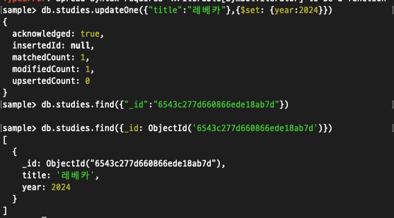

# 몽고DB 기본 

---

## 도큐먼트

몽고DB의 핵심은 정렬된 키와 연결된 값의 집합으로 이뤄진 `도큐먼트`이다.<br>
언어마다 다르지만 `도큐먼트`는 대부분 맵, 해시, 딕셔너리와 같이 도큐먼트를 자연스럽게 표현하는 자료구조를 가진다.

도큐먼트의 키는 문자열로 이루어져 있지만 다음 몇가지 예를 제외하면 어떤 UTF-8문자든 쓸 수 있다.

- 키는 \0(null 문자)를 포함하지 않는다. \0은 키의 끝을 나타내는데 사용한다.
- .과 $문자는 몇가지 특별한 속성을 가지며 특정 상황에서만 사용해야 한다. 따라서 보통 예약어로 취급된다. 부적절하게 사용하면 드라이버에서 경고를 발생한다.


몽고디비는 데이터형과 대소문자를 구분하기때문에 데이터형 또는 대소문자가 다르게 되면 서로 다른 도큐먼트로 인식한다.

---

## 컬렉션

컬렉션은 도큐먼트의 모음, 몽고DB의 도큐먼트는 DB의 행에 대응한다. 도큐먼트는 하나의 row 를 의미한다.

### 동적 스키마

컬렉션은 동적 스미카믈 갖는다. 하나의 컬렉션 내부에 서로 다른 구조의 도큐먼트를 가질 수 있다.

```json
{"name" : "yunjin"}
{"name" : "yunjin" , "age" :  30}
```

위 처럼 도큐먼트의 키, 키의 개수, 데이터형이 모두 다르더라도 같은 컬렉션에 저장할 수 있다.<br>
하지만 실제 운영시에는 서로 다른 컬렉션에 저장하기도 한다.

- 같은 컬렉션에 서로 다른 도큐먼트들을 저장하게 되면 개발자와 관리자 입장에서 번거러옴이 생긴다.
- 한 컬렉션 내에서 특정 데이터형 별로 쿼리작성하여 목록을 뽑는것보다 컬렉션별로 목록을 뽑는것이 훨씬 빠르다.
- 같은 종류의 데이터를 하나의 컬렉션에 모아두면 지역성에 좋다. 조회 탐색 시간이 빨라진다.
- 인덱스를 만드려면 도큐먼트는 특정 구조를 가져야 한다. 인덱스는 컬렉션별로 정의하게 된다. 같은 유형의 도큐먼트를 하나의 컬렉션에 넣음으로써 효율적으로 인덱싱 할 수 있다.

---

### 네이밍 

컬렉션은 이름으로 식별되고 어떠한 UTF-8 문자열이든 쓸 수 있지만 다음 몇가지 제약조건이 있다.

- 빈 문자열은 사용할 수 없다.
- \0(null)은 컬렉션의 끝을 나타내기때문에 쓸 수 없다.
- `system.` 으로 시작하는 컬렉션명은 예약어이기때문에 사용 불가능하다.
- 예약어인 `$`를 사용할 수 없다. 시스템에서 생성한 몇개의 컬렉션에서 사용하기 때문이다.

<br>

#### 서브 컬렉션

서브컬렉션의 네임스페이스에 마침표 문자를 사용하면 컬렉션을 체계화 할 수 있다. 예를 들면 (blog.posts)와 같다.<br>
이는 단치 체계화 떄문이며 자식 컬렉션과는 아무런 관계가 없다.<br>

하지만 서브컬렉션은 여러 몽고 DB툴에서 지원하므로 유용하다.
- GridFs에서는 콘텐츠 데이터와 별도로 메타데이터를 저장하는데 서브컬렉션을 사용한다.
- 대부분의 DB드라이버는 간단하게 접근할 수 있도록 문법을 제공한다.

---

## 데이터베이스

몽고 DB의 단일 인스턴스는 여러개의 데이터베이스를 호시팅할 수 있으며 각 데이터베이스를 독립적으로
취급할 수 있다.

하나의 애플리케이션의 데이터를 동일한 데이터베이스에 저장하는것이 좋은 방식이다. 또한 하나의 몽고 DB서버에서 
여러 애플리케이션이나 여러사용자 데이터를 저장할때 유용하다.

데이터 베이스는 컬렉션과 마찬가지로 이름으로 식별한다. 또한 똑같이 UTF-8문자열이든 쓸수 있지만 제약조건도 마찬가지로 있다

- 빈 문자열은 쓸 수 없다.
- 널을 표현하는 키워드 및 몇개의 특수 문자를  사용할 수 없다.
- 대소문자를 구분한다.
- 이름은 최대 64 바이트이다.

추가로 몇몇 데이터베이스 이름은 키워드로 잡혀있어 사용할 수 없다.

### admin
> admin 데이터베이스는 인증과 권한부여 역할을 한다. 일부 관리 작ㅇ버을 하려면 해당 데이터베이스에 대한 접근이 필요하다.


### local
> local 데이터베이스는 단일 서버에 대한 데이터를 저장한다. 복제 셋에서 local은 복제
> 프로세스에 사용된 데이터를 저장한다. local 데이터베이스 자체는 복제되지 않는다.

### config
> 샤딩된 몽고DB 클러스터는 config 데이터베이스를 사용해 각 샤드의 정보를 저장한다.


컬렉션을 저장하는 데이터베이스의 이름을 컬렉션명 앞에 붙이면 올바른 컬렉션명인 네임스페이스를 얻을 수 있다.

네임스페이스의 길이는 최대 120바이트지만 실제로는 100바이트보다 작게 사용하야 한다.

---

## MongoDB 기본 사용법

### 데이터 생성

```spring-mongodb-json
mongodb shell에서는 Javascript 문법 사용 가능

movie = {
  "title" : "레베카",
  "year" : 2023
}

use sample
db.studies.insertOne(movie)

// 생성 결과
{
  acknowledged: true,
  insertedId: ObjectId("6543c062d660866ede18ab7c")
}


```

---

### 데이터 조회 
> 데이터 조회는 `find`, `findOne`을 사용한다. 단일 도큐먼트를 읽기 위해서는 findOne을 사용한다.

```spring-mongodb-json
db.studies.findOne()

// 결과 값
{ _id: ObjectId("6543c277d660866ede18ab7d"), title: '레베카', year: 2023 }
```

---

### 갱신(업데이트)

게시물을 갱신하기위해서는 updateOne을 사용한다. updateOne의 매개변수는 최소 2개를 사용한다.
첫번째는 변경하고자 하는 도큐먼트를 찾는 기준이고, 두번째는 업데이트 하기위 한 도큐먼트이다.

```spring-mongodb-json

db.studies.updateOne({"title":"레베카"}, ...{$set: {year:2024}})

db.studies.find({_id: ObjectId('6543c277d660866ede18ab7d')})
```



--- 

### 삭제
`deleteOne`과 `deleteMany`를 사용하여 도큐먼트를 데이터베이스에 삭제한다.
```spring-mongodb-json
db.studies.deleteOne({_id: ObjectId('6543c277d660866ede18ab7d')})
```


---

## 데이터형

### 기본 데이터형

몽고 DB는 자바스크립트의 객체와 개념적으로 닮았다. JSON과 비슷하여 다양한 데이터 타입을 지원하지만 데이터베이스와 연동할 떄는 몇가지가 더 있다.

몽고 DB는 JSON 키/값 성질을 유지하면서 추가적인 데이터형을 지원한다.

지원하는 타입은 아래와 같다.

- null
- 불리언
- 숫자 : NumberInt(4바이트), NumberLong(8바이트)
- 문자열
- 날짜 : 64비트 정수로 날짜를 저장한다
- 정규표현식 : 자바스크립트의 정규식 지원
- 배열
- 내장 도큐먼트
- 객체 ID : 도큐먼트용 12바이트 ID이다.
- 이진 데이터
- 코드 : 쿼리와 도큐먼트는 임의의 자바스크립트 코드를 포함할 수 있다.

위 데이터타입 외에도 다양한 데이터형을 지원한다.

---

### 날짜 

자바스크립트의 Date클래스는 몽고DB의 날짜를 표현하는데도 사용된다. 새로운 객체를 생성할 때는
Date()가 아닌 new Date()를 호출하여야 한다. 

만약 new Date()가 아닌 Date()를 사용하면 객체가 아닌 날짜의 문자열을 반환한다. 따라서 주의해서 사용하지 않고
혼용하게 되면 문자열과 날짜가 뒤범벅왼다. 문자열 날짜와, 날짜 객체가 서로 일치하지 않게 되면
삭제, 수정쿼리등에서 문제를 발생시킬 수 있다.

---