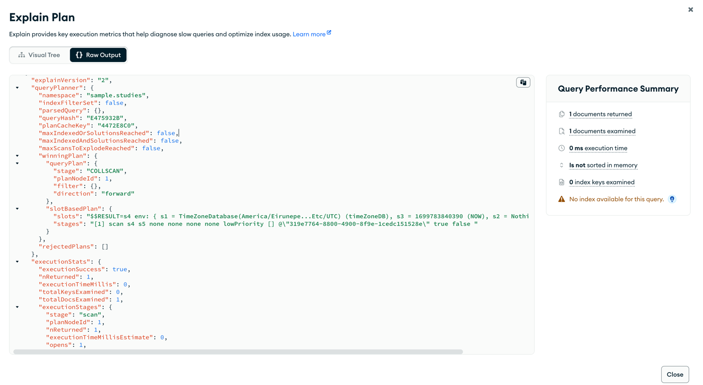

# 인덱싱 

---

## 인덱싱이란 .

인덱스는 전체 내용을 살펴보는 대신 지름길을 통해 특정 내용을 가리키는 정렬된 리스트를 확인한다. 따라서 많은양의
데이터가 있어도 빠르게 쿼리할 수 있다.

인덱스를 사용하지 않는 쿼리를 컬렉션 스캔이라고 하며, 서버가 쿼리 결과를 찾으려면 전체 내용을 살펴봐야 함을 의미한다.
따라서 큰 컬렉션을 스캔할 경우 매우 느려진다.

인덱스를 확인하기 위해서는 `explain` 키워드를 사용하여 확인할 수 있으며 `executionStats`모드를 이용하여 쿼리의 효과를
이해하는 도움을 준다.

`totalDocsExamined` - 몽고 DB가 쿼리를 실행하면서 살펴본 도큐먼트의 갯수를 의미한다. 
`millis`필드는 쿼리하는데 걸린 시간을 밀리초 단위로 보여준다. 
`executionStats.nReturned`필드는 반환받은 결과의 개수를 보여준다.

nReturned의 경우 만약 고유하지 않은 경우 해당 검색값이 고유한지 알 수 없기 때문에 일치하는 값을
찾기위해 컬렉션 내 모든 도큐먼트를 살펴봐야한다.

몽고DB가 쿼리에 효율적으로 응답하게 하려면 모든 쿼리 패턴에 인덱스를 사용해야 한다.

---

### 인덱스 생성 

인덱스를 만들기 위해서는 createIndex 컬렉션 메서드를 사용하면 된다.

인덱스르 만드는데는 컬렉션 사이즈가 크지 않는이상 몇초면 충분하며 만약 시간이 지나도 생성되지 않았다면 
`db.currentOp()`를 실햏ㅇ하거나 mongod의 로그를 통해 인덱스의 진행률을 체크할 수 있다.

하지만 인덱스의 단점이 있다면 인덱싱된 필드를 변경하는 쓰기작업은 오래걸린다. 왜냐하면 이미 잡혀있는 인덱스에서
변경이 진행되면 다시한번 도큐먼트뿐만 아니라 모든 인덱스를 갱싱해야하기 때문이다,. 따라서 어떤 필드가
인덱싱하기에 적합한지 신중해야 한다.

---

### 복합 인덱스 소개 

인덱스는 효율적으로 쿼리하기 위한 목적으로 사용되며 상당수의 쿼리 패턴은 두개 이상의 키를 기반으로 인덱스를 작성해야 한다.

인덱스는 모든 값을 정렬된 순서로 보관하기때문에 인덱스 키로 도큐먼트를 정렬하는 작업이 훨씨 빨라지게 한다.

다만 앞부분에 인덱스가 놓일 때만 정렬에 도움이 된다. 

쿼리에서 정렬 방향이 여러개이거나 검색 조건에 여러개의 키가 있을때 복합 인덱스가 유용하다. 
