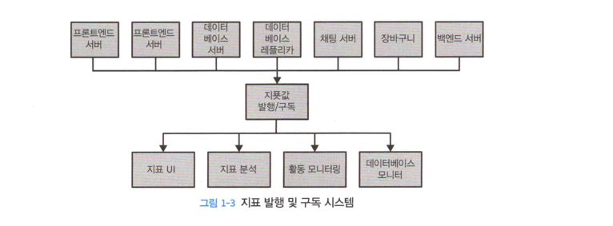
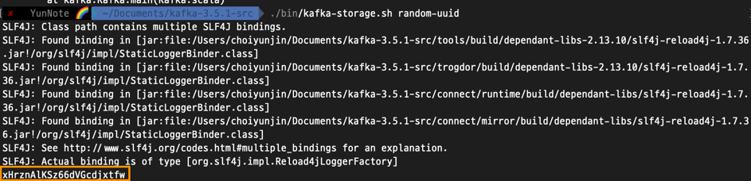
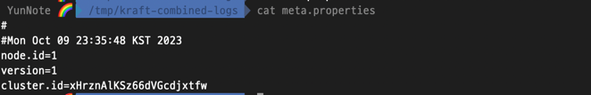

# 1. 카프카 시작하기

---

## 발행/구독 메시지 전달
> 발행/구독 메시지 전달 패턴의 특징은 전송자가 데이터를 보낼 때 직접 수신자로 보내지 않는다는 것이다. <br>
> 대신 전송자는 어떤 형태로든 메시지를 분류해서 보내고, 수신자는 이렇게 분류된 메시지를 수신하게 된다.
> 
> 발행/구독 시스템에는 대게 발행된 메시지를 전달받고 중계해주는 중간 지점 역할을 하는 브로커가 있다.


---

### 초기의 발행/구독 시스템

발행/구독 패턴은 초기에는 데이터가 필요한 하나의 서버에 데이터를 전송하여 하나의 애플리케이션 서버에서 해당 데이터를 기준으로
동작하게 만들었다. 하지만 시간이 지나면서 서비스는 커지게 되고 다양한 목적으로 데이트럴 활용하는 많은 애플리케이션들이
추가될 수 있다. 결과적으로는 아래 이미지 처럼 구성하게 된다.


딱봐도 해당 방식은 개선할 필요가 있다고 보여진다.

다음과 같은 방법을 해결하기 위해 나온것이 해당 값을 관리하는 하나의 애플리케이션 서버를 제공하고, 해당 애플리케이션 서버로
값들이 필요로하는 어떤 시스템이든 질의를 할 수 있도록 해주는 것이다.




---

### 개별 메시지 큐 시스템 

위에 나온 구조 외에도 `로그 메시지에 대한 발행/구독`, `사용자 추적 발행/구독`에 대한 내용이 추가 되어야 한다면
아래와 같은 시스템 구성이 나오게 된다.


위 사진을 보면 비지니스가 확장됨에 따라 `지표값 발행/구독`, `로그 메시지 발행/구독`, `사용자 추적 발행/구독`와 같이 
발행/구독 서버가 늘어나면서 관리포인트가 늘어나게 되고, 데이터를 전달하기 위해 중복코드가 발생하며, 버그가 발생하게 된다면
다수의 큐에 대한 시스템 관리가 이뤄져야 한다.

이러한 문제를 해결하기 위해서는 중앙에서 데이터의 발행/구독을 처리하는 중앙 집중화된 시스템이 필요 하게 된다.

---

## 카프카 

> 카프카는 위에서 나온 문제를 해결하기 위해 고안된 발행/구독 시스템이다.<br>
> 카프카는 `분산 커밋 로그` or `분산 스트리밍 플랫폼` 이라고도 불린다.<br>
> 
> 카프카는 파일시스템이나 데이터베이스 처럼 모든 트랜잭션 기록을 지속성있게 보존함으로써 일관성있게 복구할 수 있도록 보관하며, 확장시
> 성능을 향상시키고 실패가 발생하더라도 데이터 사용에는 문제가 없도록 시스템 안에서 분산시켜 저장할 수 있다


### 메시지와 배치

카프카에서 데이터의 기본 단위는 `메시지`이다. 우리가 흔하게 사용하는 데이터베이스의 `row` or `레코드`와 비슷하다고 볼 수 있다.

`메시지` 
 - 단순히 바이트의 배열이기 때문에 특정한 형식이나 의미가 없다.

`키`
 - 메타 데이터를 포함할 수 있다. 키역시 특별한 의미가 없는 단순한 바이트의 배열이다.
 - 메시지를 저장할 파티션을 결정하기 위해 사용된다. 간단한 방법으로는 키 값에서 해시값을 생성한 뒤 이 값을 토픽의 파티션 수로 나눴을떄 나오는 나머지 값에 해당하는 파티션에 메시지를 저장하게 된다. 이러면 같은 키값을 갖는 메시지들은 파티션의 갯수가 변경되지 않는한 항상 같은 파티션에 저장된다.

카프카는 효율성을 위해 메시지를 `배치` 단위로 저장한다. 
배치는 그냥 같은 토픽의 파티션에 쓰여지는 메시지들의 집합일 뿐이다. 

메시지를 쓸때마다 네트워크 신호가 오가는 것은 막대한 오버헤드를 발생하게 된다. 따라서 메시지를 배치 단위로 모아서
쓰면 오버헤드를 줄일 수 있다. 

물론 이것은 지연과 처리량사이에 트레이드 오프를 발생시킨다. 이말은 즉 배치 크기가 커질수록 시간당
처리되는 메시지의 수는 늘어나겠지만, 메시지가 전달되는데 걸리는 시간은 늘어나게 된다.

배치는 이러한 경우때문에 더 효율적인 데이터 전송과 저장을 위해 약간의 처리능력을 들여서 압축되는 경우가 많다.

---


### 스키마

카프카는 단순한 바이트 배열일 뿐이지만 전달하는 내용을 이해하기 쉽도록 일정훈 구조를 부여하는 것이 권장된다. 이것을 스키마라고 한다.

각 애플리케이션의 필요에 따라 사용 가능한 스키마가 여러가지가 있다. `JSON`, `XML` 이 기본적으로 많이 사용되나 해당 방식들은
버전간의 호환성 유지 기능이 떨어진다.

많은 카프카 개발자들은 아파치 `에이브로(Avro)` 를 선호한다. 

- 조밀한 직렬화 형식을 제공한다.
- 메시지 보넻와 스키마를 분리하기 때문에 스키마가 변경되더라도 코드를 생성할 필요가 없다.
- 강력한 데이터 타이핑과 스키마 변경에 따른 상위 호환성, 하위호환성을 지원한다.

카프카는 일관적인 데이터 형식이 중요하다. 이유는 메시지쓰기와 읽기 작업을 분리할 수 있도록 해주기 때문이다.
만약 해당 작업들이 결합되어있다면 메시지를 구독하는 애플리케이션들먼저 구버전과, 신버전 형식을 동시에
함께 지원할 수 있도록 업데이트 되어야 하며, 그다음에 메시지를 발행하는 애플리케이션이 신버전 형식을
사용하도록 업데이트 될 수 있을것이다.

잘 정의된 스키마를 공유 저장소에 등록함으로써 카프카는 구,신 버전을 동시에 지원하도록 하는 작업 없이도 메시지를 처리할 수 있다.

---

### 토픽과 파티션 

`토픽` 이란 저장되는 메시지를 의미하며 `토픽` 단위로 분류된다. 

`토픽`은 우리가 가장 많이 알고 있는 데이터베이스의 테이블이나, 파일 시스템의 폴더와 비슷하다.

토픽은 다시 여러개의 파티션으로 나뉘어 진다. 커밋로그의 관점에서는 파티션은 하나의 로그에 해당한다. 파티션에 메시지가 쓰여질 때는 
추가만 가능한 형태로 쓰여지며, 읽을 떄는 맨 앞부터 제일 끝까지의, 순서로 읽힌다.  

다만 토픽에 여러개의 파티션이 있는 만큼 토픽 안의 메시지 전체에 대해 순서는 보장되자 않으며, 단일 파티션 내부에서 만 순서가 보장된다.

파티션의 장점은 카프카 `데이터 중복`과 `확장성`을 제공하는 것이다.

`확장성` - 각 파티션이 서로 다른 서버에 저장될 수 있어 하나의 토픽이 여러개의 서버로 수평적으로 확장되어 하나의 서버의 용량을 넘어가는 
성능을 보여줄 수 있다.

`데이터 중복` - 파티션이 복제될 수 있어 다른 서버들이 동일한 파티션의 복제본을 저장하고 있어. 서버중 하나에 장애가 발생하더라도
읽거나 쓸 수 없는 상황이 벌어지지 않는다.


카프카와 같은 시스템을 사용하면 스트림이라는 용어가 등장하게 된다, 스트림은 파티션의 갯수와 상관없이 하나의 토픽에 저장된
데이터로 간주되며, 프로듀서로부터 컨슈머로의 하나의 데이터 흐름을 나타낸다.

---

## 프로듀서와 컨슈머

카프카에는 기본적으로 `프로듀서`와 `컨슈머` 두 종류가 있다. 프로듀서와 컨슈머릴 기본 요소로 사용하며 좀 더 고차원적인 기능을 제공하는
`카프카 커넥트 API` 와 `카프카 스트림`도 있다.

---

### 프로듀서
> 프로듀서는 새로운 메시지를 생성합니다. 다른 시스템에서는 `발행자` or `작성자`라고도 부르기도 한다.<br>
> 메시지는 특별한 토픽에 쓰여지며 기본적으로 프로듀서는 메시지를 쓸 때 토픽에 속한 파티션 사이에 고르게 나눠쓰도록 되어 있다.<br>
> 하지만 항상 나눠쓰는것이 아니라 특별한경우에는 특정한 파티션을 지정해서 쓰기도 한다.<br>
> 바로 `키`를 이용하면 해당 `키`의 해시를 특정 파티션으로 대응시켜주는 `파티셔너`를 사용하여 구현하게 되면 동일한 키를 가진
> 메시지들은 같은 파티션에 저장하게 된다.

---

### 컨슈머
> 컨슈머는 메시지를 읽는다. 다른 시스템에서는 `구독자` or `독자`라고 부르기도 한다<br>
> 컨슈머는 1개 이상의 토픽을 구독해서 저장된 메시지들을 각 파티션에 쓰여진 순서대로 읽어온다.<br>
> 메시지는 오프셋을 기록함으로써 어느 메시지까지 읽었는지를 유지한다.

`오프셋` - 오프셋은 지속적으로 증가하는 정수값이며, 메시지를 저장할 때 메시지에 부여하는 메타데이터이다. 
뒤에 오는 오프셋값은 앞선 메시지보다 큰 오프셋을 갖는다. 이와같은 오프셋을 기반으로 컨슈머가 작업을 멈췄다가 다시 시작하더라도
마지막으로 읽었던 메시지의 바로 다음부터 읽을 수 있다.

`컨슈머 그룹` - 컨슈머는 `컨슈머그룹`의 일원으로 동작한다. 컨슈머 그룹은 토픽에 저장된 데이터를 읽어오기 위해 하나 이상의 컨슈머로 이뤄져 있다.
`컨슈머 그룹`은 각 파티션이 하나의 컨슈머에 의해서만 읽는다. 컨슈머와 파티션의 대응관계는 소유권이라고도 부른다.

해당 방식을 사용함으로써 대량의 메시지를 갖는 토픽들을 읽기 위해 컨슈머들을 수평 확장할 수 있고, 컨슈머 그룹중 특정
컨슈머가 장애가 발생하더로다, 다른 컨슈머들이 장애가 발생한 컨슈머가 읽고 있던 파티션을 재할당 받아 이어서 작업한다.

---

## 브로커와 클러스터

### 브로커 
> 하나의 카프카 서버를 `브로커`라고 부른다. <br>
> 프로듀서로부터 메시지를 전달받아 오프셋을 할당한다음 저장소에 쓴다. <br>
> 브로커는 컨슈머의 파티션 읽기 요청을 처리하고 발행된 메시지를 보낸다. 하드웨어의 성능에 따라 다르겠지만 브로커는
> 초당 수천 개의 파티션과 수백만 개의 메시지를 쉽게 처리한다.

브로커는 `클러스터`의 일부로서 작동하도록 설계되었다. 하나의 클러스터에는 여러개의 브로커가 포함될 수 있고,
그중하나의 브로커가 클러스터 컨트롤러의 역할을 한다. (클러스터 컨트롤러는 포함된 브로커중 하나가 자동으로 선정된다.)

`컨트롤러`는 파티션을 브로커에 할당해주거나 장애가 발생한 브로커를 모니터링 해주는 등의 관리 기능들을 담당한다.
파티션은 클러스터 안의 브로커 중 하나가 담당하며 해당 브로커를 `파티션 리더`라고 부른다. 또한 복제된 파티션이
여러 브로커에 할당될 수 있는데 이것들은 `팔로워`라고 부른다. 

`복제` - 복제 기능은 메시지를 각 파티션에 중복 저장함으로써 리더 브로커가 장애가 발생하더라도 팔로워중 하나가 리더 역할을 이어받을 수 있다.
 또한, 데이터가 중복 저장되어있기 때문에 프로듀서들은 리더 브로커에게 메시지를 발행해야하지만. 읽어들이는
컨슈머들은 리더나 팔로워중 하나로부터 데이터를 읽어와도 된다.

`보존` - 브로커는 토픽에 대해서 기본적인 보존 설정이 되어있다. 특정 기간동안 해당 메시지들을 저장해주거나, 파티션의 크기가
일정 크기에 도달할때까지 데이터를 보존하며, 한도값에 도달하면 메시지는 만료하여 삭제하게 된다. 

해당 설정을 통해 사용 가능한 최소한의데이터 양을 정의한다. 설정은 각각의 토픽에 메시지가 필요한 정도까지만 저장되도록 설정을 잡아줄 수 있다.

---

## 다중 클러스터 

다중클러스터를 운용하게되면 `데이터 유형별 분리`, `보안 요구사항을 축족시키기 위한 격리` , `재해복구를 대비한 다중 데이터센터` 와 같은 
장점이 있다. 

다중 클로스터를 활용한다면 해당 메시지를 클러스터에 복제해 줄 필요가 있다. 카프카는 데이터를 다른 클러스터로
복제하는데 사용되는 `미러메이커`라는 툴을 포함한다.

`미러 메이커` 또한 근본적으로는 큐로 연결된 카프카 컨슈머와 프로듀서에 불과하다. 

---

## 왜 카프카를 쓸까 ?

### 다중 프로듀서
> 카프카는 여러 프로듀서를 처리할 수 있다. 클라이언트가 여러 토픽을 사용하던, 하나를 사용하던 상관없다.
> 
> 이러한 이유로 데이터를 수집하고 일관성을 유지하는데 적격이다. 다수의 마이크로서비스를 통해 사용자에게 공통의 형식으로 제공할때
> 컨슈머 애플리케이션은 여러개의 토픽에서 데이터를 읽을 필요 없이, 하나의 뷰 스트림만 읽어오면 된다.


### 다중 컨슈머

> 다중 프로듀서와 함께 컨슈머는 상호 간섭 없이 메시지 스트림을 일도록 설계되었으며, 해당 내용이 다른 큐 시스템과의 차이점이기도 하다.
> 
> 카프카 컨슈머는 컨슈머그룹의 일원으로 작동함으로써 하나의 스트림을 여럿이서 나눠 읽을 수 있다. 따라서 메시지는 컨슈머 그룹에 대해 한번만 처리된다.


### 디스크 기반 보존

> 카프카는 메시지를 지속성 있게 저장할 수도 있다. 이말은 항상 실시간으로 데이터를 읽어올 필요는 없다는것이기도 하다.
> 
> 카프카에서 메시지는 디스크에 쓰여진뒤 설정된 보존 규칙과 함께 저장된다. 해당 보존 규칙은 토픽별로 설정이 가능하여 
> 서로 다른 메시지 스트림이 컨슈머에 필요에 따라 다른 기간동안 보존되기도 한다. 따라서 컨슈머가
> 느린 처리 속도 혹은 트래픽 폭주로 인해서 뒤쳐저도 유실의 위험은 없다. 
> 
> 이러한 장점때문에 컨슈머가 내려가도라도 다시 시작되면 작업을 멈춘 지점에서부터 유실 없이 데이터를 처리할 수 있다.

### 확장성
> 카프카는 유연한 확장성을 가지고 있어 어떠한 크기의 데이터도 쉽게 처리 가능하다.
> 
> 처음에는 하나의 브로커로 시작, 3개의 브로커가 하나로 구성된 클러스터 구성, 마지막에는 데이터 증가에 따라 수십개에서 수백개의 브로커로
> 구성된 대규모 클러스터로 이뤄진 환경으로 작업하면 된다. 
> 
> 카프카 클러스트는 동작중에도 전체 가용성에 영향을 주지않으면서 확장이 가능하다. 이말은 개별 브로커의 장애를 
> 처리하면서도 지속적으로 클라이언트이ㅡ 요청을 처리할 수 있따는것을 의미한다. 


### 고성능 
> 아파치 카프카가 고부하에서도 높은 성능을 보여주는 이유는 위와같은 장점들 때문이다. 
> 
> 발행된 메시지가 1초도 안걸리면서도 프로듀서, 컨슈머, 브로커 모두가 매우 큰 메시지 스트림을 쉽게 다룰 수 있도록 수평적으로 확장될수 있다는 점이다.

### 플랫폼 기능
> 카프카 코어 프로젝트에는 개발자들이 자주 하는 작업을 쉽게 할 수 있도록 지원하는 플랫폼 기능이 추가 되었다.
> 
> 이 기능들은 탄탄한 기반과 자유로운 형태로 실행할 수 있는 유연성을 갖춘 API 라이브러리의 형태로 사용이 가능하도록 제공된다.
> 
> `카프카 커넥트`는 시스템으로부터 데이터를 가져오거나 데이터를 싱크 시스템으로 내보내는 작업을 도와준다.(9장)
> 
> `카프카 스트림즈`는 가변성과, 내고장성을 갖춘 스트림 처리 애플리케이션을 쉽게 개발할 수 있게 해준다. 상세한 설명은 뒤에서 다룬다 (14장)

---

# 2장 카프카 설치하기 (Mac Brew기준 설치)

카프카를 설치하기 위해서는 선행해야 하는 작업이 있으며 다음과 같다.

- Java 설치
  > 카프카와 주키퍼는 모든 OpenJDK기반 자바 규현체위에서 원활히 작동한다.

- 주키퍼 설치하기 
  > 아파치 카프카는 카프카 클러스터의 메타데이터와 컨슈머 클라이언트에 대한정보를 저장하기 위해 주키퍼를 사용한다.<br>
  > 주키퍼는 설정 정보, 이름 부여, 분산 동기화, 그룹 서비스를 제공하는 중앙화된 서비스이다.


추가적인 설명으로 카프카 4.0 부터는 주키퍼를 제거한다고 한다. 주키퍼를 제거 한 후 KRaft(Apache Kafka Raft)로 대체 된다고 한다. (2.8 이상 부터는 설정으로 선택적 제공)

주키퍼를 제거하는 이유는 주키퍼 자체의 문제가 아닌 카프카의 외부에서 메타데이터를 관리하는 컨셉자체가 문제되었다고 한다.

또한 두개의 시스템을 사용해야 한다는것이 운영의 복잡성을 증가, 학습에 드는시간 증가,  잘못된 구성으로 인한 보안 침해를 일으킬 확률이 높다.

출처 - https://velog.io/@joyfulbean/Apache-Kafka-Zookeeper-%EC%A0%9C%EA%B1%B0-%EC%9D%B4%EC%9C%A0

---

## 카프카 설치

[카프카 공식 사이트](https://kafka.apache.org/downloads) 에서 최신 버전 다운받았습니다.

```shell
(Kafka)[https://kafka.apache.org/downloads] Kafka 공식 사이트에서 
2023.10.09 기준 3.5.1 다운로드 

다운로드 후 

# 압축해제
$ wget https://downloads.apache.org/kafka/3.5.1/kafka-3.5.1-src.tgz
$ tar -xzf kafka-3.5.1-src.tgz
$ ./gradlew jar -PscalaVersion=2.13.10 ## 스칼라 프로젝트 빌드
 
```

Kafka를 실행하기전 Zookeeper에 대해 먼저 설명한다.


`Zookeeper`는 고가용성을 보장하기 위해 `앙상블`이라는 클러스터 단위로 동작하도록 설계 되었다. 주키퍼가 사용 하는
부하분산 알고리즘 때문에 앙상블은 홀수 개의 서버를 가지는것이 권장된다.

주키퍼가 요청에 응답하기 위해서는 앙상블 멤버의 과반 이상이 동작해야 한다. 3개로 구성한다면 1대가 정상적이지 않더라도 
문제 없이 동작한다는 내용이다.

앙상블을 설정하기 위해서는 다음과 같은 설정이 되어야 한다.
 - 각 서버는 공통된 설정 파일으 가져야 한다. 해당설정에는 앙상블에 포함된 서버의 목록이 포함되어있다.
 - 각 서버의 dataDir에는 자신의 ID번호를 지정하는 myid파일을 가지고 있어야 한다.

3대의 주키퍼로 구성되는 앙상블 설정은 다음과 같을 수 있다.
```shell
tickTime=2000
dataDir=/var/lib/zookeeper
clientPort=2181
initLimit=20  # 팔로워가 리더와 연결할 수 있는 최대 시간 (초기화 제한 시간)  
syncLimit=5 # 팔로워가 리더와 연결할 수 있는 최대 시간 (동기화 제한 시간)
server.1=zoo1.example.com:2888:3888
server.2=zoo2.example.com:2888:3888
server.3=zoo3.example.com:2888:3888
```

`initLimit`, `syncLimit` 은 tickTime 단위로 정의된다.<br> 
`initLimit`의 경우 20 * 2000ms = 40000ms(40초)가 된다

앙상블의 서버 목록은 다음과 같은 규칙을 갖는다

server.{X}={hostname}:{peerPort}:{leaderPort} 

X : 서버의 ID, 정숫값이어야 하지만, 0부터 시작할 필요 없으며, 순차적일 필요도 없다.<br>
hostname : 서버의 호스트명 or IP 주소 <br>
peerPort: 앙상블 안의 서버들이 서로 통신할때 사용하는 포트 <br>
leaderPort: 리더를 선출하는데 사용되는 TCP 포트 번호

클라리언트는 clientPort에 지정된 포트번호로 앙상블에 연결할수만 있으면 된다.
> clientPort는 ./config/zookeeper.properties에 정의되어 있다.

하지만 앙상블은 세 포인트를 모두 사용해서 통신할 수 있어야 한다.

----

## 브로커 설정하기

> ./config/server.properties 에 정의된 속성들로본다.

### `broker.id`

모든 카프카 브로커들은 정수값 식별자를 갖는다. 정수값은 broker.id로 설정 가능하다.
기본값은 0이며, 어떠한 값도 될 수 있다. 다만 주의해야할 점은 브로커별로 해당 정수값이 달라야 한다.

임의의 값으로 선택할 수 있으며 브로커간 이동도 가능하지만 호스트별로 고정된 값을 사용하는것이 강하게 권장된다.

---

### `listeners`
listeners 속성은 Kafka 브로커가 클라이언트로부터 듣고, 연결을 수락할 때 사용하는 네트워크 인터페이스 및 포트를 설정하는 데 사용된다.

예를 들면 

```shell
# 기본설정으로는 주석처리 되어있다.
listeners=PLAINTEXT://localhost:9092

# 콤마를 기준으로 localhost:9092와 localhost:9093을 통해 연결 가능하다.
listeners=PLAINTEXT://localhost:9092,SSL://localhost:9093

listeners=PLAINTEXT://0.0.0.0:9092로 하면 모든 네트워크 인터페이스로부터 연결을 받는다.
```

---

### `zookeeper.connect`

브로커의 메타데이터가 저장되는 Zookeeper의 서버정로를 가리킨다. 로컬호스트의 2181포트로 동작한다면 아래와 같이 설정해주면 된다<br>

```shell
zookeeper.connect=localhost:2181
```

zookeeper.connect설정은 {hostname}:{port}/{path} 로 설정이 된다. <br>
hostname, port의 설명은 생략하고 `path`는 무엇인지 찾아보니 카프카 클러스터의 chroot환경으로 사용될 주키퍼의 경로를 의미한다고 한다.


`chroot`를 설정하면 네임스페이스를 기준으로 제한되는데 사용되며 저장된 데이터의 일부만 사용하도록 제한이 가능하다 예를 들면<br> 
`localhost:2181/app1` 이라고 설정ㅈ하면 /app1 하위에 있는 데이터만 액세스 할 수 있다. 해당 설정을 통해
데이터의 분리와 보안을 관리하는데 도움이 된다.

---

### `log.dirs`

카프카는 모든 메시지를 로그 세그먼트 단위로 묶어서 `log.dirs`에 저장하며 기본값으로는 `log.dirs=/tmp/kafka-logs`로 설정되어 있다.

`log.dirs`가 설정되어있지 않다면 `log.dir`이 사용된다고 한다. `log.dirs`는 쉼표로 구분된 로컬 시스템 경로의 몰곡이며 
1개 이상의 경로가 지정되었을경우 가장 적은수의 파티션이 저장된 디렉토리에 저장한다.

다만 사용된 디스크 용량이 아닌 파티션의 수 기준으로 새로운 파티션을 저장하기 때문에 다수의 디렉토리에 대해서
균등하게 데이터가 저장되지는 않는다.

---

### `num.recovery.threads.per.data.dir`

카프카는 설정 가능한 스레드풀을 사용하여 로그 세그먼트를 관리한다. 스레드 풀은 다음 작업들을 수행한다

- 브로커가 정상시작되었을때 각 파티션의 로그세그먼트 파일을 연다 
- 브로커가 장애 발생 후 다시 시작되었을때 로그 세그먼트를 검사하고 잘못된 부분은 삭제한다.
- 브로커가 종료할떄 로그 세그먼트를 정상적으로 닫는다.


기본적으로 하나의 로그 디렉토리에 하나의 스레드가 사용이 된다. 작업을 병렬화 하기위해서는 많은 스레드를 할당해주는것이
좋다.

해당 설정을 어떻게 잡아주는지에 따라 복구를 위한 재시작 시간이 차이가 난다. 

num.recovery.threads.per.data.dir = 3이고 log.dirs에 지정된 경로수가 2개라면 전체 스레드수는 6개가 된다.
(1개의 dir 당 3개의 스레드를 할당)

---

### `auto.create.topics.enable`

해당 옵션은 브로커가 자동으로 생성하도록 할지 boolean값으로 관리한다. 해다 옵션은 다음과 같은 상황에서 자동으로 생성하도록 되어 있따.

- 프로듀서가 토픽에 메시지를 쓰기 시작할 때
- 컨슈머가 토픽으로부터 메시지를 읽기 시작할때
- 클라이언트가 토픽에 대한 메타데이터를 요청할 때

자동으로 토픽을 생성해주기 때문에 어떻게 보면 좋아보이겠지만, 바람직하지 못한 경우가 많다. 
카프카는 토픽을 생성하지 않고 존재 여부를 확인할 방법이 없다, 따라서 토픽생성을 명시적으로 관리하고자 하는 경우에는
해당 옵션을 false로 설정하여 관리한다.

---

### `auto.leader.rebalance.enable`

해당 설정은 모든 토픽의 리더 역할이 하나의 브로커에 집중됨으로써 클러스터의 균형이 꺠지는 수가 있다. 해당 설정을 활성화해주면
가능한 한 리더 역할이 균등하게 분산되도록하게 하여 해당 문제를 방지한다.  해당 설정을 키면 파티션의 분포 상타를 주기적으로
확인하는 백그라운드 스레드가 시작된다.

해당 리밸런싱의 주기는 leader.imbalance.check.interval.seconds값으로 설정이 가능하다. 

만약 파티션중 특정 브로커에 리더역할이 할당된 파티션의 비율이 leader.imbalance.per.broker.percentage에 설정된 값을 넘어가도 선호리더 리밸런싱이 발생한다.

---

### `delete.topic.enable`

환경과 데이터 보존가이드에 따라 토픽을 임의로 삭제하지 못하게 막아야 하는 경우가 있다. 그럴때 해당
옵션을 false로 설정하면 토픽의 삭제를 막을 수 있다.

---


## 토픽별 기본값
> 카프카 브로커 설정은 새로 생성되는 토픽에 적용되는 설정의 기본값도 저장한다. 
> 
> 매개변수중 몇개를 이용하여 토픽 단위로 설정도 가능하다.


### `num.partitions`

해당 옵션 값은 토픽이 생성될때 몇개의 파티션을 갖게되는지 설정한다. 자동 토픽생성기능이 활성화 되어있을때 사용되며,
기본값은 1이다.

주의해야할점은 토픽의 파티션갯수는 늘릴 수있지 줄일수는 없다.

브로커가 추가될때 클러스터 전체에 걸쳐 메시지 부하가 고르게 분산되도록 파티션 개수를 잡는것은 중요하다. 

많은 사용자대부분 토픽당 파티션의 개수를 클러스터 내 브로커의 수와 맞추가나 배수로 설정정한다. 그러면 브로커들 사이에서
골고루 분산된다. 

파티션의 갯수를 결정하기 위해서는 여러가지를 고려해야 한다

 - 처리량은 어느정도인지
 - 디스크 공간, 네트워크 대역폭도 고려
 - 과대 추산을 피하고, 데이터를 미러링할예정인지

위와 같이 여러항목에 대해서 고려해야 최적의 처리량이 나온다.

---

### `default.replication.factor`

해당 옵션은 자동 토픽 생성 기능이 활성화 되어있는 경우 토픽의 복제 팩터를 결정한다. 쉽게 보면 
각 파티션에 대한 복제수를 의미한다.

해당 값은 `min.insync.replicas`설정값보다 최소 1이상 크게 잡는것을 권장한다. 만약 충분한 하드웨어를 사용하여
큰 서비스를 운용중이라면 `min.insync.replicas`보다 2이상 크게 잡는것을 권장한다.

무조건 크게잡으면 좋지 않을까? 라는 생각을 할 수 있지만 무작정 높이면 데이터를 동기화시키는데 오히려
시간이 더걸려 처리에 지연이 발생할 수 있으며, 클러스터의 용량에도 영향을 미칠 수 있다.

---

### `log.retention.ms`

해당 옵션은 카프카가 얼마나 메시지를 보존해야 하는지를 지정할 때 가장 많이 사용되는 설정하는 보존 주기 설정이다.

기본 설정으로는 `log.retention.hours=168`로 되어있으 168 시간을 의미하기 때문에 1주일을 의미한다.

`log.retention.hours`외에도 `log.retention.minutes`, `log.retention.ms`를 사용할 수도 있다.

세설정 모두 메시지의 보존 시간을 의미하지만 kafka에서는 `log.retention.ms`를 사용하는것을 권장한다고 한다.

> 중요. 
해당 설정이 복수로 정의되었을 경우 더 작은 단위의 설정값이 우선권을 갖기때문이다 따라서 `log.retention.ms`는 언제나 적용된다.

---

### `log.retention.bytes`

메시지의 만료시간이 있다면 보존되는 메시지의 용량에 대한 설정도 있다. 해당 값은 `#log.retention.bytes=1073741824`로 되어있으나

기본적으로 주석처리 되어있다. 기본은 1기가로 잡혀있으며 만약 8개의 파티션을 갖는 토픽이라면 최대 저장 용량은
8기가가 된다. 

모든 보존 시간은 파티션안위로 동작하는것이지 토픽 단위로 동작하는것은 아니다. 

만약 -1로 설정한다면 데이터가 영구히 보존되게 된다.

> 그러면 `log.retention.ms`, `log.retention.bytes`를 같이 설정하면 어떻게 될까 .
> Kafka에서는 둘중 하나의 조건만 맞더라도 메시지가 삭제된다. 따라서 둘중 하나만 설정할 것을 권장한다.

---

### `log.segment.bytes`

앞서 나온 2가지 설정은 로그 세그먼트에 적용되는 것이지. 메시지 각각에 적용되는것은 아니다. 

카프카 브로커에 쓰여진 메시지는 파티션의 현재 로그세그먼트의 마지막에 추가된다. 로그 세그먼트의 크기가 `log.segment.bytes`에 다다르면
브로커는 기존로그 세그먼트를 닫고 새로운 세그먼트를 연다. 만료되기전까지는 세그먼트는 삭제의 대상이 되지는 않는다.

크기가 작을수록 더 자주 닫고 새로 세그먼트를 생성한다. 그만큼 효율이 감소된다.

ex) 로그세그먼트가 꽉차는데 10일이 걸리고, `log.retention.bytes=1073741824` 일 경우 비록 
메시지 삭제 보존이 1주일이지만, 세그먼트가 꽉차지 않아 삭제 대상이 되지 않아 로그가 꽉차고난 후 1주일뒤에 삭제 된다( 총 17일 )

---

### `log.roll.ms`

로그 세그먼트가 닫힐떄까지 기다리는 시간을 지정한다 앞선 2개의 설정과 동일하게 크기던 제한이든 도달하게 되면
로그 세그먼트를 단는다.

---

### `min.insync.replicas`

해당 속성은 레플리카가 최신상태로 프로듀서와 동기화되도록 할 수 있다. 

해당 속성값을 정수값으로 설정하면 해당 값만큼 레플리카를 최신상태로 동기화 한다.

해당 설정을 추가하면 다음과 같은 상황에서 데이터 유실을 방지한다

1. 리더가 쓰기 작업으 응답한다
2. 리더에 장애가 발생한다
3. 리더 역할이 최근의 쓰기 작업 내역을 복제하기 전의 다른 레플리카로 옮겨진다.

만약 이런 설정이 되지 않았을 경우 프로듀서는 쓰기 작업이 성공했다고 착각하지만 실제로는 유실되는
상황이 발생할 수 있는 것이다.

그렇다고 해당 값을 높게잡아 유실을 방지하려고 한다면 추가적인 오버헤드가 발생하면서 성능이 떨어지는 부작용이 발생한다.

특별한 경우가 아닌이상 1로 잡는것을 권장한다.

---

### `message.max.bytes`

해당 옵션은 카프카 브로카가 쓸수 있는 최대 메시지의 크기를 제한한다. 기본값은 1MB로 설정되며, 해당 값보다 더 큰 메시지를 보내려고 한다면
메시지를 거부하고 에러를 반환한다. 다만 해당 메시지는 압축된 메시지 값이 기준이기 때문에 압축전 기준으로 해당 값보다 커도 압축한
메시지의 크기가 1MB보다 작다면 보낼 수 있다.

해당 크기는 가장 적합하게 조절하는 것이 좋다.

만약 허용 가능한 크기를 증가시킨다면, 네트워크 연결과 요청을 처리하는 작업시간도 증가하고, 디스크에
써야하는 크기역시 증가, I/O 처리량에 영향을 미친다.

---


# 하드웨어 선택하기 
> 카프카는 특정한 하드웨어 구성을 요구하지 않으며 대부분 문제없이 동작하지만, 성능을 골혀한다면 전체적인 성능에
> 영향을 미칠 수 있는 요소들이 있다.
> 
> 1. 처리량과 용량
> 2. 네트워크, CPU

카프카를 크게 확장할 경우 업데이트 되어야 하는 메타데이터양 때문에 처리할 수 있는 파티션의 수에도 제한이 생길 수 있다.

---

## 디스크 처리량

로그 세그먼트를 저장하는 브로커 디스크의 처리량은 프로듀서 클라이언트의 성능에 가장 큰영향을 미친다. 

디스크 쓰기 속도가 빨라진다는것은 곧 쓰기 지연이 줄어든다는 의미이다.

SSD, HDD를 사용할 수 있으며 SSD가 속도가 빠르지만 HDD 를 쓰더라도 드라이브 기술과 드라이브 컨트롤러를 활용햐 처리량을 향상시킬 수 있따.

따라서 수많은 클라이언트의 데이터를 받아내야하는 경우에는 SSD가 더 좋은 옵션이 되며, 자주 쓸일이 없는 데이터를 많이
저장해야하는 경우 HDD가 더 낫다.

---

## 디스크 용량

많은 메시지가 쌓인다면 디스크 용량또한 환경 구성시 고려해야할 요소중 하나이다.

클러스터에 들어오는 트래픽은 다수의 파티션을 잡아줌으로써 전체적으로 균형있게 분산이 가능하다.
그렇기 때문에 브로커의 용량이 충분하지 않은 경우 브로커를 추가해줌으로써 전체 용량을 증가시킬 수 있다.

---

## 메모리 

카프카 컨슈머는 데이터를 맨 끝에서 읽어 오는것이 보통이다.  최적의 동작은 캐시에 저장되어 있는
메시지들을 컨슈머가 읽어오는것이 된다.

시스템 페이지에 캐시로 사용할 수 있는 메모리를 더 할당해줌으로써 컨슈머 클라이언트 성능을 향상시킬 수 있다.

추가로 카프카는 다른 애플리케이션과 함께 운영하는것을 권장하지 않는다. 

---

## 네트워크

네트워크 대역폭은 카프카가 처리할 수 있는 트래픽의 최대량을 결정한다. 해당 내용은 디스크 용량과
함께 클러스터의 크기를 결정하는 결정적인 요인이다.

카프카는 다수의 컨슈머를 동시에 지원하게 되면 인입되는 네트워크 샤용량과 유출되는 네트워크 사용량 사이에서
불균형이 일어나 작업이 밀리거나 취약한 상태로 빠진다. 따라서 최소한 10GB이상을 처리할 수 있는
네트워크 인터페이스 카드 사용하는것을 권장한다.

---

## 브로커 개수
카프카의 적절한 크기를 결정하는 요소에는 여러가지가 있다.
1. 디스크 용량
2. 브로커당 레플리카 용량
3. CPU 용량
4. 네트워크 용량 

가장 먼저 고려할 점은 메시지를 저장하는데 필요한 용량과 단일 브로커가 사용할 수 있는 저장소 용량이다.

만약 클러스터가 10TB를 저장해야하고 하나의 클로스터가 2TB를 저장할 수 있따면 클러스터의 최대 개수는 5개가 된다.

여기서 복제 팩터까지 하는 경우 저장 용량이 최소 100%이상 증가하게 되고 이말은 즉 복제 팩터를 2로 잡는다면 
최소한 10대의 브로커가 필요하다는 것이다.

또한 처리 가능한 요청의 양도 고려해야한다.

---

## Zookeeper를 이용한 Kafka 실행

기본적으로 Kafka를 실행시키기 위해서는 Zookeeper 서버가 떠있어야 한다. 다음 명령어를 통해 Zookeeper와 Kafka 서버를 실행 시킬 수 있다.

```shell
# 주키퍼 서버 실행
./bin/zookeeper-server-start.sh ./config/zookeeper.properties  

# Kafka 서버 실행 
./bin/kafka-server-start.sh ./config/server.properties 

# Producer 실행 
./bin/kafka-console-producer.sh --topic test --bootstrap-server localhost:9092

# Consumer 실행
./bin/kafka-console-consumer.sh --topic test --from-beginning --bootstrap-server localhost:9092 
```

---


카프카 4버전 이후 부터는 Zookeeper가 제거되기 때문에 Kraft를 이용하여 실행 할 수 있다.

## Kraft를 이용한 Kafka 실행
```shell
Kraft를 이용하여 Kafka를 구동시키기 위해서는 초기 설정이 필요하다.

log.dirs='{로그 쌓을 경로}' 를 지정해준다 .
# 기본 값은 log.dirs=/tmp/kraft-combined-logs 로 되어있다.

# 아래 이미지에서 보이는 xHrznAlKSz66dVGcdjxtfw << 가 랜덤으로 생성된 UUID입니다.
{kafka 경로}/config/kraft/server-properties 내부에 로그 폴더 포맷에 대한 
Cluster UUID의 생성 및 초기화가 필요.
```



```shell
# 로그 폴더 포맷 
{Kafka 경로}/bin/kafka-storage.sh format -t xHrznAlKSz66dVGcdjxtfw -c 
./config/kraft/server.properties

# log.dirs 로그경로에 들어가 meta.properties 에 접근하면 아래와 같이 cluster.id가 적용되어있다.
```


위와 같이 설정되어 있다면 Kafka 서버를 시작한다
```shell
bin/kafka-server-start.sh config/kraft/server.properties
```

그러면 Zookeeper서버를 실행하지 않아도 Kafka가 실행되는것을 확인할 수 있다.
올라간 Kafka가 정상적으로 동작하는지 확인을 해봐야한다.

```shell
# 테스트를 위해 `test`라는 토픽을 생성 
./bin/kafka-topics.sh --create --topic test --bootstrap-server localhost:9092

# 프로듀서 실행 
./bin/kafka-console-producer.sh --topic test --bootstrap-server localhost:9092

# 컨슈머 실행
./bin/kafka-console-consumer.sh --topic test --from-beginning --bootstrap-server localhost:9092
```


위와 같이 Zookeeper의 실행없이 Kraft를 이용하여 Kafka 구동이 가능하다.


