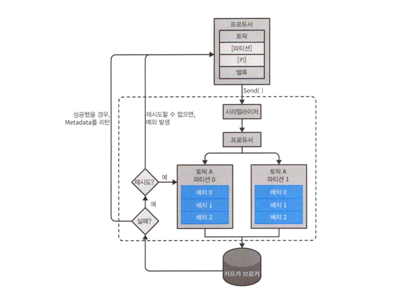
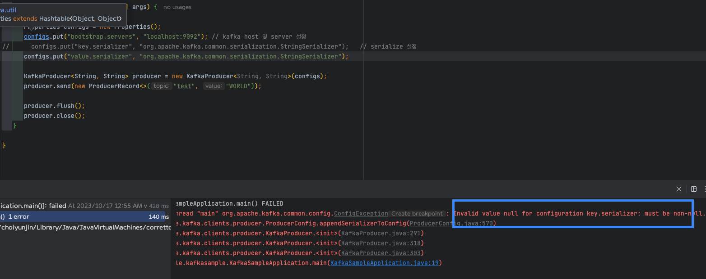
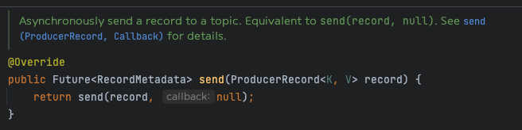
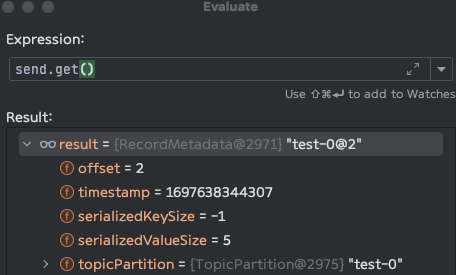
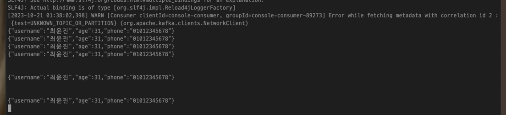
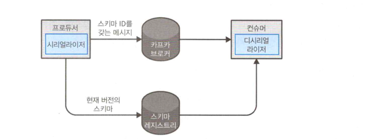

# 3. 카프카 프로듀서: 카프카에 메시지 쓰기

---

## 프로듀서 개요

서로 다른 요구 조건을 필요로 하는 경우 카르카가 메시지를 쓰기 위해 프로듀서 API를 사용하는 방식에 영향을 미치게 된다.

프로듀서 API는 매우 단순하지만, 데이터를 전송할때 내부적으로는 조금 더 많은 작업들이 이루어 진다.

프로듀서 API는 단순하지만 우리가 데이터를 전송할 때 내부적으로는 조금 더 많은 작업들이 이루어진다.



### 1. ProducerRecord 객체를 생성한다.

> 레코드가 저장될 토픽과 벨류를 필수로 지정하며, 파티션과 키는 선택사항이다. ProducerRecord를 전송하는 API를 호출하였을때
> 프로듀서는 키와 값 네트워크를 통해 전송될 수 있도록 직렬화하여 바이트 배열로 변환하는 과정이다.

### 2. 파티셔너에게 데이터를 전송.

> 파티션을 명시적으로 지정하지 않았다면 해당 데이터를 파티셔너에게로 보낸다음 파티셔너를 통해 파티션을 결정한다. 보통
> 파티셔너에서는 ProducerRecord 객체의 키값으로 결정한다.
>
> 파티션이 결정되어 메시지가 전송될 토픽과 파티션이 확정되면 프로듀서는 레코드를 같은 토픽 파티셔너로 전송될 케도드들을 모은
> 레코드 배치에 추가한다.
>
> 그러면 별도의 스레드가 해당 레코드 배치를 적절한 브로커에게 전송한다.

### 3. 브로커에서 메시지 처리

> 브로커가 메시지를 받으면 응답을 돌려줘야 한다.
>
> 성공적으로 저장되었을 경우 토픽, 파티션, 파티션 안에서의 레코드의 오프셋을 담은 RecordMetadata를 리턴한다.
>
>
> 만약 실패하였을 경우에는 에러가 반환되며, 프로듀서가 에러를 수신하였을 경우 몇번더 재시도 한다.

---

## 카프카 프로듀서 생성하기

카프카 메시지를 쓰려면 원하는 속성을 지정하여 프로듀서 객체를 생성해야 한다. 카프카는 해당 아래 3가지의 값을 필수로 갖는다.

### 🔥 bootstrap.servers

카프카 클러스와 첫 연결을 생성하기 위해 사용할 브로커의 host:port 목록을 의미한다.
다만 해당 값에 모든 브로커들이 명시될 필요는 없다. 왜냐하면 첫번째 연결을 생성한뒤 추가 정보를 받아오게
되어있기 때문이다. 다만 브로커중 갑자기 장애가 발생할 수 있기 때문에 프로듀서가 클러스터에 연결할 수 있도록
최소 2개 이상을 지정할것을 권장하긴한다.

### 🔥 key.serializer

카프카에 쓰기 위한 레코드를 직렬하기 위해서 사용하게될 시리얼라이저 클래스의 이름을 지정하기 위해 사용한다.

브로커는 메시지의 키값, 밸류값의 바이트 배열을 전달받는다. 하지만 애플리케이션마다 전송 방법이 다르기 때문에
임의의 애플리케이션에서 객체를 전송할 수 있도록 매개변수화된 타입을 제공하도록 지원한다.

해당 옵션을 사용하면 가독성 높은 코드를 작성할 수 있지만, 프로듀서입장에서는 해당 객체를
어떻게 바이트배열로 변경해야하는지 알아야한다.

`key.serializer` 옵션에는 org.apache.kafka.common.serialization.Serializer인터페이스를
구현하는 클래스의 이름이 지정되어야 한다.

카프카 Client 는 `ByteArraySerializer`, `StringSerializer`, `IntegerSerializer`등등이 포함되어 있어
자주 사용하는 타입을 사용하고 싶은경우 직접구현할 필요없이 있는것읅 가져다 쓰면된다.

### 🔥 value.serializer

카프카에 쓸 레코드의 밸류값을 직렬하기 위한 시리얼라이저 클래스의 이름을 지정한다.

---

## 직접 Producer 구현 및 테스트

#### <i>해당 예제는 Java 기준입니다.</i>

```groovy
// Kafka Gradle 추가
// https://mvnrepository.com/artifact/org.springframework.kafka/spring-kafka
implementation 'org.springframework.kafka:spring-kafka:3.0.11'
```

```java
public static void main(String[]args){

   // 1. Properties 객체 생성 
   // 2. Properties 에 필수 설정 값 세팅  
   Properties configs=new Properties();
   configs.put("bootstrap.servers","localhost:9092"); // kafka host 및 server 설정
   configs.put("key.serializer","org.apache.kafka.common.serialization.StringSerializer");   // serialize 설정
   configs.put("value.serializer","org.apache.kafka.common.serialization.StringSerializer");

   /**
    * bootstrap.servers => AdminClientConfig.BOOTSTRAP_SERVERS_CONFIG
    * key.serializer => ProducerConfig.KEY_SERIALIZER_CLASS_CONFIG
    * value.serializer => ProducerConfig.VALUE_SERIALIZER_CLASS_CONFIG
    * 오타에 취약하기 때문에 2.x부터는 카프카 클래스에 정의된 상수 사용 가능.
    */

   // 3. KafkaProducer 객체 생성시 config 를 전달하여 프로듀서 생성 .
   KafkaProducer<String, String> producer=new KafkaProducer<String, String>(configs);
   producer.send(new ProducerRecord<>("test","WORLD"));

   producer.flush();
   producer.close();
   }
```

만약 필수값을 넣지 않는다면 아래와 같은 에러가 발생




---

## 메시지를 전송하는 방법

### 1. 파이어 앤 포켓

메시지를 전송만하고 성공,실패에 대해서는 신경쓰지 않는다. 대부분의 메시지는 정상적으로 전송되겠지만
재시도를 할 수 없는 에러가 발생하거나 타임아웃이 발생할 경우 메시지가 유실되며, 애플리케이션은 아무런 정보나
예외를 전달 받을 수 없다.

### 2. 동기적 전송

카프카 프로듀서는 언제나 비동기적으로 동작한다. send()를 통해 보내면 Future 객체를 반환한다.

동기적으로 처리하기위해서는 .get()메소드를 호출하여 작업이 완료될때까지 기다려 성공여부를 확인해야한다.



실제 전송 후 .get()을 반환한 데이터를 보면 아래와 같은 결과를 받을 수 있다.



### 3. 비동기적 전송

콜백 함수와 함께 send() 메서드를 호출하면 브로커로부터 응답을 받는 시점에서 자동으로 콜백함수가 실행된다.

---

## 카프카로 메시지 전달하기

1. 메시지를 전송하기 위해서는 먼저 `ProducerRecord`를 만드는 것부터 시작한다.
2. `ProducerRecord`가 생성되었따면 전송하기 위해서 send() 메서드를 사용한다.
3. send()를 사용하면 메시지는 버퍼에 저장되었다가 별도의 스레드에 의해서 브로커로 보내진다. RecordMetadata를 포함한 자바 Future 객체를 반환하지만 리턴값을
   무시하기 때문에 성공 여부를 알 방법은 없다.
   일러한 방법은 누락되어도 상관없는경우에만 사용하라..
4. 메시지를 보내기전에 에러가 발생하는 상황이 있는데.
    1. `SerializationException` - 메시지의 직렬화 실패
    2. `TimeoutException` - 버퍼가 가득 찰 경우
    3. `InterruptException` - 전송 작업을 실행하는 중 스레드에 인터럽트가 걸리는 경우

---

### 동기적으로 메시지 전송하기

동기적으로 메세지를 보내는 법은 단순하며, 브로커가 쓰기 요청에 에러 응답을 하거나, 재전송 횟수가 소진 되었을때 발생하는
예외를 처리할 수 있다.

동기적으로 하였을때 에러가 밸생하는 경우는 대게 성능과 관련이 있다. 카프카 클러스터에 작업이 많이 몰리게 된다면
최소 2ms 에서 최대 몇초까지도 지연이 될 수 있다.

따라서 동기적으로 전송하게 된다면 해당 시간동안 아무것도 하지 않고 기다리게 된다. 성능이 낮아질뿐만 아니라 그시간동안에
아무런 메시지를 전송할 수도 없어 실제 애플리케이션에서는 잘 사용되지는 않는다.

```java
...
   try{
   // 정상 호출 되었을 경우 RecordMetadata 객체를 반환한다.   
   producer.send(producerRecord).get();
   }catch(Exception e){
   // 여기서 처리 ~
   e.printStackTrace();
   }

```

KafkaProducer에서는 두 종류에 에러가있다.

1. 재시도가 가능한 에러
   > 브로커에 문제가 발생하여 다른 파티션에 새 리더가 선출되어 메타데이터가 업데이트 되면 재시도를 통해 해결 가능
2. 재시도가 불가능한 에러
   > 메시지 크기가 너무 클 경우 재시도 없이 바로 예외를 발생시킨다.

---

### 비동기적으로 메시지 전송하기

대략 10ms 가 걸리는 하나의 요청에 대해서 메시지를 전송할때 동기적으로 매번 기다리게 된다면 100개의 요청을 처리하는데는
약 1초정도가 걸리게 된다.

메시지를 전부 전송해놓고 응답을 기다리지 않는다면 100개의 메시지를 전송하더라도 시간이 거의 걸리지 않는다.

카프카를 사용하는 대부분의 경우 굳이 응답을 받아서 처리하는 경우는 없을것 이라고 생각하고, 저 또한 그렇게 사용해왔다.

카프카는 레코드를 쓴뒤 레코드의 토픽, 파티션, 오프셋을 반환하지만 대부분의 애플리케이션은 이 값으로 무엇인가를
하거나 하지는 않았다. 다만 메시지 전송에 완전히 실패하였을 경우에는 내용을 알아야 예외를 발생시키던, 로그를 작성하거나하야
사후 분석을 할 수 있다.

```java
/** 비동기 호출 콜백 */
// 콜백은 항상 실행되며 record 를 통해 값을 볼수도 있다.
producer.send(new ProducerRecord<>("test","WORLD"),(RecordMetadata record,Exception e)->{
   if(e!=null){
   e.printStackTrace();
   }
   });
```

위 코드와 같이 `org.apache.kafka.clients.producer.Callback` 인터페이스를 구현하면 CallBack을 통해 에러를 처리하기 위한 콜백을 지정할 수
있다.

---

## 프로듀서 설장하기

### client.id (ProducerConfig.CLIENT_ID_CONFIG)

> 프로듀서와 애플리케이션을 구분하기 위한 논리적 식별자이며 임의의 식별자를 사용 가능하다.
>
> 브로커는 프로듀서가 보내온 메시지를 구분하기 위해 해당 값으 사용하며, 로그 메시지를 출력하거나, 클라이언트별로
> 사용량을 할당할떄 사용하기도 한다. 또한 문제가 발생하였을때 트러블 슈팅하기가 쉽다 .

### acks (ProducerConfig.ACKS_CONFIG)

> acks는 프로듀서가 임의의 쓰기 작업이 성공했다고 판별하기 위해 얼마나 많은 파티션 레플리카가
> 해당 레코드를 받아야하는지를 결정한다
>
> `acks=0` - 프로듀서는 메시지가 성공적으로 전달되었다고 간주하고 브로커의 응답을 기다리지 않는다. 만약 잘못되어 메시지를 받지
> 못하였을 경우 더이상 알 방법이 없고 메시지는 유실된다, 다만 메시지를 빠르게 보낼 수 있기때문에 많은 처리량이 필요할 떄 사용한다.
>
> `acks=1` - 리더 레플리카가 메시지를 받는 순간 브로커로부터 성공했다는 응답을 받는다. 만약 기존 리더에 문제가
> 발생하였고 새로운 리더가 선출되기 전이라면 프로듀서는 에러응답을 받을 것이고 재시도를 하게 된다. 리더가 끝까지 선출되지 않고
> 크래시 난 상태에서 해당 메세지가 복제가 안된대로 선출된다면 메시지가 유실될 수 있다.
>
> `acks=all` - 모든 인 싱크 레플리카에 전달된 뒤에 브로커로부터 성공했다는 응답을 받을 수 있다. 가장 안전하게 메시지를 전송할 수 있으며
> 크래시가 나더라도 메시지가 유실되지 않는다.

정리해보면 신뢰성을 낮추면 그만큼 처리량이 올라가게 된다.

---

### 메시지 전달 기간

카프카 2.1부터는 ProducerRecord를 보낼때 걸리는 시간을 두 구간으로 나눠 처리할 수 있게 하였다.

1. send()에 대한 호출이 발생한 시작부터 결과를 리턴할때까지 걸리는 시간 : 해당 시간동안 호출한 스레드는 블록된다.
2. send()에 대한 호출이 성공적으로 리턴한 시각부터 콜백이 호출될 때 까지 걸리는 시간 : 전송을 위해 배치에 추가된 시점, 재시도 불가능한 실패 발생, 전송을 위한 할당된
   시간이 소진될 떄까지의 시간과 동일

#### 동기 전송의 경우 연속적으로 블록되기 때문에 각각의 구간이 어느정도 걸렸는지 알 수 없다.

---

### max.block.ms (ProducerConfig.MAX_BLOCK_MS_CONFIG)

> 해당 옵션은 프로듀서가 얼마나 오랫동안 블록되는지를 결정하는 옵션을 제공한다.
> 프로듀서의 버퍼가 가득 차거나 메타데이터가 사용가능하지 않을때 블록된다.
>
> 블록된 상태에서 해당 key에 설정된 값만큼 시간이 흐르면 예외가 발생한다.

---

### delivery.timeout.ms

> 레코드 전송 준비가 완료된 시점 (send()가 리턴되고 레코드가 배치에 저장된 시점)에서부터 브로커의 응답을 받거나
> 전송을 포기하게 되는 시점까지의 제한을 정한다.
>
> 해당 값은 `linger.ms` + `retry.backoff.ms` +`request.timeout.ms`를 합친 시간보다 커야한다.
>
> 해당 값을 조건이 벗어나게 한다면 예외 발생.

---

### request.timeout.ms

> 해당 매개변수는 프로듀서가 데이터를 전송할 때 서버로부터 응답을 받기위해서 얼마나 기다릴것인지를 결정한다. 다만 해당
> 값은 쓰기 요청 후 전송을 포기하기까지 대기하는 시간임을 명시해야 한다. 재시도 시간이나, 실제 전송 이전에 소요되는 시간등을 포함하지는 않는다.

---

### retries, retry.backoff.ms

> retries 는 메시지 전송을 포기하고 에러를 발생시킬 때까지 메시지를 재전송하는 횟수를 지정한다.
>
> 프로듀서는 기본적으로 재시도 사이에 100ms 동안 대기하는데 retry.backoff.ms값을 조절하여 해당 간격을 조절할 수 있다.

다만 현재 해당 시점 버전의 카프카에서는 해당 값들을 변경하는것을 권장하지 않는다. 대신 크래시난 브로커가
정상적으로 돌아오기까지의 시간을 테스트한뒤 delivery.timeout.ms 매개변수값을 잡아주는것을 권장한다.

---

### linger.ms

> 현재 배치를 전송하기 전까지 대기하는 시간을 결정한다. KafkaProducer는 배치가 가득차거나 설정된 제한시간이
> 되었을때 해당 배치를 전송한다.
>
> 기본적으로 메시지 전송이 가능한 스레드가 있는 경우 곧바로 전송되도록 되어있다.
>
> 해당 설정을 잘 활용하면 처리량을 증대 시킬 수 있따. 메시지당 추가적으로 드는시간은 작지만 압축이
> 서렂ㅇ되어 있ㄱ더나 할 경우 효율적이기 떄문이다.

---

### buffer.memory

> 프로듀서가 메시지를 전송하기 전에 메시지를 대기시키는 버퍼의 크기를 결정한다.
>
> 만약 애플리케이션이 메시지를 쓰는 속도가 빠르다면 버퍼 메모리가 가득찰 수 있다. 가득 찬경우 send()는 max.block.ms 동안
> 블록되어 이 버퍼 메모리에 공간이 생길떄 까지 기다리고, 공간이 확보되지 않으면 예외를 발생시킨다.
>
> 다만 주의해야할 점은 send() 메서드에서 해당 예외가 발생하지 Future객체에 발생하지 않는다.

---

### compression.type

> 기본적으로 메시지는 압축되지 않은 상태로 전송되지만 compression.type을 지정하면 메시지를 전송할때 압축 알고리즘을 사용하여 압축한뒤 브로커로 전송한다.
>
> 구글에서만든 Snappy 압축 알고리즘이 성능도 좋으며 좋은 압축률을 보여준다.

---

### batch.size

같은 파티션에 다수의 레코드가 전송되어야 하는경우 프로듀서는 해당 메시지들을 배치 단위로 모아서 한꺼번에 전송한다. 해당 설정은
한번에 전송될 메시지의 양을 의미한다.

해당 `batch.size`의 양은 개수가 아니라 바이트 단위로 지정해야한다.

해당 값을 높게 설정한다고 해서 해당 사이즈가 다 찰때까지 기다리지는 않는다. 따라서 높게 유지한다고 해서
메시지 전송에 지연이 발생하지는 않으나 낮게 설정할 경우 지나친 전송으로 인해 오버헤드가 발생한다.

---

### max.in.flight.requests.per.connection

프로듀서가 서버로부터 응답을 받지 못한상태에서 전송할 수있는 최대 메시지의 수를 결정한다.

해당 값을 올려서 설정하면 메모리 사용량이 증가하지만 그만큼 처리량 역시 증가한다.

대부분 기본값을 사용해도 높은 성능을 보여준다고 한다.

```
카프카는 같은 파티션 내에서 메시지 순서를 보존하게 되어있다.
하지만 해당 옵션과 함께 설명된느 부분이 retries인데 해당 값과 함께 잘못설정하면 순서를 보장하지 못할 수 있다.
예를들면 retries가 0보다 큰 값으로 해놓은 상태에서 해당 옵션은 1이상으로 잡아줄 경우 메시지를 쓰다가 실패한다면 retries값에 따라 재시도 하려고 할것이며 
max.in.flight.requests.per.connection값에 따라 다음 메시지가 성공할 경우 처음 시도된 첫번째
메시지보다 두번째 메시지가 먼저쓰여 순서가 변경되게 된다.

다만 해당 문제에 대해서는 enable.idempotence=true 옵션으로 순서를 보장할 수 있다.
```   

---

### max.request.size

프로듀서가 쓰기 요청의 크기를 결정한다.<br>
최대 메시지 크기를 제한하기도 하지만, 한번의 요청에 보낼 수 있는 메시지의 최대 개수 역시 제한한다.

해당 옵션을 사용할때는 브로커 옵션 `message.max.bytes`와 함께 사용하여 두 매개변수를 맞춰주면 서로 받아들이지
못하는 크기의 메시지를 전송하려 하지 않게된다.

---

### receive.buffer.bytes, send.buffer.bytes

데이터를 읽거나 쓸 때 소켓이 사용하는 TCP 송수신 버퍼의 크기를 결정한다. 해당 값들은 높게 올려잡아주는것이 좋으며.
만약 -1로 설정한다면 운영체제의 기본값을 사용하게 된다.

---

### enable.idempotence

해당 값을 true로 설정한다면 프로듀서가 레코드를 보낼 때 마다 순차적인 번호를 붙여서 보내게 된다.

만약 브로커가 동일한 번호를 가진 레코드를 2개이상 받게된다면 하나만 저장하고 프로듀서는 `DuplicateSequenceException` 을 발생한다.

추가로 해당 값을 활성화 하려면 `max.in.flight.requests.per.connection` 매개변수의 값은 5 이하로, `retries` 값은 1 이상으로. `acks=all` 로 설정해야 한다.
만약 이와 같이 설정하지 않는다면 `ConfigException` 발생 

---

## 시리얼라이저

### 커스텀 시리얼라이저

카프카로 전송해야 하는 객체가 단순 문자열이나 정숫값이 아닐 경우에는 두가지의 선택지가 있을 수 있다.

1. 레코드를 생성하기 위한 직렬화 라이브러리를 사용한다 
2. 객체를 직렬화 하기 위해 커스텀 직렬화 로직을 작성한다.

두가지에 대해 아라는 보겠지만 직렬화 라이브러리를 사용하는것을 추천한다. 이유는 필드가 추가 또는 변경의 경우 호환성유지를 위해 같은 내용을 사용하는
모든 곳에서 동시에 코드를 변경해야 하는 상황이 발생한다. 그래도 구현하면 다음과 같이 사용 가능하다.

아래 예는 직접 작성한 CustomSerializer 샘플입니다.
```java
@Getter
public class User{

   private String username;
   private int age;
   private String phone;

   public User(String username, int age, String phone) {
      this.username = username;
      this.age = age;
      this.phone = phone;
   }
}
```

```java
public class UserCustomSerializer  implements Serializer<User> {

   private final ObjectMapper om = new ObjectMapper();

   @Override
   public byte[] serialize(String topic, User data) {

      // Getter, Setter 를 직접 User.class 내부에 만들어주면 필요 없으나.
      // @Getter를 사용할 경우 해당 옵션이 필요. 해당 옵션을 사용하기 싫다면 User.class의 필드들의
      // 접근제한자를 public 으로 변경해줘야함.
      om.setVisibility(PropertyAccessor.FIELD, Visibility.ANY);

      if(Objects.isNull(data)) {
         return null;
      }

      try {
         return om.writeValueAsBytes(data);
      } catch (JsonProcessingException e) {
         throw new RuntimeException(e);
      }
   }
}
```

```java
Properties configs = new Properties();
configs.put(AdminClientConfig.BOOTSTRAP_SERVERS_CONFIG, "localhost:9092"); // kafka host 및 server 설정
configs.put(ProducerConfig.KEY_SERIALIZER_CLASS_CONFIG, "org.apache.kafka.common.serialization.StringSerializer");   // serialize 설정
configs.put(ProducerConfig.VALUE_SERIALIZER_CLASS_CONFIG, "com.example.kafkasample.UserCustomSerializer");
```



---

### 아파치 에이브로를 사용한 직렬화
> 에이브로는 언어 중립적인데이터 직렬화 형식이다.
> 
> 에이브로 데이터는 언어에 독립적인 스키마의 형태로 기술된다. 보통 JSON 형태로 기술되며, 이진파일 형태로 결과물이
> 나오지만 JSON형태로 뽑는것도 가능하다.

에이브로의 장점중 하나는 애플리케이션에서 새로운 스키마로 전환하더라도 기존 스키마와 호환성을 유지하며, 데이터를
읽는 애플리케이션에서는 변경이나 ㅇ버데이트 없이 계속해서 처리 가능.

변경이 발생하였을때 읽는쪽의 스키마를 전부 변경하지 않고 스키마를 변경하여도 예외나 에러가 크게 발생하지 않는다.
(type null인 필드에 대해서)

###

카프카에서 에이브로 레코드 사용하기.

파일 안에 스키마를 저장함으로써 오버헤드를 감수하는 에이브로 파일과는 달리 카프카 레코드에 전체 스키마를 저장하게 될경우 사이즈는 2배이상이 될 수 있다.
이를 위해 `스키마 레지스트리`라 불리는 아키텍처 패턴을 사용한다.

`스키마 레지스트리`는 카프카의 일부가 아니라서 오픈소스 구현체중 하나를 사용하면 된다.
이제 부터 나오는 설명은 `컨플루언트 스키마 레지스트리`에 대해서 설명한다.

`스키마 레지스트리`의 핵심 아이디어는 모든 스키마는 레지스트리에 저장한다는 것이다.



프로듀서에서는 카프카 스키마의 전체적인 구조를 넘기는것이 아니라, 스키마ID만을 넘기고 컨슈머에서는 해당 스키마ID로 스키마를 가지고와서
데이터를 디시리얼라이저 하여 사용한다.

---

## 파티션 

ProduceRecord를 실제로 사용해보면 알겠지만 해당 객체는 토픽, 키, 벨류의 값을 포함한다. 하지만
키가 null이어도 토픽과, 벨류만 있따면 객체를 생성할 수 있다. (하지마 대부분의 경우 키값이 지정된 레코드를 쓴다.)

키의 역할은 메시지와 함께 저장하는 추가적인 정보이기도 하지만, 어떠한 파티션에 쓸것인자 저장될 파티션을 결정짓는 기준점이기도 하다.

같은 키값을 가진 메시지는 같은 파티션에 저장된다는 내용이다. 

```java
// 키가 있는경우 
new ProducerRecord<>(topic, key, value)

// 키가 없는 경우 파티션중 랜덤하게 저장(접착성 처리를 위해 라운드 로빈 알고리즘으로 저장)
new ProducerRecord<>(topic, value)
```

키값을 가지고 있다면 카프카는 키값을 해시한 결과를 기준으로 메시지를 저장할 파티션을 지정한다. 또한 동일한
키값은 항상 동일한 파티션에 저장되는것이 원칙이다.
(파티션 선택은 동일 토픽에 해당하는 모든 파티션이 해당된다.)

> 기본 파티셔너 외에도 `RoundRobinPartitioner`, `UniformStickyPartitioner`를 사용하면 된다.


기본 파티셔너가 사용될때 특정한 키값에 대응하는 파티션은 파티션의 개수가 변하지 않는한 변하지 않는다. 그래서
특정 파티션들은 데이터를 읽는데 최적화할때 다방면에서 활용된다. 하지만 토픽에 새로운 파티션을 추가하게 되면 더이상 유효하지 않다.

만약 `A`라는 키에대해서 3번 파티션에 저장되었다면 파티션이 추가되는 순간 기존의 데이터들은 3번 파티션에 있겠지만 이후에
추가되는 메시지들은 3번 파티션에 저장되지 않을 가능성이 크다. 

따라서 제일 좋은 방법은.. 충분한 수의 파티션을 가진 토픽을 생성한다음 더이상 파티션을 추가하지 않는것이다.

---

### 커스텀 파티셔너

위에 나온 기본 파티셔너의 경우 해시값을 기준으로 처리되어왔다.
하지만 특정 상황에서는 해시 값이 아닌, 개별 방식으로 할당하고 싶을 경우도 있을것이다.

이러한 경우 사용자가 커스텀파티셔너를 직접 만들어서 사용 할 수 있다.

`org.apache.kafka.clients.producer.Partitioner`를 implements 하여 해당 내용을 구현해주면 된다.

---

## 헤더 

