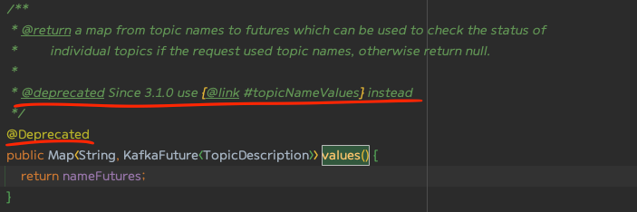
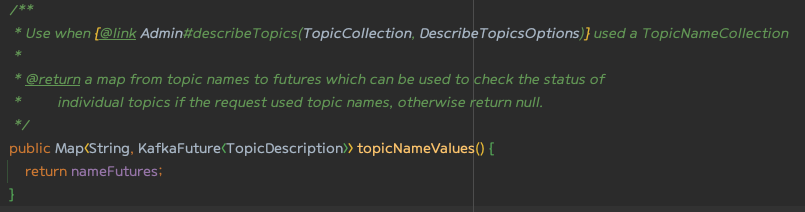
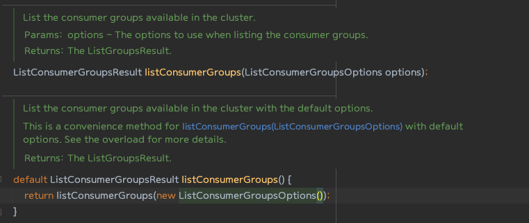

# 5. 프로그램 내에서 카프카 관리하기

Kafka 0.11 이후부터는 프로그램적인 관리기능 API를 관리하기 위한 목적으로 AdminClient가 추가되었다. 

기존 명령줄로 하던 토픽 목록 조회, 생성, 삭제, 클러스터 상세 정보 확인, ACL관리등을 해당 API로도 가능하다.

> 이전에는 토픽을 생성하기전 토픽이 이미 있는지 확인하기 위해 해당 토픽에 send()이후 발생하는 예외를 잡아 토픽을 
> 만들어야 한다는식으로 제공되었으나. 이와같이 API가 나옴으로 인하여 더 나은 해법을 가지게 되었다.

---

## AdminClient 개요 

### 비동기적이고 최종적 일관성을 가지는 API

카프카의 AdminClient에서 가장 중요한점은 비동기적으로 작동한다는 사실이다. 각 메서드는 요청을 클러스터로 전송한뒤
바로 1개 이상의 Future 객체를 리턴한다.

Feature 객체 자체는 비동기 작업의 결과를 가리키며 작업의 결과를 확인하거나, 취소하거나, 완료 될 때까지
대기하거나 작업이 완료되었을 때 실행할 함수를 지정하는 메서드를 가지고있다.

AdminClient.createTopics 메서드는 CreateTopicsResult 객체를 리턴한다. 해당 객체는
모든 토픽이 생성될 때까지 기다리거나, 각각의 토픽 상태를 하나씩 확인하거나, 특정한 토픽이 생성된 뒤 해당
토픽의 설정을 가져올 수 있도록 해 준다.

> .all().get() 호출이 되어야 생성이 된다. 실제 반환 값도 맞음

카프카 컨트롤러부터 브로커로의 메타데이터 전파는 비동기적으로 이루어지기 때문에 AdminClient API 가 리턴하는 Future 객체들은 상태가
완전히 업데이트된 시점에서 완료된것으로 간주한다. 

이시점에서 모든 브로커가 전부 다 새로운 상태에 대해 알고있지는 못할 수 있기 때문에 listTopics 요청은 최신 상태를 전달받지 않은 
브로커에 의해 처리될 수 있다. 이러한 속성을 `최종적 일관성`이라고 한다. 

최종적으로 모든 브로커는 모든 토픽에 대해 알게 될것이지만, 정확히 그게 언제가 될지에 대해서는 아무도 보장도 할 수 없다.

---

### 옵션

AdminClient의 각 메서드는 메서드별로 특정한 Options 객체를 인수로 받는다. 해당 Options들은 어떠한 값을
리턴할지 받을지 등을 정의하게 된다. 공통적으로는 timeoutMs값을 가지고 있다. 해당 값은 TimeoutException을 발생시키기 전 , 클러스터로부터의
응답을 기다리는 시간을 조정한다.

---

### 수평 구조

모든 어드민 작업은 KafkaAdminClient에 구현되어 있는 아파치 카프카 프로토콜을 사용하여 이루어 진다. 여기에서는 
객체간의 의존관계나 네임스페이스가 없어 하나로 다 되있어 무겁다는 논란이 있지만 해당 단점에 비해 구조적으로
작업을 수행하는 방법을 알아야 할 때 필요한 메서드를 하나만 찾아서 쓰기만 해도 된다는 장점이 있다. 

---

> 추가 참고사항으로는 클러스터의 상태를 변경하는 모든 작업은 컨트롤러에 의해 수행되며 상태를 읽기만 하는 작업은 
> 아무 브로커에서 수행될 수 있으며 클라이언트 입장에서 가장 부하가 적은 브로커로 전달된다.

---

### AdminClient 사용법 생성, 설정, 닫기

위와 같이 `AdminClient.create(props);`  정적메서드인 create를 사용하여 설정값을 담고 있는 Properties를 넣어 생성한다. 

AdminClient.create(props)에 전달되는 Properties의 필수 값은 이전 장에 나온 Producer와 Consumer와 다르게 URI만 명시되어 있다면
더 단순하게 생성할 수 있다.

admin 객체를 사용 후 마지막엔 결국 닫아줘야 하는데 이때 close메서드를 호출하게 되며, 호출할 때는 아직 진행 중인 작업이 있을수 있다.
따라서 close메서드에서는 타임아웃 매개변수를 전달받는데. 해당 값을 전달받으면 해당 시간동안에는 다른 메서드를 호출해서
요청을 보낼 수 는 없지만. 해당 시간이 만료될 때까지 응답을 기다린다. 

만약 해당 값없이 close를 호출하게 된다면 얼마가 되었든 모든 진행중인 작업이 완료될 때까지 대기하게 된다는 의미를 갖는다.

---

### client.dns.lookup

> 기본적으로 카프카는 부트스트랩 서버 설정에 포함된 호스트명을 기준으로 연결을 검증하고 해석하고 생성하지만 연결방식에는 2가지 방법이 있다.
> DNS 별칭을 사용할 경우, 2개 이상의 IP주소로 연결되는 하나의 DNS 항목을 사용할 경우가 있다.

---

#### 😃 DNS 별칭을 사용하는 경우

`sample.hostname.com`, `sample1.hostname.com`과 같이 컨벤션을 따르는 브로커들이 있다면 모든 브로커들을 코드에 하나하나
지정하는 것은 관리하기가 쉽지 않다. 따라서 해당하는 모든 브로커들을 가리키는 하나의 DNS별칭을 만들 수 있다.

만약 해당 브로커들을 하나로 묶기 위해 `all_sample.hostname.com`과 같이 사용하다면 매우 편리하겠지만 SASL을 사용하여 인증을
하려고 할 때는 문제가 생긴다. 또한 악의적으로 중간자 공격을 할 수 있기때문에 인증이 거부당할 수 도 있다 

이러한 경우 `client.dns.lookyp=resolve_canonical_bootstrap_servers_only` 설정을 잡아주면 된다. 
해당 설정은 DNS별칭을 펼치는것과 같기 때문에 별칭에 포함된 모든 브로커 일므을 일일이 넣어준것과 동일하게 동작한다.

---

#### 😃 다수의 IP 주소로 연결되는 DNS 이름을 사용하는 경우.

최근에는 프록시나 로드밸랜서 뒤로 모든 브로커들을 숨기는 방식으로 많이 구성한다. 

로드밸런서 또는 프록시가 단일 장애점이 되는걸 보고 싶지 않기 때문에 하나의 DNS에 대해서 여러개의 IP주소로 연겷하게 된다.
이 IP주소들은 시간이 지남에 따라 변경될 수 있고, 카프카 클리이언트는 기본적으로 해석된 첫 번째 호스트명으로 연결을 시도한다.

만약 해석된 IP주소가 불가능 할 경우 멀쩡하게 작동하고 있는데도 클라이언트는 실패할 수 있다는 얘기가 된다. 이러한 떄문에
로드밸런싱 계층의 고가용성을 충분히 활용할 수 있도록 하기 위해 `client.dns.lookup=use_all_dns_ips`를 사용하는 것이 권장된다.

> 해당 옵션 사용시 첫번째 IP에 대해서만 시도하는 것이 아니라 return 되는 모든 IP에 대해 모두 Connect를 시도한다.

참고 - https://blog.voidmainvoid.net/327

---

### request.timeout.ms

해당 옵션값은 AdminClient의 응답을 기다릴 수 있는 시간의 최대값을 정의한다. 해당 시간에는 재시도 가능한 에러를 받고 재시도 하는 시간도 포함된다.

default 값은 120초이며 이전에 나왔던것처럼 각각의 메서드는 Options를 개별로받기 때문에 각자의 타임아웃 시간을 잡아 줄 수 있다.

---

## 필수적인 토픽 관리 기능 

P.130 샘플 돌려봐야함.

코드에 보이는것처럼 listTopics()는 Future 객체를 감싸고 있는 ListTopicsResult를 반환한다. 해당 topics.names().get()를 하게 되면 실행 스레드는
서버가 가지고 있는 이름 집합을 반환할때까지 기다리거나 너무 늦는다면 타임아웃 예외를 발생시킨다. 

이후 내용에는 해당 Topic이 존재하는지 확인 후 만약 존재하지 않는다면 생성하는 코드가 있지만 상세 코드는 생략하겠습니다. 

> 다만 변경된점은 3.1.0 이후부터 DescribeTopicsResult.values()는 제거되며 DescribeTopicsResult.topicNameValues()로 변경되었다. 

#### 3.1.0 이후 

 생성시에는 createTopics()를 사용하며 삭제시에는 deleteTopics()를 사용한다.
 
---

## 설정 관리

설정관리는 ConfigResource 객체를 사용하여 할 수 있다
해당 객체를 사용하면 브로커, 브로커 로그, 토픽등을 설정 가능하다. 

해당  설정들은 주로 kafka-configs.sh 혹은 카프카 관리 툴을 이용하는게 보통이지만 애플리케이션에서 토픽의 설정을 확인하거나 수정하는것도 상당히 흔하다.

만약 코드를 통해 설정값을 변경호가조 한다면 ConfigResource을 키로, 바꾸고자 하는 설정값들을 Value로 하는 Map을 지정한다. 

카프카에서는 코드를 통해 설정을 변경하고자 하는 경우 4가지 형태의 설정 변경이 가능하다 .
1. 설정값을 잡아주는 `SET`
2. 현재 설정값을 삭제하고 기본값으로 되돌리는 `DELETE`
3. `APPEND`, `SUBSTRACT` 는 설정값을 삭제하고 기본값으로 되돌리는 관점에서는 `DELETE`와 같으나 목록 형태의 설정에만 사용이 가능하며 해당 값을 사용한다면 전체 목록을 주고받을 필요 없이 필요한 설정만 추가하거나 삭제가 가능하다.

---

## 컨슈머 그룹 관리 

앞선 내용에서 카프카는 이전 데이터를 읽어서 처리한 것과 완전히 동일한 순서로 데이터를 재처리할 수 있게 해준다는 점이 언급되었다.

AdminClient를 사용하여 프로그램적으로 컨슈머 그룹과 해당 그룹들이 커밋한 오프셋을 조회하고 수정하는 방법에 대해 내용을 정리한다.

---

### 컨슈머 그룹 살펴보기 

`AdminClient.listConsumerGroups().valid().get()` 를 사용하면 컨슈머 그룹의 목록을 조회할 수 있다.
다만 valid().get() 메서드를 호출함으로써 리턴되는 모음은 클러스터가 에러 없이 리턴한 컨슈머 그룹만을 포함하게 된다.

이 경우 에러가 예외의 형태로 발생하지 않기 때문에 `errors()`  메서드를 사용하면 모든 예외를 가져올 수 있다. 

만약 특정 컨슈머 그룹에 대해 자세하게 알고 싶다면 ConsumerGroupDescription 객체를 활용하여 확인 할 수 있다. 
해당 객체에는 그룹 멤버와, 멤버별 식별자와 호스트명, 할당된 파티션, 할당 알고리즘, 그룹 코디네이터의 호스트명등등이 포함된다. 해당 값들을 활용하면
이후 문제가 되었을시 트러블슈팅하는데 유용하지만 가장중요한 커밋된 오프셋 값이 무엇인지, 최신 메시지에서 얼마나 뒤쳐져있는지를 알 수 없다.

P.138 에 있는 예제를 통한다면 각 토픽 파티션에 대해 마지막 메시지의 오프셋을 확인할 수 있다. 

---

### 컨슈머 그룹 수정하기.

AdminClient 는 컨슈머그룹을 조회하는것 뿐만 아니라 수정하는 메서드들 역시 가지고 있다. 
 - 그룹 삭제
 - 멤버 제외
 - 커밋된 오프셋 삭제 혹은 변경등등

해당 메서드들은 SER가 비상 상황에서 임기 응변으로 복구하기 위한 툴을 제적할 때 자주 사용된다.

여러가지 유용한 메서드가 제공되지만 이중에서는 오프셋 변경 기능이 가장 유용하다.  
오프셋 삭제는 컨슈머를 맨 처음부터 실행시키는 가장 간단한 방법처럼 보이기도 하지만 컨슈머 설정에 의존하게 된다. 만약
컨슈머가 시작됬는데 커밋된 오프셋을 찾지못한다면 `auto.offset.reset`값을 가지고 있지 않는 한 알 길이 없다. 

> auto.offset.reset 은 컨슈머 설정에 사용되는 설정값으로 브로커로부터 메시지를 읽을떄 오프셋을 어떻게 처리할지 결정하는 옵션.

명시적으로 맨 앞으로 변경하면 컨슈머는 토픽의 맨 앞에서부터 처리를 시작하게 된다. 즉 컨슈머가 리셋되는 것이다.