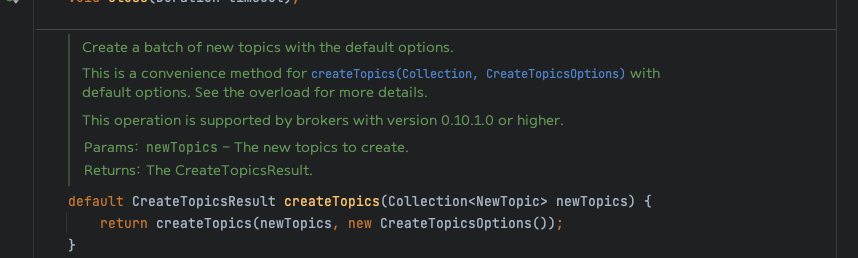
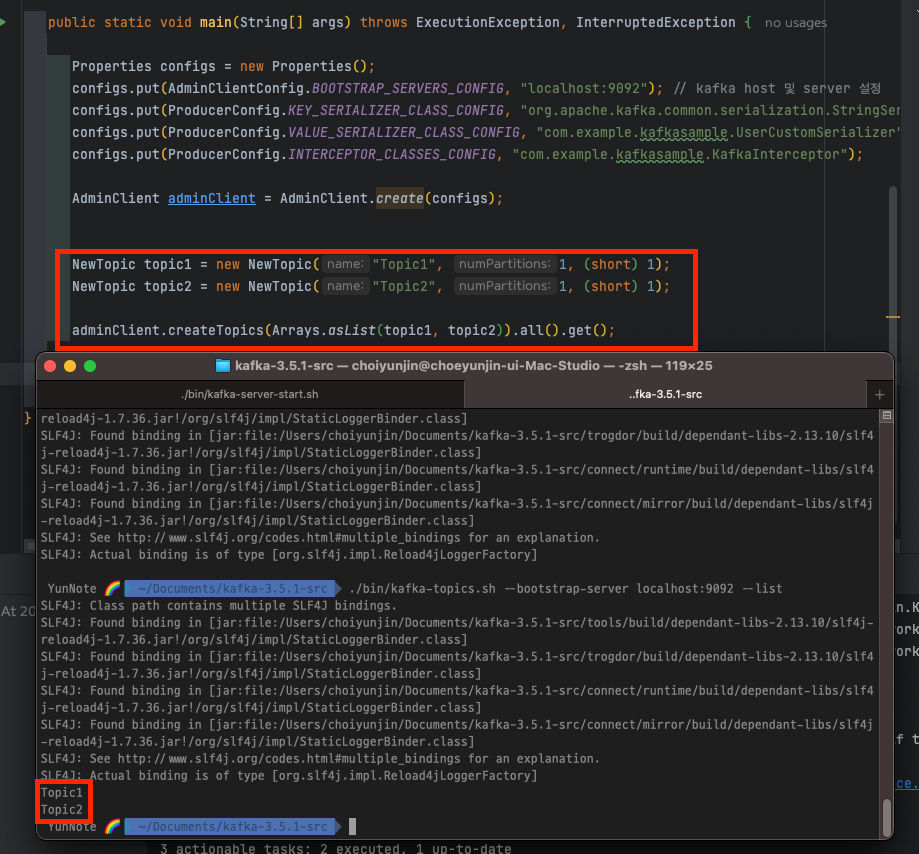

# 5. 프로그램 내에서 카프카 관리하기

Kafka 0.11 이후부터는 프로그램적인 관리기능 API를 관리하기 위한 목적으로 AdminClient가 추가되었다. 

기존 명령줄로 하던 토픽 목록 조회, 생성, 삭제, 클러스터 상세 정보 확인, ACL관리등을 해당 API로도 가능하다.

> 이전에는 토픽을 생성하기전 토픽이 이미 있는지 확인하기 위해 해당 토픽에 send()이후 발생하는 예외를 잡아 토픽을 
> 만들어야 한다는식으로 제공되었으나. 이와같이 API가 나옴으로 인하여 더 나은 해법을 가지게 되었다.

---

## AdminClient 개요 

### 비동기적이고 최종적 일관성을 가지는 API

카프카의 AdminClient에서 가장 중요한점은 비동기적으로 작동한다는 사실이다. 각 메서드는 요청을 클러스터로 전송한뒤
바로 1개 이상의 Future 객체를 리턴한다.

Feature 객체 자체는 비동기 작업의 결과를 가리키며 작업의 결과를 확인하거나, 취소하거나, 완료 될 때까지
대기하거나 작업이 완료되었을 때 실행할 함수를 지정하는 메서드를 가지고있다.

AdminClient.createTopics 메서드는 CreateTopicsResult 객체를 리턴한다. 해당 객체는
모든 토픽이 생성될 때까지 기다리거나, 각각의 토픽 상태를 하나씩 확인하거나, 특정한 토픽이 생성된 뒤 해당
토픽의 설정을 가져올 수 있도록 해 준다.

> .all().get() 호출이 되어야 생성이 된다. 실제 반환 값도 맞음

카프카 컨트롤러부터 브로커로의 메타데이터 전파는 비동기적으로 이루어지기 때문에 AdminClient API 가 리턴하는 Future 객체들은 상태가
완전히 업데이트된 시점에서 완료된것으로 간주한다. 

이시점에서 모든 브로커가 전부 다 새로운 상태에 대해 알고있지는 못할 수 있기 때문에 listTopics 요청은 최신 상태를 전달받지 않은 
브로커에 의해 처리될 수 있다. 이러한 속성을 `최종적 일관성`이라고 한다. 

최종적으로 모든 브로커는 모든 토픽에 대해 알게 될것이지만, 정확히 그게 언제가 될지에 대해서는 아무도 보장도 할 수 없다.

---

### 옵션

