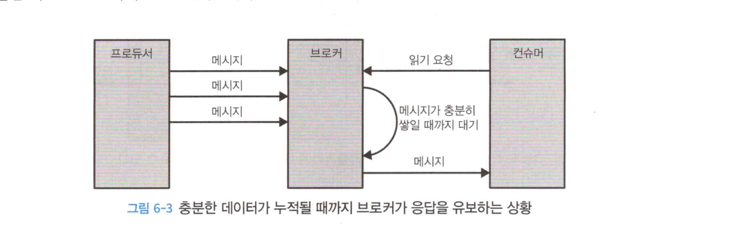

# 6장 카프카 내부 메커니즘

카프카의 내부를 알면 트러블슈팅하거나 실행되는 방식을 이해하는데 도움이 된다.

- 카프카 컨트롤러
- 카프카에서 복제(레플리케이션)의 동작방식
- 프로듀서와 컨슈머의 요청을 처리하는 방식
- 카프카가 저장을 처리하는 방식

---

## 클러스터 멤버십

카프카는 클러스터의 멤버인 브로커들의 목록을 유지하기위해 아파치 주키퍼를 사용한다.

각각의 브로커는 브로커 설정파일에 정의되어있거나 자동으로 생성된 고유한 식별자를 가진다.<br>
브로커 프로세스는 시작될 때마다 주키퍼에 Ephemeral 노드 형태로 ID를 등록한다, 컨트롤러를 포함한
카프카 브로커들과 몇몇 툴들은 브로커가 등록되는 주키퍼의 /brokers/ids 경로를 구독함으로써 브로커가 추가되거나 제거될 때 마다
알림을 받는다. 

ID는 중복될 수 없기때문에 동일한 ID를 가진 브로커가 시작한다면 에러가 발생한다. 

브로커와 주키퍼가 간의 연결이 끊어진다면 브로커가 시작될 때 생성한 노드는 자동으로 주키퍼에서 삭제된다. 또한 해당 브로커 경로를
구독한 컴포넌트들은 해당 브로커가 내려갔다는것을 알 수 있다.

---

## 컨트롤러 


1. 제일 먼저 시작되는 브로커가 주키퍼 /controller 노드를 생성함으로써 컨트롤러가 된다.
2. 이후 브로커 역시 생성하려고 요청하지만 이미 컨트롤러가 있다면 더이생 생성하지 않고 와치를 통해 변경이 생길 시 알림을 받음.
3. 만약 컨트롤러가 멈추가너 연결이 끊어진다면 알림을 통해 다른 브로커들이 컨트롤러가 되기 위해주키퍼에 요청.
4. 이후 2번과 같은 작업을 반복.

> 선출될때마다 주키퍼의 조건적 증가 연산에 의해 증가된 에포크(세대 의미)를 전달받으며 해다 에포크 값보다 낮은 가진 컨트롤러부터 메시지를
> 받을 경우 해당 값들을 무시한다.


새로운 컨트롤러가 선출되었다는 것을 알지 못한 채 브로커에 메시지를 보낼 수 있다. 이러한 건트롤러를좀비라고부른다.
컨트롤러가 전송하는 메시지에 컨트롤러 에포크를 포함하면 브로커는 예전 컨트롤러가보내온 메시지를 무시할 수 있다. 이는 좀비를 방지하는방법이기도한 것이다.

브로커가 컨트롤러가 된다면 주키퍼로부터 최신 레플리카 상태맵을 읽어 온다. 해당 작업은 비동기API를 사용하여 진행되며
지연을 줄이기 위해 요청을 여러단계로 나눠 주키퍼로 보낸다. 그럼에도 파티션수가 매우 많다면 적재 작업이 몇초씩 걸리기도 한다.


브로커가 클러스터를 나간것을 알게 된다면 해당 브로커에 속한 파티션에 대해 새로운 브로커를 할당해주며, 
컨트롤러는 새로운 리더가 필요한 모든 파티션을 순회하며 새로운 리더가 될 브로커를 결정해준다. 

새로운 상태를 주키퍼에 쓴뒤 새로 리더가 할당된 파티션의 레플리카를 포함하는 모든 브로커에 LeaderAndISR 새로운
리더와 팔로워 정보를 포함한다. 

요약하면 컨트롤러는 브로커가 클러스터에 추가되거나 제거될때 파티션과 레플리카 중에서 리더를 선출할 책임을 갖고. 
컨트롤러는 서로 자기가 컨트롤러라고 생각하는 스플릿브레인 현상을 방지하기 위해 에포크 번호를 사용한다.

> 스플릿 브레인 - 분산시스템에서 많이 발생하며 심각한 문제중 하나이다. 말그대로 누구나 마스터 노드가 되려는 경향

--- 

### KRaft: 카프카의 새로운 래프트 기반 컨트롤러

KRaft는 3.3 이후부터 프로덕션 환경에서 사용가능한 기능이 되었다.

카프카가 KRaft로 컨트롤러 교체하기로 한 이유는 아래와 같다.

1. 컨트롤러가 주키퍼에 메타데이터를 쓰는 작업은 동기방식이지만 메시지를 보내는 자겁은 비동기로 이뤄지며, 업데이트 받는 과정역시 비동기이다. 따라서 브로커, 컨트롤러, 주키퍼간 메타데이터의 불일치가 발생할 확률이 높으며 잡아내기도 어렵다.


2. 컨트롤러가 재시작될때마다 주키퍼로부터 모든 브로커와 파티션에 대한 메타데이터를 읽고나서 모든 브로커로 전송한다. 이부분에서 병목이 발생하고 파티션과 브로커가 증가함에 따라 재시작이 더욱 느려진다.
3. 메타데이터 소유권 관련된 내부 아키텍처가 좋지 못하다. 어떤작업은 컨트롤러가 하고, 다른건 브로커가 하고, 나머지는 주키퍼가 직접한다.
4. 주피커 자체가 분산 시스템이며, 카프카와 마찬가지로 운영을 위해서는 기반지식이 있어야 한다. 따라서 개발자들은 카프카와, 주키퍼 두개의 분산 시스템에 대해 배워야한다.


이러한 문제점들을 고려하여 주키퍼를 교체하는 쪽을 선택하였다.

신규 컨트롤러의 설계 핵심은 이벤트 스트림으로 나타낼 수 있도록 하는 로그 기반 아키텍처를 도입한다는 점이다.

즉 다수의 컨슈머를 사용해서 이벤트를 재생함으로써 최산상태를 빠르게 따라잡을 수 있다. 로그는 이벤트 사이에 명확한 순서를
부여하며, 컨슈머들이 항상 하나의 타임라인을 따라 움직이도록 보장한다.

신규 컨트롤러의 아키텍처에서는 메타데이터를 관리하는 데에도 적용된다. 
컨트롤러 노드들은 메타데이터 이벤트 로그를 관리하는 래프트 쿼럼이 된다. 주키퍼에 저장되어있는 모든 정보들이 로그에
저장될 것이다.

래프트 알고리즘을 사용함으로써의 장점.

1. 외부 시스템에 의존하지 않고 자체적으로 리더를 선출할 수 있게 된다.
2. 컨트롤러 장애 복구는 모든 상태를 새 컨틀롤러로 이전하는 기나긴 리로드 기간을 필요로 하지 않는다.

컨트롤러는 다른 브로커에 변경사항을 Push하지 않는다 다만 새로 도입된 MetadataFetch API를 사용하여
액티브 컨트롤러로부터 변경사항을 Pull 한다. 컨슈머의 읽기와 유사하게 브로커는 마지막으로 가져온 메타데이터 변경 사항의 오프셋을
추적하고 그 보다 나중 업데이트만 컨트롤러에 요청한다. 

브로커는 추후 시동 시간을 줄이기 위해 메타데이터를 디스크에 저장한다.

상세 내용은 P.154

---

P.156
KRaft 모드 사용법에 대해서는 실제 사용할떄 확인해도 될듯 하여 따로 정리하지 않음. 

---

## 복제 

복제는 카프카 아키텍처의 핵심이다. 실제로 카프카는 분산되고, 분할되고, 봊게된 커밋 로그서비스로 표현되기도 한다.

복제가 핵심인 이유는 개별 노드에 장애 발생시 신뢰성과 지속성을 보장하는 방식이기 때문이다.

- 카프카는 토픽을 단위로해서 조직화된다. 
- 각 토픽은 1개 이상의 파티션으로 분할되며, 각 파티션은 다시 다수의 레플리카를 갖는다.
- 각각의 레플리카는 브로커에 저장되는데, 대게 하나의 브로커는 수백 개에서 수천개의 레플리카를 저장한다.

레플리카에는 두가지 종류가 있다.

1. 리더 레플리카
   > 각 파티션에 리더 역할을 하는 레플리카가 하나씩 있다. 일관성을 보장하기 위해 모든 쓰기 요청은 리더 레플리카로 주어진다. 클라이언트들은 리더 레플리카나 팔로워를 통해 데이터를 읽는다.
2. 팔로워 레플리카
   > 리더 레플리카를 제외한 나머지를 모두 팔로워 레플리카라고 한다. 별도로 설정을 하지 않는 이상 팔로워는 클라이언트의 요청을 처리할 수 없다.
   > 팔로워 레플리카는 주로 최근 메시지들을 복제함으로써 최신 상태를 유지하는 것이다.
   > 만약 리더 레플리카가 크래쉬가 난다면 팔로워중 하나가 파티션의 리더파티션으로 승격된다.
   

추가로 `리더 레플리카`는 팔로워 레플리카가 리더 레플리카의 최신 상태를 유지하고 있는지도 확인한다. 팔로워 레플리카는
새로운 메시지가 도착하는 즉시 리더 레플리카로부터 모든 메시지를 복제함으로써 최신 상태를 유지할 수 있도록 하지만.

다양한 원인으로 동기화가 꺠지기도 한다. 예를들면 네트워크 혼잡으로 인해 속도가 느려진다거나 브로커가 크래시나 브로커가
재시작되어 복제작업을 다시 시작하기 전까지 복제상태가 뒤처지는 상황이다.


`팔로워 레플리카`는 `리더 레플리카`와 동기화를 유지하기 위해 읽기 요청을 보낸다. 이에 `리더 레플리카`는 응답 메시지를 되돌려 준다.

이를 통해 `팔로워 레플리카`는 다음번에 받아야할 오프셋을 알 수 있을 뿐더라 `리더 레플리카`입장에서는 `팔로워 레플리카`가  메시지 복사를 
완료하였는지 이후 추가된 메시지가 없는지의 여부를 알 수 있다.

또한 얼마나 뒤쳐져 있는지도 알 수 있다 만약 `팔로워 레플리카`가 10초(replica.lag.time.max.ms설정가능)이상 메시지 요청을 보내지 않거나
최근 메시지를 가져가지 않을 경우 해당 레플리카는 동기화가 풀린것(아웃 오프 싱크 레플리카)으로 간주된다. 이러한 상황이 발생한다면
해당 레플리카는 더이상 장애 상황에서 `리더 레플리카`가 될 수 없다. 

`아웃 오브 싱크 레플리카`와의 반대로 `인 싱크 레플리카`가 있는데 지속적으로 최신 메시지를 요청하는 경우를 의미하며
리더에 장애가 발생하면 `인-싱크 레플리카`만이 파티션의 리더가 될 수 있다.


#### 선호 리더

선호 리더란 토픽이 처음 생성되었을때 리더 레플리카였던 레플리카를 가리키는 말이며, 처음생성되는 시점에서는 
리더 레플리카가 모든 브로커에 균등하게 분포되기 때문에 `선호`라는 표현을 쓴다. 결과적으로 모든 파티션에 대해
선호 리더가 실제 리더가 될 경우 부하가 브로커 사이에 균들하게 분배될 것으로 예상할 수 있다. 

auto.leader.rebalance.enable=true 가 기본값이며, 현재 리더와 동기화가ㅣ 되있을 경우
리더 선출을 함으로써 선호 리더를 현재 리더로 만들어준다.

---

## 요청 처리


브로커가 하는 일의 대부분은 클라이언트, 파티션 레플리카, 컨트롤라가 파티션 리더에게 보내는 요청을 처리하는 것이다.

카프카는 TCP로 전달되는 이진 프로토콜을 가지고 있고, 요청의 형식과 브로커가 응답하는 방식을 정의한다.

다양한 언어로 구현된 클라이언트들 모두가 해당 프로토콜을 사용하여 브로커와 통신한다.

언제나 클라이언트가 요청을 연결하고 전송하며, 브로커는 처리하고 응답을 보낸다, 모든 요청은 브로커가 받은 순서대로
처리되기때문에 카프카가 저장하는 메시지는 순서가 보장되며 카프카를 메시지큐로 사용할 수 있는 것이다.

모든 요청은 표준 헤더를 갖는다.

- 요청 유형: API 키라고도 부른다.
- 요청 버전: 서로 다른 버전의 클라이언트로부터 요청을 받아 각각 버전에 맞는 응답을 할 수 있다.
- Correlation ID: 요청에 붙는 고유 식별자, 응답이나 에러 로그에도 포함되어 트러블 슈팅에도 사용된다.
- 클리이언트 ID: 요청을 보낸 애플리케이션을 구분하기 위한 ID

카프카 내부 요청 처리 흐름 


---

### 쓰기 요청 

acks 설정 배개변수는 쓰기 작업이 성공한 것으로 간주되기 전 메시지에 대한 응답을 보내야하는 브로커의 수를 가리킨다. 어느 시점에
메시지가 성공적으로 쓰여졌다라고 간주되는지 프로듀서 설정을 통해 변경가능하다.

acks=1 - 리더만 받았을때
acks=all - 모든 인 싱크 레플리카들이 메시지를 받았을때
acks=0 - 메시지가 보내졌을때, 브로커의 응답을 기다리지 않음.


파티션의 리더 레플리카를 가지고 있는 브로커가 해당 파티션에 대한 쓰기요청을 받으면 몇가지 유효성 검사를 하는데
다음과 같다

1. 데이터를 보내고 있는 사용자가 토픽에 대한 쓰기 권한이 있는가?
2. 요청에 저장된 acks 값이 올바른가 ( 0, 1, all )
3. all로 잡혀있는 경우 메시지를 안정하게 쓸 수 있을 만큼 인 싱크 레플리카가 있는지.

위 유효성을 통과한다면 새 메시지들을 로컬 디스크에 쓴다. 

리눅스의 경우 메시지는 파일 시스템 캐시에 쓰는데 디스크에 언제 반영될지는 보장이 없다. 

카프카는 디스크에 저장될떄까지 기다리지 않는다. 즉 지속성을 위해 복제에 의존하는 것이다.

메시지가 파티션 리더에 쓰여지고 나면 브로커는 acks 설정에 따라 응답을 내려보난다. 만약 0이나 1로 되어있다면 바로 응답을 보내지만
all이라면 퍼거토리라 불리는 버퍼에 저장한다음 모든 팔로워 레플리카들이 메시지를 복제한것을 확인한 다음에 클라이언트에게
응답을 보낸다.

---

### 읽기 요청 

쓰기 요청이 처리되는것과 매우 유사하게 읽기 요청이 처리된다.

클라이언트는 브로커에게 토픽, 파티션, 오프셋 목록에 해당하는 메시지들을 보내달라는 요청을 보낸다.

```
Topic1에서 파티션0 오프셋 53 이후의 메시지좀 달라! 
```

라는 방식으로 요청한다고 보면 된다. 

클라이언트는 브로커가 리턴할 수 있는 최대 데이터 양 역시 지정한다. 클라이언트가 해당 값을 지정할 수 있는 이유는
응답을 담을 수 있을 만큼의 충분한 메모리를 할당해야 하기 땜누이다. 이러한 한도 값이 없다면 브로커는
클라이언트가 메모리 부족에 처할 수 있을 정도의 응답을 보낼 수 있기 때문이다..

읽기 요청에 대한 정보는 리더를 맡고있는 브로커에 전송되어야 하며, 클라이언트는 정확히 라우팅 할 수 있도록 메타데이터에
대한 요청을 보내게 된다. 

요청을 받은 파티션 리더는 해당 메시지가 유요한지 확인한 후 존재 하지 않는다면 에러를 응답한다.

만약 존재한다면 브로커는 파티션으로부터 요청에 지정한 크기만큼 메시지를 읽어서 클라이언트에게 응답한다.

카프카는 클라이언트에게 보내는 메시지에 `제로카피` 최적화를 적용하는 것으로 유명하다. 즉 파일에서 읽어 온 메시지들을 중간 버퍼를 거치지 않고
바로 네트워크 채널로 보낸다. 

해당 방식을 채택함으로써 데이터를 복사하고 메모리 상에 버퍼를 관리하기 위한 오버헤드가 사라지며 결과적으로 성능이 향상된다.

클라이언트는 브로커가 리턴하는 데이터양에 대해서 상한을 조정하는것 뿐만 아니라 하한까지도 지정이 가능하다

대략적으로 1K라면 데이터가 1K가 되면 결괄르 리턴받는 것이다. 

해당 방식은 트래픽이 많지 않은 토픽들로 부터 메시지를 읽을때 CPU와 네트워크 사용량을 감소시키는 좋은 방법이다. 
빈응답을 받는 대신 충분한 양의 데이터가 모일떄까지 기다렸다가 한번에 받아서 데이터를 처리하는것이다. 이렇게 하면
그만큼 데이터를 주고받는 횟수가 작아 그만큼 오버헤드가 적다.



그렇다면 만약 데이터가 쌓이지 않으면 응답을 못받는것일까? 라고 생각 할 수 있지만 해당 응답에 타임아웃을 설정할 수 있기때문에
만약 설정 타임아웃이 지난다면 데이터가 모이지 않아도 응답하게 된다.

읽기 요청은 `인 싱크 레플리카`에 쓰여진 메시지들만 읽을 수 있다. 파티션 리더는 어느 메시지가
어느 레플리카로 복제되었는지 알고 있으며, 특정 메시지가 모든 `인-싱크 레플리카`에 쓰여지기 전까지는
컨슈머들이 읽을 수 없다.( 에러가 발생하지는 않고 빈값이 리턴된다, 불안전한 상태이기 떄문이다.)

P.166

---

### 기타 요청

P.168 따로 정리하지 않음 .

---

## 물리적 저장소

카프카의 기본 저장단위는 파티션 레플리카이다. 파티션은 서로 다른 브로커들 사이에 분리될 수 없고, 같은 브로커의
서로 다른 디스크에 분할 저장되는 것조차 불가능하다. 따라서 파티션의 크기는 특정 마운트 지점에 사용 가능한 공간에 제한을 받는다.

카프카 설정할떄 운영자가 파티션들이 저장된 디렉터리를 정의한다.
`log.dirs` 매개변수를 통해 지정 가능하다.

---

### 계층화된 저장소 

카프카는 대량의 데이터를 저장하기 위한 목적으로 사용되고 있지만 다음과 같은 문제가 있다.

- 파티션별로 저장 가능한 데이터 한계가 있다. 결과적으로 최대 보존 기한과 파티션 수는 제품의 요구 조건이 아닌 물리적인 디스크 크기에도 제한을 받는다.
- 디스크와 클러스터 크기는 저장소 요구 조건에 의해 결정된다. 지연과 처리량이 주 고려사항일 경우 클러스터는 필요 이상으로 커지며, 비용도 많아진다.
- 클러스터의 크기를 키우가나 줄일 때 파티션의 위치를 다른 브로커로 옮기는데 걸리는 시간은 파티션의 수에 따라 결정된다. 파티션이 클수록 클러스터의 탄력성은 줄어든다.

계층화된 저장소 기능에서는 카프카 클러스터의 저장소를 로컬과 원격, 두 계층으로나눈다. 
로컬 계층은 현재의 카프카 저장소 계층과 똑같이 로컬 세그먼트를 저장하기 위해 카프카 브로커의 로컬 디 스크를사용한다. 
새로운 원격 계층은 완료된 로그 세그먼트를 저장하기 위해 HDFS나 S3와같은 전용 저장소 시스템을 사용한다.

