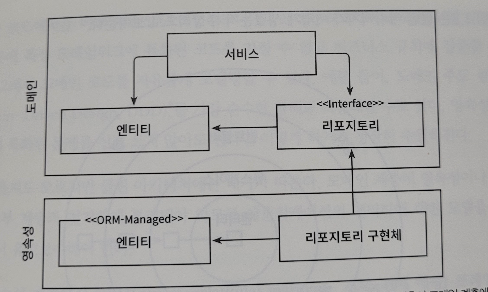
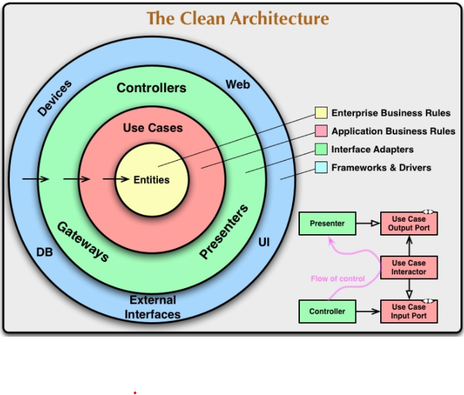
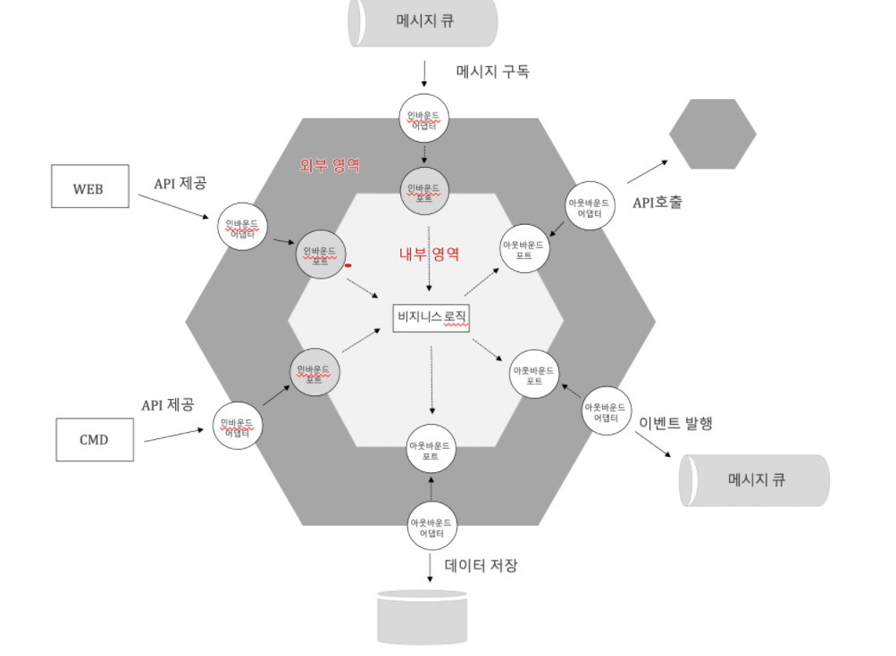
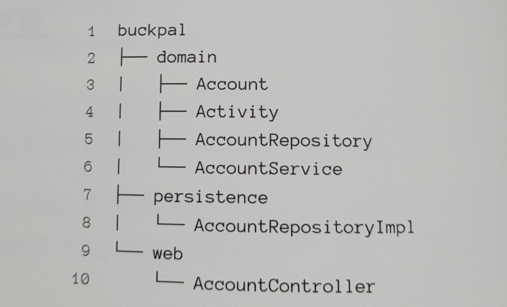
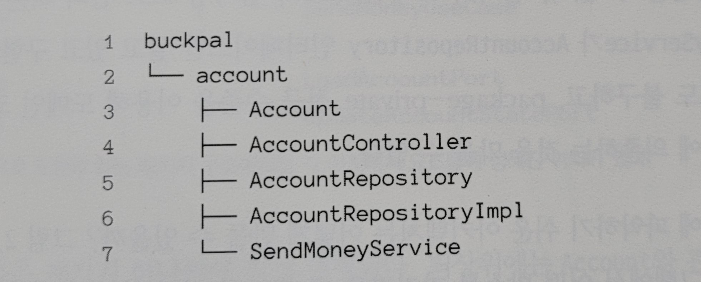
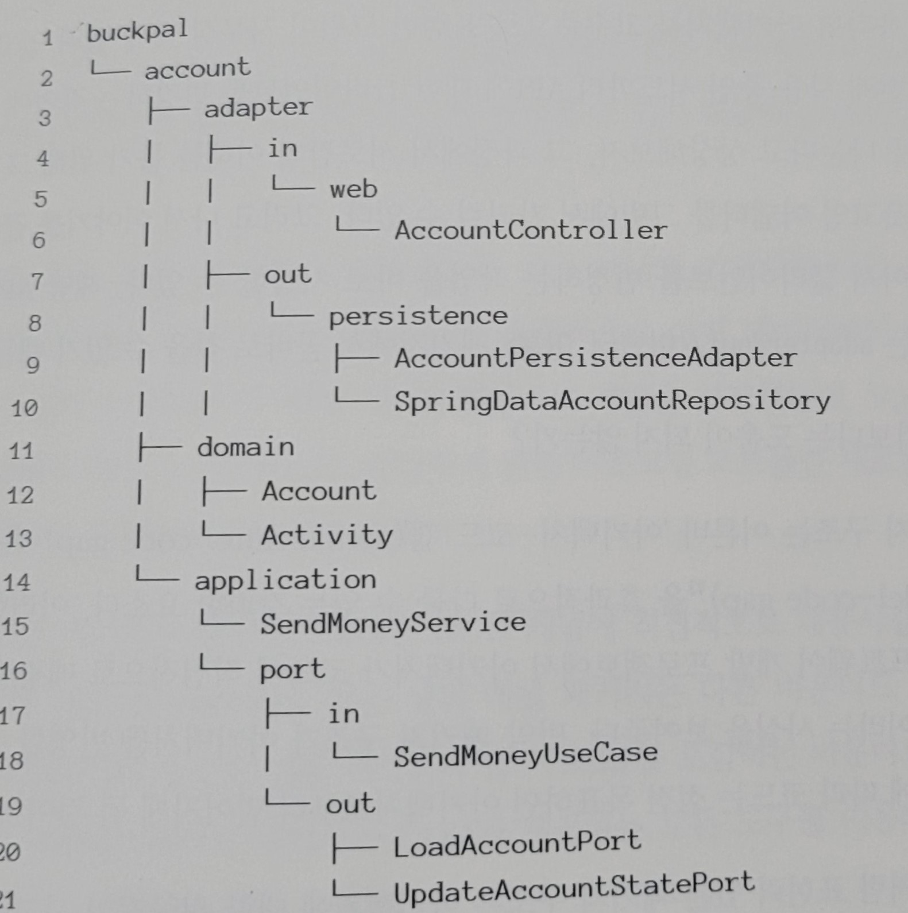
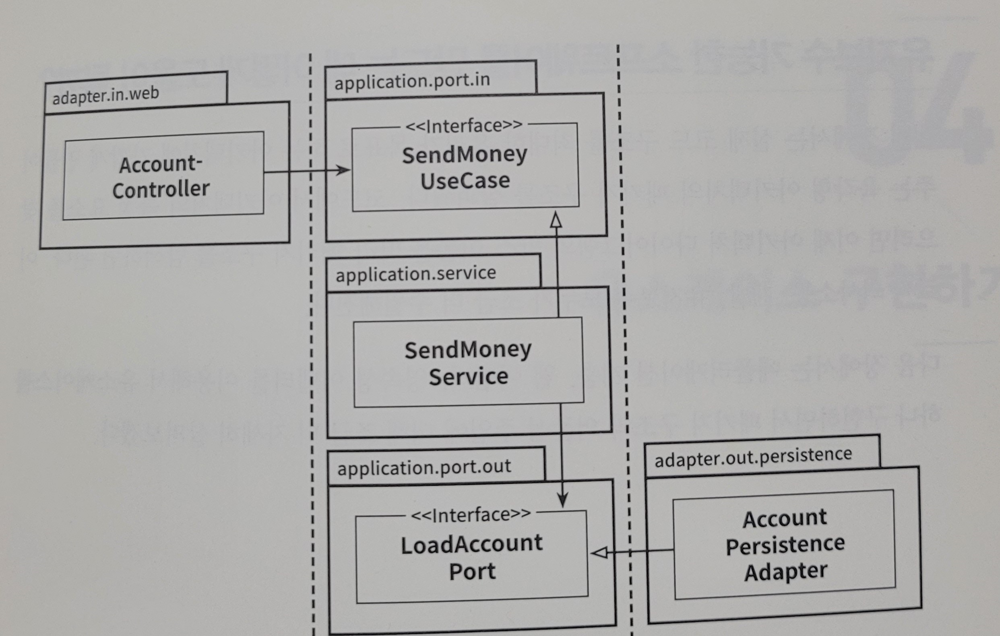

#### 해당 정리 내용은 `만들면서 배우는 클린아키텍처`도서를 읽고 정리한 내용입니다.

## 계층형 아키텍처의 문제는 무엇인가.

---
계층형 아키텍처는 코드에 나쁜 습관들이 스며들기 쉽게 만들고 시간이 지날수록 소프트웨어를 점점 더 변경하기 어렵게 만드는 수많은 허점들을 노출한다.

### 😊 계층형 아키텍처는 데이터베이스 주도 설계를 유도한다.

전통적인 계층형 아키텍처으 토대는 `데이터베이스`다. 계층형 아키텍처에서는 `상태(status)` 가 아니라 `행동(behavior`를 중심으로 모델링한다. 아마 계층형 아키텍처로 구성하였다면 데이터베이스의 구조를
먼저 생각하고, 이를 토대로 도메인 로직을 구현했을 것이다.

비즈니스 관점에서는 데이터베이스의 구조를 먼저 생각하고 이를 토대로 도메인 로직을 구현하는 방식은 전혀 맞지 않는 방법이다. 비즈니스 관점으로 보자면 도메인 로직을 먼저 만들어야한다. 그래야 우리가 로직을 제대로
이해했는지 확인할 수 있다. 또한 도메인 로직이 맞다는 것을 확인한 후에 이를 기반으로 영속성 계층과 웹 계층을 만들어야 한다.

---

### 😊 지름길을 택하기 쉬워진다.

전통적인 계층형 아키텍처에서 전체적으로 적용되는 유일한 규칙은, 특정한 계층에서는 같은 계층에 있는 컴포넌트나 아래에 있는 계층에만 접근 가능하다는 것이다.

만약 개발을 하다가 상위 계층에 위치한 컴포넌트에 접근해야 한다면 간단하게 컴포넌트를 계층 아래로 내려버리면 된다. 그러면 접근 가능하게 되고, 깔끔하게 문제가 해결된다.

하지만 이렇게 하게 된다면 도메인 밑에있는 영속성 계층이 비대해지며, 어떤 계층에도 속하지 않는 것처럼 보이는 헬퍼 컴포넌트나 유틸리티 컴포넌트들이 이처럼 아래 계층으로 내릴 가능성이 큰 후보다.
``

---

### 😊 테스트하기 어려워진다.

계층형 아키텍처를 사용할 때 일반적으로 나타나는 변화의 형태는 계층을 건너뛰는 것이다.

엔티티의 필드를 하나만 조작하면 되는경우 웹계층에서 바로 영속성계층에 접근하면 도메인 계층을 건드릴 필요가 없지 않을까 ?? 라는 생각을 하게된다. 처음 몇번은 편하고 좋지만 해당 내용이 많아진다면 두가지의 문제점이
발생한다.

1. 단 하나의 필드를 조작하는 것에 불과하더라도 도메인 로직을 웹 계층에 구현하게 된다는 것이다.
2. 웹 계층 테스트에서 도메인 계층뿐만 아니라 영속성 계층도 모킹해야 한다는 것이다.

   > 웹 계층에서 영속성 계층도 모킹을 하게 된다면 단위 테스트의 복잡도가 올라간다. 또한 테스트 설정이 복잡해지는 것은 테스트를 전혀 작성하지 않는 방향으로 가는 첫걸음이다. 왜냐하면 복잡한 설정을 할 시간이 없기 때문이다.

---

### 😊 유스케이스를 숨긴다.

새로운 유스케이스를 구현하는 코드를 짜는것을 선호하나, 실제로는 새로운 코드를 짜는 데 시간을 쓰기보단 기존 코드를 바꾸는 데 더 많은 시간을 사용하게 된다. 해당 내용은 레거시 프로젝트 분만 아니라
신규 프로젝트에서도 마찬가지다.

계층형 아키텍처에서는 도메인 로직이 여러 계층에 걸쳐 흩어지기 쉽다. 따라서 도메인 계층을 생략하게 된다면 웹 계층에 존재할 수도 있고, 도메인 계층과
영속성 계층 모두에서 접근할 수 있도록 특정 컴포넌트를 아래로 내렸다면 영속성 계층에 존재할 수도 있다.
이러한 상황이 계속된다면 기능을 추가할 적당할 위치를 찾는일은 이미 어려워진 상태이다.

따라서 여러개의 유즈케이스를 하나의 서비스가 담당하는 넓은 서비스가 만들어지기도 한다.

이렇게 만들어진 서비스는 영속성 계층에 많은 의존성을 가지게 되며 웹 레이어의 다양한 컴포넌트들이 해당 서비스에 의조ㅓㄴ하게 된다.
그렇게 된다면 해당 서비스를 테스트하기도 어려워지며, 어떤 유즈케이스를 책임지는 서비스를 찾기도 어려워진다.

하나의 유즈케이스를 하나씩만 담당하게 한다면 작업이 수월해질듯 싶다.

---

### 😊 동시 작업이 어려워진다.

여러명의 개발자가 동시에 개발하기 위해서는 아키텍처가 동시 작업을 지원해야 하지만, 쉽지 않은 방법이다.
또한 계층형 아키텍처는 이러한 측면에서는 도움이 되지 않는다.

---

## 🔖 2. 의존성 역전하기

해당 챕터에서 의존성 역전에 대한 내용이 나온다 .

우리가 흔히 아는 SOLID중에서도 `S`와 `D`에 대한 설명이 나온다.

`Single Responsibility Principle(SRP)`는 지금까지 `하나의 컴포넌트는 오로지 한 가지의 일만 해야하고, 그것을 올바르게 수행해야한다.`
라고 알고있었다.

하지만 실제 정의는 다음과 같다 `컴포넌트를 변경하는 이유는 오직 하나뿐이어야 한다.`

   

위의 사진을 보면 A라는 컴포넌트는 B,E,D,C등과 같이 다양한 컴포넌트에 의존하고 있지만 그에 비해
E 컴포넌트는 아무 컴포넌트와 의존하는것이 전혀 없다.

E컴포넌트를 변경할 유일한 이유는 새로운 요구사항에 의해 E의 기능을 변경해야할때이다.

여기서 알 수 있는 사실은 코드가 점점 많아질수록 단일 책임 원칙을 위반하기 때문에 시간이 갈수록 변경하기가 어려워 진다. 따라서 시간이 지날수록 컴포넌트를 변경할
더 많은 이유가 쌓인다, 변경할 이유가 많이 쌓인 후에는 한 컴포넌트를 변경하는것이 다른 컴포넌트가 실패하는 원인으로도 작용할 수 있다.

---

### 😊 의존성 역전 원칙 

계층형 아키텍처에서 계층 간 의존성은 항상 다음 계층인 아래 방향을 가리킨다.

단일 책임 원칙을 고수준에서 적용할 때 상위 계층들이 하위 계층들에 비해 변경할 이유가 더 많다는 것을 알 수 있다.

그렇기 때문에 영속성 계층에 대한 도메인 계층의 의존성 때문에 영속성 계층을 변경할 때마다 잠재적으로도메인 계층도 변경해야한다.
하지만 도메인 코드는 애플리케이션에서 가장 중요한 코드이다, 영속성 코드가 바뀐다고 해서 도메인 코드까지 바꾸고 싶지는 않다.

이럴때 의존성 역전 원칙(DIP)가 답이다.

> 의존성의 양쪽 코드를 모두 제어할 수 있을 때만 의존성을 역전시킬 수 있다.

   

위의 이미지를 통해 확인할 수 있는 점은 기존의 코드였다면 도메인 계층의 서비스 컴포넌트와 영속성 계층의 리포지토르 컴포넌트가 서로 상호작용 하고 있을때 
도메인 계층에 있는 서비스에서 영속성 계층에 있는 리포지토리를 의존했겠지만 다음 이미지와 같이 DIP를 적용하게 되면
도메인 계층에 리포지토리 Interface를 둠으로써 영속성 계층의 리포지토리가 도메인계층에 있는 리포지토리 Interface를 의존하도록 하게 된다.

---

### 😊 클린 아키텍처

> 클린 아키텍처에서는 설계가 비즈니스 규칙의 테스트를 용이하게 하고, 비즈니스 규칙은 프레임워크, 데이터베이스, UI기술
> 그 밖의 외부 애플리케이션이나 인터페이스로부터 독립적일 수 있다고 이야ㅐ기함 - 로버트 C. 마틴 -

이 말은 즉 , 도메인 코드가 바깥으로 향하는 어떤 의존성도 없어야 함을 의미한다. 대신 의존성 역전 원칙의 도움으로 모든 의존성이 도메인 코드를 향하고 있다.

   

클린 아키텍처를 검색하면 가장 많이 나오는 이미지 중 하나이다.

해당 이미지를 보게 되면 이 아키텍처에서 계층들은 원으로 둘러싸여 있으며, 의존성 규칙으로,  게층간의 모든 의존성은 안쪽으로 향해야 한다는 것이다.

> 도메인 계층은 영속성 계층을 모르기 때문에 도메인 계층에서 사용한 엔티티 클래스를 영속성 계층에서 함께 사용할 수 없고
> 두 계층에서 각각 엔티티를 만들어야 한다.
> 
> 즉 도메인 계층과 영속성 계층이 데이터를 주고받을 때, 두 엔티티를 서로 변환해야 한다는 뜻이다, 이는 도메인 계층과 다른 계층들 사이에서도 마찬가지이다.

---

### 😊 육각형 아키텍처 (헥사고날 아키텍처)

   

다음 아키텍처는 흔히 헥사고날 아키텍처라고 부른다.

해당 아키텍처의 특징은 , 외부로 향하는 의존성이 없기 때문에 클린아키텍처에서 제시한 의존성 규칙이 그대로 적용되어있으며, 모든 의존성은 코어를 향한다.

좌측에 있는 어댑터들은 애플리케이션 코어를 호출하기 때문에 애플리케이션을 주도 하는 어댑터들이다. 
우측에 있는 어댑터들은 애플리케이션 코어에 의해 호출되기 때문에 애플리케이션에 의해 주도되는 어댑터들을 의미한다.

이러한 핵심 개념으로 인해 해당 아키텍처 스타일은 `포트와 어댑터`아키텍처로도 많이 불린다.

---

## 🔖 3. 코드 구성하기

### 🔹 계층으로 구성하기 

   

코드를 구조화하는 첫번째 방식으로 계층을 이용하는 것이다.

얼핏 보면 가장 간단한구조이며 의존성 역전 원칙을 적용하여 의존성이 domain 패키지에 있는 도메인 코드만을 향하도록 작성되어 있다.
(domain 패키지에 interface를 둠으로써 의존성 역전을 시켰다.)

하지만 해당 패키지는 최적의 구조가 아니다. 

 - 첫번째는 기능이나 특성을 구분 짓는 패키지 경계가 없다는 점이다.
다른 도메인 관련 로직이 추가된다고 하면 domain 패키지 안에 전부 추가되게 될텐데
그렇다면 클래스들이 엉망진창으로 묶이게 될것이고 파악하기도 힘들 것이다.

 - 두번째는 애플리케이션이 어떠한 유즈케이스를 제공하는지 파악할 수 없다. 특정기능을 찾기위해서는 어떤 서비스가 이를 구현했는지 찾아야 하고,
 또한 해당 서비스 내의 어떤 메서드가 그에 대한 책임을 수행해야 하는지 찾아야 한다.

### 🔹 기능으로 구성하기

   

 - 기능을 기준으로 구성한 패키지이지만, 기능을 기준으로 코드를 구성하면 아키텍처가 명확하게 보이지 않는다.

계층형 으로 구성된 아키텍처와 다른점은 최상위의 account 패키지에 넣었다는 점이다.

패키지 경계를 package-private를 통해 접근 수준과 결합하면 각 기능 사이의 불필요한 의존성을 방지할 수 있다는 장점이 있긴하디만

기능에 의한 패키징 방식은 계층에 의한 패키징 방식보다 아키텍처의 가시성은 훨신 떨어진다.

어댑터를 나타내는 패키지명이 없고, 인커밍포트, 아웃고잉포트를 확인할 수 없다,  또한 도메인 코드와 ㅇ영속성 코드간의 의존성을 역전시켜서 packaga-private 접근 수준을 이용해 도메인 코드가 실수로
영속성 코드에 의존하는 것을 막을 수 없다.

---

### 🔹 아키텍처적으로 표현력 있는 패키지 구조

   

해당 패키지 구조에서는 헥사고날 아키텍처에서 요구하는 요소들에 정해진 위치에 클래스 파일들이 존재하도록 되어있다.

최상위 패키지에는 account와 관련된 모듈임을 나타내는 account package 존재하며
그다음 레벨에는 모델이 속한 domain, 서비스 계층을 포함하는 application package가 존재하며 각각의 인커밍 포트, 아웃고잉 포트들이 포함되어 있다.

해당 패키지 및 설명은 도서를 직접 참고하면 좋을듯 하다 .

---

### 🔹 의존성 주입의 역할

   

web -> 인커밍 포트 호출 -> 인커밍 포트를 구현한 구현체 호출 -> 아웃 고잉 포트 호출 -> 아웃고잉 포트를 구현한 구현체 호출 .