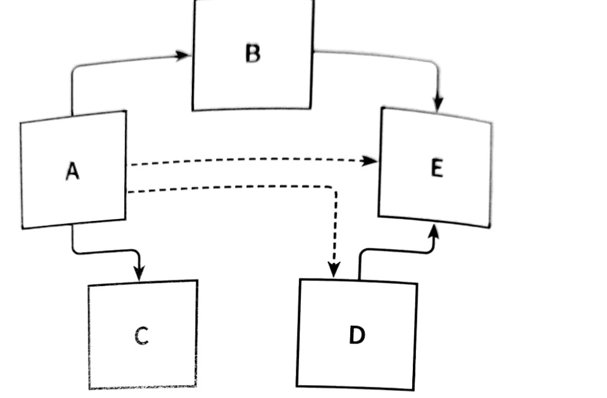

#### 해당 정리 내용은 `만들면서 배우는 클린아키텍처`도서를 읽고 정리한 내용입니다.

## 계층형 아키텍처의 문제는 무엇인가.

---
계층형 아키텍처는 코드에 나쁜 습관들이 스며들기 쉽게 만들고 시간이 지날수록 소프트웨어를 점점 더 변경하기 어렵게 만드는 수많은 허점들을 노출한다.

### 😊 계층형 아키텍처는 데이터베이스 주도 설계를 유도한다.

전통적인 계층형 아키텍처으 토대는 `데이터베이스`다. 계층형 아키텍처에서는 `상태(status)` 가 아니라 `행동(behavior`를 중심으로 모델링한다. 아마 계층형 아키텍처로 구성하였다면 데이터베이스의 구조를
먼저 생각하고, 이를 토대로 도메인 로직을 구현했을 것이다.

비즈니스 관점에서는 데이터베이스의 구조를 먼저 생각하고 이를 토대로 도메인 로직을 구현하는 방식은 전혀 맞지 않는 방법이다. 비즈니스 관점으로 보자면 도메인 로직을 먼저 만들어야한다. 그래야 우리가 로직을 제대로
이해했는지 확인할 수 있다. 또한 도메인 로직이 맞다는 것을 확인한 후에 이를 기반으로 영속성 계층과 웹 계층을 만들어야 한다.

---

### 😊 지름길을 택하기 쉬워진다.

전통적인 계층형 아키텍처에서 전체적으로 적용되는 유일한 규칙은, 특정한 계층에서는 같은 계층에 있는 컴포넌트나 아래에 있는 계층에만 접근 가능하다는 것이다.

만약 개발을 하다가 상위 계층에 위치한 컴포넌트에 접근해야 한다면 간단하게 컴포넌트를 계층 아래로 내려버리면 된다. 그러면 접근 가능하게 되고, 깔끔하게 문제가 해결된다.

하지만 이렇게 하게 된다면 도메인 밑에있는 영속성 계층이 비대해지며, 어떤 계층에도 속하지 않는 것처럼 보이는 헬퍼 컴포넌트나 유틸리티 컴포넌트들이 이처럼 아래 계층으로 내릴 가능성이 큰 후보다.
``

---

### 😊 테스트하기 어려워진다.

계층형 아키텍처를 사용할 때 일반적으로 나타나는 변화의 형태는 계층을 건너뛰는 것이다.

엔티티의 필드를 하나만 조작하면 되는경우 웹계층에서 바로 영속성계층에 접근하면 도메인 계층을 건드릴 필요가 없지 않을까 ?? 라는 생각을 하게된다. 처음 몇번은 편하고 좋지만 해당 내용이 많아진다면 두가지의 문제점이
발생한다.

1. 단 하나의 필드를 조작하는 것에 불과하더라도 도메인 로직을 웹 계층에 구현하게 된다는 것이다.
2. 웹 계층 테스트에서 도메인 계층뿐만 아니라 영속성 계층도 모킹해야 한다는 것이다.

   > 웹 계층에서 영속성 계층도 모킹을 하게 된다면 단위 테스트의 복잡도가 올라간다. 또한 테스트 설정이 복잡해지는 것은 테스트를 전혀 작성하지 않는 방향으로 가는 첫걸음이다. 왜냐하면 복잡한 설정을 할 시간이 없기 때문이다.

---

### 😊 유스케이스를 숨긴다.

새로운 유스케이스를 구현하는 코드를 짜는것을 선호하나, 실제로는 새로운 코드를 짜는 데 시간을 쓰기보단 기존 코드를 바꾸는 데 더 많은 시간을 사용하게 된다. 해당 내용은 레거시 프로젝트 분만 아니라
신규 프로젝트에서도 마찬가지다.

계층형 아키텍처에서는 도메인 로직이 여러 계층에 걸쳐 흩어지기 쉽다. 따라서 도메인 계층을 생략하게 된다면 웹 계층에 존재할 수도 있고, 도메인 계층과
영속성 계층 모두에서 접근할 수 있도록 특정 컴포넌트를 아래로 내렸다면 영속성 계층에 존재할 수도 있다.
이러한 상황이 계속된다면 기능을 추가할 적당할 위치를 찾는일은 이미 어려워진 상태이다.

따라서 여러개의 유즈케이스를 하나의 서비스가 담당하는 넓은 서비스가 만들어지기도 한다.

이렇게 만들어진 서비스는 영속성 계층에 많은 의존성을 가지게 되며 웹 레이어의 다양한 컴포넌트들이 해당 서비스에 의조ㅓㄴ하게 된다.
그렇게 된다면 해당 서비스를 테스트하기도 어려워지며, 어떤 유즈케이스를 책임지는 서비스를 찾기도 어려워진다.

하나의 유즈케이스를 하나씩만 담당하게 한다면 작업이 수월해질듯 싶다.

---

### 😊 동시 작업이 어려워진다.

여러명의 개발자가 동시에 개발하기 위해서는 아키텍처가 동시 작업을 지원해야 하지만, 쉽지 않은 방법이다.
또한 계층형 아키텍처는 이러한 측면에서는 도움이 되지 않는다.

---

## 🔖 2. 의존성 역전하기

해당 챕터에서 의존성 역전에 대한 내용이 나온다 .

우리가 흔히 아는 SOLID중에서도 `S`와 `D`에 대한 설명이 나온다.

`Single Responsibility Principle(SRP)`는 지금까지 `하나의 컴포넌트는 오로지 한 가지의 일만 해야하고, 그것을 올바르게 수행해야한다.`
라고 알고있었다.

하지만 실제 정의는 다음과 같다 `컴포넌트를 변경하는 이유는 오직 하나뿐이어야 한다.`

   

위의 사진을 보면 A라는 컴포넌트는 B,E,D,C등과 같이 다양한 컴포넌트에 의존하고 있지만 그에 비해
E 컴포넌트는 아무 컴포넌트와 의존하는것이 전혀 없다.

E컴포넌트를 변경할 유일한 이유는 새로운 요구사항에 의해 E의 기능을 변경해야할때이다.

여기서 알 수 있는 사실은 코드가 점점 많아질수록 단일 책임 원칙을 위반하기 때문에 시간이 갈수록 변경하기가 어려워 진다. 따라서 시간이 지날수록 컴포넌트를 변경할
더 많은 이유가 쌓인다, 변경할 이유가 많이 쌓인 후에는 한 컴포넌트를 변경하는것이 다른 컴포넌트가 실패하는 원인으로도 작용할 수 있다.

---

### 😊 의존성 역전 원칙 

계층형 아키텍처에서 계층 간 의존성은 항상 다음 계층인 아래 방향을 가리킨다.

단일 책임 원칙을 고수준에서 적용할 때 상위 계층들이 하위 계층들에 비해 변경할 이유가 더 많다는 것을 알 수 있다.

그렇기 때문에 