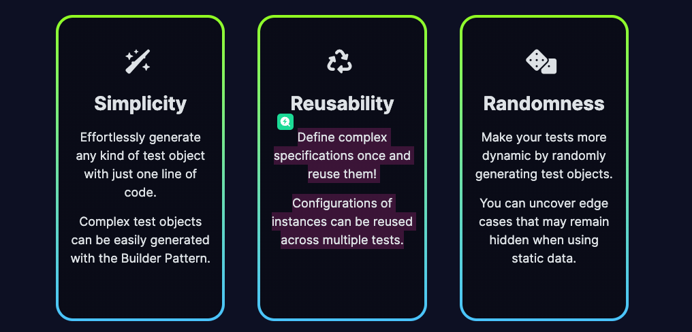
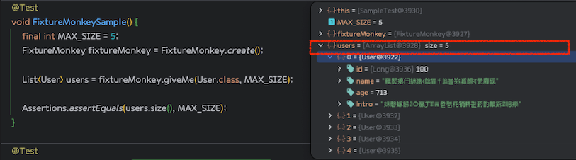
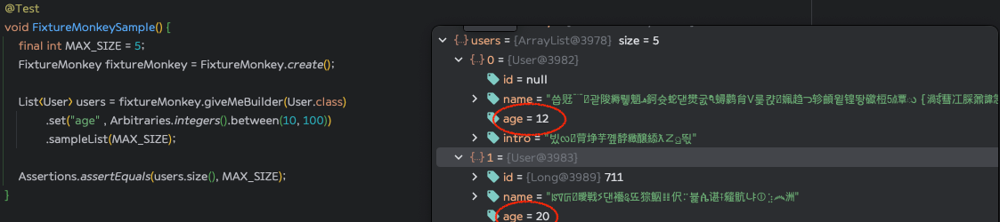
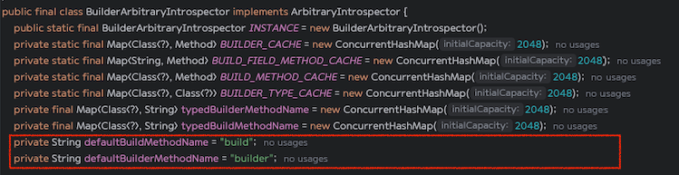

#  Fixture를 활용한 테스트코드 작성, 그런데 🙉 `FixtureMonkey`를 곁들인...   

안녕하세요.  😀<br>
올리브영 트랜잭션개발팀에서 백엔드 개발을 하고 있는 윤노트입니다.

이번 글에서는 테스트 코드를 작성하면서 사용하게되는 Fixture에 대한 설명과 어떻게 사용하여 
테스트코드를 작성하였는지데 대해서 정리하였습니다.

해당 글은 Fixture를 처음 경험한다는 가정하에 설명하도록 하겠습니다.

---
## 🛠️ Fixture

먼저 `Fixture`가 무엇인지 알아보겠습니다. `Fixture`는 말그대로 `고정되어있는 물체`를 의미합니다.

개발을 함에 있어서 제가 생각하는 `Fixture` 란 다음과 같습니다.

> 특정 객체에 대해서 사전에 미리 정의하여 필요시 정의된 객체를 호출해서 사용하는 용도. <br>
> 한마디로 `객체 생성 및 초기화 코드를 Fixture로 정의하고 테스트 코드에서 필요한 객체르 호출하여 사용하는 용도` 라고 생각합니다.

---

## 🤔 Fixture 어떻게 사용하고 있는데?

테스트 코드를 작성하면서 <b>한.번.쯤</b>은 누구나 테스트용 객체를 어떻게 구성해야 할지.<br>
어떻게 데이터를 넣어여 재사 및 운영할때 좋은 객체가 생성될지 고민을 해보셨을거라고 생각합니다.

이러한 고민을 해결해주기 위한 방법으로는 `생성자를 통해 생성하는 방식`, `패턴을 활용하는 방식`, `JSON 파일로 만들어놓고 ObjectMapper를 통해 불러오는 방식` 등등 
 다양한 방식을 활용하여 객체를 사용할 수 있습니다.

여러가지 방식중 <b>파트너스쿼드</b> 에서는 `Test Data Builder 패턴`과 `Object Mother 패턴` 을 활용한 방식과, `JSON 파일을 Object로 변환`하는 방식을 활용하여 
테스트 코드를 사용하였었습니다.

<br>

---

## 🛠️ 직접 생성자를 통해 Fixture 생성 방법

> 말그대로 사용하는 테스트 시점에 생성하거나, @BeforeAll 또는 @BeforeEach 를 통하여 테스트 시작 전에 생성할 수 있다. 

```java

public class SampleTest {

    private static User user;

    @BeforeAll
    static void setup() {
        user = new User(/* name */ "윤노트",  /* age */ 32,  /* intro */"🧑‍💻");
    }

    @Test
    void sampleTest() {

        final String expectName = "윤노트";
        final int age = 32;
        final String intro = "🧑‍💻";
        final User actual = UserFixture.createUser();

        assertThat(actual.getName()).isEqualTo(expectName);
        assertThat(actual.getAge()).isEqualTo(age);
        assertThat(actual.getIntro()).isEqualTo(intro);
    }
}
```

---

## 🛠️ Test Data Builder 패턴과 Object Mother 패턴을  통해 Fixture 생성

> Builder를 직접 구현하여 편의메서드를 만들거나, Lombok에서 제공하는 @Builder를 사용하여 구성 하는 방법도 있습니다.

아래와 같이 직접 구현하면 필요한 부분에 대해서는 편의메서드로 직접 생성하여 사용할 수 있습니다.

### @Builder를 사용한 User 코드

```java
/** User.class */
@Getter
@Builder
public class User {

    private String name;
    private int age;
    private String intro;

    private User (UserBuilder userBuilder) {
        this.name = userBuilder.name;
        this.age = userBuilder.age;
        this.intro = userBuilder.intro;
    }
}

```

### 직접구현한 Builder를 사용하는  User 코드

```java
/** User.class */
@Getter
public class User {

    // 필드 생략
    //...

    private User (UserBuilder userBuilder) {
        //...
    }

    public static class UserBuilder {

        // 필드 생략
        //... 

        // 메서드 생략
        // ...

        public User build() {
            return new User(this);
        }
    }
}

```

### UserFixture 코드

```java
public class UserFixture {
    public static User createUser() {
        // 직접 작성한 Builder 
        return new User.UserBuilder()
                .name("윤노트")
                .age(32)
                .intro("🧑‍💻")
                .build();
    }

    public static User createUserBuilderType() {
        // Lombok을 사용한 Builder
        return User.builder()
                .name("윤노트")
                .age(32)
                .intro("🧑‍💻")
                .build();
    }
}
```


### 테스트 코드


```java

@DisplayName("[User] 직접 구현한 Builder Test")
@Test
void builderTypeTest() {

    final String expectName = "윤노트";
    final int age = 32;
    final String intro = "🧑‍💻";
    
    // 직접 구현한 Builder
    final User actual = UserFixture.createUser();

    assertThat(actual.getName()).isEqualTo(expectName);
    assertThat(actual.getAge()).isEqualTo(age);
    assertThat(actual.getIntro()).isEqualTo(intro);
}

@DisplayName("[User] Lombok Builder Test") 
@Test
void lombokBuilderTypeTest () {

    final String expectName = "윤노트";
    final int age = 32;
    final String intro = "🧑‍💻";
    
    // Lombok을 통해 구현
    final User actual = UserFixture.createUser();

    // .. 검증 생략 위와 동일
}
```

<br>

---

## 🤔 기존방식에서 변경하려는 이유


파트너스쿼드에서 사용하고 있던 JSON to Object 방식과 직접 객체를생성해주는 방식을 사용하던중 `Fixture Monkey` 를 찾게 되었고 아래와 같은 이유로 변경을 하게 되었습니다.

1. 유연성 부족 및 코드 동기화 어려움.
   > API에 대해서 테스트 코드 작성 후 API의 응답 형식 및 API 자체가 변경될 경우 테스트 코드도 함께 수정이 필요하다. 또한 빠르게 API를 수정하다 보니 테스트 코드를 수정하지 못하여 동기화가 되지 못하는 경우.

2. 개발자가 개발 하고 테스트 코드를 작성하다보니 놓치게 되는 엣지케이스.
   > 테스트 코드를 미리 작업하고 API를 작성하면 좋지만 그렇지 못한 경우 API를 작성한 후 테스트 코드를 작성하다보니 <br> 
   > 이미 나의 뇌가 어떻게 데이터를 넣어야 에러가 안나는지 학습해버려서 .. 엣지케이스를 놓치는 경우..

3. 다양한 테스트 객체를 생성하여 테스트 커버리지를 높이기 위해 오히려 복잡해지는 코드.
   >  복잡한 로직 하나를 확인하기 위해 여러개의 객체를 추가하고,, 만들어내고,,  복잡합니다..!
   
<br>

---

<br>

## 기존 Fixture를 바꿔보자! [🙉 Fixture Monkey]((https://naver.github.io/fixture-monkey/v1-0-0/)) 두두등장




> 
> Fixture Monkey는 2023.11.10일에 정식 1.0.0 버전이 Release 되었습니다.
> 
> `Java & Kotlin library for automatically generating reusable and controllable, arbitrary test fixtures`
> Fixture Monkey의 공식 홈체이지 대문에 걸려있는 글입니다.
> 
> `재사용 가능하고 복잡한 임의의 테스트 Fixture를 자동으로 생성해주는 Java&Kotlin 라이브러리`라고 나와있습니다.
>
> 또한 자바 표준 Bean Validation 1.0(JSR-303), Bean Validation 2.0 (JSR-380) 어노테이션을 사용하여 객체를 생성하기 때문에
> 전용 어노테이션이 추가로 필요하지가 않다는 장점이 있는것 같습니다.


<br>

---

<br>


## ✍️ 편한건 알았으니 이제 사용해보자!

> 해당 라이브러리를 추가하는 것은 Github에 너무 잘나와있기 때문에 적용하였다고 가정하고 진행하겠습니다.

사용법은 간단합니다. 사용하고자 하는 코드에 `FixtureMonkey.create()`를 사용하여 쉽게 시작할 수 있습니다.

```java
@Test
void FixtureMonkeySample() {
    final int MAX_SIZE = 5;
    FixtureMonkey fixtureMonkey = FixtureMonkey.create();

    List<User> users = fixtureMonkey.giveMe(User.class, MAX_SIZE);

    assertThat(users).hasSize(MAX_SIZE);
}
```


<br>

#### 위 사진은 실제 코드를 디버깅모드로 실행하였을때의 데이터 결과 값입니다.
#### `users` 변수를 확인해보면 랜덤하게 생성된 size 5의 컬렉션을 반환한것을 확인할 수 있습니다. 또한 각각 index에 해당하는 row에
#### FixtureMonkey가 랜덤한 값들을 넣어준것을 확인할 수 있습니다.
 
<br>

해당 코드는 Builder를 통해 생성되는 특정 Field의 데이터 값을 고정하거나, Arbitraries를 사용하여 특정 범위의 값만 넣도록 설정한 예입니다.
`age`의 경우 10  100사이의 값만 넣으라는 내용입니다. 우측 사진처럼 각 index의 데이터의 age가 10 이상 100 이하인것을 확인할 수 있습니다.

```java
@Test
void FixtureMonkeySample() {
    final int MAX_SIZE = 5;
    FixtureMonkey fixtureMonkey = FixtureMonkey.create();

    List<User> users = fixtureMonkey.giveMeBuilder(User.class)
            .set("age" , Arbitraries.integers().between(10, 100))
            .sampleList(MAX_SIZE);

    assertThat(users).hasSize(MAX_SIZE);
    assertThat(actual.get(0).getAge()).isBetween(10, 100);
}
```


>  🔥🔥 만약 직접 테스트해보기 위해 User.class를 생성하여 돌렸더니 실행이 안되거나 데이터가 만들어지지 않는다면 Getter, Setter를 추가해주시기 바랍니다. 해당 내용은 아래에서 한번더 다루겠습니다.

<br>

---

<br>

## ❓ 파트너 스쿼드에서는 어떻게 적용하였을까

> 1. 데이터 생성 전략을 FailoverArbitraryIntrospector 설정
> 2. 기존 Fixture 생성 방식 FixtureMonkey로 변경 
> 3. ♻️ 재사용 가능한 부분에 대해서는 Util로 변경


--- 

## 데이터 기본 생성 전략 변경 
[Fixture Monkey 인스턴스 생성 방법](https://naver.github.io/fixture-monkey/v1-0-0/docs/generating-objects/introspector/#constructorpropertiesarbitraryintrospector)
> FixtureMonkey 의 기본 생성 방식은 `BeanArbitraryIntrospector` 입니다 .

<br>

### ⭐ [BeanArbitraryIntrospector](https://naver.github.io/fixture-monkey/v1-0-0/docs/generating-objects/introspector/#beanarbitraryintrospector)
> BeanArbitraryIntrospector 방식은 리플렉션과 Setter 메서드를 사용하여 객체를 생성하기 때문에 생성하고자 하는 클래스에 `기본생성자`와 `Setter`가 있어야 합니다.


<br>

### ⭐ [ConstructorPropertiesArbitraryIntrospector](https://naver.github.io/fixture-monkey/v1-0-0/docs/generating-objects/introspector/#constructorpropertiesarbitraryintrospector)
> ConstructorPropertiesArbitraryIntrospector 방식은 이름 그대로 생성자를 이용한 생성방식입니다.

<br>

### ⭐ [FieldReflectionArbitraryIntrospector](https://naver.github.io/fixture-monkey/v1-0-0/docs/generating-objects/introspector/#fieldreflectionarbitraryintrospector)
> FieldReflectionArbitraryIntrospector는 리플렉션 방식을 이용하여 인스턴스를 생성하고 필드에 값을 설정한다. <br>
> 따라서 기본생성자와 getter 또는 setter가 있어야 한다. 라고 설명이 되어있지만 실제 테스트시 Getter, Setter가 구현되어있지 않고 기본생성자만 있어도 생성이 됩니다.
> 
> 단, final이 아닌 가변 객체에 대해서는 @Getter, @Setter가 없는 경우도 생성이 된다고 합니다!<br>
> https://github.com/naver/fixture-monkey/issues/961#issuecomment-2021906200

<br>

### ⭐ [BuilderArbitraryIntrospector](https://naver.github.io/fixture-monkey/v1-0-0/docs/generating-objects/introspector/#builderarbitraryintrospector)
> BuilderArbitraryIntrospector는 빌더 방식을 이용하여 인스턴스를 생성하고 필드에 값을 설정한다. <br>
> Lombok @Builder를 사용하여 사용가능하며, Lombok을 사용하지 않는경우 `builder`, `build` 이름을 갖는 메서드를 생성해주면
> 정상적으로 데이터가 설정되어 객체가 생성되는것을 확인할 수 있수있습니다.



<details>

 <summary> <b style="font-size: 18px;">직접 Builder 구현하는 경우</b> </summary>

```java
public class User{

    // 필드 생략 
    // ...

    private User(Long id, String name, int age) {
        this.id = id;
        this.name = name;
        this.age = age;
    }

    public static class Builder {
        // 필드 생략 
        // ...

        // 메서드 생략
        // ...

        // 해당 이름(build)이 아니라면 생성되지 않음.
        User build() {
            return new User(this.id, this.name, this.age);
        }
    }

    // 해당 이름(builder)이 아니라면 생성되지 않음.
    static Builder builder() {
        return new Builder();
    }
}
```

</details>

<br>


### ⭐ [FailoverArbitraryIntrospector](https://naver.github.io/fixture-monkey/v1-0-0/docs/generating-objects/introspector/#failoverarbitraryintrospector)
>  테스트 코드를 작성하다보면 작성된 코드의 객체 생성방식이 모두 달라 단일로는 생성이 되지 않는 경우가 발생할 수 있습니다.
> 
> 그런 경우 `FailoverArbitraryIntrospector`를 사용하여 여러개의 생성방식을 지정할 수 있습니다.

<br>

---

<br>

## 기존 Fixture 생성 방식 FixtureMonkey로 변경한 이유 

기존 파트너오피스 스쿼드에 작성된 테스트코드는 `test/resources` 하위에 도메인별 fixture에 해당하는 json파일들을 구성해 놓고 파일을 읽어 ObjectMapper를 통해
객체로 변환하여 사용하였습니다.

하지만 json파일의 경우 변환하고자 하는 클래스에 필드가 없지만 json파일안에 해당 키가 있다면 변환시 ObjectMapper에서  `UnrecognizedPropertyException`을 발생시켜
JSON 파일의 구조가 변경되면 해당 구조를 반영하기 위해 모델 클래스를 업데이트해야 합니다. <br>
다만 ```new ObjectMapper().configure(DeserializationFeature.FAIL_ON_UNKNOWN_PROPERTIES, false);``` 설정을 추가하면 변환할 수 있다.

또한 다양한 케이스에 대해서 테스트하기 위해서는 json 파일들을 케이스마다 하나씩 만들어줘야했으며 개발자입장에서 엣지케이스를 테스트하는데 불편함이 있었습니다.

FixtureMonkey 를 사용하면 몇줄의 코드로 정상케이스, 엣지케이스들을 쉽게 생성 및 재사용 가능하기때문에 변경하게 되었습니다.

<br>

---

<br>

## ♻️ Utils 클래스 변경 및 재사용성 구성 

>`Define complex specifications once and reuse them! Configurations of instances can be reused across multiple tests.`<br><br>
> FixtureMonkey의 장점중 하나인 Reusability입니다. 메인화면에서 강조하는것처럼 복잡한 구조를 한번 정리하여 다수의 테스트에서 재사용할 수 있다.

첫번째는 Common(Util) 클래스로 변경하는 내용입니다. Request, Response, Domain, Entity 처럼 용도에 따라 객체를 생성하는 방식이 다르기 때문에 FixtureMonkey객체를 용도에
따라 분리하는것이 아닌 `FailoverIntrospector`을 사용하여 구성하도록 변경하였습니다.

```java
public class FixtureCommon {
    
    /** 
     * 테스트코드를 작성하는 메서드에서 호출하여 사용할 수 있도록 static Field로 구성
     * FixtureMonkeyUtils.fixtureMonkey;`와 같이 공통 설정에 대해서 사용하도록 합니다.
     */
    public static FixtureMonkey fixtureMonkey = FixtureMonkey.builder()
        .objectIntrospector(new FailoverIntrospector(
            Arrays.asList(
                FieldReflectionArbitraryIntrospector.INSTANCE,
                BeanArbitraryIntrospector.INSTANCE,
                BuilderArbitraryIntrospector.INSTANCE
            )
        ))
        
        // FixtureMonkey의 대입값에 null 허용하지 않음.
        .defaultNotNull(true)
        .build();
}
```

<br>
두번째는 재사용 가능한 객체들에 대한 정의 입니다. 해당 예제는 실제 코드가 아닌 샘플 코드입니다.

`이름은 윤노트인데 나이만 32살, 33살로 구성하여 테스트 코드를 작성`과 같은 간단한 예를 들겠습니다.<br>
(설명을 위해 간단한 예를 들었습니다.)

```java
public class FixtureCommon {
    // ...

    private static ArbitraryBuilder<User> fixName() {
        return fixtureMonkey.giveMeBuilder(User.class)
                .set("name", "윤노트");
    }

    public static User age32YunNote() {
        return fixName()
                .set("age", 32)
                .sample();
    }

    public static User age33YunNote() {
        return fixName()
                .set("age", 33)
                .sample();
    }
}
```

```java
@Test
void FixtureMonkeyReusabilityAge32Sample() {

    User actual = FixtureCommon.age32YunNote();

    assertThat(actual.getName()).isEqualTo("윤노트");
    assertThat(actual.getAge()).isEqualTo(32);
}

@Test
void FixtureMonkeyReusabilityAge33Sample() {
    User actual = FixtureCommon.age33YunNote();

    assertThat(actual.getName()).isEqualTo("윤노트");
    assertThat(actual.getAge()).isEqualTo(33);
}
```

위와 같이 ArbitraryBuiler를 사용하여 구성하는 부분을 재사용하여 특정 필드들만 set하여 사용할 수 있습니다. <br>

<br>

---

## 💭 정리 

> 테스트코드를 작성하는 분들이라면 `🙉 FixtureMonkey`를 사용해보시는것을 추천드립니다. <br>
> 테스트 코드를 작성하는 것은 매우 중요하다는것을 모두 알고있지만, 업무를 보다보면 시간이 부족하거나, 테스트 객체를 작성하는것이 귀찮기 때문에 다음에 작성해야지!!
> 라고 넘어가는 분들도 많을것이라고 생각됩니다.  <br> 이러한 문제에 대해서 FixtureMonkey는 대부분의 사람들이 쉽게 사용할 수 있는 도구라고 생각이 되며, 간단한 몇줄의 코드로
> 다양한 테스트 케이스에 대해서 생성해 낼 수 있어 테스트 코드의 신뢰도가 올라갈것으로 생각되며 코드의 양도 많지 않아보다 깔끔하고 가독성 좋은
> 객체를 생성해 낸다는 큰 장점이 있다고 생각합니다.
> 
> 실제로 파트너스쿼드에서 약 500개 이상의 테스트코드를 FixtureMonkey를 사용하였으며 테스트에 필요한 관심 필드들을
> 명시적으로 표현함으로 Fixture를 생성하는 시간을 줄일 수 있었으며, 엣지케이스들을 통해 미쳐 발견하지 못한 케이스들에 대해서도
> 작성할 수 있었습니다.


