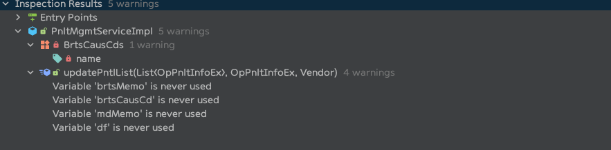
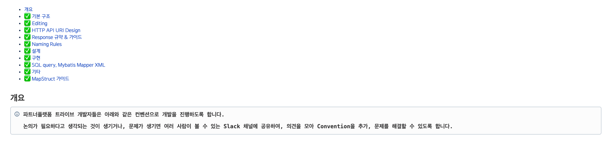
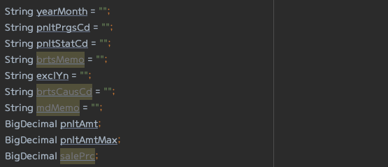
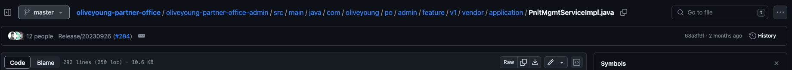
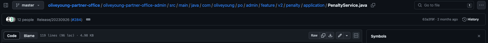
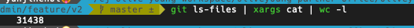
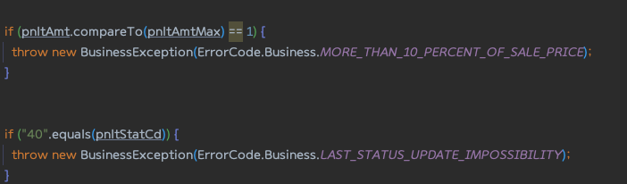
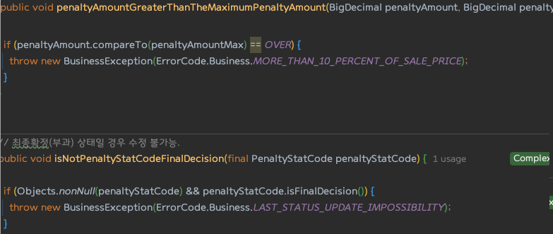
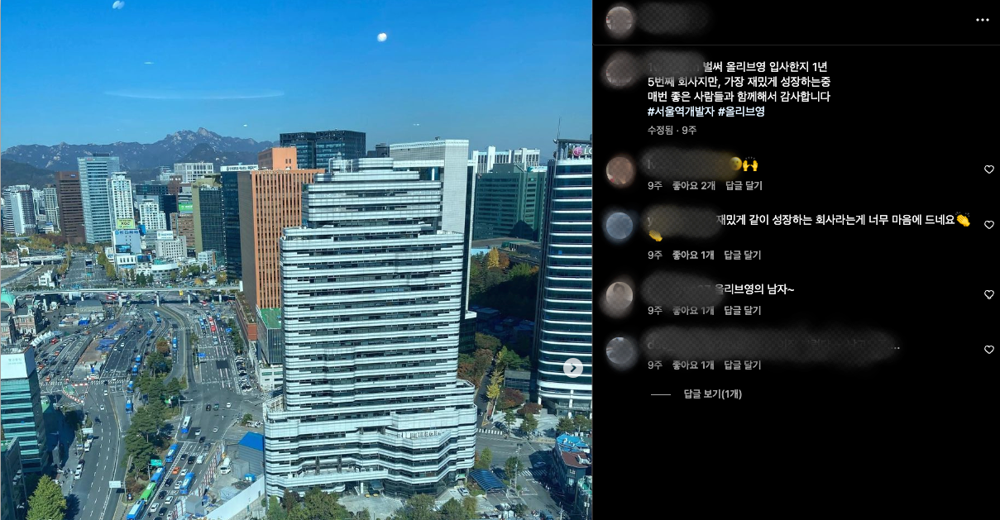

# 파트너오피스 리뉴얼, 왜 우리는 리팩토링을 하였는가?

안녕하세요.  
올리브영 파트너 스쿼드에서 백엔드 개발을 하고 있는 윤노트입니다.

파트너 스쿼드에서는 말그래도 파트너사들이 사용하는 플랫폼을 개발하고 있습니다. 

해당 내용에서는 코드개선을 왜 하게되었는지, 코드개선을 함으로써 얻은 장점과 느낌에 대한 내용에 대해서 설명합니다.

---

## 🤔 잘 돌아가잖아! 근데  코드 개선하는 이유가 뭔데?

처음 코드를 제대로 확인하기 전까지는 `왜? 잘돌아가는데 굳이 개선하려는 이유가 뭐지? ` , ` 금방 바꿀 수 있을꺼 같은데?` 와 같은 생각을 했습니다.

하지만 직접 코드를 보고 ~~맞기 전 까지~~ 개발/운영을 하다보니 제 생각이 틀렸다는 것을 알았습니다..

저희가 가지고 있는 레거시 코드는 다음과 같은 문제들이 있었습니다. 

> #### 🔥 코드가 너무 중구난방이고 코드를 눈으로 쫒아가기 너무 힘들어요! 
>   > <b>개인적으로 읽기 좋은 코드가 좋은 코드라고 생각합니다. 읽기가 너무 힘듭니다❗❗❗</b> 
>   > 
> #### 🔥 축약어가 너무 많은데 이게 도대체 뭐야?  
>   > `pnlt` == `penalty`  `entr` == `enterprise`   `onl_brnd_nm` == `online_brand_name`   간단하게 예로 설명할 용어들이다 처음보면 도대체 이게 무엇을 의미하는지 한번에 알기가 어렵다.
> #### 🔥 기존 기능을 수정 하려고 하는데  다른 곳 에서도 쓰이는데 이거 수정해도 괜찮은건가?? 
>   > 아래 이미지는 설명 참고용입니다
>   >  
>   > EtEntrDlexInfoCondition 에 필드안쓰니까 삭제하려고 하는데, 사용하는 API가 4군데인데 1개의 API를 수정하기 위해 3개의 API를 확인해야한다.
> #### 🔥 (코드 분석 후 ...) 뭐야?! 안쓰는 변수, 메서드 잖아?! 
>  
>  > 
>  > 선언은 되어있는데 확인해보니 사용하지 않고 있는 변수, 메서드들이 많습니다.
> 
> #### 🔥 코드 컨벤션도 다 다른데 어떤걸 따라서 작성하는게 좋을까 ?
> 
>  > 가져오기 -  `getXXX()`, `searchXXX()`, `findXX()` 
>  > 등록 -  `persistXX()`, `saveXX()`, `registXX()` , 
>  > 수정 - `updateXX()`, `modifyXX()`  
>  > 삭제 - `deleteXX()`, `removeXX()`  
>  > 
>  > 동작에 대한 네이밍이 일관되지 않아 가독성을 해치고 운영 및 리뷰때 효율적인 코드리뷰가 되지 않는다고 생각하였습니다.
> 

---

## 🤔 어떻게 코드 개선을 진행 해볼까 ?!

팀원들과 `자! 이제 코드 개선해보자`라고 생각하자마자 고민에 빠지게 되었습니다.

> 코드 개선을 하긴 할껀데, 도대체 이 코드를 어디서 부터 어떻게 나눠서 진행 해야되지 ... 뭐 부터 건드려 볼까??

결론은 `결국에는 한번 건드려야할 코드이기 때문에 이참에 다 변경하자!` 였습니다.

#### 코드 개선 순서는 다음과 같았습니다.

1. 코드 스타일 통일 - 모든 개발자가 작성하는 코드 스타일이 다르기 때문에 1~2명의 개발자가 개선작업을 진행 코드 리뷰를 통해 코드 스타일 컨벤션 통합
2. 범용적으로 사용되는 클래스 제거
3. 사용되지 않는 변수 및 메서드 제거
4. 상태코드 상수값 Enum 변경 및 매직 넘버 변경
5. 불필요하게 호출 되는 메서드 분석 및 비지니스 로직 개선

- ### 1. 팀 코드 스타일 컨벤션  정의
  > 가장 먼저 진행한 일은 `코드 스타일 가이드` 를 정리하는 것 이었습니다. 개인마다 작성하는 클래스명, 변수명등 스타일이 다르기때문에 이러한 
  > 차이가 추후에 다시한번 코드 개선을 진행하게끔 하는 관리 포인트가 될 수 있을것이라고 생각하였습니다.
  > 
  > 
  > 
  > 
  > 
  > 위 와 같이 총 10가지 내용으로된 컨벤션과 총 61번의 코멘트와 함께 팀 코드 스타일 컨벤션이 정의되었습니다.

 

- ### 2.범용적으로 사용되는 클래스 제거
    > 두번째로는 범용적으로 사용하기 위해 만든 클래스를 개선 대상으로 진행하였습니다.
  > 
  > 위 사진은 필드명은 블러처리를 하였으나 각자 다른 필드를 의미하는 변수입니다.
  > 사진으로 다 보여드리지는 못하였지만 EtEntrBaseEx가 상속과 함께 포함하는 필드가 158개였습니다.  
  > EtEntrBaseEx - 70개, EtEntrBase - 64개, BaseCommonEntity - 24개   
  >  모든 기능과 필드를 하나의 클래스에 넣어서 처리하는 것은 운영 및 수정이 어렵고, 확장성과 재사용성을 저해할 수 있는 요소로 판단하여 각 기능에 대한 도메인으로 분리하였습니다. 
  > VO로 묶을 수 있는 필드들에 대해서는 VO로 재정의하며, 더 이상 사용하지 않는 필드들은 사용유무 확인 후 과감하게 제거 하였으며, 도메인을 재정의 하였습니다.

 

- ### 3. 사용하지 않는 변수 및 메서드 제거 
   > 세번째는 사용하지 않는 변수와 메서드를 제거하는 일이었습니다 .
   > 
   > 
   > 
   > 위 사진처럼 코드를 분석해보니, 전혀 사용하지도 않는 변수 및 메서드들이 숨어있었고 해당 내용들을 삭제하였습니다. 
   > (IDE가 너무 친절하게 잘 알려주었다.. 😄 하지만 혹시 몰라서 2차적으로 확인 진행. ) 
 

 

- ### 4. 상태코드 상수값 Enum 변경 및 매직 넘버 변경
  > 아래 코드는 중간 부분만 제가 제거하고 실제로 작성되어있던 코드를 가져왔습니다.
  > 
  > 
  >
  > 도대체 10, 30, 40, 45는 무엇일까 고민하게 되었으며 상태를 의미하는 값들에 대해서는 Enum으로 변경작업을 진행하였습니다.
  > 

- ### 5. 불필요하게 호출 되는 메서드 분석 및 비지니스 로직 개선
   > (코드를 직접 기입할 수 없어 설명으로 대체하였습니다.) 
   > 개선전 코드의 경우 하나의 Service에 있는 하나의 메서드가 대략 110줄의 코드를 가지고, 변수 설정, 정책 확인, 조건에 따른 값 변경, 예외처리등  
   > 모든 책임을 가지고 로직을 처리하고 있었습니다.  
   >  
   > 따라서 비지니스 로직에 대해서 정책, 변환등의 작업을 따로 분리하여 책임분담을 하였으며 함축적으로 사용하고 있는 변수명들에 대해서도 
   > 풀어서 작성하여 정확히 해당 로직이 무엇을 하는 내용인지 명확하게 파악할 수 있도록 코드를 개선하였습니다. 

---

## 👍 그래서 뭐가 좀 나아졌는데??

## 코드 라인 감소

> 특정 서비스 로직에 대해서 라인수 확인 시 50%이상의 개선된 파일들도 확인할 수 있었습니다.

#### 😭 개선 전 

#### 🤗 개선 후  

> 개선되기 전 패키지와, 개선된 후의 패키지의 전체 라인 비교시 대략 30%의 코드 감소를 확인할 수 있었습니다.

#### 😭 Package 전체 라인 개선 전

#### 🤗 Package 전체 라인 개선 후

---

## String 상수 상태값 Enum 변경 

> 기존에 사용하던 상수들에 대해서 Enum 값으로 변경하면서 상태값에 대한 내용을 직관적으로 확인 할 수 있습니다.

#### 😭 코드 값 개선 전

#### 🤗 코드 값 Enum으로 개선 후
 

#### 코드량이 조금 증가하였지만 메서드 및 Enum 으로 변경하면서 재사용성과 코드를 직관적으로 해석 할 수 있습니다.

---

## Request, Response 개선 

> Request, Response 의 경우 개별 파일로 동작하여 서로 다른 API에서 같은 Response 를 사용하여 하나의 API 스펙 변경시 다른 API에서도
> 사이드 이펙트가 발생할만한 내용들이 있었습니다.
> 
> 따라서 하나의 API당 하나의 Request, Response를 짝지어서 사용하도록 개선하였으며. InnerClass로 만들어 `xxx.Request`, `xxx.Response`와 같이 사용하도록 변경하였습니다.
>  
> 이러한 변경을 통해 기대하는 장점은 다음과 같다고 생각합니다.
> 
>  #### 1. 명확한 이해
> > 하나의 API당 하나의 Request, Response로 구성되어있기 때문에 빠르게 로직을 이해하고 파악할 수 있다고 생각합니다.
> 
>  #### 2. 운영의 편리성 
>  > Request, Response 가 API하나에 매핑되기 때문에 새로운 기능의 추가, 수정시 다른 API에서의 사이드이펙트를 걱정할 필요가 없으며. 유연하게 작업이 가능할 것으로 생각합니다.

----

## 🧑🏻‍💻 개선을 통해 우리가 발전했을까?

> 코드 개선을 통해 우리는 한발짝 더 나아갔는지 확인해보겠습니다.

### 서비스에 대한 이해도 상승 :) 
> 글을 쓰고있는 저의 경우 입사한지 2개월 후 해당 코드개선을 진행하게 되었습니다.  
> 큰 규모의 서비스를 1~2개월안에 완전하게 파악한다는 것은 사실 어려운(?)일이라고 생각합니다. ~~어디까지나 내 생각..~~ 
>
> 개선을 하기 전에는 서비스에서  사용하고 있는 API또는 비지니스 로직에 대해서 정확하게 이해를 하고 있지 못한상태였습니다.
> 코드 개선을 통해서 API의 내부에서 사용되는 로직과, 정책등에 대해 다시한번 정확하게 파악할 수 있어 서비스에 대한 이해도가 상승하는 효과를 
> 보았다고 할 수 있을것 같습니다.

 

### 레벨업!
>  가끔 코드를 작성할때 `나는 이렇게 작성하였는데 이게 맞는걸까?`, `이 방식보다 더 좋은 방식이 있을것 같은데 어떻게 해야할까?`와 같은 고민을 할때가 있었습니다.
> 
> 코드 개선하기위해 팀원들과 리뷰를 많이 진행하면서 궁금증에 대한 해답을 얻을 수 있었고, 개선을 하기 위해 다양한 자료들을 찾아보며 더 좋은 코드를 작성하며 학습할 수 있었습니다.
> 
> 또한 다양한 방식의 접근을 통해 우리가 놓친 부분에 대해서도 다양한 시각으로 바라 볼수 있었습니다. 

 

---

## 🧑🏻‍💻 마무리

이번 포스팅에서는 왜 리팩토링을 진행하게 되었고 어떠한 부분에 대해서 진행하였는지, 결과를 통해 얻은 경험에 대해서 공유할 수 있었습니다.

마지막으로 파트너 스쿼드의 김XX님의 인스타그램의 글을 가지고 왔습니다. 코드 리팩토링을 진행하면서 작성해주신 내용입니다.

  
오늘도 저희는 `가장 재밌게 성장` 하고 있습니다! 

다음 포스팅으로는 `파트너오피스 리뉴얼,  기능도 중요하지만 데이터가 더 중요한 이유!`에 대한 내용으로 찾아오도록 하겠습니다.

감사합니다.

