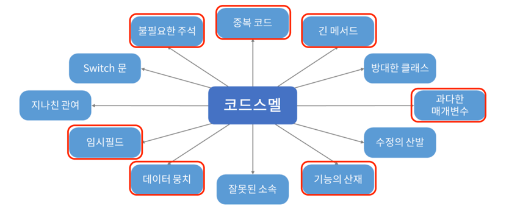

# 파트너오피스 리뉴얼, 왜 우리는 리팩토링을 하였는가?

안녕하세요 XXX입니다 .

이번시간에는 올리브영 파트너들이 사용하는 파트너오피스 플랫폼의 레거시 코드를 개선하면서 얻은것과, 발생하였던 문제, 문제에 대한 해결 3가지 주제로 설명해보겠습니다.

---

## 🔥 잘돌아가는데 개선하는이유가 뭔데

많은 분들은 위 사진처럼 머릿속에서 `왜? 잘돌아가는데 굳이 개선하려는 이유가 뭔데?` 라고 생각하실 수 있을것 같습니다.

저 또한 많은사람들과 같은 생각을 했었습니다, 하지만 다시 생각해 보니 코드는 사실상 쓰는 횟수보다 코드를 읽는 횟수가 훨씬 많으며, 개발을 할때 쓰는비용보다 읽는 비용이 더 크다고 생각하게 되었으며.
팀원들 또한 저와 비슷한 생각으로 개선작업을 진행하고자 했을것이라고 생각합니다.

그렇다면 저희팀에서 개선하는 가장 큰 이유가 무엇인지 나열해 보도록 하겠습니다.

> 🔥 실제로 코드가 너무 뒤죽박죽이고 개발을 할때 눈을 코드를 쫒기가 힘들다. 
> 🔥 이슈가 발생했을떄 디버깅하는데 시간이 너무 오래 걸린다. 
> 🔥 새로운 기능의 도입, 수정시 기존 코드를 변경하면 다른 기능에 사이드 이펙트가 발생한다 
> 🔥 막상 소스를 분석하고보니 사용하지 않는 변수, 메소드, 쿼리로 구성되어있다.(코드스멜 정리)  
> 🔥 여러명의 개발자가 각자 자신만의 스타일로 작성되어있어 매번 개발할때 마다 코드를 이해해야한다. 

바로 위와 같은 문제(?)들로 인하여 코드 개선 작업을 진행하게 되었습니다. 

---

## ❓어떻게 코드 개선을 진행했을까? 

처음 소스코드를 접했을때 같이 개선작업을 진행하는 팀원들과 고민을 많이했습니다. 
이 코드를 어디서 부터 건드려야할까.. 건드리면 문제되는게 아닐까?? 

하지만 시간이 지나면 결국 누구던지 건드려야할 코드였기 때문에 각오(?)하고 건드려보았습니다.

#### ☝  첫번째로 `🔥 여러명의 개발자가 각자 자신만의 스타일로 작성되어있어 매번 개발할때 마다 코드를 이해해야한다` 해당 문제부터 해결하기로 하였습니다.

하나의 패키지를 기준으로 코드 개선작업을 시작했으며 서로 변경된 코드에 대해 이야기와 피드백을 주고받으면서 `코드 스타일 가이드`를 작성하여 개선작업에 활용하기 시작하였습니다. 
패키지는 어떻게 구성되도록 변경하며, 변수명의 경우 축약어를 쓰지 않고, Request, Response분리등등 다양한 문제에 대해서 가이드를 작성하였습니다.

//todo - PR 사진 첨부 필요 

위와 같은 작업들을 대략 1~2주 정도 반복 한것 같습니다. 

// todo - 추가로 서로 다른사람이 코드 스타일 가이드를 기준으로 개선한 내용 첨부

그 결과 대략적으로 다른 패키지들에 대해서도 작업을 할때 `코드 스타일 가이드`기준으로 작성하게 되었으며 여러명이 개선작업을 한 코드이지만 마치 한사람이 작업한것과 같은 코드를 작성할 수 있었습니다.

> 파트너플랫폼 파트에서 작성한 `코드 스타일 가이드 `에 서는 추후 다시 한번 작성하겠습니다!.

 

#### ✌🏻 두번째로는 `🔥 막상 소스를 분석하고보니 사용하지 않는 변수, 메소드, 쿼리로 구성되어있다`에 대한 해결 이었습니다.

대략적인 패키지, DTO에 대한 구성을 하고 상세 서비스 로직을 파악하기 시작하였습니다. 비지니스 로직에 대한 이해를 바탕으로 개선작업을 진행해야했기 때문에 복잡하지만 위에서부터 천천히 분석하기 시작하였습니다.

그런데 황당하게도 코드를 분석하고  작성하다보니 전혀 사용하지도, 호출하지도 않는 코드들이 숨어있었습니다.  
아래와 같이 코드스멜에 해당하는 코드들을 찾아내고 삭제, 개선하기 시작했습니다.

//todo - 실제 개선전 코드와, 개선 후 코드를 블러 처리하여 비교 사진 첨부 예정.

상세 내부 코드들은 공개 할수 없지만 위의 사진들만 보아도 한눈에 보기 쉽게 정리된것을 확인할 수 있었습니다. 

 

위 두개의 내용에 대해서 정리를 하고 보니 아래 3건에 대한 내용은 자연스럽게 해소가 될 수 있었습니다.

> 🔥 실제로 코드가 너무 뒤죽박죽이고 개발을 할때 눈을 코드를 쫒기가 힘들다. 
> 🔥 이슈가 발생했을떄 디버깅하는데 시간이 너무 오래 걸린다. 
> 🔥 새로운 기능의 도입, 수정시 기존 코드를 변경하면 다른 기능에 사이드 이펙트가 발생한다

---

## 👍 코드 개선 작업을 진행하면서 우리가 얻은것

기존 코드를 대략 2~3개월동안 개선 작업을 하면서 우리는 아래와같은 이점을 얻을 수 있었습니다.

- 정상적으로 동작할것이라고 생각했던 로직에 대해 다시 한번 확인하여 비지니스 로직을 정확하게 파악 할 수 있다.
- 공통코드의 분리를 통해 이슈되는 코드의 변경을 진행하여도 다른 코드에 영향을 미치지 않는다.
- 다양한 도메인에 대한 전반적인 지식과 해결해야 하는 문제에 대해 정확히 알 수 있었다.
- 코드 개선을 통해 불필요한 변수나 비지니스 로직에 대해서 재정의 하여 보기 좋은 코드, 눈으로 쫒기 쉬운 코드를 만들 수 있었다.
- 여러명의 개발자가 통일된 스타일로 개발을 할 수 있어 마치 한사람이 작성한것과 같은 효과를 주어 코드를 이해하기가 쉽다.

~~코드적인것 뿐만 아니라 팀과의 친밀감이나 타부서에 대한이해 등을 설명하고 즐겁게 했다는것을 정리 해야함~~ 

---

## 👎 발생한 문제 

이번에 코드를 개선할 수 있는

---

참고 이미지 출처

 - https://xangmin.tistory.com/162