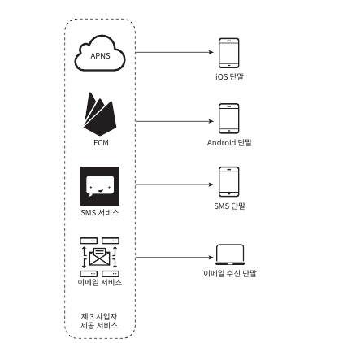
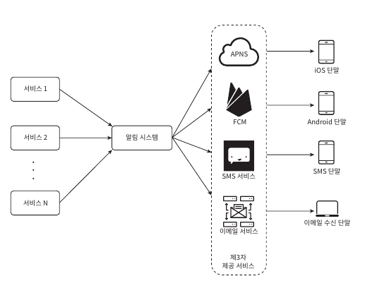
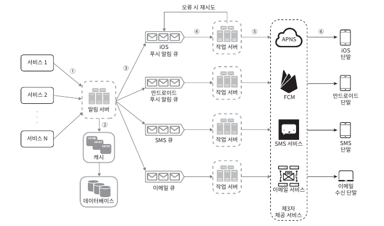
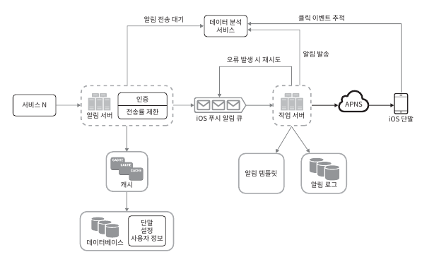

알림시스템

알림시스템은 모바일 푸시, SMS, Email 이렇게 3가지로 나눌 수 있다.

알림서비스를 구현하기 위해서는 3가지의 내용을 다룬다.

- 알림 유형별 지원 방안
- 연락처 정보 수집 절차
- 알림 전송 및 수집 절차

---

### 알림 유형별 지원 방안
iOS에서 푸시알림을 보내기위해서는 세개의 컴포넌트가 필요하다.

#### 알림 제공자
> 알림요청을 만들어 애플 푸시알림서비스인 APNS(Apple Push Notification Service) 로 보내눈 주체다. 
> 알림요청을 만드려면 다음과 같은 데이터가 필요하다  
> 
> 단말 토큰 (Device Token) - 알림요청을 기기에 보내는데 필요한 고유식별자. 
> 페이로드 (payload) - 알림 내용을 담은 JSON 딕셔너리 

 

####APNS (Apple Push Notification Service)
> 애플이 제공하는 원격 서비스이다. 푸시 알림을 iOS로 보내는 역할을 담당한다.

 

#### iOS 단말
> 푸시 알림을 수신하는 사용자 단말.

---

### 안드로이드 푸시알림
> 안드로이드 푸시알림 또한 iOS와 비슷한 절차로 전송된다 다만 APNS대신에 FCM(Firebase Cloud Messaging)을 사용한다는 점만 다르다.

---

### SMS 메시지
> SMS 메세지를 보낼때는 주로 트윌리오, 넥스모같은 제 3사업자의 서비스를 많이 이용한다, 다만 상용서비스들이라
> 일정 이용요금을 내야한다.

---

###  이메일

대부분의 회사가 이메일 서비스를 구축할 역량을 가지고있지마 샌드그리드, 메일침프와 같은 이메일 서비스를 이용한다.
해당 서비스들은 전송 성공률도 높고 데이터 분석 서비스도 제공한다.

---

위 4가지 유형에 대해서 하나의 그림으로 표현하면 다음과 같다.

---

### 설계안 초안 

- ### 1 부터 N개의 서비스
> 마이크로서비스일 수 있으며, 크론잡, 분산 시스템 컴포넌트일 수도 있다. 과금서비스, 배송알림을 보내려는 쇼핑몰 웹사이트등이 그 예다.

- ### 알림 시스템
> 알림 전송/수신 처리의 핵심이다, 초안에서는 1개의 알림 시스템을 사용한다고 가정한다. 
> 알림 시스템은 서비스들에게 전송을 위한 API를 제공해야 하고, 제 3자 서비스에 전달할 페이로드를 만들어 낼 수 있어야한다.

- ### 제 3자 서비스
> 사용자들에게 알림을 실제로 전달하는 역할을한다.
> 제 3자 서비스를 통합을 진행할 때 유의해야할 점이 있다. 그것은 확장성이다. 
> 쉽게 서비스를 통합하거나, 기존 서비스를 제거할 수 있어야한다는것이다. 또한 해당 서비스가 다른 시장에서는 사용할 수 없을 수 있다는것이다. 
> FCM은 중국에서는 사용할 수 없다, 중국시장에서는 제이푸시, 푸시와이같은 서비스를 이용해야만 한다

### 설계도 초안의 문제

해당 설계도 초안대로 만들게 되면 몇가지 문제가 있다.
1. SPOF(Single-Point-Of-Failure) - 알림 서비스에 서버가 하나밖에 없단는것이다, 해당 알림시스템 서버에 장애가 발생한다면 곧바로 장애로 이어진다는 내용이다.
2. 규모 확장성 - 한대의 서비스로 푸시 알림에 대한걸 모두 처리하기때문에, DB나 캐시등 중요 컴포넌트의 규모를 개별적으로 늘릴수 있는 방법이 없다.
3. 성능 병목 - 알림을 처리하고 보내는 작업은 자원을 많이 필요로 하는 작업일 수도 있다. 하지만 한대로 처리하게되면 사용자 트래픽이 많이 몰리는 시간에는 시스템이 과부하 상태에 빠질 수 있다.

---

### 초안읠 개선한 개선된 버전

- 일림 서버는 여러대로 구성되어있으며 알림을 받고자하는 사용자에 대한 정보를 가져오거나 해당 요청들에 대해서 푸시알림큐에 전송하는 역할을 지원한다.
- 캐시의 경우 사용자의 정보, 단말정보, 알림 템플릿등을 캐시한다.
- 데이터베이스의 경우 사용자, 알림, 설정등을 저장한다.
- 메세지 큐는 시스템간 의존성을 제거하기 위해 사용한다. 다량의 알림이 전송되어야 하는 경우를 대비한 버퍼 역할도 한다. 그림에는 각 종류별 메시지큐를 가지고 있기 때문에 3자서비스 가운데 하나가 장애가 발생하더라도 다른 종류의 알림은 정상동작 한다.
- 작업서버는 메시지큐에서 전송할 알림을 꺼내서 제 3자 서비스로 전달하는 역할을 한다.

---

### 상세 설계
- 안정성
- 추가로 필요한 컴포넌트 및 고려사항은 알림템플릿, 알림 설정, 전송률 제한, 재시도 메커니즘, 보안, 큐에보관된 알림에 대한 모니터링과 이벤트 추적등이 해당된다.

---

### 안정성
 - #### 데이터 손실 방지
> 알림 전송 시스템에서 중요한 요구사항중 하나는 어떤한 상황에서도 알림이 소실되면 안된다는 것이다. 
> 알림은 지연되거나 순서가 틀려도 괜찮지만 사라지면은 안된다. 해당 요구사항을 하기 위해서는 알림 데이터를 데이터베이스에 보관하고
> 재시도 메커니즘을 구현해야한다. 알림로그 데이터베이스를 유지하는것이 한가지 방법이다.

 - #### 알림 중복 전송 방지
> 같은 알림이 여러번 반복되는 것을 완전히 막는것은 불가능하다. 대부분의 경우에는 한번 전송되겠지만.
> 분산시스템의 특성상 가끔은 같은 알림이 중복되어 전송되기도 한다. 이러한 빈도를 줄이려면 중복을 탐지하는 매커니즘을 도입하고
> 오류를 신중하게 처리해야한다.   
> 
> 일반적인 중복방지 로직의 사례는 알림이 도착하면 이벤트 ID를 검사하여 이전에 발생한 이벤트인지 확인하는 것이다.
> 중복된 이벤트라면 버리고, 그렇지 않다면 전송한다.

- #### 알림 템플릿
> 일반적으로 발생하는 알림 메시지의 구성은 대부분 비슷하다. 따라서 인자(parameter)나 스타일, 링크를 조정하기만 하면 사전에 지정한 형식에 맞춰 알림을 만들어 내는 틀이다.
> 템플릿을 사용하면 전송될 알림드르이 형식을 일관성 있게 유지할 수 있고, 오류가능성뿐 아니라 알림 작성에 드는 시간도 줄일 수 있다.

- #### 알림 설정
> 알림이 많이오게 된다면 사용자들은 쉽게 피곤함을 느낀다, 따라서 사용자가 알림 설정을 상세히 조정할 수 있도록 해야한다.
> 따라서 알림을 보내기전 해당 사용자가 해당 알림을 켜 두었는지 확인해야 한다.

- #### 전송률 제한
> 사용자에게 너무 많은 알림을 보내지 않도록 하는 방법은, 알림의 빈도를 제한하는 것이다.  
> 알림을 너무 많이 보내기시작하면 사용자들은 알림을 아예 꺼 버릴 수 있기 때문이다.

- #### 재시도 방법
> 제 3자서비스 전송에 실패하면 재시도 큐에 다시 전송하여 추후에 다시 보낼 수 있도록 한다. 만약 계속해서 발생한다면 개발자에게 통지한다.

- #### 푸시 알림과 보안
> iOS와 안드로이드 앱의 경우에는 appKey와 appSecret를 사용하여 보안을 유지한다, 따라서 인증된, 승은된 클라이언트만 해당 API를 사용하여 알림을 보낼 수 있다.

- #### 큐 모니터링
> 알림 시스템을 모니터링 할 때 중요한 매트릭하나는 큐에 쌓인 알림의 개수이다. 해당 갯수가 너무 크면 작업 서버들이 이벤트를 빠르게 처리하고
> 있지 않다는 의미가 된다, 그럴 경우에는 서버를 증설하는게 바람직할 것이다.

- #### 이벤트 추적
> 알림 확인율, 클릭율, 실제 앱사용으로 이어지는 비율같은 메트릭은 사용자를 이해하는데 중요하다.
> 분석 서비스는 보통 이벤트 추적기능도 제공한다, 따라서 알림 시스템을 만들때 분석 서비스도 통합해야한다

---

### 위의 내용들을 모두 반영하여 수정된 설계안은 다음과 같은 이미지이다.
