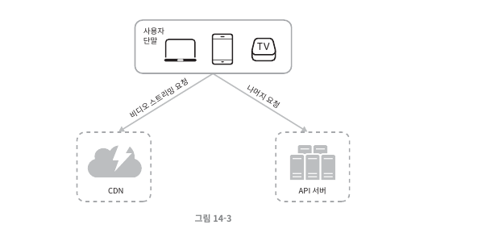
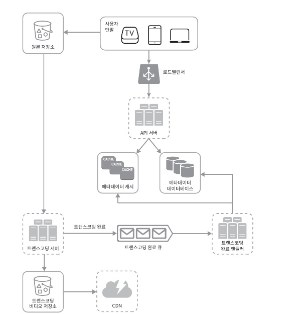
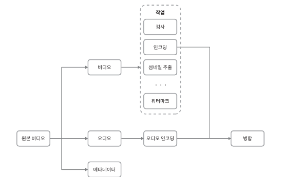
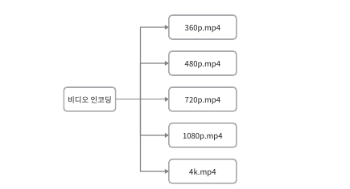
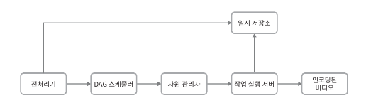
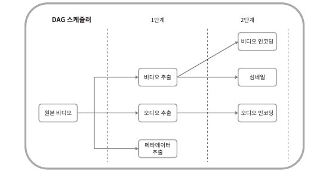
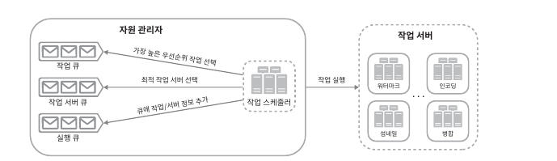
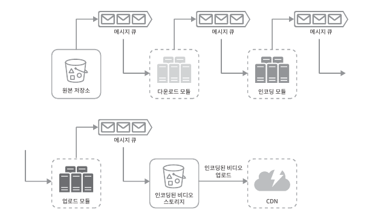
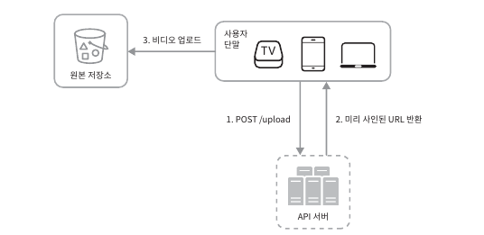

### 유튜브 설계

해당 내용에서는 다음과 같은 기능을 갖는 비디오 스트리밍 서비스 설계에 초점을 맞췄다.

 - 빠른 비디오 업로드
 - 원활한 비디오 재생
 - 재생 품질 선택 기능
 - 낮은 인프라 비용
 - 높은 가용성과 규모 확장성, 그리고 안정성
 - 지원 클라이언트 : 모바일 앱, 웹브라우저, 스마트TV

--- 

#### 개략적 규모 추정

- 일간 능동자(DAU) : 500만
- 한명의 사용자가 하루에 보는 비디오 : 5개
- 10%의 사용자가 하루에 한개의 비디오 업로드
- 평균 비디오의 크기는 300MB
- 하루에 비디오 저장을 위해 요구되는 저장용량 = DAU * 10% * 크기가 된다 따라서 500만 * 10% * 300MB = 150TB

매일같이 위처럼 서비스가 된다면 발생하는 요금은 CDN기준 대략적으로 15만 달러이다.

따라서 추정 결과에 다라 서비스하면 서비스 비용이 너무 많이 들게 된다, 사업자가 큰 고객에게 할인을 해주는점을
사용하게 되더라도 큰 비용이다.

---

#### 개략적 설계안 제시 및 동의 구하기

- 시스템 설계는 모든 것을 밑바닥부터 만드는것과는 관계가 없다. 적절한 기술을 골라 설계를 마치는 것이, 그 기술 각각이
어떻게 동작하는지 상세히 설명하는 것보다 중요하다. 예를들면 BLOB 저장소를 사용할 거싱라면 상세한 설계를 제시하는것은 지나치다.

- 규모 확장이 쉬운 BLOB 저장소나 CDN을 만드는것은, 지극히 복잡할 뿐 아니라 많은 비용이든다. 따라서 넷플릭스는 아마존을 사용하고.
페이스북은 아카마이의 CDN을 사용한다.

개략적으로만 보면 다음과 같이 세개의 컴포넌트로 구성이된다.

- 단말(client) - 컴퓨터, 모바일 폰, 스마트 TV를 통해서 시청할 수 있다.
- CDN - 비디오는 CDN에 저장한다, 재생 버튼을 통해 요청하면 CDN으로부터 스트리밍이 진행된다.
- API 서버 - 비디오 스트리밍을 제외한 모든 요청은 API 서버가 처리한다, 피드 추천, 업로드 URL 생성, 메타데이터 DB와 캐시 갱신,
- 사용자 가입 등등이 API 서버가 처리하는 작업이다.

---

### 비디오 업로드 절차.

- 사용자 단말 - 컴퓨터, 모바일폰, 스마트 TV를 통해 접근하는 이용자.
- 로드 밸런서 - API서버 각각으로 요청을 분산하는 역할
- API서버 - 비디오스트리밍을 제외한 모든 요청 처리.
- 메타데이터 데이터베이스 - 비디오의 메타데이터 보관.
- 메타데이터 캐시 - 성능을 높이기 위해 비디오 메타데이터와 사용자 객체는 캐시한다.
- 원본 저장소 - 원본 비디오를 보관할 대형 이진파일 저장소 시스템
- 트랜스코딩 서버 - 비디오 트랜스코딩은 비디오 인코딩이라고 부르기도 하는 절차로, 비디오의 포맷을 변환하는 절차다.
단말이나 대역폭 요구사항에 맞는 최적의 비디오 스트림을 제공하기 위해 필요하다.
- 트랜스코딩 비디오 저장소 - 트랜스 코딩이 완료된 비디오를 저장하는 BLOB저장소이다.
- CDN - 비디오를 캐시하는 역할을 담당, 재생 버튼을 누르면 CDN을 통해서 스트리밍이 이루어진다.
- 트랜스코딩 완료 큐 - 비디오 트랜스코딩 완료 이벤트들을 보관할 큐.
- 트랜스코딩 완료 핸들러 - 트랜스코딩 완료 큐에서 이벤트 데이터를 꺼내 메타데이터 캐시와 데이터베이스를 갱신할 작업 서버.

---

#### 비디오 업로드 프로세스 A

1. 비디오를 원본 저장소에 업로드한다.
2. 트랜스코딩 서버는 원본 저장소에서 해당 비디오를 가져와 트랜스코딩을 시작한다.
3. 트랜스 코딩이 완료되면 아래 두절차가 병렬적으로 수행된다.
   1. 완료된 비디오를 트랜스코딩 비디오 저장소로 업로드한다.
   2. 트랜스 코딩 완료 이벤트를 트랜스코딩 완료 큐에 넣는다.
      1. 트랜스코딩이 끝난 비디오를 CDN에 올린다.
      2. 완료 핸들러가 이벤트 데이터를 큐에서 꺼낸다.
      3. 완료 핸들러가 메타 데이터 데이터베이스와 캐시를 갱신한다.
4. API서버가 단말에게 비디오 업로드가 끝나서 스트리밍 준비가 되었음을 알린다.

 

#### 비디오 업로드 프로세스 B
원본 저장소에 파일이 업로드되는 동안, 단말은 병렬적으로 비디오 메타데이터 갱신 요청을 API서버에 보낸다.
메타데이터에는 파일이름, 크기, 포맷 등의 정보가 들어있다. API 서버는 이정보로 메타데이터 캐시와 데이터베이스를 업데이트 한다.

-----

#### 비디오 스트리밍 절차

먼저 스트리밍 프로토콜이라는 중요한 개념을 알아야한다.

스트리밍 프로토콜은 비디오 스트리밍을 위해 데이터를 전송할 때 쓰이는 표준화된 통신방법이다.
널리 사용된느 방식으로는 다음과 같은 것이 있다.

- MPEG-DASH : MPEG는 `Moving Picture Experts Group`의 약어이며, DASH는 `Dynamic Adaptive Streaming over HTTP`의 약어이다.
- 애플 HLS : HLS는 `HTTP Live Streaming`의 약어이다.
- 마이크로소프트 스무드 스트리밍 (Microsoft Smooth Streaming)
- 어도비 HTTP 동적 스트리밍

해당 프로토콜의 동작 원리를 정확하게 이해하거나 외울 필용는 없다.

다만 기억해야하는것은 프로토콜마다 지원하는 비디오 인코딩이 다르고 플레이어도 다르다. 따라서 비디오 스트리밍 서비스를 설계할 때는 서비스의 용례에 맞는 프로토콜을 잘 골라야한다.

비디오는 CDN에서 바로 스트리밍된다. 사용자의 단말에 가장 가까운 CDN 에지 서버가 비디오 전송을 담당할 것이다,.
따라서 전송지연은 아주 낮다.

`엣지 서버란` 사용자 또는 데이터소스의 물리적인 위치나 그 근처에서 컴퓨팅을 수행하는것을 의미.

---

### 상세 설계

해당 내용에서는 최적화 방안과 함께 좀 더 상세하게 다듬고 오류 처리 메커니즘에 대해서도 소개한다.

#### 비디오 트랜스코딩

비디오를 녹화하면 단말은 해당 비디오를 특정 포맷으로 저장한다.

해당 비디오가 다른 단말에서도 순조롭게 재생되려면 다른 단말과 호환되는 비트레이트와 포맷으로 저장되어야한다.

`비트레이트`는 비디오를 구성하는 비트가 얼마나 빨리 처리되어야 하는지를 나타내는 단위다. 비트레이트가 높은 비디오는 일반적으로 고화질 비디오다.

비트레이트가 높은 비디오 스트림을 정상 재생하기 위해서는 높은 성능의 컴퓨팅파워가 필요하고 인터넷 회선 속도도 빨라야한다.

따라서 비디오 트랜스코딩은 다음과 같은 이유로 중요하다.

 - 가공되지 않은 원본 비디오는 저장 공간을 많이 차지하며 초당 60프레임으로 녹화된 비디오는 수백 GB의 저장공간을 차지할 수 있다.
 - 상당수의 단말과 브라우저는 특정 종류의 비디오 포맷만 지원한다, 따라서 호환성 문제때문에 하나의 비디오를 여러포맷으로 인코딩해두는것이 좋다.
 - 네트워크 대역폭이 충분하지 않은 사용자에게는 저화질 비디오를, 충분한 사용자에게는 고화질 비디오를 보내는것이 바람직하다.
 - 모바일의 경우 단말의 상황이 실시간으로 달라질 수 있기 때문에 비디오가 끊김 없이 재생되도록 하기 위해서는 비디오 화질을 자동으로 변경하거나
 - 수동으로 변경할 수 있도록 하는것이 바람직하다.

인코딩 포맷은 다양하지만 대부분은 다음 두부분으로 구성되어있다.
1. 컨테이너 : 비디오 파일, 오디오, 메타데이터를 담는 바구니 같은것, 포맷은 `avi`, `mov`, `mp4` 와 같은 확장자이다.
2. 코덱 : 비디오 화질은 보존하면서 파일 크기를 줄일 목적으로 고안된 압축 및 압축 해제 알고리즘. 가장 많이 사용하는것으로는 `H.264`, `VP9`, `HEVC`가 있다.

---

##유항 비순환 그래프 모델

> 비디오를 트랜스코딩 하는것은 컴퓨팅 자원을 많이 소모할 뿐 아니라 시간도 많이든다, 또한 자기만의 비디오 프로세싱요구사항을 가지고 있따.
> 
> 이처럼 각기 다른 유형의 비디오 프로세싱 파이프라인을 지원하는 한편 처리 과정의 병렬성을 높이기 위해서는 적절한 수준의 추상화를 도입하여 클라이언트로 하여금 실행할 작업을 손수 정의할 수 있도록 해야한다.
> 

해당 이미지는 비디오 트랜스코딩을 위해 본 설계안이 채택한 DAG 모델이다.

해당 부분에서 원본비디오는 비디오, 오디오, 메타데이터 총 세부분으로 처리된다.

 

#### 비디오
- 검사 : 좋은 품질의 비디오인지, 손상은 없는지 확인하는 작업이다.
- 비디오 인코딩 :  비디오를 다양한 해상도, 코덱, 비트레이트조합으로 인코딩하는 작업이다. 해당 작업이 완료되면 아래와 같은 결과물이 나온다.

- 썸네일 : 사용자가 업로드한 이미지나 비디오에서 자동 추출된 이미지로 셈네일을 만드는 작업이다.
- 워터마크 : 비디오에 대한식별정보를 이미지 위에 오버레이 형태로 띄워 표시하는 작업이다.

---

### 비디오 트랜스코딩 아키텍처

> 본 설계안에서는 클라우드 서비스를 활용한 비디오 트랜스코딩 아키텍처를 다음과 같이 정의

총 5개의 컴포넌트로 구성.

- 전처리기
- DAG 스케줄러
- 자원관리자
- 작업 실행 서버
- 인코딩된 비디오

---

#### 전처리기
> 먼저 전처리기는 다음과 같은일을 한다.
> - 비디오 분할 : 비디오스트림을 GOP(Group of Pictures)라고 불리는 단위로 쪼갠다. GOP란 특정 순서로 배열된 프레임 그룹이다. 하나의 GOP는 독립적으로 재생 가능하며 길이는 몇조정도이다. 하지만 오래된 단말이나 브라우저에서는 GOP를 지원하지 않는다. 그런 경우에는 전처리기가 비디오 분할을 대신한다.
> - DAG 생성 : 클라이언트가 작성한 내용에 따라 DAG를 만들어낸다.
> - 데이터 캐시 : 전처리기는 분할된 비디오의 캐시이기도 하다. 안정성을 높이기 위해 전처리기는 GOP와 메타데이터를임시저장소에 보관한다. 비디오 인코딩에 실패하면 보관된 데이터를 활용해 인코딩을 재개한다.
> 

---

#### DAG 스케쥴러

DAG스케줄러는 DAG그래프를 몇개 단계로 분할한 다음에 각각을 자원 관리자의 작업큐에 집어넣는다. 해당 이미지는 DAG스케쥴러의 동작방식이다.

하나의 DAG그래프를 2개의 작업단계로 쪼갠 사례이다.

1. 비디오, 오디오, 메타데이터 추출
2. 해당 비디오 파일을 인코딩 및 섬네일 추출, 오디오 인코딩 진행.

---

#### 자원 관리자
> 자원 배분을 효과적으로 수행하는 역할 담당.
> 
> 아래 이미지와 같이 세 개의 큐와 작업 스케쥴러로 구성.

- 작업 큐 : 실행할 작업이 보관되어있는 우선순위 큐.
- 작업 서버 큐 : 작업 서버의 가용 상태 정보가 보관되어있는 우선순위 큐
- 실행 큐 : 현재 실행 중인 작업 및 작업 서버 정보가 보관되어있는 큐.
- 작업 스케쥴러 : 최적의 작업/서버 조합을 골라, 해당 작업 서버가 작업을 수행하도록 지시하는 역할.

자원 관리자는 다음과 같이 동작한다.

1. 작업 큐에서 가장 높은 우선순위의 작업을 꺼냄.
2. 해당 작업을 실행하기 위해서 작업 서버를 선택
3. 해당 작업 서버에게 작업을 지시.
4. 해당 작업이 어떤 서버에게 할당되어있는지에 대한 정보를 실행큐에 저장.

---

#### 작업 실행 서버
> 작업 실행 서버는 DAG에 정의된 작업을 수행한다, 작업 종류에 따라 작업서버도 구분하여 관리한다.

---

#### 임시 저장소
> 임시 저장소 구현에는 여러 자장소 시스템 활용 가능, 데이터의 유형, 크기, 이용 빈도, 데이터 유효기간등에 따라 달라진다.
> 임시 저장소에 보관한 데이터는 비디오 프로세싱이 완료되면 삭제한다.

---

#### 인코딩된 비디오
> 간단헤게 말하면 인코딩 파이프라인의 최종 결과물이다. xxx.확장자와 같은 이름을 갖는다.

---

### 시스템 최적화.

#### 속도 최적화 : 비디오 병렬 업로드.
> 비디오를 전부 한번의 작업으로 업로드하는것은 비효율 적이다. 하나의 비도은 여러개의 GOP들로 분할 할 수 있다.
> 
> 분할한 GOP를 병렬적으로 업로드하면 일부가 실패하게 되더라도 빠르게 업로드를 재개할 수 있다. 따라서 비디오를 GOP 경계에 맞춰 분할하는 작업을 단말이 수행하면 업로드 속도를 높일 수 있다.

---

#### 속도 최적화 : 업로드 센터를 사용자 근거리에 지정.
> 업로드 속도를 개선하는 또다른 방법은 업로드센터를 여러 곳에 두는 것이다, 즉 다양한 곳에 업로드 센터를 설치하는 것이다.
> Amazon 엣지 로케이션과 비슷한듯

---

#### 속도 최적화 : 모든 절차를 병렬화
> 낮은 응답지연을 달성하는 것은 어려운 일이다, 또하나의 방법은 느슨하게 결합된 시스템을 만들어서 병렬성을 높이는것이다.
> 
> 기존에 있던 방법을 병렬로 바꾸기 위해서는 메시지 큐를 도입한다, 메시지 큐가 시스템 결합도를 낮추는지 예를 들어보면 다음과 같다.

메시지큐를 통해서 보관된 이벤트 각각을 병렬로 처리한다.

---

#### 안전성 최적화 : 미리 사인된 업로드 URL
> 모든 제품은 안전성이 중요하다, 허가받은 사용자만이 올바른 장소에 비디오를  업로드 할 수 있도록 하기 위해
> 미리 사인된 업로드 URL을 이용한다.

업로드 절차는 다음과 같다.
 1. 클라이언트가 APi 서버에게 POST요청으로 미리 사인된 URL을 요청한다.
 2. 클라이언트는 해당 URL이 가리키는 위치에 비디오를 업로드한다.

---

#### 안전성 최적화 : 비디오 보호
 > 비디오의 경우 저작권을 보호하기 위해 다음 세가지선택지중 하나를 선택 가능
 
 - 디지털 저작권 관리시스템 도입 : 가장 널리 사용되는 시스템으로 애플의 페어플레이, 그글의 와이드바인, MS의 플레이 레디가 있다.
 - AWS 암호화 : 비디오를 암호화하고 접근 권한을 설정하는 방식이다, 암호화된 비디오는 재생 시에만 복호화한다. 허락된 사용자만 암호화된 비디오 시청 가능
 - 워터마크 : 비디오 위에소유자 정보를 포함하는 이미지 오버레이를 올리는것이다. 회사 로고나 이름 사용 가능

---

#### 비용 최적화 
1. 인기 비디오는 CDN을 통해 재생하되 다른 비디오는 비디오 서버를 통해 재생한다. ( 유튜브의 경우 롱테일 분포를 따른다)
2. 인기가 별로 없는 비디오는 인코딩 할 필요가 없다, 짧은 비디오라면 필요할 때 인코딩항 ㅕ재생한다.
3. 어떤 비디오는 특정 지역에서만 인기가 높다, 그러한 비디오는 다른지역에 옮길 필요가 없다.
4. CDN을 직접 구축하고 인터넷 서비스 제공자와 제휴한다, 

---

### 오류 처리
> 시스템 오류는 대형 시스템에서는 불가피하다, 시스템 오류에는 두가지 종류가 있다.
1. 회복 가능 오류 : 특정 비디오 세그먼트를 트랜스코딩하다 실패했든가 하는 오류는 회복 가능한 오류에 속한다.   일반적으로 해당 오류들은 몇번 재시도 하면 해결된다, 하지만 계속 실패하고 복구가 어렵다면 클라이언트에게 적절한 오류 코드를 반환해야 한다.
2. 회복 불가능 오류 : 비디오 포맷이 잘못되었다거나 하는 회복 불가능한 오류가 발견되면 시스템은 해당 비디오에 대한 작업을 중단하고 클라이언트에게 적절한 오류를 반환한다.

시스템 컴포넌트에서 발생할 수 있는 오류에 대한 해결방법은 다음과 같다.

 - 업로드 오류 : 몇 회 이상의 재시도 
 - 비디오 분할 오류 : 낡은 버전의 클라이언트 및 브라우저의 경우 전체 비디오를 서버로 전송하고 해당 서버가 비디오 분할을 처리하도록 한다.
 - 트랜스코딩 오류 : 재시도
 - 전처리 오류 : DAG 그래프를 재생성
 - DAG 스케줄러 오류 : 작업을 다시 스케줄링
 - 자원 관리자 큐에 장애 발생 : 사본을 이용
 - 작업 서버 장애 : 다른 서버에서 해당 작업 재시도
 - API 서버 장애 : API 서버는 무상태 서버이므로 신규 요청은 다른 API 서버로 우회된다.
 - 메타데이터 캐시 서버 장애 : DB는 다중화 되어있기 때문에 다른 노드에서 데이터를 가져올 수 있다. 장애가난 캐시서버는 새로 교체한다
 - 메타데이터 데이터베이스 서버 장애 : 주 서버가 죽었다면 부 서버가운데 하나를 주 서버로 교체