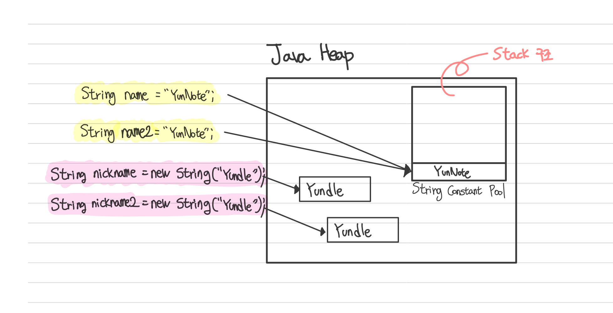

>String, StringBuilder, StringBuffer를 정리하면서 String Constant Pool 에 대해 정리하면 좋을듯 하여 이렇게 정리를 합니다.


## 😊 String Constant Pool

---

String 객체를 생성하는 방법에는 2가지 방법이 있습니다.
1. String 리터럴 객체 생성 `"" 쌍따옴표를 이용한 객체 생성 `
2. new 연산자를 통한 String 객체 생성 `new String(""")`

`리터럴 객체 생성방식`과 `new 연산자 생성방식`은 뭐가 다른걸까.

흔히 new 연산자를 통해 생성하는 객체들은 Heap Memory 영역에 저장되는것을 알고 있다.<br>
그렇다면 리터럴 객체로생성하는 String 은 Heap Memory 영역에 저장되는것이 아닌것인가??<br>
물론 두가지 방식 모두 Heap Memory 에 저장이됩니다. 다만 리터럴로 생성된 String 객체는 
Heap 영역 내의 <strong>`String Constant Pool`</strong>에 저장이 됩니다.

생성되는 그림은 다음과 같습니다.



위의 그림을 보면 리터럴 방식으로 YunNote라는 값을 저장하는 변수를 생성하였을때 
Java Heap Memory안에서도 String Constant Pool 에 저장된 모습을 확인할 수 있다. <br>
또한 변수 `name`과 `name2`를 보면 <mark style="background-color:#000000"><strong style="color:#E2E2E2;">String Constant Pool</strong></mark> 내부에 있는 값을 동일하게 가리키는 것을 확인할 수 있다.

String Constant Pool은 String 리터럴로 생성한 객체의 값이(ex. YunNote) 이미 String Constant Pool 에 존재한다면
해당 객체는 String Constant Pool 안에 존재하는 값(ex. Yundle)의 Reference를 참조하게 된다 ,
따라서 name과 name2는 같은 `YunNote`라는 값의 Reference 값을 가지게 되는것이다.

그렇다면 동일한 문자열을 가지고 있는 리터럴이면 동일설 비교를 하였을때 true를 반환하는지 확인해보자.

---

#### 리터럴을 통한 String 객체 생성

```java
String name = "YunNote";
String name2 = "YunNote";

System.out.println(name == name2); // true를 반환
```

<br>

---

#### new 연산자를 통한 String 객체 생성

```java
String nickname = new String("Yundle");
String nickname2 = new String("Yundle");

System.out.println(nickname == nickname2); // false
System.out.println(nickname.equals(nickname2)) // true
```

<br>

### 😊 String intern() 메서드

---

String 클래스를 정리하다 보니까 inter()이라는 메서드가 존재하고있었습니다.

>`intern()`<br>
> String 객체가 이미 String Constant Pool에 존재한다면 해당하는 객체의 Reference를 리턴한다.
> 만약 존재하지 않는다면 해당 String 객체를 String Constant Pool에 추가한다.


```java
String variable1 = new String("YunNote").intern();
String variable2 = new String("YunNote").intern();

System.out.println(variable1 == variable2);
System.out.println(variable1.equals(variable2));
```
위의 예제를 보면 `new 연산자`를 이용하였기 때문에 Heap 영역에 다른 Reference로 생성될것 같지만 
`intern()`메서드를 사용하였기 떄문에 해당하는 문자열 `YunNote`는 String Constant Pool 에 등록이 된다

따라서 동등성, 동일성 비교시 true가 반환되는 것을 확인할 수 있다.