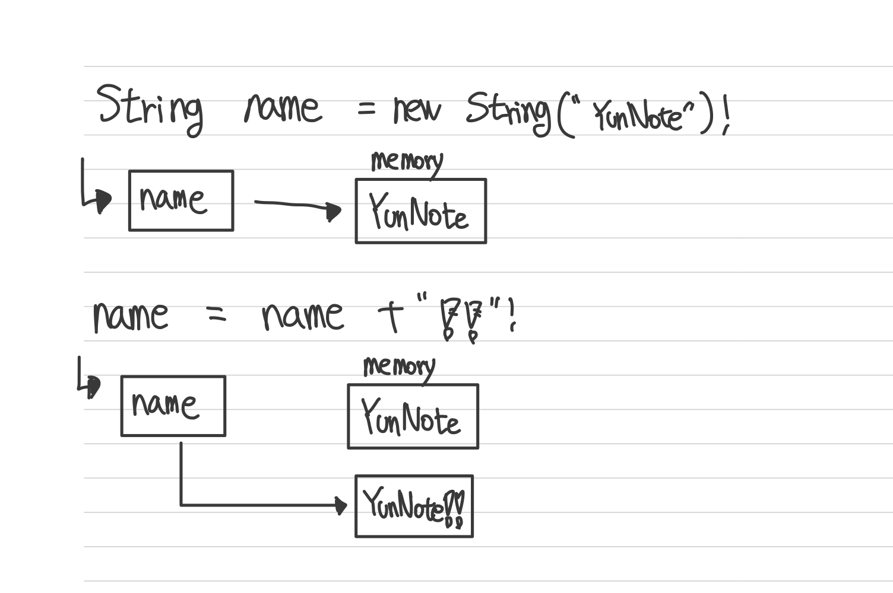
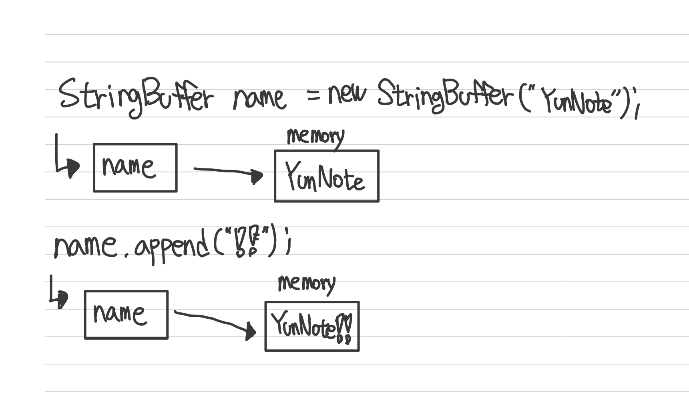

## String, StringBuffer, StringBuilder의 비교 

---

>개발을 하면서 String도 보았을것이고 StringBuffer와 StringBuilder도 많이 보았을 것입니다. 
>문자열을 만들고 제어하는데 오 3가지씩이나 제공하는것일까요 ?? 
>해당 README에서는 3가지 Class의 장단점과 사용법, 성능의 차이를 알아보도록 하겠습니다. 

## 😊 String 

---

String은 불변(immutable)의 속성을 갖습니다. 이게 무슨말인지 확인해보겠습니다

위의 예제는 name이라는 변수에 `YunNote`라는 문자열을 넣는 코드입니다 .
그다음은 name이라는 값에 `!!`라는 문자열 을 추가하는 코드입니다. 

String class를 사용하여 다음과 같이 + 연산자를 통해 추가하게 되면 우리는 기존에 존재하는 `YunNote`라는 메모리에 `!!`가 추가되는줄 알았습니다.

하지만 실제로는 새로운 메모리에 객체를 올리게 되고 처음 선언했던 `YunNote`를 가리키던 name은 `YunNote!!`를 가지고 있는 메모리 영역을 가리키게 됩니다. 
>위의 예제는 Java Heap 안에서도 `String Constant Pool` 에 저장된다. `String Constant Pool`에 대한 내용도 다로 정리할 예정입니다.

기존에 존재하던 `YunNote`객체는 Garbage Collection에 의해 사라지게 됩니다.

> 이러한 예로 보면 String 불변이라는 것을 확인할 수 가  있습니다.

### String 장,단점

`장점 `
 - 간단하게 변하지 않는 읽기만 하는경우 String을 사용하게 되면 좋은 성능을 기대할 수 있다.

`단점`
 - 문자열의 추가, 수정, 삭제 등의 연산이 자주 일어나게 되는경우 Memory에 항상 새로운 객체를 생성하기 때문에 힙 메모리가 부족하여 성능에 영향을 미칠 수 있다.

 

## 😊 StringBuffer와 StringBuilder 란 

---

`String` 이 있는데 `StringBuffer`와 `StringBuilder`는 왜있을까란 생각을 하곤했습니다. 
위의 세개의 Class에 대해 자세하게 알기전에는 String이 더 편하고 익숙하니 String 만 사용했었습니다.

그렇다면 StringBuffer와 StringBuilder는 기존의 String 과 차이점이 뭘까요.

1. 바로 `가변(Mutable)`속성을 가진다는 것입니다.
2. `+`연산자가 아닌 `append`, `delete`와 같은 메서드를 통해 값을  변경합니다.

>위의 이미지에 보이는것처럼 StringBuffer와 StringBuilder는 처음에 가지고 있던 메모리의 객체내의 문자열을 직접 변경하는 것입니다.
따라서 문자열이 추가될때마다 새로운 객체를 만들지 않기때문에 문자열의 추가 or 수정, 삭제가 빈번하게 발생한다면 String 보다는 StringBuffer와 StringBuiler를 사용하기를 권장합니다.

 

## 😊 StringBuffer와 StringBuilder의 차이는 ?

---

