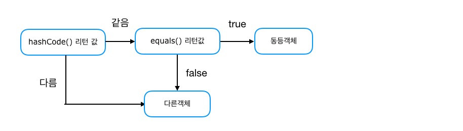

## HashCode와 Equals란 

>면접을 보거나 면접관으로 들어갔을때 가장 많이했던 질문중 하나입니다.<br>
>한번더 정리하기 위해 다음과 같이 정리합니다.


먼저 `hashCode`와 `equals`는 Class의 최상의 Class인 Object Class에 정의되어 있다.

```java
@HotSpotIntrinsicCandidate
public native int hashCode();

public boolean equals(Object obj) {
    return (this == obj);
}
```

### `동일성`
> 동일선 비교란 "=="를 통해 비교합니다. 동일성 비교는 객체 인스턴스의 주소 값을 비교한다.

### `동등성`
> 동등성 비교는 "equals"메서드를 통해 비교한다. 해당 객체 내부의 값을 통하여 비교합니다.

<br>

### 😊 Equals

---

equals는 비교하고자 하는 객체가 서로 동일한지 검사하기 위해 사용하는 메서드이다.
equals는 각 객체가 참조하고있는 것이 동일한지 확인하는 메서드입니다.


```java
public static void main(String[] args) {

    String a = "YunNote";
    String b = "YunNote";
    String c = new String("YunNote");

    System.out.println(a == b);
    System.out.println(a == c);
    System.out.println(a.equals(b));
    System.out.println(a.equals(c));
}
```

그렇다면 User객체를 이용하여 비교하는 테스트 코드를 작성해보겠습니다

```java
public class User {

    private Long id;
    private String name;
    private int age;

    public User(Long id, String name, int age) {
        this.id = id;
        this.name = name;
        this.age = age;
    }

    @Override
    public String toString() {
        return "id :: " + id + ", name :: " + name + ", age :: " + age;
    }
}

```

```java
public static void main(String[] args) {

    User user1 = findUser();
    User user2 = findUser();

    System.out.println(user1); // 출력결과 - id :: 1, name :: YunNote, age :: 29
    System.out.println(user2); // 출력결과 - id :: 1, name :: YunNote, age :: 29
    System.out.println(user1 == user2); // false
    System.out.println(user1.equals(user2)); // false
}


public static User findUser() {
    return new User(1L, "YunNote", 29);
}

```

해당 코드는 findUser()메서드를 호출하여 동일한 값을 가지고 있는 User객체를 반환하도록 했습니다.

당연히 같은 값 or 주소이겠거니하고 == , equals를 통해 비교하였지만 둘다 false가 발생합니다.

1. `동일성`비교에서 false가 발생한 이유는 다음과 같습니다. new 를 통해 Heap 영역에 새로운 객체를 따로 만들었기 때문에 객체 인스턴스의 주소값을 비교하는 동일성 비교에서는 false가 출력됩니다.

2. `동등성` 그렇다면 동등성 비교에서는 왜 false가 발생하였을까요. 그 유는 equals를 재정의하지 않아 Object class의 equals를 사용하여 비교하기 떄문입니다.

이와 같은 문제를 해결하기 위해서는 equals와 hashcode를 Override하면 됩니다. User Class에 다음 코드를 추가해보겠습니다

```java
User.class
...

@Override
public boolean equals(Object o) {
    if (this == o) return true;
    if (o == null || getClass() != o.getClass()) return false;
    User user = (User) o;
    return age == user.age && Objects.equals(id, user.id) && Objects.equals(name, user.name);
}

@Override
public int hashCode() {
    return Objects.hash(id, name, age);
}
```

equals만 구현해도 equals비교에서 true가 나오지만 hashCode를 구현하는 이유는 밑에서 알아보겠습니다.

#### tip. 문자열은 equals를 통해 항상 비교하는것이 좋다.


<br>


### 😊 HashCode

---

HashCode란 Runtime 객체의 유일한 integer값을 반환합니다. Object Class에 구현되어있는 hashCode에서는 
heap에 저장된 객체의 메모리 주소를 반환하도록 되어있다.

hashCode는 HashTable과 같은 자료구조를 사용할 때 데이터가 저장되는 위치를 결정하기 위해 사용한다.

<br>

### 😊 equals와 hashCode의 관계 

---

동일한 객체는 동일한 메모리 주소를 갖는다는 것을 의미하기 때문에, 동일한 객체는 동일한 hashCode값을 반환해야한다.
따라서 우리가 equals를 통해 비교를 하기위해 Override를 한다면 equals와 hashCode는 같이 구현하는것 이 좋다.

- Java Runtime동안 equals에 정의된 정보가 수정되지 않았다면, hashCode는 항상 동일한 정수 값을 반환해야 한다.
- 두 객체가 equals를 통해 비교하였을때 true를 반환한다면 해당 두 객체의 hashCode의 값도 같은 값을 반환해야한다.
- 두 객체가 equals를 통해 비교하였을때 false를 반환하였다면 해당 두객체의 hashCode의 값이 일치할 필요가 없다.
- 두 객체의 hashCode가 true를 반환한다고 해서 equals가 항상 true일 필요는 없다.


### 😊 equals와 hashCode의 실행 순서 

---

hash값을 사용하는 Collection에서 주로 발생하는 문제인데, equals만 구현하고 hashCode를 구현하지 않은상태에서 동일한 값이라고 생각하지만 그렇지 않은경우가 생깁니다.

왜 이런 문제가 발생하는지 좀더 공부하여 찾아본 결과 hashCode를 비교한다음 equals값을 비교하는것을 확인 할 수 있었습니다.



hash값을 사용하는 컬렉션에서는 hashCode 메서드의 리턴값이 먼저 일치하는지 확인하고 일치한다면 그다음에 equals메서드를 통해 값을 비교하여 
해당 값이 true여야 같은 객체라고 인식합니다.

따라서 객체를 만들기위해 class를 정의 할 떄는 equals와 hashCode를 같이 @Override 해주는것이 사이드 이펙트를 줄이기에 좋습니다.